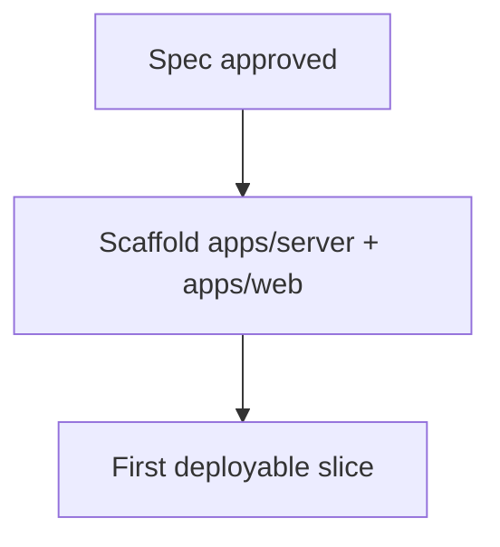

# Architecture (current state)

> Living document: describes what is **deployed/implemented now**. The intended
> design lives in [`specs/aboutme-design.md`](specs/aboutme-design.md).

**Current state: nothing is implemented yet.** The repository contains the
approved design spec, ADRs, docs tooling, and the monorepo skeleton. This
document gains real content as the first components land.

