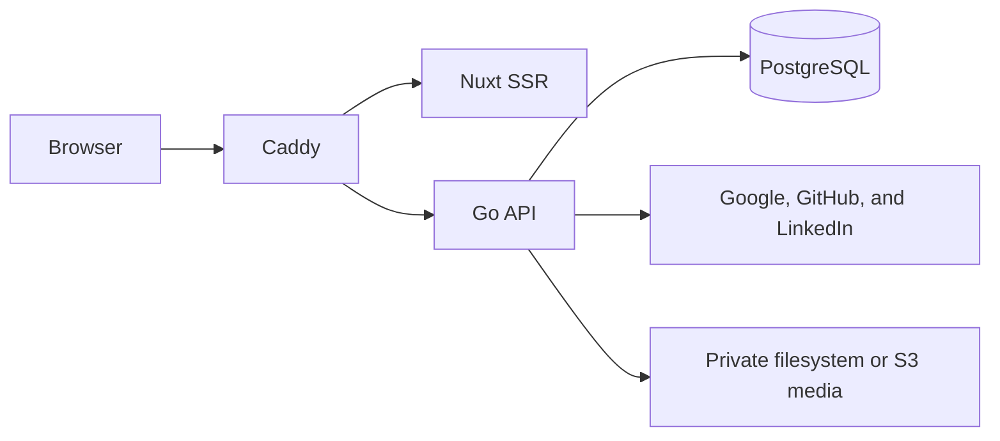

# Current-state architecture

This document describes the current integration candidate, verified on
2026-08-14. The [design](design/README.md) owns intended behavior. The
[roadmap](plans/implementation-plan.md) owns delivery state and gates.

## Running system

| Component  | Implemented responsibility                                                                    |
| ---------- | --------------------------------------------------------------------------------------------- |
| Caddy      | One-origin routing, forwarding-header removal, and canonical client-IP delivery to Go         |
| Go server  | Health, authentication, sessions, users, resume HTTP, private media, and request policy       |
| Nuxt       | Landing/login/session UI, typed API transport, fonts, presets, and the pure resume renderer   |
| PostgreSQL | Auth records, sessions, users, resume aggregates, idempotency records, and media cleanup jobs |
| Media      | Private create-only filesystem or S3 objects behind validated server-owned keys               |

Daily development runs Go, Nuxt, and Caddy as native processes at
`http://localhost:20080`. They use the `aboutme_dev` database in the one shared
`aboutme-test-db` container. See the
[native development runbook](runbooks/native-development.md).

Authenticated development uses a separate native stack on ports 20440–20443. It
serves only `https://localhost:20443`, runs a deterministic local Google OpenID
Connect mock on 20442, and still uses the shared `aboutme_dev` database. Its
disposable pinned Playwright image imports the invocation's Caddy root into an
isolated NSS database and writes only bounded local verdicts. It does not change
the host trust store or use a certificate bypass.

The Compose deployment has four long-lived containers plus a one-shot migration
container. PostgreSQL is not published to the host. Caddy is the only published
service. The current Compose Caddyfile serves HTTP; this is suitable for
deployment smoke checks but does not yet satisfy the P9 HTTPS-on-443 UAT
contract.

## Implemented HTTP surface

The [OpenAPI document](api/openapi.yaml) is the exact HTTP authority. The
implemented surface includes:

- `GET` and `HEAD` health and readiness probes;
- Google and LinkedIn OpenID Connect plus GitHub OAuth login;
- authenticated, CSRF-protected provider link and reauthentication starts;
- current-user lookup, logout, session listing, per-session revoke, and
  logout-everywhere;
- owner-only resume list, create, read, metadata update, and delete;
- owner-only personal-details, entry, section, structure, and customization
  mutations;
- owner-only photo upload, read, crop, and delete over private media;
- JSON envelopes, request IDs, body bounds, security and cache headers,
  trusted-proxy client-IP handling, and rate limiting.

The committed TypeScript API types are generated from OpenAPI. The web client
uses those types through `openapi-fetch`, and `make api-check` detects drift.

## Implemented resume data layer

Phase 2A provides the relational domain and transaction primitives. Phase 2B
wires those primitives into the complete private resume HTTP surface. The
implemented boundary provides:

- immutable resume schemas v1 and v2, retained generated types, explicit
  adjacent converters, and released/accepted/emitted registries for both
  versions;
- hand-written goose migrations as the sole relational schema source; their
  pre-UAT history remains correctable until the first candidate adds the
  immutable baseline marker required by
  [ADR 0020](adr/0020-uat-migration-baseline.md);
- sqlc-generated data access from those migrations and `sql/queries.sql`;
- schema-derived bounds, aggregate validation, and a bounded codec;
- owner-scoped CRUD primitives, a three-resume cap, and revision
  compare-and-swap (CAS) that persists the complete document aggregate;
- a transactional idempotency primitive keyed by user, concrete operation, UUID
  key, and canonical request fingerprint; it stores the exact response with the
  mutation and enforces a bounded candidate deadline;
- pure document projection, explicit adjacent-converter machinery, a one-row CAS
  backfill primitive, independent write, migration, and bounds suites, and a
  bounds completeness guard.

Every mutation uses strict singleton headers, bounded and duplicate-key-safe
decoding, owner-scoped lookup, revision CAS, and one aggregate sanitizer and
validator boundary. A released v1 request is upgraded, changed, persisted as a
complete current-v2 aggregate, and projected back to v1. The fixed customization
allowlist is derived from the embedded current schema. P8 still owns the
authoritative hourly global idempotency-expiry sweep.

The versioned sanitizer allowlist and hostile corpus generate Go and TypeScript
artifacts. `internal/sanitize.RichText` builds its Go policy from that artifact;
the client wrapper builds DOMPurify policy from the same data and is a byte-
preserving passthrough on server-side rendering. Author and independent suites
cover the corpus, parser boundaries, exact anchor hardening, idempotence, and
deterministic arbitrary input. Phase 2B calls the Go sanitizer before every
resume write. Public-read and internal-print re-sanitizing remain owned by P5A
and P7A.

The web package contains the licensed font catalog, a pure Vue renderer with
continuous and deterministic paged modes, and a generated registry for all 20
validated template presets. Byte-exact HTML goldens cover both starting layouts
and display modes for every preset. Renderer-boundary lint rejects runtime,
state, network, clock, random, and ambient-locale dependencies. A pinned AMD64
Chromium harness proves the named screenshot and print baselines at zero
tolerance, all bundled fonts offline, the hostile corpus in a live DOM, and the
renderer CSP against both harness and normal Nuxt output. Its reviewed manifest
builds an immutable source archive from the exact commit and excludes the
worktree, Git metadata, local state, and secret-like paths.

## Implemented private media boundary

Resume photo objects are never public. Uploads pass session, CSRF, origin,
route-rate, mutation-header, declared-size, and one-task admission checks before
the body is read. The server streams one bounded raw multipart file, validates
the container, fully decodes a static JPEG, PNG, or WebP, applies Exif
orientation, strips metadata, and writes a deterministic bounded JPEG or PNG.

Only the media package creates or parses a photo key. Every read, cleanup
enqueue, and compensation validates that key against the expected resume before
backend I/O. Filesystem and S3 implement the same create-only, bounded-page
contract. Replacement and deletion revoke the database reference and enqueue the
exact old key in one transaction. Definite failures compensate a proved-created
candidate; unknown object-write or database outcomes remain private for later
reconciliation. P8-priv owns the deletion worker, 24-hour target, and 48-hour
orphan reconciliation.

## Known delivery gaps

- The current Compose route serves HTTP. P9 requires the complete image-based
  deployment at an HTTPS origin on port 443 with isolated data and services. The
  native 20443 authentication harness supports development but does not close
  this UAT gap.

## Not implemented

The editor, public publishing, Server-Sent Events, production PDF and image
rendering, privacy workers, production infrastructure, staging, production
deployment, and Flutter remain planned.
