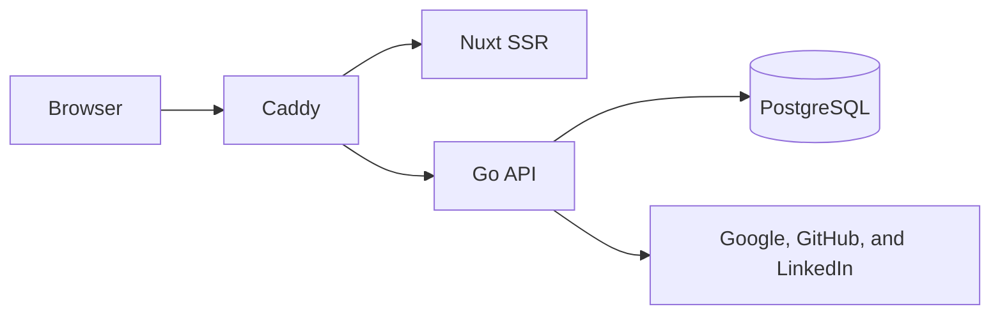

# Current-state architecture

This document describes the repository at `main` commit `9edca31`, verified on
2026-08-12. The [design](design/README.md) owns intended behavior. The
[roadmap](plans/implementation-plan.md) owns delivery state and gates.

## Running system

| Component  | Implemented responsibility                                                                   |
| ---------- | -------------------------------------------------------------------------------------------- |
| Caddy      | One-origin routing, forwarding-header removal, and canonical client-IP delivery to Go        |
| Go server  | Health, authentication, sessions, users, resume domain/store primitives, and request policy  |
| Nuxt       | Landing and login pages, authenticated user state, session settings, and typed API transport |
| PostgreSQL | Auth records, sessions, users, resume aggregates, slug tombstones, and idempotency records   |

Daily development runs Go, Nuxt, and Caddy as native processes at
`http://localhost:20080`. They use the `aboutme_dev` database in the one shared
`aboutme-test-db` container. See the
[native development runbook](runbooks/native-development.md).

The Compose deployment has four long-lived containers plus a one-shot migration
container. PostgreSQL is not published to the host. Caddy is the only published
service. The current Compose Caddyfile serves HTTP; this is suitable for
deployment smoke checks but does not yet satisfy the P9 HTTPS-on-443 UAT
contract.

## Implemented HTTP surface

The [OpenAPI document](api/openapi.yaml) is the exact HTTP authority. The
implemented surface includes:

- `GET` and `HEAD` health and readiness probes;
- Google and LinkedIn OpenID Connect plus GitHub OAuth login;
- authenticated, CSRF-protected provider link and reauthentication starts;
- current-user lookup, logout, session listing, per-session revoke, and
  logout-everywhere;
- JSON envelopes, request IDs, body bounds, security and cache headers,
  trusted-proxy client-IP handling, and rate limiting.

The committed TypeScript API types are generated from OpenAPI. The web client
uses those types through `openapi-fetch`, and `make api-check` detects drift.

Resume HTTP routes are not implemented.

## Implemented resume data layer

Phase 2A Tasks 1–11 are present, but Task 12 and both phase gates remain. The
landed slice provides:

- immutable resume schema v1 and released-version registries;
- hand-written, append-only goose migrations as the sole relational schema
  source;
- sqlc-generated data access from those migrations and `sql/queries.sql`;
- schema-derived bounds, aggregate validation, and a bounded codec;
- owner-scoped CRUD primitives, a three-resume cap, revision compare-and-swap,
  and transactional idempotency;
- pure document projection, compare-and-swap backfill, independent write and
  migration suites, and a bounds completeness guard.

Twenty template preset JSON files are committed. Their design contract remains
draft, and the renderer, sanitizer, and licensed font assets have not landed.

## Known contract defects

- The settings page starts provider linking and reauthentication with GET links.
  The server and OpenAPI require authenticated CSRF-protected POST, then
  navigation to the returned authorization URL. P1.1 remains open.
- `GET /me` currently inherits identity order from SQL ordered only by
  `created_at`. The settings page uses the first identity as its default
  reauthentication provider, so P1.1 must add the `id` tiebreaker required by
  the design.
- The current Compose route serves HTTP. P9 requires the complete image-based
  deployment at an HTTPS origin on port 443. The UAT harness must close this gap
  before acceptance can run.

## Not implemented

Resume HTTP and media, sanitizing and rendering, the editor, public publishing,
Server-Sent Events, PDF and image rendering, privacy jobs, production
infrastructure, staging, production deployment, and Flutter remain planned.
