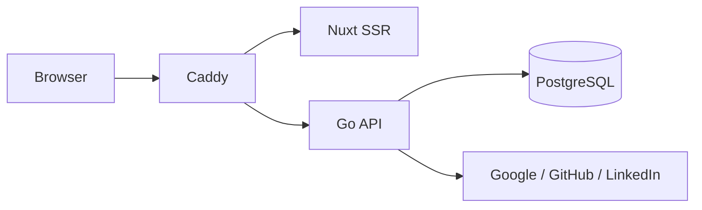

# Architecture (current state)

> Living document: describes what is **implemented on `main` now**. Intended
> product architecture lives in
> [`specs/aboutme-design.md`](specs/aboutme-design.md); execution status lives
> in the
> [numbered delivery index](plans/implementation-plan.md#numbered-delivery-index).

## Implemented on `main`

Phase 0 foundations, Phase 1 authentication/sessions, and the reviewed Phase 2A
checkpoint through Task 7 are on `main`:

- Caddy fronts one local origin and routes the Nuxt SSR app and Go API. The
  podman compose stack includes PostgreSQL and a fail-closed one-shot migration
  service.
- The Go service exposes `/healthz`, `/readyz`, the three provider OAuth flows,
  `/api/v1/me`, logout, session listing, per-session revoke, and
  logout-everywhere. Request bounds, cache/security headers, CSRF, trusted-proxy
  client-IP handling, and rate limiting wrap the routes.
- PostgreSQL stores users, identities, OAuth transactions, opaque sessions,
  resumes, slug tombstones, and idempotency records. Declarative SQL, sqlc
  output, and append-only goose migrations are guarded by live-database drift
  and migration tests.
- The resume domain validates schema and aggregate bounds, preserves ownership
  boundaries, enforces the three-resume cap, performs revision CAS
  (compare-and-swap), and serializes idempotent mutations transactionally. It
  has no HTTP surface yet.
- Nuxt serves the landing/login pages and session settings UI. Resume-schema
  generation, OpenAPI lint/conformance tests, linting, typechecking,
  vulnerability scanning, and builds are wired into CI. Generated OpenAPI
  TypeScript client tooling is not implemented yet and is queued before P2B.

## Active Phase 2A remainder

Tasks 1–7 and their corrective reviews are integrated. Immutable v1 schema and
bidirectional wire compatibility (Task 2b/8), the cleared-contact proof, the
mechanical generated-write restriction, blind suites, traceability closure, and
all phase gates remain. This checkpoint makes the data-layer primitives
available for continued development; it does not mark P2A complete or unlock
P2B.

## Not implemented yet

Resume HTTP endpoints and media (P2B), the renderer/sanitizer/templates (P3),
the editor (P4), publish/public surfaces (P5), SSE (P6), print/og-image (P7),
privacy jobs (P8), AWS infrastructure (PI), staging/production deployment, and
Flutter remain future phases.
