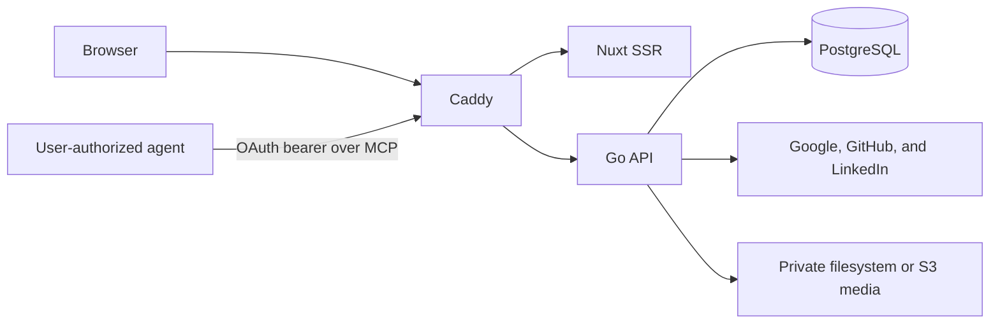

# Current-state architecture

This document describes the current integration candidate, verified on
2026-09-02. The [design](design/README.md) owns intended behavior.

## Running system

| Component  | Implemented responsibility                                                                                                  |
| ---------- | --------------------------------------------------------------------------------------------------------------------------- |
| Caddy      | One-origin routing, forwarding-header removal, and canonical client-IP delivery to Go                                       |
| Go server  | Health, user and agent authentication, sessions, resume HTTP/MCP, private media, publish, public read, and request policy   |
| Nuxt       | Landing page, login/session/agent-consent UI, typed API transport, fonts, presets, the authenticated editor, and public SSR |
| PostgreSQL | Auth, OAuth client/grant/token, session, user, resume, public-state, idempotency, and media-cleanup records                 |
| Media      | Private create-only filesystem or S3 objects behind validated server-owned keys                                             |

Daily development runs Go, Nuxt, and Caddy as native processes at
`http://localhost:20080`. They use the `aboutme_dev` database in the one shared
`aboutme-test-db` container. See the
[native development runbook](runbooks/native-development.md).

Authenticated development uses a separate native stack on ports 20440–20443. It
serves only `https://localhost:20443`, runs a deterministic local Google OpenID
Connect mock on 20442, and still uses the shared `aboutme_dev` database. Its
disposable pinned Playwright image imports the invocation's Caddy root into an
isolated NSS database and writes only bounded local verdicts. It does not change
the host trust store or use a certificate bypass.

The Compose deployment has four long-lived containers plus a one-shot migration
container. PostgreSQL is not published to the host. Caddy is the only published
service. The current Compose Caddyfile serves HTTP; this is suitable for
deployment smoke checks but does not yet satisfy the local UAT contract of an
HTTPS origin on port 443.

## Implemented HTTP surface

The [OpenAPI document](api/openapi.yaml) is the exact JSON API authority. OAuth
protocol and MCP endpoints follow their protocol contracts and the accepted
[agent-access ADR](adr/0026-mcp-agent-access.md). The implemented surface
includes:

- `GET` and `HEAD` health and readiness probes;
- an unauthenticated capabilities read that reports whether provider login and
  agent access are enabled;
- Google and LinkedIn OpenID Connect plus GitHub OAuth login, whose routes are
  registered only when `PROVIDER_LOGIN_ENABLED` is true (off by default);
- email-and-password registration, verification, login, reauthentication,
  add/change, and reset;
- authenticated, CSRF-protected provider link and reauthentication starts;
- OAuth dynamic client registration, S256 authorization-code consent, token
  exchange/rotation/revocation, discovery metadata, and bearer-authenticated
  Streamable HTTP MCP;
- current-user lookup, logout, session listing, per-session revoke, and
  logout-everywhere;
- owner-only resume list, create, read, metadata update, and delete;
- owner-only personal-details, entry, section, structure, and customization
  mutations;
- owner-only photo upload, read, crop, and delete over private media;
- owner-only publish, unpublish, rename, and slug delete, with public JSON,
  photo, HTML, Markdown, sitemap, robots, and llms.txt reads gated by publish
  state, SEO/GEO, and download flags;
- JSON envelopes, request IDs, body bounds, security and cache headers,
  trusted-proxy client-IP handling, and rate limiting.

Password credentials are one Argon2id hash per user; verification and reset
tokens are stored only as digests. Transactional authentication mail is sealed
into an encrypted outbox and delivered by a bounded worker through SES
(production) or a loopback-only, secret-authenticated capture server
(development). Every password login and credential mutation serializes on the
user lock and fences session issuance and reset.

The committed TypeScript API types are generated from OpenAPI. The web client
uses those types through `openapi-fetch`, and `make api-check` detects drift.

## Implemented agent access

Users authorize public agent clients with account-wide `resumes:read` and
`resumes:write` scopes. Client redirect URIs are exact-match; codes are
60-second, digest-only, single-use, and bound to S256 PKCE. Access and rotating
refresh tokens are stored only as digests. Code replay, refresh-token replay,
and connected-agent revocation invalidate the applicable token family.

The `/mcp` bearer boundary never reads cookies. Its fifteen tools provide
private editor parity for resume read/write and photo operations, including
delete of private or published resumes, but expose no publish, unpublish, or
public-read capability. Mutations share the REST ownership, validation,
sanitizing, bounds, and revision compare-and-swap path. The settings page lists
live grants and revokes them through the existing session, Origin, and CSRF
chain.

`make dev-https-mcp-check` proves registration, provider login, consent, token
exchange, exact tool discovery, agent-created editor content, grant revocation,
and the revoked token's closed 401 over the trusted local HTTPS origin. The
proof writes only bounded boolean/error-count evidence and cleans its reserved
user, resume, client, grant, code, and token rows.

The web shell renders a signed-out variant (Sign in, Create account) until the
session read resolves and a signed-in variant (Resumes, Settings, account)
afterward. The login and settings pages show provider and connected-agent
controls only when the capabilities read enables them. Local native development
and HTTPS proof commands seed one account and one private sample resume; Compose
and cloud never run the seed.

## Implemented resume data layer

The relational domain and transaction primitives back the complete private
resume HTTP surface. The implemented boundary provides:

- immutable resume schemas v1 and v2, retained generated types, explicit
  adjacent converters, and released/accepted/emitted registries for both
  versions;
- hand-written goose migrations as the sole relational schema source; their
  pre-UAT history remains correctable until the first candidate adds the
  immutable baseline marker required by
  [ADR 0020](adr/0020-uat-migration-baseline.md);
- sqlc-generated data access from those migrations and `sql/queries.sql`;
- schema-derived bounds, aggregate validation, and a bounded codec;
- owner-scoped CRUD primitives, a three-resume cap, and revision
  compare-and-swap (CAS) that persists the complete document aggregate;
- a transactional idempotency primitive keyed by user, concrete operation, UUID
  key, and canonical request fingerprint; it stores the exact response with the
  mutation and enforces a bounded candidate deadline;
- pure document projection, explicit adjacent-converter machinery, a one-row CAS
  backfill primitive, independent write, migration, and bounds suites, and a
  bounds completeness guard.

Every mutation uses strict singleton headers, bounded and duplicate-key-safe
decoding, owner-scoped lookup, revision CAS, and one aggregate sanitizer and
validator boundary. A released v1 request is upgraded, changed, persisted as a
complete current-v2 aggregate, and projected back to v1. The fixed customization
allowlist is derived from the embedded current schema. The authoritative hourly
global idempotency-expiry sweep is not implemented yet.

The versioned sanitizer allowlist and hostile corpus generate Go and TypeScript
artifacts. `internal/sanitize.RichText` builds its Go policy from that artifact;
the client wrapper builds DOMPurify policy from the same data and is a byte-
preserving passthrough on server-side rendering. Author and independent suites
cover the corpus, parser boundaries, exact anchor hardening, idempotence, and
deterministic arbitrary input. The Go sanitizer runs before every resume write
and on the public-read projection. Internal-print re-sanitizing awaits the print
worker.

The web package contains the licensed font catalog, a pure Vue renderer with
continuous and deterministic paged modes, and a generated registry for all 20
validated template presets. Byte-exact HTML goldens cover both starting layouts
and display modes for every preset. Renderer-boundary lint rejects runtime,
state, network, clock, random, and ambient-locale dependencies. A pinned AMD64
Chromium harness proves the named screenshot and print baselines at zero
tolerance, all bundled fonts offline, the hostile corpus in a live DOM, and the
renderer CSP against both harness and normal Nuxt output. Its reviewed manifest
builds an immutable source archive from the exact commit and excludes the
worktree, Git metadata, local state, and secret-like paths.

## Implemented private media boundary

Resume photo objects are never public. Uploads pass session, CSRF, origin,
route-rate, mutation-header, declared-size, and one-task admission checks before
the body is read. The server streams one bounded raw multipart file, validates
the container, fully decodes a static JPEG, PNG, or WebP, applies Exif
orientation, strips metadata, and writes a deterministic bounded JPEG or PNG.

Only the media package creates or parses a photo key. Every read, cleanup
enqueue, and compensation validates that key against the expected resume before
backend I/O. Filesystem and S3 implement the same create-only, bounded-page
contract. Replacement and deletion revoke the database reference and enqueue the
exact old key in one transaction. Definite failures compensate a proved-created
candidate; unknown object-write or database outcomes remain private for later
reconciliation. The deletion worker, its 24-hour target, and the 48-hour orphan
reconciliation are not implemented yet.

## Implemented authenticated editor

The web app carries a full optimistic-save editor behind a per-resume mutation
queue. User actions become typed commands that capture target/base/intended/
context before replay, coalesce only adjacent same-target value edits, and
dispatch after one second of inactivity. A revision CAS reconciles stale writes,
offers one safe rebase per conflict, and surfaces dedicated field, entry,
reorder, structure, crop/photo, and destructive reconfirmation actions.
Templates apply against optimistic state, preserve content, and emit a
deterministic placement delta with exact partial recovery and guarded undo.
Photos upload as raw bytes and are never previewed or decoded on the client;
owner reads bind an in-memory data URL to the accepted photo key. The preview
imports the pure renderer and never derives a photo URL from an object key.
Session loss retains in-memory work for reauthentication; no browser storage or
unload beacon holds resume data.

## Implemented public publish and SSR

Publish state is one row per resume holding the live flag, slug, discovery
generation, and a 180-day tombstone for released slugs. Public reads project a
closed, privacy-safe document that omits every account/owner/storage/private/
hidden value and re-sanitizes retained rich text. Discoverable JSON, photo,
HTML, Markdown, sitemap, robots, and llms.txt all derive from that projection
and respect the SEO/GEO and download flags; nondiscoverable and private states
return the uniform public `404`. Nuxt renders public HTML through an isolated
worker with a five-second deadline, exact request/origin bounds, deterministic
JSON-LD, a single matching CSP hash, and external hydration that replaces only a
mismatched revision.

## Known delivery gaps

- The current Compose route serves HTTP. Local UAT requires the complete
  image-based deployment at an HTTPS origin on port 443 with isolated data and
  services. The native 20443 authentication harness supports development but
  does not close this gap.

## Not implemented

Server-Sent Events, production PDF and image rendering, privacy workers,
production infrastructure, staging, production deployment, and Flutter remain
planned.
