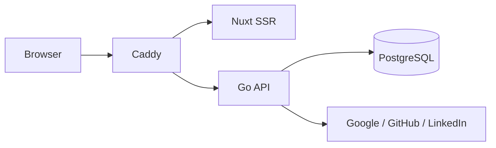

# Architecture (current state)

> Living document: describes what is **implemented on `main` now**. Intended
> product architecture lives in
> [`specs/aboutme-design.md`](specs/aboutme-design.md); execution status lives
> in the
> [numbered delivery index](plans/implementation-plan.md#numbered-delivery-index).

## Implemented on `main`

Phase 0 foundations and Phase 1 authentication/sessions are merged:

- Caddy fronts one local origin and routes the Nuxt SSR app and Go API. The
  podman compose stack includes PostgreSQL and a fail-closed one-shot migration
  service.
- The Go service exposes `/healthz`, `/readyz`, the three provider OAuth flows,
  `/api/v1/me`, logout, session listing, per-session revoke, and
  logout-everywhere. Request bounds, cache/security headers, CSRF, trusted-proxy
  client-IP handling, and rate limiting wrap the routes.
- PostgreSQL stores users, identities, OAuth transactions, and opaque sessions.
  Declarative SQL, sqlc output, and append-only Goose migrations are guarded by
  live-database drift and migration tests.
- Nuxt serves the landing/login pages and session settings UI. Resume-schema
  generation, OpenAPI lint/conformance tests, linting, typechecking,
  vulnerability scanning, and builds are wired into CI. Generated OpenAPI
  TypeScript client tooling is not implemented yet and is queued before P2B.

## Active but not merged

Phase 2A is being built on the isolated `worktree-phase-2a-resume-store` branch.
Tasks 1–6 are implemented and independently reviewed. The audit's title-bound,
clean-cache lint, callback-contract, TTL-reaping, and concurrent
CAS/idempotency-convergence corrections pass fresh independent review. The
corrective diff is not committed yet. Immutable v1 schema and bidirectional wire
compatibility (Task 2b/8), blind suites, and phase gates remain. The branch is
not part of `main` or the remote yet, so resume tables/store behavior must not
be described as shipped.

## Not implemented yet

Resume HTTP endpoints and media (P2B), the renderer/sanitizer/templates (P3),
the editor (P4), publish/public surfaces (P5), SSE (P6), print/og-image (P7),
privacy jobs (P8), AWS infrastructure (PI), staging/production deployment, and
Flutter remain future phases.
