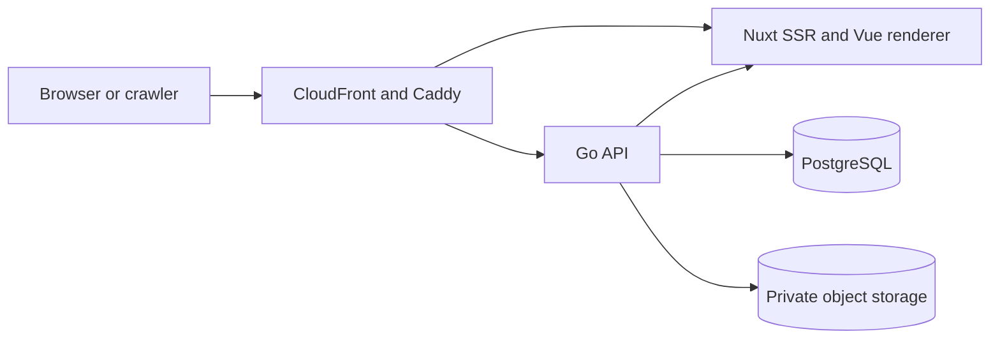

# aboutme design

Status: **Draft v4** (2026-08-12). This design is not approved or frozen.

This directory defines the intended v1 product and architecture. Current
behavior lives in code, deployment configuration, and
[`../api/openapi.yaml`](../api/openapi.yaml). The current-state narrative lives
in [`../architecture.md`](../architecture.md). Delivery state lives in the
[`../plans/implementation-plan.md`](../plans/implementation-plan.md).

[Architecture Decision Records](../adr/) explain individual choices and state
whether each choice is proposed or accepted. This draft incorporates their
current outcomes. If a page here disagrees with an accepted ADR, the ADR
controls that decision until this draft is corrected.

## Sections

| Section | File                                   | Purpose                                             |
| ------- | -------------------------------------- | --------------------------------------------------- |
| 1       | [Product](product.md)                  | Users, core journeys, v1 scope, and public states   |
| 2       | [System](system.md)                    | Components, route ownership, and failure boundaries |
| 3       | [Data](data.md)                        | Relational model, resume document, and versioning   |
| 4       | [API](api.md)                          | HTTP conventions, endpoints, and write safety       |
| 5       | [Web and rendering](web.md)            | Editor, renderer, templates, fonts, and sanitizing  |
| 6       | [Deployment](deployment.md)            | Environments, network trust, storage, and backups   |
| 7       | [Repository boundaries](repository.md) | Sources of truth and dependency direction           |
| 8       | [Realtime](realtime.md)                | Autosave, Server-Sent Events, and fallback behavior |
| 9       | [Operations](operations.md)            | Privacy lifecycle, monitoring, and launch evidence  |
| 10      | [Decision status](decisions.md)        | Integrated ADRs, open gates, and approval rules     |
| —       | [Font catalog](fonts.md)               | License gate, v2 choices, coverage, and provenance  |

The [template system](templates/README.md) is the detailed contract for preset
data, rendering tokens, and print behavior.

## System summary

The design has five cross-cutting rules:

1. A resume is the public entity. User accounts have no public page or public
   identifier.
2. One pure Vue renderer produces editor preview, public HTML, PDF, images, and
   template test output.
3. Every resume write passes through one validated aggregate boundary with
   optimistic concurrency and transactional idempotency.
4. Caddy is the sole client-IP trust boundary. Go accepts the canonical client
   address only from configured trusted proxies.
5. Local verification precedes cloud work. No AWS or DNS mutation occurs before
   local user acceptance testing and explicit human authorization.

## Approval rule

Draft pages may change through reviewed design work. Approval requires both
independent design and plan reviews to have no blocking findings, every open
gate in [Decision status](decisions.md) to have an owner and deadline, and an
explicit dated approval by the design owner. After approval, corrections or
changed decisions require a new design revision or an ADR; they do not silently
rewrite the approved text.
