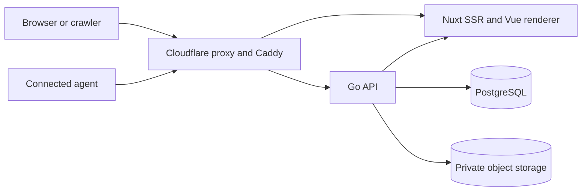

# aboutme design

Status: **Approved v4** (2026-08-12), approved by the design owner's delegated
review, with owner-approved amendments through ADR 0048 (2026-09-20). Changed
decisions from here on need a new ADR or a v5 revision.

This directory defines the intended v1 product and architecture. Current
behavior lives in code, deployment configuration, and
[`../api/openapi.yaml`](../api/openapi.yaml). The current-state narrative lives
in [`../architecture.md`](../architecture.md).

[Architecture Decision Records](../adr/) explain individual choices. ADRs
0001–0048 are accepted, subject to recorded supersessions. If a page disagrees
with an accepted ADR, the ADR controls that decision until this text is
corrected.

## Sections

| Section | File                                                  | Purpose                                                     |
| ------- | ----------------------------------------------------- | ----------------------------------------------------------- |
| 1       | [Product](product.md)                                 | Users, core journeys, v1 scope, and public states           |
| 2       | [System](system.md)                                   | Components, route ownership, and failure boundaries         |
| 3       | [Data](data.md)                                       | Relational model, resume document, and versioning           |
| 4       | [API](api.md)                                         | HTTP conventions, endpoints, and write safety               |
| 5       | [Web and rendering](web.md)                           | Editor, renderer, templates, fonts, and sanitizing          |
| 5a      | [Resume localization](editor-localization.md)         | Interface and resume-language separation                    |
| 5b      | [Second-factor auth](second-factor-authentication.md) | Passkey, recovery, TOTP, and authority rules                |
| 5c      | [Passkey contract](passkey-second-factor-contract.md) | V0.4.2 wire, storage, mail, and migration                   |
| 5d      | [Passkey release fence](passkey-release-fence.md)     | Deployment serialization, IAM, rollback, and TOTP floor     |
| 5e      | [TOTP contract](totp-second-factor-contract.md)       | V0.4.5 authenticator-app wire, storage, mail, and migration |
| 5f      | [TOTP key management](totp-key-management.md)         | TOTP sealing, key ring, rotation, and key failures          |
| 6       | [Deployment](deployment.md)                           | Environments, network trust, storage, and backups           |
| 6a      | [Single-host production](single-host-production.md)   | First-release production host, edge, database and deploy    |
| 7       | [Repository boundaries](repository.md)                | Sources of truth and dependency direction                   |
| 8       | [Realtime](realtime.md)                               | Autosave, Server-Sent Events, and fallback behavior         |
| 9       | [Operations](operations.md)                           | Privacy lifecycle, monitoring, and launch evidence          |
| 10      | [Decision status](decisions.md)                       | Integrated ADRs, open gates, and approval rules             |
| Other   | [Font catalog](fonts.md)                              | License gate, v2 choices, coverage, and provenance          |
| Other   | [Numeric budgets](budgets.md)                         | Hard limits, rate policies, SLOs, and benchmarks            |

The [template system](templates/README.md) is the detailed contract for preset
data, rendering tokens, and print behavior. The
[scaling contract](scaling/README.md) defines replica coordination, admission,
and what a second replica needs under ADR 0035.

## System summary

The design has five cross-cutting rules:

1. A resume is the public entity. User accounts have no public page or public
   identifier.
2. One pure Vue renderer produces editor preview, public HTML, PDF, images, and
   template test output.
3. Every resume write passes through one validated aggregate boundary with
   optimistic concurrency and transactional idempotency, whether the caller is
   the editor or a connected agent.
4. Caddy is the sole client-IP trust boundary. Go accepts the canonical client
   address only from configured trusted proxies.
5. Authors run the narrowest affected checks locally. GitHub CI is the full
   delivery gate, and tagging or deployment waits for green CI on the exact
   release commit under [ADR 0046](../adr/0046-github-ci-delivery-gate.md).

## Approval rule

V4 and its accepted amendments through ADR 0048 are approved and implementable.
A changed decision needs a new ADR; a structural rewrite needs a v5 revision.
Neither silently rewrites approved text.

A correction that fixes an error, ambiguity, or contradiction without changing a
decision is an ordinary edit. Note it in [Decision status](decisions.md).
