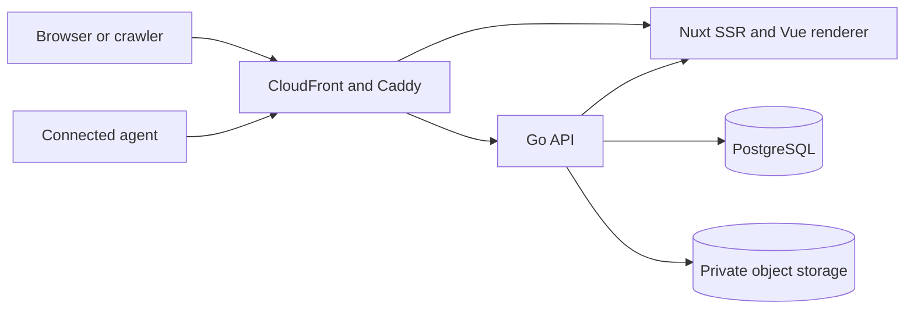

# aboutme design

This directory defines the intended product and architecture. Design v4 was
approved on 2026-08-12 and amended by every accepted ADR since.
[Decision status](decisions.md) lists the ADRs and the change process; an
accepted ADR controls its decision until contradicting text here is fixed.

Current behavior lives in code, deployment configuration, and
[`../api/openapi.yaml`](../api/openapi.yaml). The current-state narrative is
[`../architecture.md`](../architecture.md).

## Pages

| Section | File                                                            | Purpose                                                        |
| ------- | --------------------------------------------------------------- | -------------------------------------------------------------- |
| 1       | [Product](product.md)                                           | Users, journeys, scope, public namespace, and publish states   |
| 2       | [System](system.md)                                             | Components, route ownership, renderer and failure boundaries   |
| 3       | [Data](data.md)                                                 | Relational model, resume document, validation, and versions    |
| 4       | [API](api.md)                                                   | HTTP conventions, endpoints, photo intake, and write safety    |
| 5       | [Web and rendering](web.md)                                     | Web surfaces, UI toolkit, renderer, templates, and print       |
| 5a      | [Localization](localization.md)                                 | Vietnamese and English interface, separate from resume text    |
| 5b      | [Security](security.md)                                         | Identity, sessions, CSRF, agent OAuth, limits, and content     |
| 5c      | [Second-factor authentication](second-factor-authentication.md) | Shared passkey, TOTP, recovery, and epoch rules                |
| 5d      | [Passkey contract](passkey-second-factor-contract.md)           | Pending, WebAuthn, recovery, mail, and passkey storage shapes  |
| 5e      | [Authenticator-app contract](totp-second-factor-contract.md)    | TOTP routes, failure budget, and storage                       |
| 5f      | [TOTP key management](totp-key-management.md)                   | Sealing, key ring, rotation, and key failures                  |
| 6       | [Deployment](deployment.md)                                     | Environments, trust boundaries, media, mail, and migrations    |
| 6a      | [Single-host production](single-host-production.md)             | Production host, edge, database, secrets, deploy, and alarms   |
| 6b      | [Release fence](passkey-release-fence.md)                       | Minimum production release, operation lock, and IAM            |
| 7       | [Repository boundaries](repository.md)                          | Sources of truth and dependency direction                      |
| 8       | [Realtime](realtime.md)                                         | Autosave, Server-Sent Events, and fallback                     |
| 9       | [Operations](operations.md)                                     | Privacy lifecycle, export, deletion, monitoring, and checks    |
| 10      | [Decision status](decisions.md)                                 | ADR index, open gates, and change process                      |
| Other   | [Numeric budgets](budgets.md)                                   | Hard limits, rate policies, SLOs, and benchmark protocol       |
| Other   | [Font catalog](fonts.md)                                        | Font license gate, provenance, coverage, and fallback          |
| Other   | [MCP owner workflow](mcp-owner-workflow.md)                     | Official-SDK client run that copies one resume into Vietnamese |
| Other   | [Templates](templates/README.md)                                | Preset data, tokens, colors, geometry, and print behavior      |
| Other   | [Scaling](scaling/README.md)                                    | What a second serving replica needs                            |
| Other   | [Link previews](link-previews.md)                               | Page tags, preview card, and platform rules for shared links   |
| Other   | [Link-preview card](link-preview-card.md)                       | Card and publish-dialog preview visuals                        |
| Other   | [Deployment transparency](deployment-transparency/README.md)    | Running digests, signed provenance, SBOMs, and the verify page |
| Other   | [LinkedIn sign-in](linkedin-sign-in.md)                         | LinkedIn OIDC flow, account linking, and app setup             |
| Other   | [LinkedIn import](linkedin-import.md)                           | New resume from the LinkedIn data download                     |
| Other   | [Viewer analytics](viewer-analytics/README.md)                  | View counts and sign in to view, with no viewer data kept      |
| Other   | [Public page bar and theme](public-page-theme.md)               | Page bar, owner color scheme, and the dark palette rule        |

## System summary

Five rules cut across every page:

1. A resume is the public entity. User accounts have no public page or public
   identifier.
2. One pure Vue renderer produces the editor preview, public HTML, PDF, images,
   and template test output.
3. Every resume write, from the editor or a connected agent, passes one
   validated aggregate boundary with optimistic concurrency and transactional
   idempotency.
4. Caddy is the sole client-IP trust boundary. Go accepts the canonical client
   address only from configured trusted proxies.
5. GitHub CI is the full delivery gate; a tag or deploy waits for green CI on
   the exact release commit
   ([ADR 0046](../adr/0046-github-ci-delivery-gate.md)).
