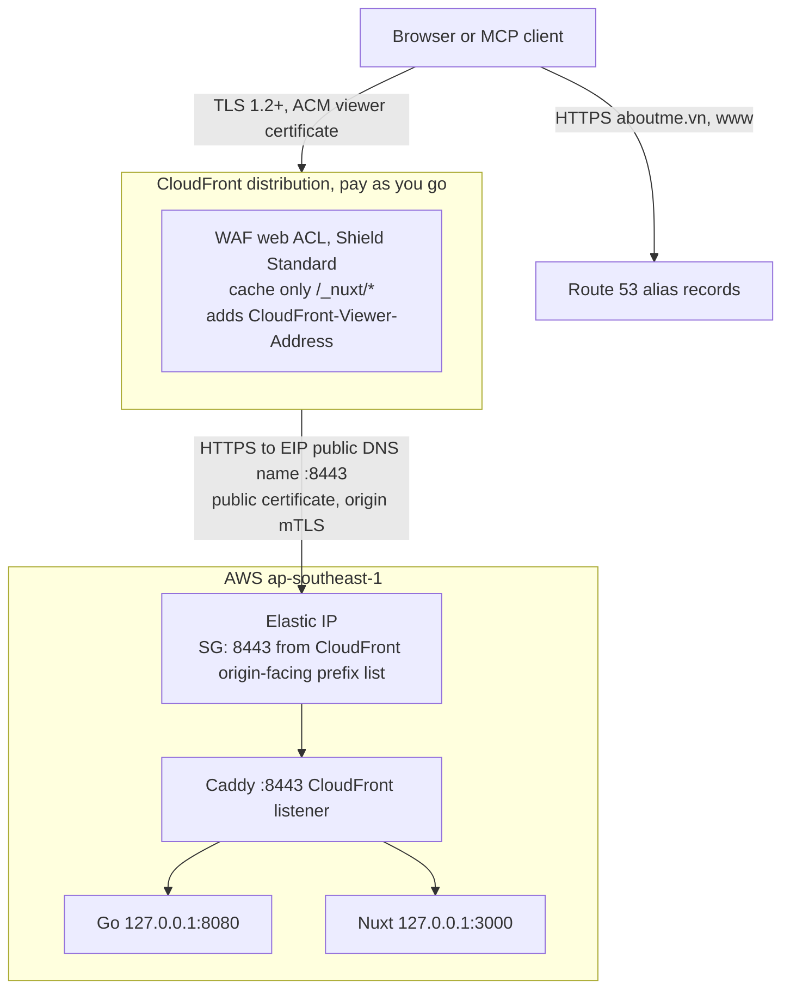

# CloudFront edge

Production at `https://aboutme.vn` runs behind Amazon CloudFront, in front of
the same EC2 host, with no load balancer, under
[ADR 0054](../adr/0054-cloudfront-edge-for-single-host-production.md). Route 53
serves DNS ([ADR 0056](../adr/0056-route-53-production-dns.md),
[DNS runbook](../runbooks/dns.md)). This edge is interim:
[ADR 0051](../adr/0051-vietnam-hosted-production.md) still governs the later
move to Vietnam, which replaces this edge with vCDN.

Status: built and serving production. **Owner approval** marks a choice the
owner makes before the work that depends on it starts. **Verify** marks a fact
from documentation or community sources that devops confirms on the account
([facts to verify](#facts-to-verify)).

## Why

Measurements on 2026-09-25 found slow and failed origin fetches only through
Cloudflare locations far from Singapore, in Asian daytime: first-byte times up
to 6.4 seconds through Hong Kong while Singapore stayed near 0.2 seconds
(`.dev/prod-checks/origin-latency/poll-now.log`), and 522 and 525 errors through
the United States and Japan in the same investigation. The public internet path
from distant Cloudflare locations to the origin is the cause. CloudFront fetches
from AWS origins over the AWS backbone and has edges in Hanoi and Saigon
([features][cf-features]). The owner chose it over Cloudflare Argo, on condition
that it is as secure as today.

## Request path

Everything behind Caddy is unchanged: task layout, Go's loopback trust of
`X-Real-IP`, RDS, S3, SES, and jobs.

## Origin access

The origin stays a public Elastic IP. VPC origins take an EC2 instance only in a
private subnet ([VPC origins][cf-vpc]), which would need a NAT gateway for image
pulls and AWS and outside APIs (USD 0.045 per hour in the published US East
example, [VPC pricing][vpc-price]), and they exclude origin mTLS ([enable
mTLS][cf-mtls-enable]).

Two layers replace Cloudflare's ranges and Authenticated Origin Pulls:

1. **Network.** A new security group admits TCP 8443 only from the AWS-managed
   prefix list `com.amazonaws.global.cloudfront.origin-facing` ([prefix
   list][cf-prefix]). The list weighs 55 rules against the default quota of 60
   per group ([weights][vpc-pl-weight]), so it gets its own group, attached to
   the host beside the existing one. The list admits every CloudFront customer,
   as Cloudflare's ranges admit every Cloudflare customer.
2. **Origin mTLS.** CloudFront presents a client certificate from our own
   private CA, and Caddy requires and verifies it on 8443 ([origin
   mTLS][cf-mtls]). This is the counterpart of Cloudflare's zone-level origin
   pull certificate. The certificate is ECDSA P-256 with the TLS client
   authentication extended key usage, imported into ACM in `us-east-1`
   ([requirements][cf-mtls-cert]). `tls.sh client-ca` generates it: the CA key
   is discarded, the CA certificate goes to SSM, and `tls.sh client-import`
   moves the client certificate and key from the per-user tmpfs to ACM, then
   deletes them. Another distribution cannot present it. Origin mTLS is
   available on pay-as-you-go, Business, and Premium, not on the Free plan
   ([enable mTLS][cf-mtls-enable]).

A secret origin header is not used. It is weaker than mTLS: the value travels in
every request and sits in the distribution config and OpenTofu state. It stays
the fallback if origin mTLS fails on the account.

Caddy runs one listener per edge, each with its own client certificate trust
pool and client address rule: only the CloudFront listener on 8443 runs today,
and 443 is closed. A future edge, such as vCDN, gets its own listener, so a
header one edge sets is never trusted on another's. The origin domain name is
the Elastic IP's public DNS name (`ec2-…ap-southeast-1.compute.amazonaws.com`),
read from OpenTofu, so no DNS record points at the origin ([origin
domain][cf-origin]).

## Origin certificate

CloudFront accepts only a certificate from a CA in the Mozilla list, with the
full chain, whose names include the origin domain or, when the viewer `Host`
header is forwarded, that host ([origin TLS][cf-origin-tls]). The Cloudflare
Origin CA certificate does not qualify. The origin gets an **ACM exportable
public certificate** for `aboutme.vn` and `www.aboutme.vn` in `ap-southeast-1`:

- USD 7 per name at issuance and each renewal ([ACM pricing][acm-price]), valid
  198 days and renewed 45 days before expiry ([exportable][acm-export]): about
  USD 33 a year for two names. It shares the viewer certificate's DNS validation
  records, which work in any region ([DNS validation][acm-dns]).
- `tls.sh` gains an export mode. It exports with a one-time passphrase inside a
  private tmpfs directory, removes the passphrase, and writes the key to the
  existing SecureString `/aboutme/prod/tls/origin-key` and the leaf and chain to
  String parameters. No task definition or entrypoint change is needed beyond
  appending the chain. **Verify:** leaf plus chain may exceed the 4 KB limit of
  a standard parameter ([tiers][ssm-tiers]); if so, the chain gets its own
  parameter.
- An EventBridge rule on `ACM Certificate Available` with action `RENEWAL` for
  this certificate emails the owner through the existing SNS topic
  ([events][acm-events]). The owner runs the export and redeploys the live tag.
  `deploy.sh` refuses to deploy when the deployed origin certificate expires in
  fewer than 21 days, so a missed email cannot silently run out the 45 days.
- Full (strict) accepts a publicly trusted certificate ([Full
  strict][cfl-strict]), so it serves both edges during the migration.

Let's Encrypt in Caddy was rejected: TLS-ALPN-01 cannot pass CloudFront, and
HTTP-01 or DNS-01 needs ACME storage shared by both Caddy tasks and kept across
deploys, or several deploys a day hit the limit of five certificates per name
set per week ([rate limits][le-limits]); DNS-01 also puts a DNS credential on
the host. The viewer certificate stays separate so its key never leaves ACM.

## Viewer TLS, hostnames, and DNS

- A free ACM certificate in `us-east-1` ([certificates][cf-cert]) covers the
  aliases `aboutme.vn` and `www.aboutme.vn`. HTTP redirects to HTTPS; security
  policy `TLSv1.2_2021`; HTTP/2 and HTTP/3; IPv6 on, matching today's `AAAA`
  answers; price class All.
- The viewer `Host` is forwarded, so Caddy sees the same hosts as behind
  Cloudflare, and `www` keeps redirecting at the origin.
- **DNS is Route 53** ([ADR 0056](../adr/0056-route-53-production-dns.md)). The
  apex and `www` are alias A, AAAA, and HTTPS records to the distribution in a
  DNSSEC-signed zone ([DNS runbook](../runbooks/dns.md)). An alias answer
  follows the resolver's client subnet: a Vietnamese subnet got `HAN50`.
  Cloudflare's flattened apex CNAME ([flattening][cfl-flatten]) got edges near
  Cloudflare's resolver instead: Singapore through `1.1.1.1` and Marseille
  (first byte 1.0 s) through `8.8.8.8`. Alias queries to CloudFront are free
  ([Route 53 pricing][r53-price]).

## Cache and forwarding

ADR 0022 stands: edge storage is never publication authority. CloudFront caches
only hashed assets and passes everything else through uncached, which is
stricter than the 60-second revalidated maximum ADR 0022 allows.

| Behavior      | Cache policy                                                   | Origin request policy                                                                    | Methods   |
| ------------- | -------------------------------------------------------------- | ---------------------------------------------------------------------------------------- | --------- |
| `/_nuxt/*`    | Custom: TTL 0 / 0 / 1 year, key = `Host` and all query strings | None                                                                                     | GET, HEAD |
| Default (`*`) | Managed `CachingDisabled` ([cache policies][cf-cache])         | Custom: all viewer headers, cookies, and query strings, plus `CloudFront-Viewer-Address` | All seven |

- The `/_nuxt/*` key includes query strings because the renderer stylesheets are
  fixed names versioned by `?v=`, which the managed `CachingOptimized` policy
  would drop. The origin's `Cache-Control` decides what stays; `Host` in the key
  keeps a `www` redirect from being served for the apex.
- The default origin request policy uses header behavior
  `allViewerAndWhitelistCloudFront` ([API][cf-orp-api]), so `Authorization`
  reaches the origin on every method, as MCP and bearer calls need; CloudFront
  otherwise strips it from GET and HEAD ([forwarding][cf-auth]). Cookies,
  `Origin`, `User-Agent`, and `If-None-Match` pass as behind Cloudflare.
- Error caching minimum TTL is 0 for 400, 403, 404, 405, 414, 416, and 500 to
  504, so a maintenance 503, or a 404 for a hash the old release lacks, is never
  replayed.
- Origin: HTTPS only, TLS 1.2 minimum, port 8443, IPv4, connection timeout 10
  seconds with 3 attempts, read timeout 60 seconds, keep-alive 60 seconds, and
  no response completion timeout, so a stream has no total cap ([origin
  settings][cf-origin]). The read timeout bounds the gap between packets; SSE
  heartbeats every 25 seconds stay inside it, and a render ends within 20
  seconds ([budgets](budgets.md)). MCP is stateless with JSON responses, so SSE
  is the only long response.
- Limits: request body 64 GB, request line and headers 32,768 bytes, URL 8,192
  bytes ([quotas][cf-quotas]), so 2 MiB photos and 4 MiB `/mcp` bodies fit. A
  GET with a body gets 403. CloudFront speaks HTTP/1.1 to the origin and streams
  chunked responses as they arrive ([custom origins][cf-custom]).

## Client address

`CloudFront-Viewer-Address` carries the viewer address and source port
([headers][cf-headers]); CloudFront adds it when the origin request policy lists
it ([API][cf-orp-api]). For IPv6 the address comes without brackets, as in
`2001:db8:0:0:0:0:0:1:60776` ([nginx ticket][nginx-2524]; **Verify**), which
Caddy's `client_ip_headers` cannot parse reliably. The CloudFront listener
therefore sets no `trusted_proxies` and applies this rule:

1. Remove `X-Real-IP`, `X-Forwarded-For`, `Forwarded`, `X-Forwarded-Host`, and
   `CF-Connecting-IP`. CloudFront already removes viewer `X-Real-IP` and
   `X-Forwarded-Proto` ([custom origins][cf-custom]).
2. Accept `CloudFront-Viewer-Address` only with exactly one value matching
   `^([0-9A-Fa-f:.]+):([0-9]{1,5})$`; the address is everything before the last
   colon, since the port is always present. Remove the header.
3. Send the address as the single `X-Real-IP`. Missing, repeated, or malformed
   input sends none, and Go fails closed as today.

Go is unchanged: it trusts `X-Real-IP` only from loopback and parses it with
`netip`. A spoofed value needs a request that reaches 8443 without our
distribution, which the security group and mTLS block. **Verify:** a
viewer-supplied `CloudFront-Viewer-Address` is replaced, not appended; step 2
rejects a duplicate either way.

## Response headers

Origin headers pass through: both CSPs, `Clear-Site-Data`, `__Host-` cookies,
`ETag`, `Cache-Control`, and `Retry-After`. CloudFront sets its own `Via` and
adds `X-Cache`, `X-Amz-Cf-Pop`, and `X-Amz-Cf-Id` ([custom origins][cf-custom]).
Caddy sets `Strict-Transport-Security: max-age=31536000` (no subdomains, no
preload) and `X-Content-Type-Options: nosniff` when the upstream did not, and
removes `Server` and its own `Via: 1.1 Caddy`, so no response names the origin
software and the rule survives the move to vCDN.

## DDoS and WAF

Shield Standard covers network and transport layer attacks on CloudFront at no
charge ([Shield][shield]), but not the application layer (L7). Cloudflare's free
plan has unmetered L7 DDoS protection ([DDoS][cfl-ddos]) and the Free Managed
Ruleset ([rules][cfl-waf]), so parity needs AWS WAF.

**Owner approval:** launch with one web ACL holding a rate-based rule per IP,
the Amazon IP reputation list, and known bad inputs: USD 5 per web ACL plus USD
1 per rule or managed group, USD 8 a month, plus USD 0.60 per million requests
([WAF pricing][waf-price]). Rules count for a week, then block; the rate limit
starts at 2,000 requests per five minutes. The core rule set is left out: it
blocks bodies over 8 KB, which photo uploads, autosaves, and `/mcp` calls
exceed, and its cross-site scripting body rule would inspect rich-text resume
bodies ([baseline groups][waf-crs]). WAF logging stays off. Viewer analytics
adds label-only rules on one path
([counting](viewer-analytics/counting.md#layers-2-and-3-edge-labels)).

## Deploys and monitoring

- The `SO_REUSEPORT` handoff is unchanged. The maintenance Caddyfile carries the
  same listeners, trust, and client address rule.
- CloudFront returns 502 on a bad origin certificate, chain, or mTLS handshake
  and 504 when the origin does not answer in time ([origin TLS][cf-origin-tls],
  [origin settings][cf-origin]); they replace 521, 522, and 525. Its own errors
  carry `X-Cache: Error from cloudfront`. It retries a stalled GET or HEAD but
  not a POST, PUT, PATCH, or DELETE, so a write on a connection the outgoing
  Caddy is closing can still fail, as behind Cloudflare.
- `deploy.sh`: smoke, warm-up, and the maintenance check keep using
  `https://aboutme.vn` and, after cutover, require `Via` to name CloudFront. The
  direct-origin check covers 443 and 8443. Retries treat 502 and 504 as
  transient. The Cloudflare range check goes with Cloudflare. A preflight checks
  the distribution's origin domain and at least 21 days on the origin
  certificate.
- The Route 53 health check on `/readyz` now passes through CloudFront and fails
  on 502 or 504 as on any 5xx today. An EventBridge rule on
  `ACM Certificate Approaching Expiration` for the imported client certificate
  emails the owner 45 days ahead ([events][acm-events]).
- **Owner approval:** once CloudFront serves production, raise the release fence
  to the first release whose Caddy has the CloudFront listener, because
  `--rollback` redeploys the older Caddy image, which has no 8443 listener.

## Privacy

Cloudflare handles no page traffic, IP addresses, or decrypted content, and
after the DNS move it answers no queries either. AWS, already the hosting
processor, terminates TLS at CloudFront edges worldwide, including in Vietnam,
so data still leaves Vietnam until the ADR 0051 move. CloudFront access logs and
WAF logs stay off, as the privacy policy promises no IP address in request logs.

The notice in `apps/web/app/i18n/legal.ts` changes in both languages at cutover:
CloudFront (Amazon Web Services, global edge network) delivers the site and
processes IP addresses; public pages are not stored at the edge; Cloudflare only
provides DNS; transfer abroad goes mainly to Singapore and in part to Google.
When the Cloudflare zone is removed, the Cloudflare DNS sentence goes (**Owner
approval:** the exact text).

## Cost

In the 30 days to 2026-09-25 the host sent 2.9 GB and CloudWatch received
443,000 log events from all containers, an upper bound on requests. CloudFront's
always-free tier is 1 TB and 10 million requests a month; beyond it, Vietnam and
Singapore cost USD 0.120 per GB and USD 0.0120 per 10,000 HTTPS requests ([pay
as you go][cf-payg]).

| Item                        | USD per month                            |
| --------------------------- | ---------------------------------------- |
| CloudFront, origin fetches  | 0 inside the free tier                   |
| ACM viewer certificate      | 0 ([ACM pricing][acm-price])             |
| ACM exportable origin cert  | about 2.75 (14 per 198-day renewal)      |
| Imported client certificate | No charge listed; **Verify** on the bill |
| AWS WAF, if approved        | 8 plus 0.60 per million requests         |
| **Total**                   | **about 11**                             |

The flat-rate Free plan (USD 0, WAF included) lacks origin mTLS and custom
policies; Business (USD 200) is the first with origin mTLS ([plans][cf-plans]).
Cloudflare Argo is USD 5 a month plus USD 0.10 per GB by third-party accounts;
Cloudflare's pages give no price, so that figure is unverified.

## Security parity

| Control              | Cloudflare proxy                       | CloudFront                                      |
| -------------------- | -------------------------------------- | ----------------------------------------------- |
| Viewer TLS           | Edge certificate, TLS 1.2+             | ACM certificate, `TLSv1.2_2021`                 |
| Origin reachability  | Security group: Cloudflare ranges      | Security group: CloudFront prefix list, 8443    |
| Origin authenticates | Origin pull mTLS, our CA               | Origin mTLS, our CA                             |
| Edge verifies origin | Full (strict), Origin CA               | Publicly trusted certificate, full chain        |
| Client address       | `CF-Connecting-IP` from trusted ranges | `CloudFront-Viewer-Address` on its own listener |
| Network DDoS         | Cloudflare                             | Shield Standard                                 |
| Application DDoS     | Free L7 mitigation, managed ruleset    | WAF rate rule, two managed groups (approval)    |
| HSTS, `nosniff`      | Cloudflare settings                    | Caddy                                           |
| Edge cache           | `/_nuxt/*` only                        | `/_nuxt/*` only                                 |
| Decrypts traffic     | Cloudflare                             | AWS, already the hosting processor              |

Without the WAF, application-layer protection is weaker than Cloudflare's.

## Migration

Each step ships alone; the site stays on Cloudflare until step 5.

1. **Origin certificate.** Request the exportable certificate, add the two
   validation records at Cloudflare, export to SSM, and deploy. Cloudflare keeps
   working in Full (strict).
2. **Caddy edge listeners.** An `EDGES` list (`cloudflare`, `cloudfront`, or
   both) enables the 443 and 8443 listeners, with the client address rule, HSTS,
   `nosniff`, and `Server` removal. Tests cover forged headers per listener,
   IPv4 and unbracketed IPv6 values, duplicates, and a missing header. ADR
   0051's Caddy edge selection later adds `vcdn` to this list.
3. **Build the edge.** `tls.sh` stores the client CA parameter and imports the
   client certificate; OpenTofu adds the viewer certificate, the security group,
   the policies, the distribution, and the web ACL; task definitions get
   `EDGES=cloudflare,cloudfront` and the trust pool.
4. **Test before cutover** with `aboutme.vn` and `www.aboutme.vn` pinned to the
   distribution's edge addresses (`curl --resolve`, Chromium
   `--host-resolver-rules`), running the [test plan](#test-plan). The real
   hostname keeps `PUBLIC_ORIGIN`, cookies, CSRF origin checks, and passkeys
   valid; a temporary hostname would fail them. **Owner approval:** pinned
   hostnames instead of a temporary one.
5. **Cutover.** Raise the release fence and deploy the privacy notice. At
   Cloudflare, replace the apex `A` with a DNS-only CNAME to the distribution
   and point `www` at it, TTL 60. Proxied answers carry TTL 300
   ([TTL][cfl-ttl]), so old resolvers reach the 443 listener for about five
   minutes. Watch `x-amz-cf-pop`, 5xx rates, and the site-down alarm.
6. **Soak seven days** with Cloudflare's SSL, origin pull, and cache settings
   intact.
7. **Remove Cloudflare from the path:** `EDGES=cloudfront`; delete the 443
   rules, `CLOUDFLARE_RANGES`, the range check, and the old pull CA parameter;
   remove the zone origin pull certificate; revoke the Origin CA certificate;
   update the living docs. **Owner approval:** add CAA `0 issue "amazon.com"`
   then, not earlier, since it blocks Cloudflare's edge certificate on rollback.

**Rollback** before step 7: restore the proxied apex `A` to the Elastic IP and
the proxied `www` CNAME; Cloudflare serves within its TTL and 443 never stopped.
After step 7, revert that step, apply, and deploy first.

## Test plan

Before cutover with pinned hostnames and again after; evidence under
`.dev/prod-checks/cloudfront/`.

1. **Origin closed:** `https://<EIP>:443` and `:8443` time out from the laptop;
   a throwaway distribution without the client certificate gets 502.
2. **Client address:** sign-in records the tester's real IPv4 and IPv6 address
   in the sessions list; forged `X-Forwarded-For`, `X-Real-IP`,
   `CF-Connecting-IP`, `Forwarded`, and `CloudFront-Viewer-Address` change
   nothing; login rate limits trip for one address, not a second.
3. **SSE:** an editor stream stays open 10 minutes without reconnecting, and an
   edit in a second tab arrives.
4. **MCP:** discovery, authorization, token, `tools/list`, an edit, and
   `upload_photo` with 2 MiB, on the owner test account.
5. **Uploads:** a 2 MiB editor photo succeeds; an oversized one gets Go's error,
   not an edge error.
6. **Cache:** a hashed `/_nuxt/` file hits on the second request; `?v=` values
   cache apart; `/`, `/healthz`, `/api/*`, a public page, its PDF, and its photo
   always miss; unpublish gives 404 at once; `If-None-Match` gets 304.
7. **Headers:** CSPs, `Clear-Site-Data`, HSTS, `nosniff`, and `__Host-` cookies
   present; `Server: Caddy`, `Via: 1.1 Caddy`, and `CF-Ray` absent from served
   responses (Caddy's own empty 502 and 504 keep its defaults); `www` redirects.
8. **Deploy:** a one-second poll of `/` and `/healthz` through a deploy and a
   `--rollback` sees only 200 or the marked 503, never 502, 504, or a timeout.
9. **Latency:** the origin latency poll from Vietnam and one distant network
   shows a nearby `x-amz-cf-pop` and first byte under one second.

## Facts to verify

1. CloudFront sends the forwarded `Host` as the SNI name; the docs require the
   certificate to match it but do not name the SNI value ([origin
   TLS][cf-origin-tls]). If not, set Caddy's `default_sni` on 8443.
2. The IPv6 `CloudFront-Viewer-Address` format; a viewer value is replaced.
3. Viewer `If-None-Match` reaches the origin with cookies forwarded.
4. Error caching TTL 0 keeps the maintenance 503 off `/_nuxt/*` after a deploy.
5. Origin mTLS with the imported ECDSA certificate on pay-as-you-go through
   OpenTofu (the locked AWS provider 6.64.0 has `origin_mtls_config`).
6. Changing the instance's security groups applies in place.
7. The exported leaf and chain fit the 4 KB parameter limit.
8. From Vietnam, the apex through `1.1.1.1` and `8.8.8.8` reaches `HAN` or `SGN`
   after the name server change.
9. Imported ACM certificates carry no charge.

[acm-dns]: https://docs.aws.amazon.com/acm/latest/userguide/dns-validation.html
[acm-events]:
  https://docs.aws.amazon.com/acm/latest/userguide/supported-events.html
[acm-export]:
  https://docs.aws.amazon.com/acm/latest/userguide/acm-exportable-certificates.html
[acm-price]: https://aws.amazon.com/certificate-manager/pricing/
[cf-auth]:
  https://docs.aws.amazon.com/AmazonCloudFront/latest/DeveloperGuide/add-origin-custom-headers.html#add-origin-custom-headers-forward-authorization
[cf-cache]:
  https://docs.aws.amazon.com/AmazonCloudFront/latest/DeveloperGuide/using-managed-cache-policies.html
[cf-cert]:
  https://docs.aws.amazon.com/AmazonCloudFront/latest/DeveloperGuide/cnames-and-https-requirements.html
[cf-custom]:
  https://docs.aws.amazon.com/AmazonCloudFront/latest/DeveloperGuide/RequestAndResponseBehaviorCustomOrigin.html
[cf-features]: https://aws.amazon.com/cloudfront/features/
[cf-headers]:
  https://docs.aws.amazon.com/AmazonCloudFront/latest/DeveloperGuide/adding-cloudfront-headers.html
[cf-mtls]:
  https://docs.aws.amazon.com/AmazonCloudFront/latest/DeveloperGuide/origin-mtls-authentication.html
[cf-mtls-cert]:
  https://docs.aws.amazon.com/AmazonCloudFront/latest/DeveloperGuide/origin-certificate-management-certificate-manager.html
[cf-mtls-enable]:
  https://docs.aws.amazon.com/AmazonCloudFront/latest/DeveloperGuide/origin-enable-mtls-distributions.html
[cf-orp-api]:
  https://docs.aws.amazon.com/cloudfront/latest/APIReference/API_OriginRequestPolicyHeadersConfig.html
[cf-origin]:
  https://docs.aws.amazon.com/AmazonCloudFront/latest/DeveloperGuide/DownloadDistValuesOrigin.html
[cf-origin-tls]:
  https://docs.aws.amazon.com/AmazonCloudFront/latest/DeveloperGuide/using-https-cloudfront-to-custom-origin.html
[cf-payg]: https://aws.amazon.com/cloudfront/pricing/pay-as-you-go/
[cf-plans]:
  https://docs.aws.amazon.com/AmazonCloudFront/latest/DeveloperGuide/flat-rate-pricing-plan.html
[cf-prefix]:
  https://docs.aws.amazon.com/AmazonCloudFront/latest/DeveloperGuide/LocationsOfEdgeServers.html
[cf-quotas]:
  https://docs.aws.amazon.com/AmazonCloudFront/latest/DeveloperGuide/cloudfront-limits.html
[cf-vpc]:
  https://docs.aws.amazon.com/AmazonCloudFront/latest/DeveloperGuide/private-content-vpc-origins.html
[cfl-ddos]: https://developers.cloudflare.com/ddos-protection/
[cfl-flatten]:
  https://developers.cloudflare.com/dns/cname-flattening/set-up-cname-flattening/
[cfl-strict]:
  https://developers.cloudflare.com/ssl/origin-configuration/ssl-modes/full-strict/
[cfl-ttl]:
  https://developers.cloudflare.com/dns/manage-dns-records/reference/ttl/
[cfl-waf]: https://developers.cloudflare.com/waf/managed-rules/
[le-limits]: https://letsencrypt.org/docs/rate-limits/
[nginx-2524]: https://trac.nginx.org/nginx/ticket/2524
[r53-price]: https://aws.amazon.com/route53/pricing/
[shield]:
  https://docs.aws.amazon.com/waf/latest/developerguide/ddos-standard-summary.html
[ssm-tiers]:
  https://docs.aws.amazon.com/systems-manager/latest/userguide/parameter-store-advanced-parameters.html
[vpc-pl-weight]:
  https://docs.aws.amazon.com/vpc/latest/userguide/working-with-aws-managed-prefix-lists.html#aws-managed-prefix-list-weights
[vpc-price]: https://aws.amazon.com/vpc/pricing/
[waf-crs]:
  https://docs.aws.amazon.com/waf/latest/developerguide/aws-managed-rule-groups-baseline.html
[waf-price]: https://aws.amazon.com/waf/pricing/
