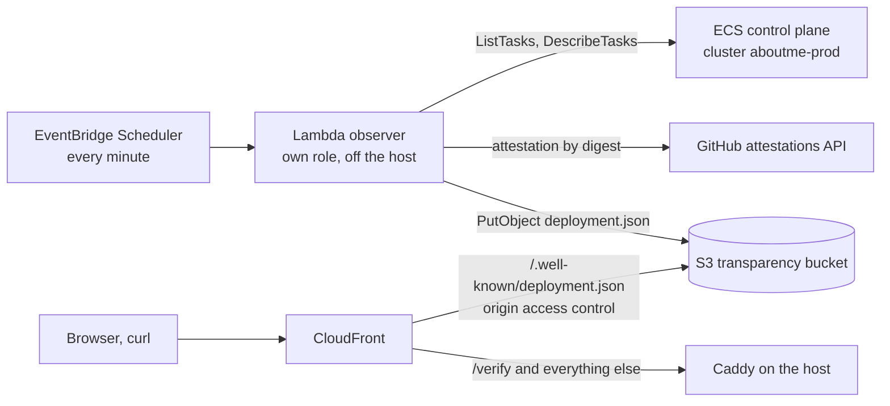

# Deployment transparency

Anyone can check which build runs `https://aboutme.vn`. An observer outside the
application asks the platform which image digests are running, checks each
digest against the signed GitHub build record, and publishes the result at
`https://aboutme.vn/.well-known/deployment.json`. The page `/verify` shows the
same document to people and tells them how to check it themselves.
[ADR 0057](../../adr/0057-deployment-transparency-observer.md) records the
choice.

Status: proposed. **Owner approval** marks a product-visible choice the owner
makes before the work that depends on it starts ([list](#owner-approval)).
**Verify** marks a platform fact that devops confirms on the account before
relying on it ([facts](#facts-to-verify)).

| Page                            | Holds                                                     |
| ------------------------------- | --------------------------------------------------------- |
| This page                       | Observer placement, access, publishing, freshness, limits |
| [Document](document.md)         | `deployment.json` schema, field sources, sanitizer        |
| [Verification](verification.md) | Provenance, SBOM, what "verified" means, user commands    |
| [Verify page](page.md)          | `/verify` states, layout, copy, footer link               |

## Evidence model

The critical field is the image digest the platform reports, not a tag. A tag
can move; a digest names exact bytes. Each running digest is joined to a
Sigstore-signed provenance record that GitHub Actions produced when it built
that digest from a tagged commit. The document shows four steps, and each must
match:

1. **Source:** the public repository, tag, and commit.
2. **Build:** the `release-images` workflow run that built from that commit.
3. **Image:** the digest the build signed, in `ghcr.io/dannyota/aboutme-*`.
4. **Running:** the digest the platform reports for each serving container.

Every field except the running digest, replica count, and start time comes from
the signed record, never from the application or from deploy scripts. The
application reporting its own digest would be weaker evidence: a compromised
application can say anything about itself.

## Where the observer runs



**Owner approval:** the observer on AWS is a Lambda function that runs the
observer container image, started every minute by EventBridge Scheduler.

- It runs outside the EC2 host. Its credentials never exist on the host, so code
  in the `app` task cannot reach them through the instance role, as it can reach
  other tasks' credentials today
  ([single-host design](../single-host-production.md#host-and-networking)).
- It needs no public IPv4 address and no host memory. The host has 2 GiB and
  little headroom.
- It costs under USD 0.50 a month: about 43,200 invocations of one second at 128
  MB sit inside the Lambda and Scheduler free tiers, and 43,200 S3 writes cost
  about USD 0.22 (**Verify** on the bill).
- It runs the same image as the Kubernetes observer below, so both platforms
  share one binary, one sanitizer, and one schema.

Rejected:

| Option                         | Why not                                                                                             |
| ------------------------------ | --------------------------------------------------------------------------------------------------- |
| Sidecar in the `app` task      | Shares the observed task's host and failure domain; its report is close to self-reporting           |
| Scheduled ECS task on the host | Task-role credentials reachable from the `app` task; competes for 2 GiB; deploys pause its schedule |
| Fargate task or service        | About USD 2.50 a month at five minutes, about USD 12.50 at one minute, plus a public IPv4 per run   |
| Lambda from a zip              | A second artifact kind with its own build and upload path; Kubernetes still needs an image          |

The observer image is `ghcr.io/dannyota/aboutme-observer`, built, scanned, and
attested by `release-images.yml` like the other three. Lambda runs container
images only from Amazon ECR, so `deploy/aws/scripts/observer.sh <tag>` verifies
the GHCR image's provenance with `gh attestation verify`, copies it byte for
byte into the private ECR repository `aboutme-prod-observer`, fails unless the
ECR digest equals the GHCR digest, and points the function at that digest.
Observer updates are separate from application deploys and rare.

Function settings: `arm64`, 128 MB, 30-second timeout, reserved concurrency one
so runs never overlap, no VPC, and no environment secret. Its environment holds
only the cluster name, the three service names, and the bucket name; none of
them reaches the document.

### Kubernetes

**Open conflict for the owner:**
[ADR 0051](../../adr/0051-vietnam-hosted-production.md) and the
[Vietnam design](../vietnam-production.md) describe one vServer with Podman
under systemd, not Kubernetes. This section holds for a GreenNode VKS cluster.
On the Podman host there is no read-only platform API: the Podman socket grants
full control, so an observer on it would need root-equivalent access. That host
needs its own design before the move.

On Kubernetes the same image runs as a Deployment with one replica that polls
every 60 seconds, in its own namespace `aboutme-observer`:

```yaml
apiVersion: rbac.authorization.k8s.io/v1
kind: Role
metadata: { name: deployment-observer, namespace: aboutme }
rules:
  - apiGroups: [""]
    resources: ["pods"]
    verbs: ["get", "list"]
---
apiVersion: rbac.authorization.k8s.io/v1
kind: RoleBinding
metadata: { name: deployment-observer, namespace: aboutme }
subjects:
  - kind: ServiceAccount
    name: deployment-observer
    namespace: aboutme-observer
roleRef:
  apiGroup: rbac.authorization.k8s.io
  kind: Role
  name: deployment-observer
```

- It reads `status.containerStatuses[].imageID` and takes only the
  `@sha256:<hex>` suffix; `containerd://` and `docker-pullable://` prefixes are
  discarded. A pod counts only while its container state is `running`.
- The `app.kubernetes.io/component` label maps a pod to a component. The
  observer reads labels and never writes them out.
- The pod runs as non-root with a read-only root file system, no capabilities,
  and the `RuntimeDefault` seccomp profile. A NetworkPolicy allows egress only
  to the API server, DNS, GitHub, GHCR, the Sigstore trust root, and the object
  store.
- It writes to an object store bucket with a key limited to that bucket. The
  edge serves the path from the bucket if vCDN can route one path to a second
  origin (**Verify**); otherwise Caddy proxies that exact path to the bucket.

## Access on AWS

The observer's role, with `<ACCOUNT>` and `<BUCKET>` filled by OpenTofu:

```json
{
  "Version": "2012-10-17",
  "Statement": [
    {
      "Sid": "ListServingTasks",
      "Effect": "Allow",
      "Action": "ecs:ListTasks",
      "Resource": "*",
      "Condition": {
        "ArnEquals": {
          "ecs:cluster": "arn:aws:ecs:ap-southeast-1:<ACCOUNT>:cluster/aboutme-prod"
        }
      }
    },
    {
      "Sid": "DescribeServingTasks",
      "Effect": "Allow",
      "Action": "ecs:DescribeTasks",
      "Resource": "arn:aws:ecs:ap-southeast-1:<ACCOUNT>:task/aboutme-prod/*",
      "Condition": {
        "ArnEquals": {
          "ecs:cluster": "arn:aws:ecs:ap-southeast-1:<ACCOUNT>:cluster/aboutme-prod"
        }
      }
    },
    {
      "Sid": "PublishDocument",
      "Effect": "Allow",
      "Action": "s3:PutObject",
      "Resource": "arn:aws:s3:::<BUCKET>/deployment.json"
    },
    {
      "Sid": "VerificationCache",
      "Effect": "Allow",
      "Action": ["s3:GetObject", "s3:PutObject"],
      "Resource": "arn:aws:s3:::<BUCKET>/verified/*"
    },
    {
      "Sid": "Logs",
      "Effect": "Allow",
      "Action": ["logs:CreateLogStream", "logs:PutLogEvents"],
      "Resource": "arn:aws:logs:ap-southeast-1:<ACCOUNT>:log-group:/aws/lambda/aboutme-prod-observer:*"
    }
  ]
}
```

`ecs:ListTasks` authorizes against the `container-instance` resource type and
`ecs:DescribeTasks` against `task`; both accept the `ecs:cluster` condition key
([service authorization reference][ecs-iam]). **Verify** with the IAM policy
simulator and one live run that a call against another cluster is denied. The
platform read is exactly these two actions.

The rest of the boundary:

- **Bucket** `aboutme-prod-transparency` (name from a variable, as the media
  bucket's is): private, Block Public Access on, SSE-S3, versioning off. Its
  policy lets only the CloudFront distribution read `deployment.json` through
  origin access control, and denies `s3:PutObject` on `deployment.json` and
  `verified/*` to every principal except the observer role. CloudFront never
  serves `verified/*`.
- **ECR** repository `aboutme-prod-observer`: private, immutable tags, a
  repository policy that lets the Lambda service pull (`ecr:BatchGetImage`,
  `ecr:GetDownloadUrlForLayer`) with `aws:SourceArn` set to the function.
- **Scheduler** role: `lambda:InvokeFunction` on the function only. It is a new
  role, separate from the jobs scheduler role.
- **Deploy role** gains `ecr:GetAuthorizationToken` (no resource scope exists),
  the five layer and image push actions on the one repository, and
  `lambda:GetFunction` and `lambda:UpdateFunctionCode` on the one function. The
  operator role's explicit deny already blocks it from doing either directly.
- The `app`, `web`, `jobs`, `maintenance`, and instance roles get nothing.
- A CloudWatch alarm on the function's `Errors` metric (five or more in ten
  minutes) emails the owner through the existing SNS topic.

## Run, freshness, and staleness

Each run lists the `RUNNING` tasks of the `aboutme-prod-app`,
`aboutme-prod-web`, and `aboutme-prod-maintenance` services (one `ListTasks`
call per service), describes them in one call, and counts containers whose
`lastStatus` is `RUNNING` by component and digest. It then verifies every digest
not in its cache ([verification](verification.md)) and writes the document.

- **Freshness:** a run takes about one second, so the document is at most about
  90 seconds old when read: one minute between runs plus the 30-second edge
  cache.
- **Stale:** the observer writes `stale_after` as `observed_at` plus 180
  seconds. The page treats the document as stale after `stale_after`, or more
  than 600 seconds after `observed_at` whatever `stale_after` says. It measures
  "now" from the response's `Date` plus `Age` headers, so a wrong visitor clock
  cannot make old data look current.
- **Failure:** a failed platform read writes nothing, so the last good document
  ages into stale and the alarm fires. A failed or impossible verification still
  writes the document, with that image marked `unchecked`, `not_found`, or
  `invalid`. A document that fails the output schema is never written.

The page never shows "verified" for a stale document, an unknown schema version,
or any image whose status is not `verified`.

## Serving and caching

**Owner approval:** CloudFront serves `/.well-known/deployment.json` from the S3
bucket and caches it for 30 seconds. This amends the rule that CloudFront caches
only `/_nuxt/*`
([ADR 0054](../../adr/0054-cloudfront-edge-for-single-host-production.md)). The
document holds no personal data and no publication state, so ADR 0022 does not
apply.

- A new ordered cache behavior for that exact path, GET and HEAD only, with a
  cache policy of TTL 0, default 30, maximum 30 seconds, no cookies, headers, or
  query strings in the key. The observer writes the object with
  `Content-Type: application/json` and `Cache-Control: public, max-age=30`.
- The request never reaches Caddy, so a response headers policy on this behavior
  sets HSTS (`max-age=31536000`), `X-Content-Type-Options: nosniff`, and
  `Access-Control-Allow-Origin: *` for GET, and removes `Server`,
  `x-amz-request-id`, `x-amz-id-2`, and `x-amz-server-side-encryption`
  (**Verify** that CloudFront may remove `Server`).
- The web ACL's per-IP rate rule covers this path like every other. Edge caching
  keeps origin reads to about two a minute per edge location, and Go carries no
  load for it.
- `www.aboutme.vn` serves the same object.
- The page is an ordinary Nuxt route through Caddy. The browser fetches the
  document from the same origin, so no Content Security Policy change is needed.

## What this proves

It proves:

- At `observed_at`, the ECS control plane reported these digests as running in
  the three serving services, with these replica counts.
- GitHub Actions, running the public `release-images.yml` workflow for that tag
  on a GitHub-hosted runner, built and signed each verified digest from the
  named commit, and the signature is in the public Sigstore transparency log.

It does not prove:

- **That the host is honest.** The ECS agent on the host reports the digest to
  the control plane. A compromised host or agent could run other code and report
  the expected digest. Host-network containers can reach the instance role,
  which carries the agent's permission to report task state, so code running in
  the `app` task could also forge that report. On Kubernetes the kubelet reports
  `imageID`, with the same limit for a compromised node.
- **Runtime integrity.** Code injected into a running container after start is
  not visible.
- **Configuration.** Environment values, secrets, feature flags, and task
  settings are not shown, by design.
- **Good source.** A verified build of a buggy or malicious commit is still
  verified. The source is public for review.
- **Build isolation.** Provenance comes from the same job that built the image
  (SLSA Build Level 2), so a compromised build step could influence it.
- **Operator honesty.** The owner's AWS administrator login can change the
  observer, the bucket, or the bucket policy. The observer defends against a
  compromised application and against silent drift, not against the operator.
- **Jobs.** One-shot tasks (`migrate`, `db-setup`, `jobs`, `totp-reencrypt`) are
  not listed ([approval](#owner-approval)).

The page states the first three limits in plain words ([page](page.md#limits)).

## Release plan and compatibility

Three small releases, in order, each shipping alone:

1. **Release evidence:** SBOM attestations for every image and a GitHub Release
   per tag. No runtime change.
2. **Observer:** the observer image, Lambda, bucket, edge path, and alarm. The
   document goes live; nothing links to it yet.
3. **Verify page:** `/verify`, the footer link, and the public-root entry.

Compatibility:

- There is no database change and nothing to migrate. The document is a
  snapshot; no history is kept, so nothing is lost when it is overwritten.
- Digests released before release 1 have provenance but no SBOM. The document
  marks their SBOM `not_found`, and the page shows that step without failing the
  build chain.
- A browser holding an older page reads a newer document by `schema_version`. An
  unknown major version shows "This page is out of date" and never a status.
- Self-hosted instances have no observer. Go answers the path with 404, and the
  page shows that the server publishes no deployment record.
- Rollback: disabling the schedule leaves the last document to go stale, which
  the page shows honestly. Removing the edge behavior sends the path back to Go,
  which answers 404.

## Owner approval

| ID  | Choice                                                                                                                     | Recommendation                                                              |
| --- | -------------------------------------------------------------------------------------------------------------------------- | --------------------------------------------------------------------------- |
| A1  | Page path `/verify` or `/transparency` ([page](page.md#path))                                                              | `/verify`: it matches the approved label and title                          |
| A2  | Lambda observer every minute, off the host, under USD 0.50 a month; edge caches the document 30 seconds                    | Approve                                                                     |
| A3  | `release-images.yml` creates a GitHub Release per tag holding the SBOMs and digests ([verification](verification.md#sbom)) | Approve: SBOMs need a stable public link; workflow artifacts expire         |
| A4  | List serving services only (server, web, caddy, maintenance while it runs), not one-shot jobs                              | Approve: jobs run for seconds and use the server image of their own release |
| A5  | Show the observer's verdict and the command to verify it yourself, with the limits above ([page](page.md))                 | Approve both, so people who cannot run a command still see a checked result |

The footer label ("Kiểm chứng" and "Verify") and page title ("Kiểm chứng phiên
bản đang chạy" and "Verify what's running") are decided.

## Facts to verify

1. `ecs:ListTasks` with `Resource: "*"` and the `ecs:cluster` condition allows
   the observer's calls and denies another cluster.
2. ECS `containers[].imageDigest` equals the pinned digest for a single-platform
   manifest. Release images today are single-platform Docker v2 manifests; when
   `linux/amd64` arrives and images become an index, confirm which digest ECS
   and the kubelet report, and attest that one.
3. Lambda accepts the observer image's manifest type (it must be one platform,
   built with `--provenance=false`).
4. The ECR repository policy grant is enough for Lambda to pull without an
   execution-role ECR permission.
5. A CloudFront response headers policy may remove `Server` from an S3 origin
   response.
6. The copy into ECR keeps the digest byte for byte.

[ecs-iam]:
  https://docs.aws.amazon.com/service-authorization/latest/reference/list_amazonelasticcontainerservice.html
