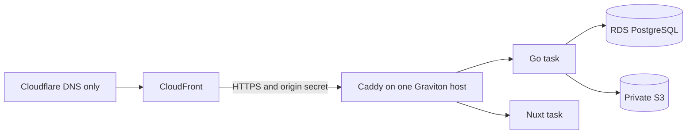

# 6. Deployment and trust boundaries

The environments share application code and route policy but use different
process and infrastructure shapes. Current runnable behavior remains documented
in [`../architecture.md`](../architecture.md) and operator guides.

## Environment model

| Environment        | Shape                                                                                       | User origin                       |
| ------------------ | ------------------------------------------------------------------------------------------- | --------------------------------- |
| Tests              | One capped PostgreSQL container; native test processes; optional isolated service harnesses | Kernel-assigned or `20090+` ports |
| Native development | Shared test DB container plus native Go, Nuxt, and Caddy processes                          | `http://localhost:20080`          |
| Local UAT          | Complete image-based Podman Compose deployment; created only for the UAT session            | HTTPS on port `443`               |
| Self-hosted        | Podman Compose with operator-supplied credentials and TLS configuration                     | Operator-defined HTTPS origin     |
| Production         | CloudFront, Caddy on ECS/EC2 Graviton, Go, Nuxt, RDS PostgreSQL, and private S3             | `https://aboutme.vn`              |

Native development uses ports `20432` (PostgreSQL), `20081` (Go), `20030`
(Nuxt), and `20080` (Caddy). The test and development databases are separate
logical databases in the one container. Local UAT does not reuse this native
process stack; it creates the full deployment and tears it down at session end.

Browser authentication requires HTTPS because session and OAuth transaction
cookies are always `Secure`. Native HTTP remains useful for unauthenticated UI
and API work. Auth and complete user workflows run in the HTTPS UAT origin.

## Production topology

V1 is an honest single-node application tier: one EC2 Graviton host runs Caddy,
Go, and Nuxt under ECS. Caddy and Go use fixed host-network ports; Nuxt may use
the bridge-mode boundary defined by the infrastructure plan. There is no
application load balancer or horizontal scaling in v1. Deploys have a brief,
documented maintenance window. Scaling beyond one task per service requires a
new discovery and load-balancing decision.

Cloudflare is DNS-only. CloudFront owns viewer TLS and uses an ACM certificate
in `us-east-1`. The origin is in `ap-southeast-1`, uses HTTPS, and accepts
traffic only from CloudFront's origin-facing path. Caddy accepts current and
next origin secrets during rotation.

`origin.aboutme.vn` is a DNS-only record to the origin's elastic IP. Caddy gets
its origin certificate through Cloudflare DNS-01, so port 80 and an
unauthenticated HTTP challenge path are unnecessary. The security group admits
origin 443 only from CloudFront's origin-facing managed prefix list. Caddy then
verifies the rotating origin-secret header before routing. Viewer policy
redirects HTTP to HTTPS, requires TLS 1.2 or newer, and sends HTTP Strict
Transport Security.

## Client-IP boundary

Caddy validates the production path before trusting forwarding data. It strips
viewer-supplied forwarding headers, derives one canonical client address, and
sends it to Go. Go accepts that header only from configured trusted-proxy CIDRs,
normalizes it with `netip`, and fails closed in production when the proxy set is
empty. Go never parses `X-Forwarded-For` itself.

## CloudFront behavior

| Surface                                      | Cookies               | Cache policy                                                 |
| -------------------------------------------- | --------------------- | ------------------------------------------------------------ |
| Authenticated API and `/api/v1/events` SSE   | Forwarded as required | Disabled; origin sends `no-store`                            |
| Public JSON, photo, and `/api/v1/live/*` SSE | Never forwarded       | JSON/photo revalidate with ETag; SSE is never cached         |
| Public HTML and discovery                    | Never forwarded       | Up to 60 seconds, with explicit invalidation on state change |
| Public PDF and generated images              | Never forwarded       | Up to 60 seconds, with publish-state invalidation            |

Viewer responses never cache `Set-Cookie`. Apex is the sole application origin;
`www` redirects before any authentication route.

## Media

Object storage is private. Go is the authorization boundary for owner and public
media reads. P2B adds owner upload and read routes. P5A adds a live-gated public
photo route. V1 has no direct `/assets` object-store origin because a leaked key
must not keep an unpublished photo public.
[ADR 0019](../adr/0019-private-media-delivery.md) records the decision.

The media bucket is unversioned. Object keys are immutable and random, so
replacement never needs an older version at the same key. An object delete must
remove its bytes rather than leave a noncurrent version outside the orphan
sweep's reach. Object writes are create-only and fail on collision; a loser
never overwrites or deletes bytes already referenced by a winner.

Uploads first write a new immutable candidate, then update the resume in a
transactional database operation. Every fresh candidate not named by the
committed result is best-effort deleted, including an idempotency replay or
loser, conflict, stale precondition, or definite rollback. An ambiguous commit,
crash, or failed compensation can still leave an unreachable object; the weekly
orphan sweep owns that residual. Replace and delete never remove the old object
before the document no longer references it.

Only normalized JPEG or PNG bytes enter object storage. Photo normalization and
Chromium rendering share one task-wide heavy-work permit before P7 combines
those workloads, so their memory peaks cannot overlap.

## Database and releases

RDS PostgreSQL uses Graviton-compatible instances, gp3 storage, automated
backups, and point-in-time recovery. V1 may begin single-AZ; Multi-AZ is a later
availability decision. Backup retention is 30 days. Restore evidence matters
more than backup configuration: staging performs a real isolated restore and
data verification before launch.

Production migration order is: stop writes, verify backup, take the migration
advisory lock, run embedded goose migrations exactly once, start the new tasks,
wait for readiness, then reopen traffic. Rollback uses a forward corrective
migration; released migration files never change.

Every release migration remains compatible with both the candidate server and
the immediately prior server digest for the full rollback window. A breaking
schema change uses expand, backfill, and contract across releases; the contract
step cannot land while the prior digest is still a rollback target. Before
deployment, the release gate applies candidate migrations to a seeded database
and runs the prior digest's readiness plus supported read/write smoke against
that migrated schema. Code-back/schema-forward rollback is a recovery claim only
when this test passes.

Application secrets use AWS Systems Manager Parameter Store `SecureString`
values in `ap-southeast-1` and are injected at runtime. They do not enter
images, source, command lines, logs, or Terraform state where the platform
permits a reference instead. Secret names and rotation procedures are tracked;
values are never evidence artifacts.

No AWS, Cloudflare, certificate, DNS, or deployment mutation occurs before the
local UAT gate and its independent review pass and the human owner authorizes
resource creation. Production launch requires a later, separate approval.
