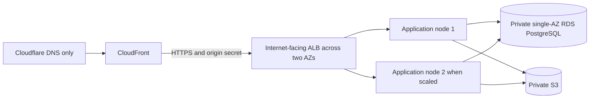

# 6. Deployment and trust boundaries

The environments share application code and route policy but use different
process and infrastructure shapes. Current runnable behavior remains documented
in [`../architecture.md`](../architecture.md) and operator guides.

## Environment model

| Environment         | Shape                                                                                       | User origin                       |
| ------------------- | ------------------------------------------------------------------------------------------- | --------------------------------- |
| Tests               | One capped PostgreSQL container; native test processes; optional isolated service harnesses | Kernel-assigned or `20090+` ports |
| Native development  | Shared test DB container plus native Go, Nuxt, and Caddy processes                          | `http://localhost:20080`          |
| Native HTTPS checks | Shared DB, native processes, and disposable browser                                         | `https://localhost:20443`         |
| AWS UAT             | Scheduled ECS/EC2 Graviton and RDS PostgreSQL in Singapore; stopped between test windows    | `https://uat.aboutme.vn`          |
| Self-hosted         | Podman Compose with operator-supplied credentials and TLS configuration                     | Operator-defined HTTPS origin     |
| Production          | CloudFront, Caddy on ECS/EC2 Graviton, Go, Nuxt, RDS PostgreSQL, and private S3             | `https://aboutme.vn`              |

Native development uses ports `20432` (PostgreSQL), `20081` (Go), `20030`
(Nuxt), and `20080` (Caddy). The test and development databases are separate
logical databases in the one container. AWS UAT has separate data and media; it
never receives a copy of the native development account or database. The native
script idempotently seeds `aboutme_dev` with one development account and one
private sample resume. The command refuses any other database and is never run
by Compose or cloud environments.

`PROVIDER_LOGIN_ENABLED` defaults to false and accepts only `true`, `false`, or
blank. The native HTTPS harness sets it to true for provider authentication
proofs; native HTTP, Compose, self-hosted, and production configurations leave
it unset for the password-only v1 surface.

Browser authentication requires HTTPS because session and OAuth transaction
cookies are always `Secure`. Native HTTP remains useful for unauthenticated UI
and API work. Auth feature checks run at the native HTTPS origin. Complete
product acceptance runs at the AWS UAT origin.

## Build and deployment architecture

Daily development and feature checks run on the laptop. GitHub Actions runs the
existing app CI jobs and builds AWS deployment images natively on
`ubuntu-24.04-arm`, targeting `linux/arm64`. The pinned AMD64 Playwright
baseline job stays on AMD64. ARM64 container smoke tests cover runtime
compatibility, including Chromium and fonts; they do not replace the browser
baseline gate.

The public app builds and smoke-tests all four images from an explicit reviewed
app commit, per
[ADR 0033](../adr/0033-public-image-builds-private-deployment.md). Its workflow
emits OCI archives and canonical source/run evidence without AWS access. The
planned private `aboutme-infra` repository validates that evidence and owns
protected image publication and deployment. Its release record binds the public
build to the infrastructure commit and four ECR digests. UAT deploys those
digests; production reuses the UAT-proven images without rebuilding them. Public
app checks stay independent of AWS and the private repository.

Native ARM64 builds avoid emulation overhead. Graviton runtime cost and
performance still depend on instance size and workload: Phase 9 prices the
Singapore options, and Phase 10 measures the selected configuration. GitHub
build machines are separate from the Singapore application and data region.

## Production topology

[ADR 0034](../adr/0034-scheduled-uat-and-production-autoscaling.md) replaces the
earlier single-host comparison baseline for AWS. OpenTofu remains the
infrastructure tool. Phase 10 must first design and implement the distributed
runtime contracts named below; this target is not evidence that the current
process-local implementation is replica-safe.

Each application node runs distinct Caddy, Go, and Nuxt ECS tasks with separate
cgroups: Caddy uses 128 MiB and 128 CPU units, Go plus Chromium uses 512 MiB and
512 CPU units, and Nuxt uses 256 MiB and 256 CPU units. Scheduled ops tasks use
256 MiB and 256 CPU units. One application replica is placed per node. The
initial production capacity range is one to two replicas and scales in both
directions; this launch bound is not a permanent product limit. RDS compute is
fixed and sized separately. Increasing the application replica count alone is
unsafe until Phase 10 replaces or coordinates process-local publication fences,
render jobs and capabilities, SSE state, and limiters across the fleet.

Application nodes use public IPv4 for outbound access without a NAT gateway.
Their inbound security group accepts only the ALB security group, and Caddy
still requires the rotating origin secret. RDS remains private and single-AZ at
launch. Service discovery, placement, readiness, scale-in draining, and the
source-specific forwarded-address chain are explicit Phase 10 design outputs.

Cloudflare is DNS-only. CloudFront owns viewer TLS and uses an ACM certificate
in `us-east-1`. The internet-facing ALB spans two public subnets and is the
stable origin in `ap-southeast-1`; the former elastic-IP origin is superseded
for production. CloudFront reaches the ALB over HTTPS and overwrites the origin
secret. Phase 10 must choose and prove the ALB-to-Caddy target TLS and
authentication model, health routing, and security-group rules before compute
wiring. The model must account for ALB target TLS behavior rather than assume
native target-certificate validation. No listener or node path may bypass the
CloudFront and origin-secret boundary.

Viewer policy redirects HTTP to HTTPS, requires TLS 1.2 or newer, and sends HTTP
Strict Transport Security. Caddy accepts current and next origin secrets during
rotation.

## Client-IP boundary

Caddy validates the CloudFront-to-ALB path before trusting forwarding data. It
strips untrusted forwarding headers and derives one canonical client address
from the source-specific, validated chain. Go accepts that canonical header only
from the colocated trusted Caddy boundary, normalizes it with `netip`, and fails
closed in production when its trusted-proxy set is empty. Go never parses
`X-Forwarded-For` itself. Phase 10 tests forged viewer headers, direct ALB and
node bypass, and the exact ALB header behavior before activation.

## CloudFront behavior

| Surface                                    | Cookies               | Cache policy                                                     |
| ------------------------------------------ | --------------------- | ---------------------------------------------------------------- |
| Authenticated API and `/api/v1/events` SSE | Forwarded as required | Disabled; origin sends `no-store`                                |
| Public JSON and photo                      | Never forwarded       | Stored up to 60 seconds; revalidated through the live-state gate |
| `/api/v1/live/*` SSE                       | Never forwarded       | Never cached                                                     |
| Public HTML and discovery                  | Never forwarded       | Stored up to 60 seconds; revalidated through the live-state gate |
| Public PDF and generated images            | Never forwarded       | Stored up to 60 seconds; revalidated through the live-state gate |

Viewer responses never cache `Set-Cookie`. Apex is the sole application origin;
`www` redirects before any authentication route.

CloudFront storage is not publication authority. A public reuse reaches the
origin, where the current slug, state, route flag, and public generation are
checked before a strong ETag can validate retained bytes. Cacheable public
responses use `Cache-Control: no-cache, must-revalidate`. Their CloudFront
behaviors set minimum and default TTL to zero and maximum TTL to 60 seconds, so
retained bytes always revalidate and are never served under positive freshness.
Origin render caches are private and generation-keyed. The state mutation waits
for old-generation origin leases to drain before success; edge invalidation
remains cleanup and defense in depth.
[ADR 0022](../adr/0022-public-artifact-revocation.md) owns the trade-off.

Public resume HTML reaches Go first. Go holds the origin connection and
per-resume generation lease while Nuxt renders a private frozen snapshot, then
returns the completed or streaming body to Caddy or CloudFront. Nuxt does not
receive the public origin socket. An edge viewer request already admitted under
the old state may finish after revocation; later admission or revalidation must
see the new state. Sitemap and `llms.txt` responses use a global discovery
generation lease; any mutation that changes their membership advances and drains
that generation before success.

Within one application replica, Go reaches its colocated Nuxt task through the
deployment-private route selected in Phase 10 and the equivalent direct native
Nuxt address in development. Routing must preserve replica affinity for the
frozen public snapshot and one-use print capability. Caddy denies
`/internal-render` and `/internal-render/*` before its default web proxy. The
Nuxt route is POST-only, accepts only the bounded frozen snapshot, and has no
ambient session, ID lookup, API fetch, or database path. Route-parity tests pin
the Caddy denial and direct-origin caller so topology drift cannot expose it.

## Internal print

The render browser reaches its selected Nuxt replica only on the internal
application network. Go authorizes and freezes the render snapshot, then issues
a 256-bit one-use capability with a maximum 60-second lifetime. Nuxt redeems it
through a loopback or deployment-private Go interface and receives the document
and inline photo context. The browser has no account cookie or general outbound
network access. Caddy's external `/print/**` denial and network placement are
defense in depth; Nuxt still rejects a missing, expired, mismatched, or consumed
capability. Go retains the consumed job binding and is the only component that
can accept completed bytes after the terminal digest and public-generation
check. Nuxt and Chromium have no artifact-publish credential. Completion
requires a controller authority separate from the job ID. Phase 10 must replace
the current process-local queue, redeemed-capability state, and controller
handle with a fleet-safe contract before a second replica can serve traffic; the
job ID alone grants no completion authority.
[ADR 0023](../adr/0023-private-print-capability.md) owns the protocol.

## Media

Object storage is private. Go is the authorization boundary for owner and public
media reads. P2B adds owner upload and read routes. P5A adds a live-gated public
photo route. V1 has no direct `/assets` object-store origin because a leaked key
must not keep an unpublished photo public.
[ADR 0019](../adr/0019-private-media-delivery.md) records the decision.

The media bucket is unversioned. Object keys are immutable and random, so
replacement never needs an older version at the same key. An object delete must
remove its bytes rather than leave a noncurrent version outside the orphan
sweep's reach. Object writes are create-only and fail on collision; a loser
never overwrites or deletes bytes already referenced by a winner.

Uploads first write a new immutable candidate, then update the resume in a
transactional database operation. Only an object write with a proved-created
outcome may reach that mutation. Every such candidate not named by a definite
database result is best-effort deleted, including an idempotency replay or
loser, conflict, stale precondition, or definite rollback. An ambiguous database
commit retains the possibly live candidate. A remote object write with an
unknown outcome stops before database mutation and is not deleted because the
key may name a collision winner. Crashes, unknown outcomes, and failed
compensation can leave an unreachable private object; weekly orphan
reconciliation owns that residual.

Replacement, photo deletion, resume deletion, and account deletion revoke the
reference and enqueue an exact-key deletion job in one PostgreSQL transaction.
The API may succeed after that commit because every read is reference-gated and
the bucket is private. A worker retries idempotent object deletion toward a
24-hour physical-removal target. Overdue work is audited and alerted until it
finishes. The weekly orphan job reconciles storage, live references, and the
durable queue; it is not the ordinary deletion path.

Only normalized JPEG or PNG bytes enter object storage. Photo normalization and
Chromium rendering share one task-wide heavy-work permit before P7 combines
those workloads, so their memory peaks cannot overlap.

## Authentication email

Verification, reset, and security-notification email is committed through a
bounded encrypted outbox and delivered by a worker. Production uses the AWS SDK
for Go v2 SES client in `ap-southeast-1` with a verified sending domain, a
configuration set, and delivery/bounce/complaint alarms. AWS credentials use the
standard runtime credential chain and never enter repository files.

Native development starts a loopback-only mail-capture command that retains a
bounded number of messages and never initializes AWS. Real SES and DNS changes
follow the owner's recorded UAT authorization and SES handoff under
[ADR 0031](../adr/0031-aws-cost-research-and-hosted-uat.md). The
[email runbook](../runbooks/email.md) records an existing Singapore SES sandbox
setup. Preserve its Google Workspace root DNS and SES resources. Phase 10 adds
runtime IAM, adopts existing infrastructure without overlapping ownership, and
proves application mail with approved recipients. Unrestricted production mail
requires SES production access; a simulator smoke does not prove a user's
verification or reset flow.

## Database and releases

RDS PostgreSQL uses Graviton-compatible instances, gp3 storage, automated
backups, and point-in-time recovery. V1 may begin single-AZ; Multi-AZ is a later
availability decision. Backup retention is 30 days. Restore evidence matters
more than backup configuration: staging performs a real isolated restore and
data verification before launch.

Production migration order is: stop admission and drain admitted requests on
every replica, verify backup, take the migration advisory lock, run embedded
goose migrations exactly once, start the new tasks, wait for fleet readiness,
then reopen traffic. Scaling and deployment drains must preserve publication,
account-deletion, private-media, artifact-revocation, render, and SSE
invariants. Rollback uses a forward corrective migration; migrations fixed by
the first UAT baseline never change
([ADR 0020](../adr/0020-uat-migration-baseline.md)).

The embedded runner uses goose's Provider with a PostgreSQL session advisory
locker. The Provider acquires the lock before it checks which migrations remain
pending, applies that set, and releases the lock. This prevents concurrent
runners from acting on a stale pre-lock pending list and keeps lock handling in
goose instead of duplicating it in application code.

Every release migration remains compatible with both the candidate server and
the immediately prior server digest for the full rollback window. A breaking
schema change uses expand, backfill, and contract across releases; the contract
step cannot land while the prior digest is still a rollback target. Before
deployment, the release gate applies candidate migrations to a seeded database
and runs the prior digest's readiness plus supported read/write smoke against
that migrated schema. Code-back/schema-forward rollback is a recovery claim only
when this test passes.

Application secrets use AWS Systems Manager Parameter Store `SecureString`
values in `ap-southeast-1` and are injected at runtime. They do not enter
images, source, command lines, logs, or OpenTofu state where the platform
permits a reference instead. Secret names and rotation procedures are tracked;
values are never evidence artifacts.

Phase 9 settles Singapore cost, sizes, and UAT lifetime before activation. UAT
terminates application nodes and removes its temporary ALB between scheduled
test windows, then stops RDS. RDS storage, keys, state, ECR images, and required
logs remain. The cost model conservatively reserves a full month of one 30 GB
application root disk and one public IPv4 address; these are cost headroom, not
claims that terminated-node resources remain. Any orphaned volume or address is
inventoried and removed. RDS stop automation must restart it before AWS's
seven-day limit, run overdue privacy and retention work before its deadlines,
and return it to the scheduled stopped state. A failed or high-cost forecast
shortens optional testing rather than weakening retention or revocation.
Production autoscaling never selects zero. A serialized, operator-approved
snapshot and migration deployment may drain application capacity to zero, then
must restore at least one healthy replica. The owner has authorized Phase 10 AWS
UAT and Cloudflare DNS at `uat.aboutme.vn`. Local candidate checks and
infrastructure simulation precede deployment; complete UAT and operational
drills follow it. Production launch in Phase 11 requires separate approval. The
local port-443 UAT gate is superseded by
[ADR 0031](../adr/0031-aws-cost-research-and-hosted-uat.md).
