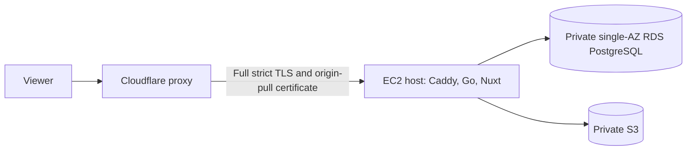

# 6. Deployment and trust boundaries

The environments share application code and route policy but use different
process and infrastructure shapes. Current runnable behavior remains documented
in [`../architecture.md`](../architecture.md) and operator guides.

## Environment model

| Environment         | Shape                                                                                       | User origin                       |
| ------------------- | ------------------------------------------------------------------------------------------- | --------------------------------- |
| Tests               | One capped PostgreSQL container; native test processes; optional isolated service harnesses | Kernel-assigned or `20090+` ports |
| Native development  | Shared test DB container plus native Go, Nuxt, and Caddy processes                          | `http://localhost:20080`          |
| Native HTTPS checks | Shared DB, native processes, and disposable browser                                         | `https://localhost:20443`         |
| Self-hosted         | Podman Compose with operator-supplied credentials and TLS configuration                     | Operator-defined HTTPS origin     |
| Production          | Cloudflare proxy, one Bottlerocket ECS host (Caddy, Go, Nuxt), RDS PostgreSQL, private S3   | `https://aboutme.vn`              |

Native development uses ports `20432` (PostgreSQL), `20081` (Go), `20030`
(Nuxt), and `20080` (Caddy). The test and development databases are separate
logical databases in the one container. Production never receives a copy of the
native development account or database. The native script idempotently seeds
`aboutme_dev` with one development account and one private sample resume. The
command refuses any other database and is never run by Compose or cloud
environments.

`PROVIDER_LOGIN_ENABLED` defaults to off and accepts blank, `false`, `true`, or
a comma list of `google`, `github`, and `linkedin`. The native HTTPS harness
sets it to true for provider authentication proofs; native HTTP, Compose, and
self-hosted configurations leave it unset for a password-only surface.
Production can enable only Google; it stays off until
`provider_login_enabled = "google"`.

`PASSWORD_REGISTRATION_ENABLED` accepts blank or `true` (sign-up on) and `false`
(sign-up off). Production sets it from the `password_registration_enabled`
variable.

Browser authentication requires HTTPS because session and OAuth transaction
cookies are always `Secure`. Native HTTP remains useful for unauthenticated UI
and API work. Auth feature checks run at the native HTTPS origin. Complete
product acceptance runs in production, per
[ADR 0037](../adr/0037-single-host-production-without-hosted-uat.md).

## Build and deployment architecture

Daily development and feature checks run on the laptop. GitHub Actions runs the
app CI jobs. A version tag builds the server, web and Caddy images natively on
`ubuntu-24.04-arm` for `linux/arm64`, smoke-tests them, and publishes them to
public GitHub Container Registry packages with build provenance. The pinned
AMD64 Playwright baseline job stays on AMD64; ARM64 smoke tests cover runtime
compatibility, including Chromium and fonts, and do not replace it.

OpenTofu modules live in `deploy/aws/`. State and environment values stay out of
Git, and GitHub holds no cloud credentials. The owner applies infrastructure and
runs deploys from the laptop against image digests, never a moving tag.

## Production topology

[ADR 0037](../adr/0037-single-host-production-without-hosted-uat.md) sets the
first-release topology. The
[single-host production design](single-host-production.md) owns its details:
host networking, edge settings, database roles, secrets, deploy steps, jobs and
alarms.

One serving replica runs under
[ADR 0036](../adr/0036-single-replica-launch-and-pipeline-migrations.md). The
growth path is a larger instance before a second replica. Raising the replica
count alone is unsafe: publication fences, render jobs and capabilities, and SSE
state are process-local until the deferred work in the
[scaling contract](scaling/README.md) lands.

## Client-IP boundary

Cloudflare sets `CF-Connecting-IP`. Caddy trusts it only from Cloudflare's
published ranges, rejects duplicate or invalid values, strips every other
forwarding header, and emits one `X-Real-IP`. Go accepts that canonical header
only from the colocated Caddy on loopback, normalizes it with `netip`, and fails
closed in production when its trusted-proxy set is empty. Go never parses
`X-Forwarded-For`. Tests cover forged viewer headers and direct requests to the
origin address.

## Edge behavior

Cloudflare terminates viewer TLS, redirects HTTP to HTTPS, requires TLS 1.2 or
newer, and sends HTTP Strict Transport Security. Apex is the sole application
origin; `www` redirects before any authentication route. The origin accepts only
Cloudflare's address ranges and its origin-pull client certificate.

A cache rule bypasses Cloudflare's cache for every path except `/_nuxt/*` hashed
assets. Cookies, `Authorization` and SSE pass through unchanged. Edge storage is
therefore never publication authority: every public request reaches the origin,
where the current slug, state, route flag and public generation are checked
before a strong ETag can validate retained bytes. Cacheable public responses
still send `Cache-Control: no-cache, must-revalidate`. Origin render caches are
private and generation-keyed. The state mutation waits for old-generation origin
leases to drain before success.
[ADR 0022](../adr/0022-public-artifact-revocation.md) owns the trade-off.

Public resume HTML reaches Go first. Go holds the origin connection and
per-resume generation lease while Nuxt renders a private frozen snapshot, then
returns the body to Caddy. Nuxt does not receive the public origin socket. A
request already admitted under the old state may finish after revocation; later
admission or revalidation must see the new state. Sitemap and `llms.txt`
responses use a global discovery generation lease; any mutation that changes
their membership advances and drains that generation before success.

Go reaches Nuxt on the host's private network, and the native Nuxt address in
development. Caddy denies `/internal-render` and `/internal-render/*` before its
default web proxy. The Nuxt route is POST-only, accepts only the bounded frozen
snapshot, and has no ambient session, ID lookup, API fetch, or database path.
Route-parity tests pin the Caddy denial and direct-origin caller.

## Internal print

The render browser reaches Nuxt only on the host's private network. Go
authorizes and freezes the render snapshot, then issues a 256-bit one-use
capability with a maximum 60-second lifetime. Nuxt redeems it through a loopback
or deployment-private Go interface and receives the document and inline photo
context. The browser has no account cookie or general outbound network access.
Caddy's external `/print/**` denial and network placement are defense in depth;
Nuxt still rejects a missing, expired, mismatched, or consumed capability. Go
retains the consumed job binding and is the only component that can accept
completed bytes after the terminal digest and public-generation check. Nuxt and
Chromium have no artifact-publish credential. Completion requires a controller
authority separate from the job ID. The render queue, redeemed-capability state
and controller handle are process-local, which is correct only while one replica
serves. [ADR 0023](../adr/0023-private-print-capability.md) owns the protocol.

## Media

Object storage is private. Go is the authorization boundary for owner and public
media reads, including the live-gated public photo route. V1 has no direct
`/assets` object-store origin because a leaked key must not keep an unpublished
photo public. [ADR 0019](../adr/0019-private-media-delivery.md) records the
decision.

The media bucket is unversioned. Object keys are immutable and random, so
replacement never needs an older version at the same key. An object delete must
remove its bytes rather than leave a noncurrent version outside the orphan
sweep's reach. Object writes are create-only and fail on collision; a loser
never overwrites or deletes bytes already referenced by a winner.

Uploads first write a new immutable candidate, then update the resume in a
transactional database operation. Only an object write with a proved-created
outcome may reach that mutation. Every such candidate not named by a definite
database result is best-effort deleted, including an idempotency replay or
loser, conflict, stale precondition, or definite rollback. An ambiguous database
commit retains the possibly live candidate. A remote object write with an
unknown outcome stops before database mutation and is not deleted because the
key may name a collision winner. Crashes, unknown outcomes, and failed
compensation can leave an unreachable private object; weekly orphan
reconciliation owns that residual.

Replacement, photo deletion, resume deletion, and account deletion revoke the
reference and enqueue an exact-key deletion job in one PostgreSQL transaction.
The API may succeed after that commit because every read is reference-gated and
the bucket is private. A worker retries idempotent object deletion toward a
24-hour physical-removal target. Overdue work is audited and alerted until it
finishes. The weekly orphan job reconciles storage, live references, and the
durable queue; it is not the ordinary deletion path.

Only normalized JPEG or PNG bytes enter object storage. Photo normalization and
Chromium rendering share one task-wide heavy-work permit, so their memory peaks
cannot overlap.

## Authentication email

Verification, reset, and security-notification email is committed through a
bounded encrypted outbox and delivered by a worker. Production uses the AWS SDK
for Go v2 SES client in `ap-southeast-1` with a verified sending domain, a
configuration set, and delivery/bounce/complaint alarms. AWS credentials use the
standard runtime credential chain and never enter repository files.

Native development starts a loopback-only mail-capture command that retains a
bounded number of messages and never initializes AWS. The
[email runbook](../runbooks/email.md) records the existing Singapore SES sandbox
setup. Preserve its Google Workspace root DNS and SES resources. The production
task role adds send permission without taking over those resources. Mail to real
users requires SES production access; a simulator smoke does not prove a user's
verification or reset flow.

## Database and releases

RDS PostgreSQL uses Graviton-compatible instances, gp3 storage, automated
backups, and point-in-time recovery. It starts single-AZ; Multi-AZ is a later
availability decision. Backup retention is 30 days. Restore evidence matters
more than backup configuration: one isolated restore with data verification
precedes the public announcement.

A deploy snapshots the database, stops the job schedules and the service, runs
the migration task to completion, then starts the new service, waits for
readiness, and re-enables the schedules. The migration task exits; the server
never migrates at startup, and a nonzero migration exit blocks the update. It
takes the migration advisory lock and applies pending goose migrations exactly
once, so a second concurrent runner is safe rather than expected. With one
replica this interrupts service briefly, which ADR 0036 accepts.
`apps/server/migrations/.uat-baseline` makes existing migrations immutable
([ADR 0020](../adr/0020-uat-migration-baseline.md),
[ADR 0038](../adr/0038-single-baseline-and-plain-migrator.md)). Every migration
runs as the fixed `aboutme_migrator` role, which `db-setup` (`cmd/db-setup`)
creates and grants ahead of the first deploy.

The migration runner uses goose's Provider with a PostgreSQL session advisory
locker. The Provider acquires the lock before it checks which migrations remain
pending, applies that set, and releases it, so no runner acts on a stale pending
list.

### Authentication release fence

Production passkey enrollment requires the monotonic DynamoDB minimum and
serialized operation lock in the
[passkey release-fence contract](passkey-release-fence.md). The AWS-login
principal assumes the dedicated operator role, then the dedicated deploy role;
application and other runtime roles cannot read or write the fence.

Production TOTP enrollment uses the same fence and lock with floor v0.4.7,
numeric release 4007. Before taking the lock, `deploy.sh` refuses to register an
app revision that turns passkey enrollment on below 4002 or TOTP enrollment on
while the fence item is missing or below 4007, and `fence.sh` blocks every mode
while a running app has TOTP enrollment on below 4007. The
[fence contract](passkey-release-fence.md#authenticator-app-key-re-encryption)
also defines the one-shot `totp_reencrypt` operation.

Enrollment stays off until a healthy capable release raises the fence. Every
supported rollback and restoration continues through the current deployer, not a
script from the target release. DynamoDB cannot constrain a pre-fence script,
OpenTofu, or an AWS account administrator. The production runbook and IAM
boundary must remove ordinary direct mutations and require a compatibility proof
before that privileged bypass.

A breaking schema change uses expand, backfill, and contract across releases, so
the previous server keeps working against the migrated schema. The deploy script
does not test that, so redeploying an earlier image is a supported rollback only
when the failed release applied no migration. Otherwise recovery is a forward
fix or a point-in-time restore.

Application secrets use AWS Systems Manager Parameter Store `SecureString`
values in `ap-southeast-1`, injected at runtime. They never enter images,
source, command lines, logs, or OpenTofu state. Secret names and rotation
procedures are tracked; values are never evidence.

The TOTP key ring uses two such parameters, `totp/key-a` and `totp/key-b`, and
nonsecret OpenTofu slot variables choose the active and optional previous key.
Only the app ECS execution role reads those two exact ARNs; scheduled jobs and
other roles get none. A TOTP key failure never changes `/readyz`. The
[key-management design](totp-key-management.md) owns rotation and the
`aboutme-prod-totp-unavailable` alarm.

A later second replica uses the pinned admission and password-email key versions
from [rate identities](scaling/rate-identities.md). A key change then requires
closed admission, joined or fenced work, and proved zero claim, rate and pending
debt.
