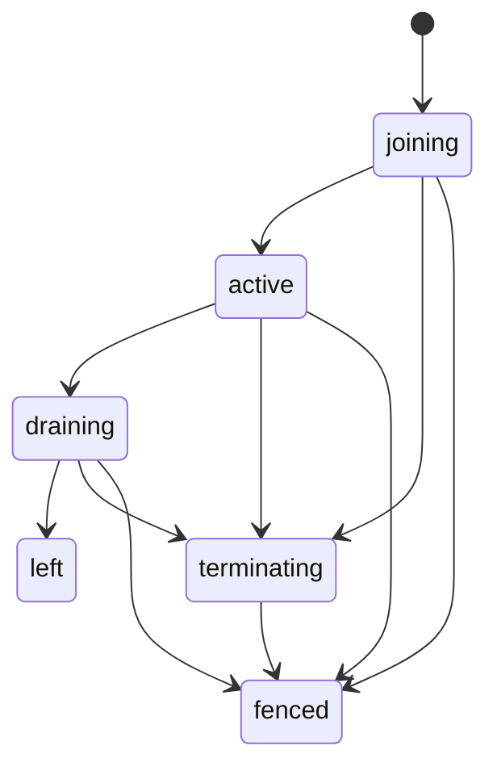

# Replica membership and lifecycle

Status: Accepted under
[ADR 0035](../../adr/0035-replica-coordination-and-uat-lifecycle.md). Not built.
The [scaling index](README.md) holds the shared rules.

A replica may serve, own work, or be reclaimed only through durable membership
in PostgreSQL. Only exact EC2 termination proves that an unresponsive process
has stopped.

## Topology

- One EC2 node runs one complete replica: Caddy, Go with Chromium, and Nuxt, in
  separate task cgroups. The Go task keeps its 512 MiB bound.
- Production capacity is one or two nodes (ADR 0034). No deploy or replacement
  may start a third node, so deploys replace one node at a time.
- A node is eligible only when its three tasks carry the same approved release
  digest and coordination reports the replica ready. A partial or mixed replica
  never receives traffic.
- Render and print stay on one node. Go's Chromium reaches its paired Nuxt, and
  Nuxt redeems a print capability only through its paired Go. No load balancer,
  cross-node route or service discovery takes part.
- The fleet edge keeps the single-host client-IP rule: Caddy sets one canonical
  client address and accepts forwarding headers only from a trusted proxy.

## Durable state

`runtime_replicas` holds one row per process incarnation:

- `replica_id`: a random non-nil UUID created at every boot. A restart is a new
  incarnation.
- `replica_kind`: `serving` or `maintenance`. Only serving replicas count toward
  desired capacity or become public-ready. A maintenance replica runs scheduled
  jobs and may hold only `mail.send` claims.
- `instance_id` (`i-` plus 17 lowercase hex), container instance ARN, and
  release digest (`sha256:` plus 64 hex). `runtime_replica_tasks` holds exactly
  three rows, one each for the Caddy, Go and Nuxt task ARNs. Task ARN is the
  primary key, so no task joins two replicas.
- `state` and one timestamp per state. At most one nonterminal incarnation
  exists per instance. Identity never changes and rows are never deleted.

`left` and `fenced` are terminal. The app login cannot update this table; named
functions register, mark ready and finish leave.

`runtime_capacity` is a singleton: `desired_replicas` 1 or 2, `generation`,
`controller_generation`, `controller_operation_id`, `admission_enabled` and a
lifecycle phase. A fresh register, mark-ready, leave or proof advances
`generation` once. A fresh lifecycle action advances both generations once.
Replay, rejection and rollback advance neither.

Evidence rows are immutable and bound to the exact replica tuple:

| Table                         | Key facts                                                                                                                           |
| ----------------------------- | ----------------------------------------------------------------------------------------------------------------------------------- |
| `runtime_termination_intents` | One per replica; reason `startup_failed`, `readiness_failed` or `drain_failed`; no cancel edge                                      |
| `runtime_leave_receipts`      | One per replica; binds the prepare step; records zero owned transitions and zero claims                                             |
| `runtime_fencing_proofs`      | Adapter `ec2_terminated_v1`; unique `evidence_id` and `request_id`; `requested_at <= observed_terminated_at`; reclaimed claim count |

## Joining

1. Composition reads the replica ID and the exact instance, task and release
   identity from trusted deployment input. It verifies the loaded key versions
   (see [admission](admission.md#key-identity)). A partial tuple fails startup.
2. One transaction locks `public_state`, then `runtime_capacity`, and inserts a
   `joining` row with its three task rows. Exact replay returns current state.
3. The process opens its transition listener and revision `LISTEN`, then probes
   a normal query, both listener connections, paired Nuxt and Caddy, a shared
   admission rollback, and the absence of closing or unresolved transitions.
4. Mark-ready records `join_ready_at`. It fails while a closing or unresolved
   transition exists or capacity is not accepting joins. The state stays
   `joining`.
5. The lifecycle controller checks the target's key-version evidence, then calls
   `activate_replica_capacity`. Caddy readiness opens only after the controller
   observes that commit.

## Lifecycle actions

Only `aboutme_lifecycle_command` runs these. Each takes the expected controller
generation and an operation ID, locks `public_state` then `runtime_capacity`,
and records its typed arguments and result in `runtime_lifecycle_operations` and
`runtime_lifecycle_operation_steps`. Exact replay returns the stored historical
result. No action accepts a transition that is closing or unresolved, or an
unfenced `terminating` replica.

| Action                      | Requires                                                                                                   | Effect                                                                |
| --------------------------- | ---------------------------------------------------------------------------------------------------------- | --------------------------------------------------------------------- |
| `prepare_scale_out`         | Online, desired 1, one active serving replica, partition 2 disabled                                        | Desired 2                                                             |
| `activate_replica_capacity` | Exact ready `joining` tuple; active serving count below desired                                            | `active`; first activation enables rate partition 1, second enables 2 |
| `prepare_scale_in`          | Desired 2, two active serving replicas, both partitions enabled, no other drain                            | Exact target to `draining`                                            |
| `finish_scale_in`           | Target `left` with receipt and audit proof, or `fenced` with intent and proof; at most one active survivor | Desired 1, partition 2 disabled                                       |
| `begin_replica_termination` | `startup_failed` from joining, `readiness_failed` from active, `drain_failed` from draining                | `terminating` and one intent                                          |
| `prepare_maintenance_drain` | The one active maintenance replica                                                                         | `draining`                                                            |

A replacement activation names an exact fenced predecessor, which it may consume
once. It changes no partition flag. Maintenance activation changes neither
desired capacity nor partitions.

Workflows are closed: `initial_serving` (activate), `scale_out` (prepare, then
activate), `replacement_serving` (activate with predecessor), `scale_in`
(prepare, then finish), `replica_termination` (begin), and `maintenance`
(activate, then drain). An action checks its predecessor step in the same
operation. A predecessor's result generation must not exceed the next action's
expected generation. Arguments and results are typed columns plus SHA-256
digests over a fixed length-prefixed framing, never JSON.

Rate partitions 1 and 2 are logical fleet capacity, not node slots. Failure and
fencing keep both flags, even with no survivor, so a replacement inherits the
capacity. Disabling a partition keeps its rows and debt.

## Graceful leave

1. `prepare_scale_in` or `SIGTERM` makes the replica `draining` before Caddy
   closes. New HTTP, SSE, render, claim and transition work is refused.
2. The process finishes every acknowledged transition. Revoking work keeps its
   five-second deadline, render its 20-second deadline, and SSE closes within
   one heartbeat. It joins all callbacks and Chromium.
3. Its last database action records the immutable leave receipt and the `left`
   state. The function requires zero owned closing or unresolved transitions and
   zero live claims. It never waits on a transition parent.
4. The controller calls `TerminateInstanceInAutoScalingGroup` for that exact
   instance with desired-capacity decrement. It never lowers desired capacity
   generically, because the ASG could pick the other node.

The ASG lifecycle hook defaults to `CONTINUE` and never restores admission.

## Termination proof

A missing, late or ambiguous leave is never inferred. The controller begins
termination for the exact incarnation and terminates it. The replica keeps its
membership and claims until proof.

The `aboutme_fencing_proof` task calls `ec2:DescribeInstances` for the exact
instance immediately before its transaction and requires state `terminated`. The
proof function then:

- rejects instance reuse, a mismatched tuple and conflicting duplicate evidence;
  a byte-identical replay succeeds;
- for `left`, adds audit proof only;
- otherwise sets `fenced` and releases that replica's claims atomically.

Proof never acknowledges a transition, revives a timed-out mutation or changes a
transition row. ECS `STOPPED`, load-balancer health, lost sessions, lock loss,
heartbeats and elapsed time are diagnostics, not proof. A dead initiator's
closing transition is rolled back separately
([fenced-initiator recovery](transitions.md#fenced-initiator-recovery)).

## Outage and recovery

Loss of either listener or of the normal query path quarantines the process. It
closes all admission, cancels and joins leases, SSE streams, render callbacks
and Chromium, and fails readiness. Liveness stays healthy, so a shared database
outage does not restart every node.

The same `replica_id` may return to serving only when the database is reachable,
the row is still `active`, no intent, proof or EC2 termination exists, all
canceled work has joined, both listeners are back, all transitions since the
last cursor are replayed with admission closed, and every probe passes. A
`draining` replica may finish draining but never reopens.

Readiness is false for any state other than `active`, during quarantine or
replay, with a lost listener, an unresolved transition, a closing target not yet
closed locally, unavailable shared admission, a pool below its reserved
connections, or a failed paired probe. The one-second readiness cache may cache
failure but never turns it into success.

## Lifecycle controller

ADR 0035 runs the controller on EventBridge Scheduler and one Step Functions
Standard state machine. A conditional-write object in the private state bucket
holds ownership.

- One owner serializes scaling, replacement and manual changes. Ownership has no
  timeout takeover. A new owner first stops the prior execution, joins its child
  tasks and then takes over by compare-and-set.
- Every retry describes AWS and rereads database state, then performs only the
  next convergent step. A stale generation cannot activate, terminate or change
  a partition.
- A fleet-wide database outage suppresses readiness-driven replacement. An
  isolated failed replica gets a bounded replay grace, then one termination
  intent. Replacement starts only after proof.
- Lifecycle-command and fencing-proof run as separate tasks with separate
  logins. Each resolves its own credential at task start. Workflow state holds
  identifiers and receipts, never a credential.

## Connections

RDS keeps `max_connections` at 100 or more, and the fleet budgets 60:

| Consumer                                                                          | Connections |
| --------------------------------------------------------------------------------- | ----------: |
| Two Go pools of 12, each with one revision `LISTEN` and one transition connection |          24 |
| Migrator, maintenance, lifecycle-command, fencing-proof, restore verifier: 4 each |          20 |
| Administration and incident reserve                                               |          16 |

The remaining capacity grants no extra node or worker. Every constructor and
task definition enforces its cap.

## Lock order

Operations take only the needed subsequence of:

1. `public_state`;
2. `runtime_capacity`;
3. lifecycle operation, then step;
4. replicas in UUID byte order, then task rows;
5. intent, receipt and proof;
6. claim parents in UUID order;
7. claim catalog and scope summaries in canonical order;
8. rate partitions in numeric order.

Membership functions never lock or wait on a transition parent. They read
closing or unresolved transitions without locking and fail closed. An
acknowledgement that holds its parent may wait on a replica row, then rechecks
the state.
