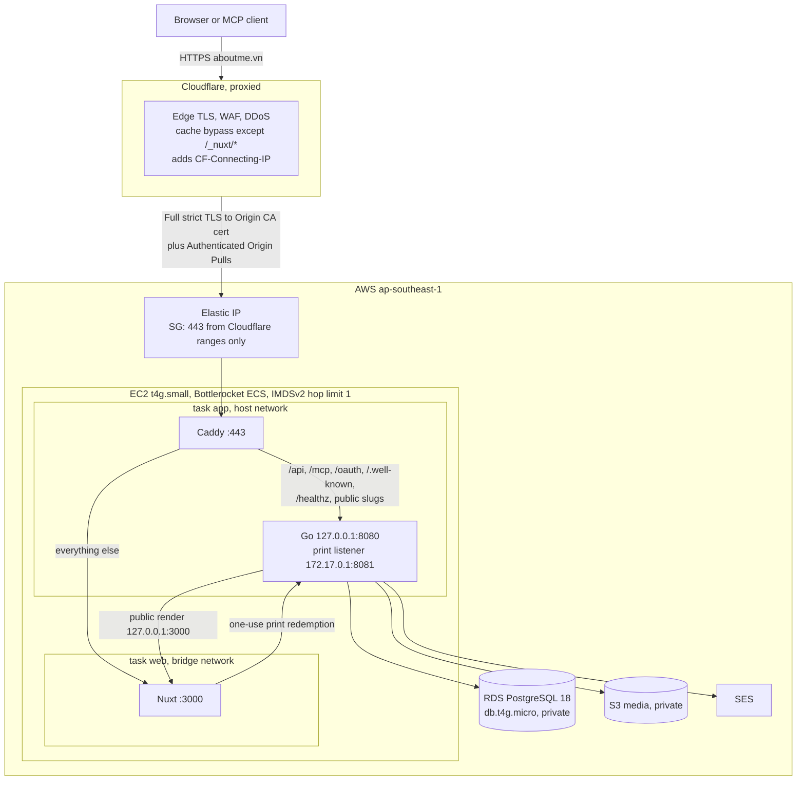
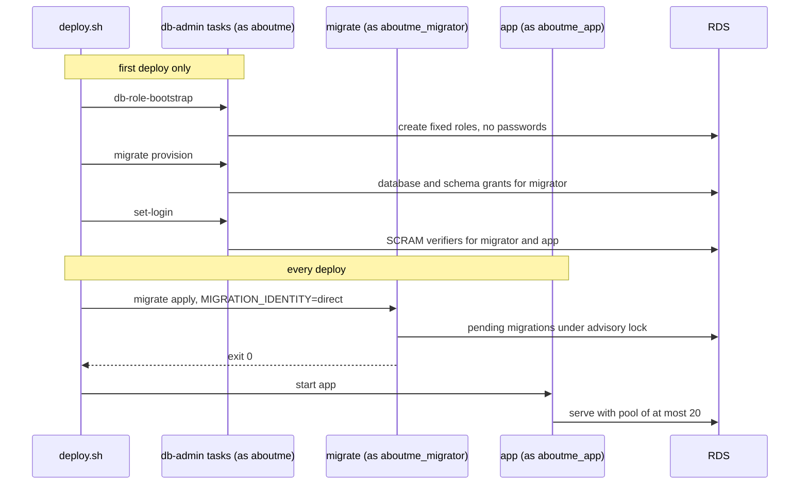

# Single-host production

Status: Accepted under
[ADR 0037](../adr/0037-single-host-production-without-hosted-uat.md). This
document states how the first release runs at `https://aboutme.vn`. It narrows
the [deployment design](deployment.md) for that release; trust boundaries not
named here are unchanged.

## Request path

## Edge

- Cloudflare proxies `aboutme.vn` in Full (strict) mode. Caddy presents a
  Cloudflare Origin CA certificate.
- Zone-level Authenticated Origin Pulls uses our own client certificate, and
  Caddy accepts only that certificate. The global Cloudflare certificate is
  shared by every Cloudflare account, so it proves only that a request came
  through some Cloudflare zone.
- A cache rule bypasses the cache for every path except `/_nuxt/*`. Public PDF
  and image exports have extensions Cloudflare caches by default, and a cached
  copy would survive unpublish or deletion.
- Bot Fight Mode is off. It cannot exempt paths, and it would block MCP clients,
  API calls and the health check. DDoS protection and Go's rate limits remain.
  Cloudflare passes `Authorization` unchanged.
- Cloudflare's IP ranges feed both the security group and Caddy's trusted proxy
  list. `deploy.sh` compares the live ranges with the deployed ones and stops on
  a difference until `tofu apply` refreshes them.
- SSE heartbeats every 25 seconds stay under Cloudflare's 100-second idle
  timeout.
- Cloudflare decrypts all traffic. The privacy notice states this.

## Host and networking

One EC2 instance runs the Bottlerocket ECS variant. It is not in an Auto Scaling
group, so its Elastic IP stays attached; a CloudWatch alarm auto-recovers it on
a failed status check. There is no inbound SSH. The owner reaches the host
through SSM.

| ECS task        | Network | Containers | Runs                                  |
| --------------- | ------- | ---------- | ------------------------------------- |
| `app` (service) | host    | Caddy, Go  | Always; desired and maximum count one |
| `web` (service) | bridge  | Nuxt       | Always                                |
| `migrate`       | bridge  | server     | Every deploy, before `app` starts     |
| `db-admin` (3)  | bridge  | server     | First deploy only                     |
| `jobs`          | bridge  | server     | EventBridge Scheduler                 |

The trust boundaries match the Compose deployment:

- Go's public listener binds `127.0.0.1:8080` and trusts only `127.0.0.1`. Only
  Caddy shares that loopback. Bridge containers cannot reach it.
- Caddy trusts `CF-Connecting-IP` only from Cloudflare's published ranges and
  removes forwarding headers from every other peer before setting the header Go
  accepts.
- Nuxt has its own network namespace and is never a trusted proxy. It reaches
  only Go's private print listener on the bridge gateway, where the one-use
  capability still applies.
- The security group admits only TCP 443 from Cloudflare ranges, read by
  OpenTofu from the Cloudflare provider. Host port 3000 is unreachable from
  outside.
- IMDSv2 with hop limit one keeps bridge containers away from the instance role.
  The instance role holds only ECS agent and SSM permissions, because host-mode
  containers can still reach instance metadata.
- Chromium's outbound network stays blocked by its proxy setting, independent of
  the network mode.

`t4g` instances do not support ENI trunking and allow two `awsvpc` tasks, and
`awsvpc` tasks on EC2 cannot hold a public IP. That is why `app` uses host
networking. A probe on Bottlerocket `aws-ecs-2` 1.65.0 (2026-09-16) confirmed
the four facts this layout depends on: host-mode tasks receive task-role
credentials, a bridge container reaches a host listener on `172.17.0.1`, a
host-mode process reaches a bridge container's published port on `127.0.0.1`,
and IMDSv2 hop limit one blocks bridge containers while host-mode containers
still get a token. `deploy/aws/probe/` can rerun the probe after a Bottlerocket
major update.

Memory fits in 2 GiB: roughly 300 MiB for Bottlerocket and the agent, the
existing 512 MiB Go and Chromium cap, and about 300 MiB for Nuxt and Caddy. A
larger instance is the first growth step, per ADR 0036.

## Database

RDS PostgreSQL 18 runs `db.t4g.micro` with 20 GiB gp3, single-AZ, in a private
subnet with no public address. Its security group admits 5432 only from the host
security group. `rds.force_ssl` is on, and Go connects with
`sslmode=verify-full` against the AWS RDS CA bundle shipped in the server image.
Backups keep 30 days with point-in-time recovery. Deletion protection is on and
deletion takes a final snapshot.

The RDS master user is named `aboutme` and owns database `aboutme`. RDS manages
its password in Secrets Manager. It is not a superuser.

- `db-role-bootstrap` already works for a non-superuser holding CREATEROLE.
- `migrate provision` currently requires a superuser. Database and `public`
  schema grants need only database ownership, so hosted provisioning requires
  `session_user` `aboutme` owning the database and drops the superuser check.
  History adoption keeps its superuser requirement and stays local-only.
- `set-login` is a new fixed command. It accepts only `aboutme_migrator` and
  `aboutme_app`, reads their passwords from its environment, and sends a
  client-computed SCRAM-SHA-256 verifier, so no plaintext password reaches
  PostgreSQL logs. The other login roles keep no password until needed.
- Provisioning refuses to run once the migration foundation exists. Bootstrap
  reruns only verify. The deploy script runs these steps only with
  `--first-deploy`.

## Secrets and identity

Secret values live in SSM Parameter Store SecureString under `/aboutme/prod/`
with the AWS-managed key. ECS injects them as container secrets. They never
enter images, Git, logs or OpenTofu state.

| Value                                         | Reader execution role     |
| --------------------------------------------- | ------------------------- |
| RDS master secret (Secrets Manager)           | `db-admin`                |
| `aboutme_migrator` password                   | `db-admin`, `migrate`     |
| `aboutme_app` password                        | `db-admin`, `app`, `jobs` |
| Auth email key and key ID, password-rate HMAC | `app`                     |
| Origin CA private key                         | `app`                     |

OpenTofu generates the passwords and keys as ephemeral values and writes them
through write-only attributes. The first implementation task confirms write-only
support in the pinned OpenTofu and AWS provider versions; the fallback is a
script that generates values and writes them straight to SSM.

TLS keys cannot follow that path, because a value derived from an ephemeral key
cannot feed a regular resource. A local script generates two key pairs in a
temporary directory it removes afterwards:

- The Origin CA key goes to SSM. Only its certificate signing request goes to
  OpenTofu, which issues the certificate.
- The origin-pull client key and certificate go straight to Cloudflare's API.
  Caddy receives only the public certificate.

The `app` task role may get, put, list and delete objects in the media bucket
and send mail from the verified SES identity. The `jobs` task role has the same
bucket access and no mail access. `migrate` and `db-admin` task roles grant
nothing.

Non-secret configuration is plain task definition values: `ENV=prod`,
`PUBLIC_ORIGIN=https://aboutme.vn`, `MCP_ENABLED=true`, `PROVIDER_LOGIN_ENABLED`
unset, `MEDIA_BACKEND=s3` without static keys, and the SES settings.

## Release and deploy

A version tag triggers a public workflow on `ubuntu-24.04-arm`. It builds the
server, web and Caddy images for `linux/arm64`, runs smoke checks, pushes to
`ghcr.io/dannyota/aboutme-{server,web,caddy}`, attests build provenance and
prints the digests. The Caddy image carries the Caddyfile and generated route
table; its entrypoint writes the Origin CA key to a tmpfs file before Caddy
starts.

`deploy/aws/deploy.sh <tag>` runs from the laptop:

1. Resolve the tag to digests. Require the tag on `main` with green CI.
2. Take an RDS snapshot named for the tag and wait for it.
3. Register new task definition revisions by digest.
4. Disable the job schedules, scale `app` to zero and wait. The site is down
   from here.
5. With `--first-deploy`, run the three `db-admin` steps.
6. Run `migrate` and require exit 0. On failure, restore the previous `app`
   revision and stop.
7. Update `web`, then `app`, wait for steady state, and re-enable the job
   schedules.
8. Smoke through Cloudflare: health, TLS and security headers. A direct request
   to the Elastic IP must fail.

`deploy.sh --rollback <tag>` redeploys earlier digests without migrating. It is
safe only when the failed release applied no migration, because this script does
not run the prior-digest compatibility test from the deployment design. After a
migration, recovery is a forward fix or a point-in-time restore.

`apps/server/migrations/.uat-baseline` is committed before the first production
migration. From then on, migrations are immutable, per
[ADR 0020](../adr/0020-uat-migration-baseline.md).

OpenTofu owns infrastructure and first task definitions and ignores later
revisions on the services.

Deploys take about one to three minutes of downtime. A monthly SSM maintenance
window applies Bottlerocket updates with `apiclient update apply --reboot`.

## Scheduled jobs

EventBridge Scheduler runs the `jobs` task with the server image's privacy
commands, per the [privacy runbook](../runbooks/privacy.md):
`idempotency-expiry-sweep` and `media-deletion-sweep` hourly,
`privacy-retention-sweep` daily, and `media-orphan-sweep` weekly. The commands
already hold advisory locks against overlap.

## Monitoring and cost

All alarms notify one SNS topic that emails the owner.

| Signal   | Mechanism                                                                 |
| -------- | ------------------------------------------------------------------------- |
| Logs     | awslogs to CloudWatch Logs, 180-day retention                             |
| App down | ECS running count below one; Route 53 health check on `/healthz`          |
| Host     | EC2 status check with auto-recovery; ECS CPU and memory                   |
| Database | RDS CPU, credit balance, free storage and connections                     |
| Jobs     | ECS task stopped with nonzero exit; Scheduler invocation failures         |
| Mail     | SES bounce and complaint rates                                            |
| Spend    | AWS Budget at $60 with actual and forecast alerts; Cost Anomaly Detection |

Expected monthly cost is about $45–55: EC2 $15.48, RDS $18.25 plus $2.76
storage, root disk $1.92, Elastic IP $3.65, the state KMS key $1, and a few
dollars for logs, the HTTPS health check, Secrets Manager, S3 and SES, using
[recorded prices](../research/aws-cost/pricing.csv).

## Infrastructure code

- `deploy/aws/` holds OpenTofu modules and a `prod` root. `backend.hcl` and
  `prod.tfvars` are ignored; committed `*.example` files show their shape.
- State lives in a versioned, encrypted S3 bucket with OpenTofu's lock file and
  client-side state encryption through KMS. A small bootstrap root creates the
  bucket.
- A Cloudflare API token scoped to the `aboutme.vn` zone, with DNS, SSL, Origin
  CA and cache rule rights, stays in the owner's environment.
- Public CI runs `tofu fmt -check` and `tofu validate` without cloud
  credentials. No workflow deploys.

## Code changes

The current code needs five changes before the first deploy:

1. `migrate provision` accepts the non-superuser database owner.
2. A fixed `set-login` command sends SCRAM verifiers for the two login roles.
3. The server image ships the RDS CA bundle for `sslmode=verify-full`.
4. Production allows the print listener at exactly `172.17.0.1:8081`, in Go's
   configuration and in Nuxt's redemption allowlist.
5. Provider OAuth credentials are required only when `PROVIDER_LOGIN_ENABLED` is
   true, so the password-only release starts without them.

## Launch checks

Before the first deploy: the code changes listed below pass their tests, the
image smoke passes, and `tofu plan` is reviewed. Before announcing the site: one
restore drill from a snapshot to a temporary instance, SES production access,
and live privacy and terms pages.
