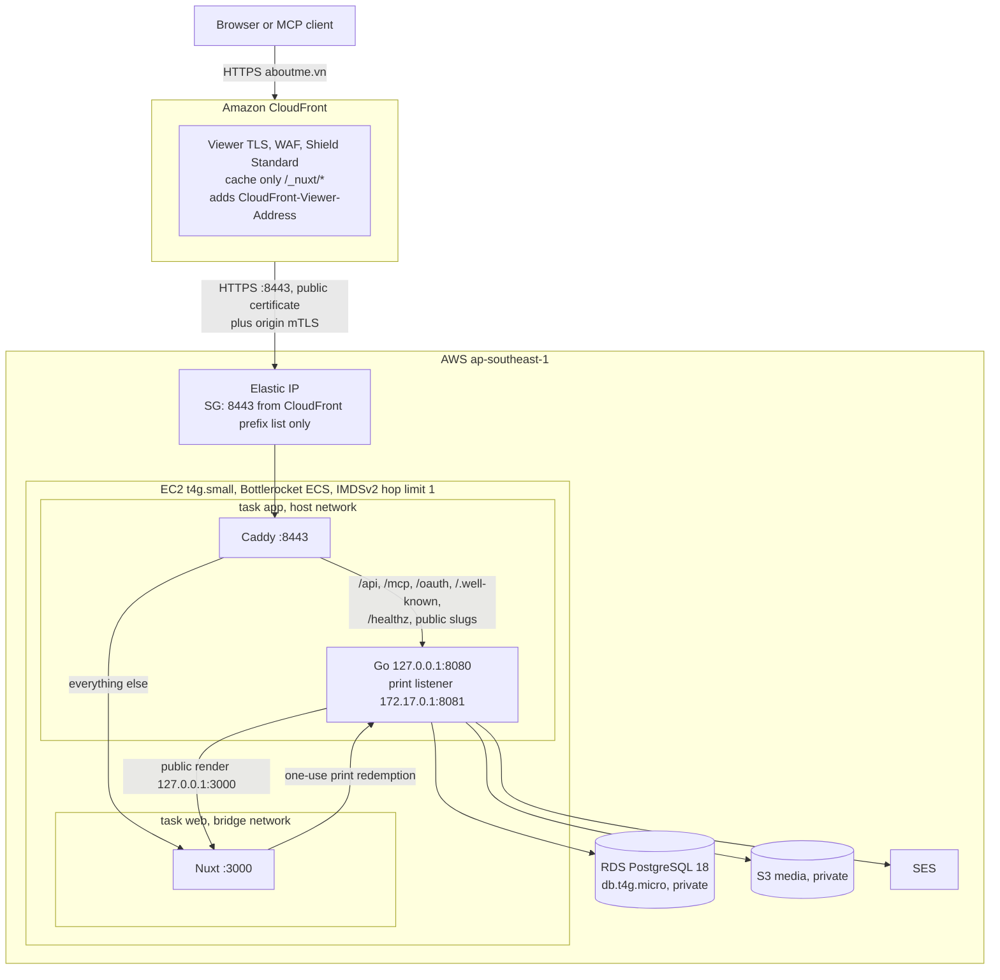
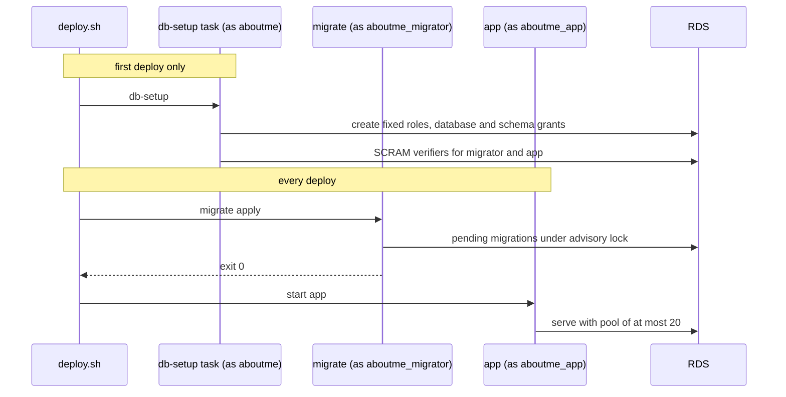

# Single-host production

Production runs at `https://aboutme.vn` on one host under
[ADR 0037](../adr/0037-single-host-production-without-hosted-uat.md). This page
narrows the [deployment design](deployment.md); trust boundaries not named here
are unchanged. The [production runbook](../runbooks/production.md) holds the
commands.

## Request path

## Edge

Amazon CloudFront serves `aboutme.vn` and `www.aboutme.vn`. The
[CloudFront edge design](cloudfront-edge.md) owns the distribution, cache,
origin access, client address, and WAF rules. Cloudflare answers DNS only, with
DNS-only CNAMEs to the distribution.

- Caddy presents an ACM exportable public certificate on 8443 and requires
  CloudFront's origin mTLS client certificate from our own CA.
- CloudFront caches only `/_nuxt/*`. Public PDF and image exports always reach
  the origin, so no cached copy survives unpublish or deletion.
- Caddy derives the client address from `CloudFront-Viewer-Address` and sets
  HSTS and `nosniff`.
- CloudFront's 60-second origin read timeout bounds the gap between packets; SSE
  heartbeats every 25 seconds stay inside it.
- AWS decrypts all traffic at the edge. The privacy notice states this.

## Host and networking

One EC2 instance runs the Bottlerocket ECS variant. It is not in an Auto Scaling
group, so its Elastic IP stays attached; a CloudWatch alarm auto-recovers it on
a failed status check. There is no inbound SSH. The owner reaches the host
through SSM.

| ECS task                | Network | Containers | Runs                                                 |
| ----------------------- | ------- | ---------- | ---------------------------------------------------- |
| `app` (service)         | host    | Caddy, Go  | Always; desired and maximum count one                |
| `web` (service)         | bridge  | Nuxt       | Always                                               |
| `maintenance` (service) | host    | Caddy      | Deploy and recovery only; desired count zero at rest |
| `migrate`               | bridge  | server     | Normal deploy, before `app` starts                   |
| `db-setup`              | bridge  | server     | First deploy only                                    |
| `jobs`                  | bridge  | server     | EventBridge Scheduler                                |
| `totp-reencrypt`        | bridge  | server     | TOTP key rotation only                               |

The runtime trust boundaries are:

- Go's public listener binds `127.0.0.1:8080` and trusts only `127.0.0.1`. Only
  Caddy shares that loopback. Bridge containers cannot reach it.
- Caddy removes every viewer forwarding header and sets the header Go accepts
  only from one well-formed `CloudFront-Viewer-Address`.
- `app` and `maintenance` both run Caddy with host networking and declare no ECS
  port mapping. Caddy runs as uid 10001 with no capabilities and binds only
  8443, an unprivileged port. It binds with `SO_REUSEPORT`, which requires the
  same uid on both processes, so both services can listen on 8443 at once and
  the kernel spreads new connections across them. Every handoff starts the
  incoming service and confirms its task before it stops the outgoing one, so
  something always accepts connections on 8443. A failed confirmation stops the
  handoff before the outgoing service is touched.
- Nuxt has its own network namespace and is never a trusted proxy. It reaches
  only Go's private print listener on the bridge gateway, where the one-use
  capability still applies.
- A security group admits only TCP 8443 from the AWS-managed CloudFront
  origin-facing prefix list. The host's other group admits nothing. Host port
  3000 is unreachable from outside.
- IMDSv2 with hop limit one keeps bridge containers away from the instance role.
  Host-mode containers can still reach instance metadata, so the instance role
  holds only ECS agent and SSM permissions and an explicit deny on every
  `/aboutme/prod` parameter and the RDS master secret. A remaining risk is
  accepted: code running in the `app` task could use the instance role's ECS
  agent permissions to request other tasks' credentials on this host. Every task
  on the host is ours, and the `app` task already holds the widest runtime
  secrets. Moving Chromium into its own task removes most of this risk and
  belongs with the second-replica work.
- Chromium's outbound network stays blocked by its proxy setting, independent of
  the network mode.
- Chromium keeps its sandbox. Bottlerocket disables user namespaces, so the host
  sets `user.max_user_namespaces` to 16384, and the `app` server container adds
  `SYS_ADMIN` so Docker's seccomp profile allows the sandbox's namespaces. The
  image runs as a non-root user, so the process gains no effective capability.
  The sandbox fails to start without both settings.

`t4g` instances do not support ENI trunking and allow two `awsvpc` tasks, and
`awsvpc` tasks on EC2 cannot hold a public IP. That is why `app` uses host
networking. The layout depends on four facts, which hold on Bottlerocket
`aws-ecs-2` 1.65.0: host-mode tasks receive task-role credentials, a bridge
container reaches a host listener on `172.17.0.1`, a host-mode process reaches a
bridge container's published port on `127.0.0.1`, and IMDSv2 hop limit one
blocks bridge containers while host-mode containers still get a token.
`deploy/aws/probe/` rechecks them after a Bottlerocket major update.

Memory fits in 2 GiB: roughly 300 MiB for Bottlerocket and the agent, the
existing 512 MiB Go and Chromium cap, and about 300 MiB for Nuxt and Caddy. A
larger instance is the first growth step, per ADR 0036.

## Database

RDS PostgreSQL 18 runs `db.t4g.micro` with 20 GiB gp3, single-AZ, in a private
subnet with no public address. Its security group admits 5432 only from the host
security group. `rds.force_ssl` is on, and Go connects with
`sslmode=verify-full` against the AWS RDS CA bundle shipped in the server image.
Automated backups keep 30 days with point-in-time recovery. Each release also
takes a manual snapshot tagged `aboutme:created-by=deploy.sh`; the daily
`release-snapshot-sweep` job deletes each one once it is more than 27 days old,
so none reaches 30 days even after one missed run. Deletion protection is on and
deletion takes a final snapshot.

The RDS master user is named `aboutme` and owns database `aboutme`. RDS manages
its password in Secrets Manager. It is not a superuser.

- `db-setup` (`cmd/db-setup`) is one idempotent command run as the RDS master
  user. It creates any missing fixed role, fails closed on attribute or
  membership drift in an existing one, and re-applies database and schema grants
  without weakening one. When both `MIGRATOR_PASSWORD` and `APP_PASSWORD` are
  set, it stores their SCRAM-SHA-256 verifiers, so no plaintext password reaches
  PostgreSQL logs. The deploy script runs it only with `--first-deploy`.
- `migrate` always runs as `aboutme_migrator` (see
  [ADR 0038](../adr/0038-single-baseline-and-plain-migrator.md)): its
  `DATABASE_URL` login already is that role, and the migration runner verifies
  this on every connection, so no separate identity flag selects it.

## Secrets and identity

Secret values live in SSM Parameter Store SecureString under `/aboutme/prod/`
with the AWS-managed key. ECS injects them as container secrets. They never
enter images, Git, logs or OpenTofu state.

| Value                                            | Reader execution role                 |
| ------------------------------------------------ | ------------------------------------- |
| RDS master secret (Secrets Manager)              | `db-admin` (used by `db-setup`)       |
| `aboutme_migrator` password                      | `db-admin`, `migrate`                 |
| `aboutme_app` password                           | `db-admin`, `app`, `jobs`             |
| Auth email key and key ID, password-rate HMAC    | `app`                                 |
| Google client ID and secret                      | `app`                                 |
| TOTP keys `totp/key-a` and `totp/key-b`          | `app` (also used by `totp-reencrypt`) |
| Origin key and certificate, CloudFront client CA | `app`, `maintenance`                  |

`deploy/aws/scripts/secrets.sh` generates each password and key with `openssl`,
writes it straight to SSM, and never overwrites or prints one. OpenTofu
references parameter names only.

`deploy/aws/scripts/tls.sh` handles the TLS material in a private temporary
directory and deletes it at the end; the
[CloudFront runbook](../runbooks/cloudfront.md) has the commands:

- `export` writes the ACM origin certificate's key and chain to SSM.
- `client-ca` creates a CA that signs the origin mTLS client certificate, then
  discards the CA key. Caddy receives only the CA certificate. `client-import`
  moves the client certificate and key into ACM for CloudFront.

The `app` task role may get, put, list and delete objects in the media bucket
and send mail from the verified SES identity. The `jobs` task role has the same
bucket access and no mail access. `migrate` and `db-setup` have no task role.

The `maintenance` task has no task role. Its execution role can write Caddy logs
and read only the origin certificate, origin private key, and CloudFront client
CA parameters needed to terminate production TLS.

Non-secret configuration is plain task definition values: `ENV=prod`,
`PUBLIC_ORIGIN=https://aboutme.vn`, `MCP_ENABLED=true`, `PROVIDER_LOGIN_ENABLED`
from the `provider_login_enabled` variable (`false` or `google`),
`MEDIA_BACKEND=s3` without static keys, the SES settings,
`PASSWORD_REGISTRATION_ENABLED`, and both enrollment flags. The TOTP key slot
variables choose which parameters the app receives as `TOTP_ACTIVE_KEY` and
`TOTP_PREVIOUS_KEY`.

## Release and deploy

A version tag triggers a public workflow on `ubuntu-24.04-arm`. It builds the
server, web and Caddy images for `linux/arm64`, runs smoke checks, pushes to
`ghcr.io/dannyota/aboutme-{server,web,caddy}`, attests build provenance and an
SPDX SBOM for each digest, and prints the digests. A final job with only
`contents: write` publishes a GitHub Release for the tag holding the SBOMs and a
`digests.txt` ([build evidence](deployment-transparency/verification.md#sbom)).
The Caddy image carries the Caddyfile and generated route table; its entrypoint
writes the origin key to a tmpfs file before Caddy starts.

`deploy/aws/scripts/deploy.sh <tag>` runs from the laptop:

1. Resolve the tag to digests. Require the tag on `main` with green CI, and each
   digest's build provenance signed by `release-images.yml` for that tag and
   commit on a GitHub-hosted runner (`gh attestation verify`). Refuse to
   continue if the app or maintenance task definition still maps port 443
   or 8443. Check the CloudFront distribution's origin and require at least 21
   days on the origin certificate.
2. Take an RDS snapshot named for the tag, tagged
   `aboutme:created-by=deploy.sh`, and wait for it.
3. Register new task definition revisions by digest, under the
   [release fence](passkey-release-fence.md).
4. Disable the job schedules.
5. Start `maintenance` beside the running `app`, confirm it, then scale `app` to
   zero and prove its tasks stopped.
6. Require CloudFront to return `maintenance`'s marked 503 response before any
   database task starts.
7. With `--first-deploy`, run `db-setup`. Otherwise run `migrate` and require
   exit 0.
8. Update `web`, start `app` beside `maintenance` and confirm it (steady
   service, one task of the released revision, every container running), then
   stop `maintenance`.
9. Re-enable the job schedules at the new `jobs` revision.
10. Smoke through CloudFront: health, HSTS, and a `Via` naming CloudFront. A
    direct request to the Elastic IP on 443 or 8443 must time out.

Maintenance mode keeps the same CloudFront listener, origin mTLS, and client
address rule. Every apex path, including readiness and API paths, returns the
same page with status 503, `Cache-Control: no-store`, and `Retry-After: 60`. The
`www` host still redirects to the matching apex path. The page carries the app's
Aurora identity, in light or dark to match `prefers-color-scheme`, makes no
external request, and shows Vietnamese by default, or the language the visitor's
`aboutme-locale` cookie names (`vi` or `en`); a client-side VI/EN toggle
switches language and writes that cookie. The page polls `/readyz` without
caching, backs off from 10 to 60 seconds, and reloads only after a 200. Visitors
without JavaScript refresh after 60 seconds.

A failure before a migration request could have been accepted starts the
previous `app` revision beside `maintenance`, confirms it, stops `maintenance`,
and restores the earlier job schedule states. A migration request is treated as
possibly applied before its response arrives. A running database task, or a
failed, partial, or uncertain migration, leaves maintenance up and leaves `app`
and the schedules stopped. The operator fixes forward or restores the release
snapshot because the prior app is not proven against the changed database.

If the new app may have started but never reached steady state, recovery scales
it back to zero; `maintenance`, already running beside it, stays up. A service
confirmation that finds the wrong revision, more or fewer than one task, or a
container not yet running is treated the same as an unconfirmed wait. A healthy
new app stays up when only schedule enablement fails; the script reports each
schedule that still needs repair. A failed first deploy leaves maintenance up
because no prior app exists.

`deploy.sh --rollback <tag>` redeploys earlier server, web, and app digests
without migrating, through the same handoff, and keeps the current maintenance
Caddy image. It is safe only when the failed release applied no migration;
otherwise recovery is a forward fix or a point-in-time restore.

OpenTofu owns infrastructure and the first task definitions and ignores later
service revisions. A handoff keeps something listening on 8443 throughout; at
most a few connections still queued on an outgoing Caddy's listener are reset
when it closes. A CloudFront 502 or 504 can still come from a host reboot during
the monthly Bottlerocket update window, from host loss, or from ECS replacing an
app task that failed its health check, which stops the task before a replacement
starts. A monthly SSM maintenance window applies Bottlerocket updates with
`apiclient update apply --reboot`.

## Scheduled jobs

EventBridge Scheduler runs the `jobs` task with the server image's privacy
commands, per the [privacy runbook](../runbooks/privacy.md):
`idempotency-expiry-sweep` and `media-deletion-sweep` hourly,
`privacy-retention-sweep` and `release-snapshot-sweep` daily, and
`media-orphan-sweep` weekly. The database commands hold advisory locks against
overlap. `release-snapshot-sweep` reads only RDS snapshot metadata, and the
`jobs` task role may delete only snapshots that carry the deploy.sh tag, plus
the one release snapshot taken before tagging began.

## Monitoring and cost

All alarms notify one SNS topic that emails the owner.

| Signal   | Mechanism                                                                      |
| -------- | ------------------------------------------------------------------------------ |
| Logs     | awslogs to CloudWatch Logs, 180-day retention                                  |
| App down | Stopped-task events for `app` and `web`; Route 53 health check on `/readyz`    |
| Host     | EC2 status check with auto-recovery; ECS CPU and memory                        |
| Database | RDS CPU, credit balance, free storage and connections                          |
| Jobs     | ECS task stopped with nonzero exit; Scheduler invocation failures              |
| TOTP     | Log metric filter on `totp_unavailable`, alarm `aboutme-prod-totp-unavailable` |
| Mail     | SES bounce and complaint alarms from the existing email stack                  |
| Observer | Observer errors (five in ten minutes) and missing runs (none in ten minutes)   |
| Spend    | Budget filtered to `Project=aboutme`, managed outside this repository          |

Expected monthly cost is about $45–55: EC2 $15.48, RDS $18.25 plus $2.76
storage, root disk $1.92, Elastic IP $3.65, the state KMS key $1, and a few
dollars for logs, the HTTPS health check, Secrets Manager, S3 and SES, using
[recorded prices](../research/aws-cost/pricing.csv). The CloudFront edge adds
about $11 ([edge cost](cloudfront-edge.md#cost)). The deployment observer, a
Lambda function off the host that publishes `/.well-known/deployment.json` every
minute, adds under $0.50
([deployment transparency](deployment-transparency/README.md)).

## Infrastructure code

- `deploy/aws/` holds OpenTofu modules and a `prod` root. `backend.hcl` and
  `prod.tfvars` are ignored; committed `*.example` files show their shape.
- State lives in a versioned, encrypted S3 bucket with OpenTofu's lock file and
  client-side state encryption through KMS. A small bootstrap root creates the
  bucket.
- OpenTofu manages AWS only, including the CloudFront distribution and WAF;
  there is no Cloudflare API token. The owner applies the Cloudflare DNS records
  through an authenticated Cloudflare connection, and the
  [production runbook](../runbooks/production.md#cloudflare-dns) lists them. A
  change to any record updates the runbook in the same change.
- Public CI runs `tofu fmt -check` and `tofu validate` without cloud
  credentials. No workflow deploys.

## Before the public announcement

One restore drill from a snapshot to a temporary instance, SES production
access, and live privacy and terms pages.
