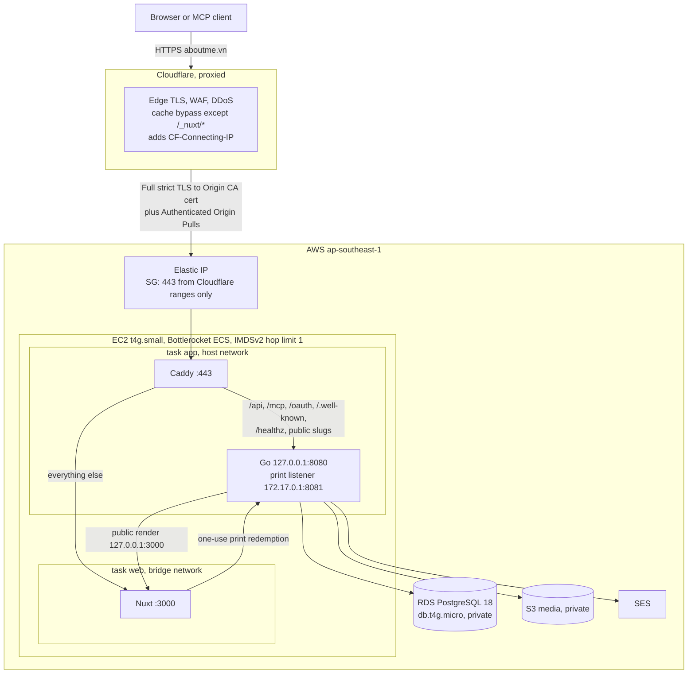
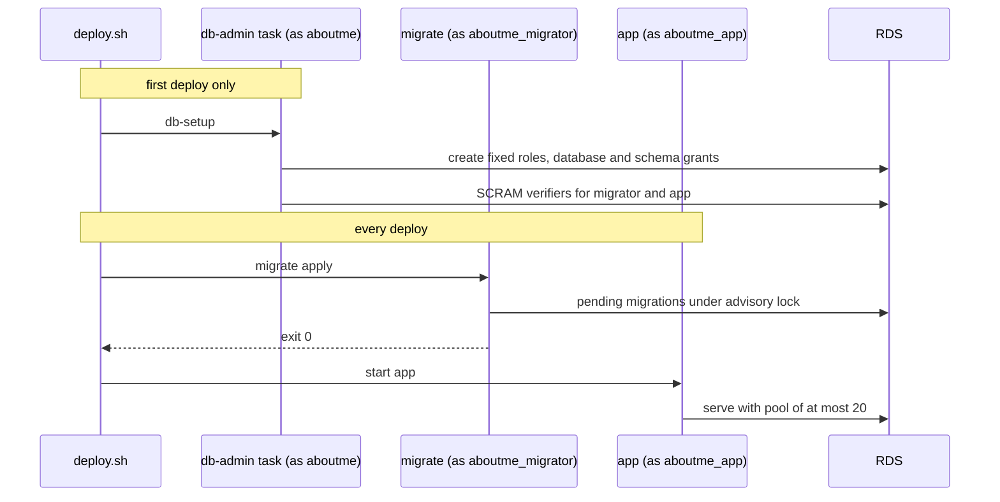

# Single-host production

Status: Accepted under
[ADR 0037](../adr/0037-single-host-production-without-hosted-uat.md). This
document states how the first release runs at `https://aboutme.vn`. It narrows
the [deployment design](deployment.md) for that release; trust boundaries not
named here are unchanged.

## Request path

## Edge

- Cloudflare proxies `aboutme.vn` in Full (strict) mode. Caddy presents a
  Cloudflare Origin CA certificate.
- Zone-level Authenticated Origin Pulls uses our own client certificate, and
  Caddy accepts only that certificate. The global Cloudflare certificate is
  shared by every Cloudflare account, so it proves only that a request came
  through some Cloudflare zone.
- A cache rule bypasses the cache for every path except `/_nuxt/*`. Public PDF
  and image exports have extensions Cloudflare caches by default, and a cached
  copy would survive unpublish or deletion.
- Bot Fight Mode is off. It cannot exempt paths, and it would block MCP clients,
  API calls and the health check. DDoS protection and Go's rate limits remain.
  Cloudflare passes `Authorization` unchanged.
- Cloudflare's IP ranges feed both the security group and Caddy's trusted proxy
  list. `deploy.sh` compares the live ranges with the deployed ones and stops on
  a difference until `tofu apply` refreshes them.
- SSE heartbeats every 25 seconds stay under Cloudflare's 100-second idle
  timeout.
- Cloudflare decrypts all traffic. The privacy notice states this.

## Host and networking

One EC2 instance runs the Bottlerocket ECS variant. It is not in an Auto Scaling
group, so its Elastic IP stays attached; a CloudWatch alarm auto-recovers it on
a failed status check. There is no inbound SSH. The owner reaches the host
through SSM.

| ECS task                | Network | Containers | Runs                                                 |
| ----------------------- | ------- | ---------- | ---------------------------------------------------- |
| `app` (service)         | host    | Caddy, Go  | Always; desired and maximum count one                |
| `web` (service)         | bridge  | Nuxt       | Always                                               |
| `maintenance` (service) | host    | Caddy      | Deploy and recovery only; desired count zero at rest |
| `migrate`               | bridge  | server     | Normal deploy, before `app` starts                   |
| `db-admin`              | bridge  | server     | First deploy only                                    |
| `jobs`                  | bridge  | server     | EventBridge Scheduler                                |

The runtime trust boundaries are:

- Go's public listener binds `127.0.0.1:8080` and trusts only `127.0.0.1`. Only
  Caddy shares that loopback. Bridge containers cannot reach it.
- Caddy trusts `CF-Connecting-IP` only from Cloudflare's published ranges and
  removes forwarding headers from every other peer before setting the header Go
  accepts.
- `app` and `maintenance` both bind host port 443. The deploy script proves all
  tasks for one service have stopped before starting the other. A failed proof
  stops the handoff, so both services are never deliberately started together.
- Nuxt has its own network namespace and is never a trusted proxy. It reaches
  only Go's private print listener on the bridge gateway, where the one-use
  capability still applies.
- The security group admits only TCP 443 from Cloudflare ranges, read by
  OpenTofu from Cloudflare's public IP list. Host port 3000 is unreachable from
  outside.
- IMDSv2 with hop limit one keeps bridge containers away from the instance role.
  Host-mode containers can still reach instance metadata, so the instance role
  holds only ECS agent and SSM permissions and an explicit deny on every
  `/aboutme/prod` parameter and the RDS master secret. A remaining risk is
  accepted: code running in the `app` task could use the instance role's ECS
  agent permissions to request other tasks' credentials on this host. Every task
  on the host is ours, and the `app` task already holds the widest runtime
  secrets. Moving Chromium into its own task removes most of this risk and
  belongs with the second-replica work.
- Chromium's outbound network stays blocked by its proxy setting, independent of
  the network mode.
- Chromium keeps its sandbox. Bottlerocket disables user namespaces, so the host
  sets `user.max_user_namespaces` to 16384, and the `app` server container adds
  `SYS_ADMIN` so Docker's seccomp profile allows the sandbox's namespaces. The
  image runs as a non-root user, so the process gains no effective capability.
  The sandbox fails to start without both settings.

`t4g` instances do not support ENI trunking and allow two `awsvpc` tasks, and
`awsvpc` tasks on EC2 cannot hold a public IP. That is why `app` uses host
networking. The layout depends on four facts, which hold on Bottlerocket
`aws-ecs-2` 1.65.0: host-mode tasks receive task-role credentials, a bridge
container reaches a host listener on `172.17.0.1`, a host-mode process reaches a
bridge container's published port on `127.0.0.1`, and IMDSv2 hop limit one
blocks bridge containers while host-mode containers still get a token.
`deploy/aws/probe/` rechecks them after a Bottlerocket major update.

Memory fits in 2 GiB: roughly 300 MiB for Bottlerocket and the agent, the
existing 512 MiB Go and Chromium cap, and about 300 MiB for Nuxt and Caddy. A
larger instance is the first growth step, per ADR 0036.

## Database

RDS PostgreSQL 18 runs `db.t4g.micro` with 20 GiB gp3, single-AZ, in a private
subnet with no public address. Its security group admits 5432 only from the host
security group. `rds.force_ssl` is on, and Go connects with
`sslmode=verify-full` against the AWS RDS CA bundle shipped in the server image.
Automated backups keep 30 days with point-in-time recovery. Each release also
takes a manual snapshot tagged `aboutme:created-by=deploy.sh`; the daily
`release-snapshot-sweep` job deletes each one once it is more than 27 days old,
so none reaches 30 days even after one missed run. Deletion protection is on and
deletion takes a final snapshot.

The RDS master user is named `aboutme` and owns database `aboutme`. RDS manages
its password in Secrets Manager. It is not a superuser.

- `db-setup` (`cmd/db-setup`) is one idempotent command run as the RDS master
  user `aboutme`, which owns the database but is not a superuser: it creates any
  missing fixed role, fails closed on attribute or membership drift in an
  existing one, applies database and schema grants, and, when both
  `MIGRATOR_PASSWORD` and `APP_PASSWORD` are set, stores their SCRAM-SHA-256
  verifiers so no plaintext password reaches PostgreSQL logs.
- Every `db-setup` run re-applies the database and schema grants; a run with
  both `MIGRATOR_PASSWORD` and `APP_PASSWORD` set rewrites both SCRAM verifiers.
  It never weakens an existing grant, and it still fails closed on role
  attribute or membership drift. The deploy script runs it only with
  `--first-deploy`.
- `migrate` always runs as `aboutme_migrator` (see
  [ADR 0038](../adr/0038-single-baseline-and-plain-migrator.md)): its
  `DATABASE_URL` login already is that role, and the migration runner verifies
  this on every connection, so no separate identity flag selects it.

## Secrets and identity

Secret values live in SSM Parameter Store SecureString under `/aboutme/prod/`
with the AWS-managed key. ECS injects them as container secrets. They never
enter images, Git, logs or OpenTofu state.

| Value                                         | Reader execution role     |
| --------------------------------------------- | ------------------------- |
| RDS master secret (Secrets Manager)           | `db-admin`                |
| `aboutme_migrator` password                   | `db-admin`, `migrate`     |
| `aboutme_app` password                        | `db-admin`, `app`, `jobs` |
| Auth email key and key ID, password-rate HMAC | `app`                     |
| Origin CA private key                         | `app`, `maintenance`      |

`deploy/aws/scripts/secrets.sh` generates each password and key with `openssl`,
writes it straight to SSM, and never overwrites or prints one. OpenTofu
references parameter names only.

`deploy/aws/scripts/tls.sh` generates the TLS keys in a private temporary
directory and deletes it at the end:

- The Origin CA key goes straight to SSM. Only the public certificate signing
  request leaves the script; Cloudflare issues the certificate from it.
- The origin-pull CA signs a client certificate, and the CA key is discarded.
  The owner uploads the client certificate and key once in the Cloudflare
  dashboard as the zone-level origin-pull certificate. Caddy receives only the
  CA certificate.

The `app` task role may get, put, list and delete objects in the media bucket
and send mail from the verified SES identity. The `jobs` task role has the same
bucket access and no mail access. `migrate` and `db-admin` task roles grant
nothing.

The `maintenance` task has no task role. Its execution role can write Caddy logs
and read only the origin certificate, origin private key, and origin-pull CA
parameters needed to terminate production TLS.

Non-secret configuration is plain task definition values: `ENV=prod`,
`PUBLIC_ORIGIN=https://aboutme.vn`, `MCP_ENABLED=true`, `PROVIDER_LOGIN_ENABLED`
from the `provider_login_enabled` variable (`false` or `google`),
`MEDIA_BACKEND=s3` without static keys, and the SES settings. When Google is on,
its client ID and secret are task secrets from SSM.

## Release and deploy

A version tag triggers a public workflow on `ubuntu-24.04-arm`. It builds the
server, web and Caddy images for `linux/arm64`, runs smoke checks, pushes to
`ghcr.io/dannyota/aboutme-{server,web,caddy}`, attests build provenance and
prints the digests. The Caddy image carries the Caddyfile and generated route
table; its entrypoint writes the Origin CA key to a tmpfs file before Caddy
starts.

`deploy/aws/scripts/deploy.sh <tag>` runs from the laptop:

1. Resolve the tag to digests. Require the tag on `main` with green CI.
2. Take an RDS snapshot named for the tag, tagged
   `aboutme:created-by=deploy.sh`, and wait for it.
3. Register new task definition revisions by digest. A rollback keeps the
   current maintenance Caddy image so a tag from before maintenance mode can
   still serve the handoff page.
4. Disable the job schedules, scale `app` to zero, and prove its tasks stopped.
5. Start `maintenance` and require the Cloudflare path to return its marked 503
   response before any database task starts.
6. With `--first-deploy`, run the `db-admin` `db-setup` task. Run `migrate` for
   a normal deploy and require exit 0.
7. Update `web`, then stop `maintenance` and prove its tasks stopped before
   requesting `app` to start.
8. Wait for `app` steady state, then re-enable the job schedules at the new
   `jobs` revision.
9. Smoke through Cloudflare: health, TLS and security headers. A direct request
   to the Elastic IP must fail.

Maintenance mode keeps the normal Cloudflare proxy trust and origin-pull mTLS.
Every apex path, including readiness and API paths, returns the same bilingual
HTML with status 503, `Cache-Control: no-store`, and `Retry-After: 60`. The
`www` host still redirects to the matching apex path. The page polls `/readyz`
without caching, backs off from 10 to 60 seconds, and reloads only after a 200.
Visitors without JavaScript refresh after 60 seconds.

A failure before a migration request could have been accepted stops maintenance,
restores the previous `app` revision, and restores the earlier job schedule
states. A migration request is treated as possibly applied before its response
arrives. A running database task, or a failed, partial, or uncertain migration,
leaves maintenance up and leaves `app` and the schedules stopped. The operator
fixes forward or restores the release snapshot because the prior app is not
proven against the changed database.

If the new app may have started but never reached steady state, recovery first
proves that every app task stopped and only then starts maintenance. If ECS
cannot prove that either service released port 443, recovery stops and does not
start the competing service. A healthy new app stays up when only schedule
enablement fails; the script reports each schedule that still needs repair. A
failed first deploy leaves maintenance up because no prior app exists.

`deploy.sh --rollback <tag>` redeploys earlier server, web, and app digests
without migrating, through the same maintenance handoff. It retains the current
maintenance-capable Caddy image. Rollback is safe only when the failed release
applied no migration, because this script does not run the prior-digest
compatibility test from the deployment design. After a migration, recovery is a
forward fix or a point-in-time restore.

`apps/server/migrations/.uat-baseline` freezes the existing migrations; only new
forward migrations may be added, per
[ADR 0020](../adr/0020-uat-migration-baseline.md) and
[ADR 0038](../adr/0038-single-baseline-and-plain-migrator.md).

OpenTofu owns infrastructure and first task definitions and ignores later
revisions on the services.

Deploy duration depends on ECS task placement and image pulls. Maintenance
serves its 503 response between successful handoffs. An exclusive host-port 443
exchange can refuse connections or TLS until ECS releases and reacquires the
port; the final v0.3.30 handoff gap measured about one minute. A monthly SSM
maintenance window applies Bottlerocket updates with
`apiclient update apply --reboot`.

## Scheduled jobs

EventBridge Scheduler runs the `jobs` task with the server image's privacy
commands, per the [privacy runbook](../runbooks/privacy.md):
`idempotency-expiry-sweep` and `media-deletion-sweep` hourly,
`privacy-retention-sweep` and `release-snapshot-sweep` daily, and
`media-orphan-sweep` weekly. The database commands hold advisory locks against
overlap. `release-snapshot-sweep` reads only RDS snapshot metadata, and the
`jobs` task role may delete only snapshots that carry the deploy.sh tag, plus
the one release snapshot taken before tagging began.

## Monitoring and cost

All alarms notify one SNS topic that emails the owner.

| Signal   | Mechanism                                                                    |
| -------- | ---------------------------------------------------------------------------- |
| Logs     | awslogs to CloudWatch Logs, 180-day retention                                |
| App down | Stopped-task events for `app` and `web`; Route 53 health check on `/healthz` |
| Host     | EC2 status check with auto-recovery; ECS CPU and memory                      |
| Database | RDS CPU, credit balance, free storage and connections                        |
| Jobs     | ECS task stopped with nonzero exit; Scheduler invocation failures            |
| Mail     | SES bounce and complaint alarms from the existing email stack                |
| Spend    | Budget filtered to `Project=aboutme`, managed outside this repository        |

Expected monthly cost is about $45–55: EC2 $15.48, RDS $18.25 plus $2.76
storage, root disk $1.92, Elastic IP $3.65, the state KMS key $1, and a few
dollars for logs, the HTTPS health check, Secrets Manager, S3 and SES, using
[recorded prices](../research/aws-cost/pricing.csv).

## Infrastructure code

- `deploy/aws/` holds OpenTofu modules and a `prod` root. `backend.hcl` and
  `prod.tfvars` are ignored; committed `*.example` files show their shape.
- State lives in a versioned, encrypted S3 bucket with OpenTofu's lock file and
  client-side state encryption through KMS. A small bootstrap root creates the
  bucket.
- OpenTofu manages AWS only; there is no Cloudflare API token. The Cloudflare
  settings are applied through the owner's authenticated Cloudflare connection
  and listed in the production runbook: the two proxied DNS records, Full
  (strict) SSL, HTTPS redirect, minimum TLS 1.2, HSTS, Bot Fight Mode off, the
  cache rule, zone-level origin pulls (enabled before the first deploy, because
  Caddy requires the client certificate from its first start), and the Origin CA
  certificate. A change to any of them updates the runbook in the same change.
- Public CI runs `tofu fmt -check` and `tofu validate` without cloud
  credentials. No workflow deploys.

## Launch checks

Before the first deploy: the tests pass, the image smoke passes, and `tofu plan`
is reviewed. Before announcing the site: one restore drill from a snapshot to a
temporary instance, SES production access, and live privacy and terms pages.
