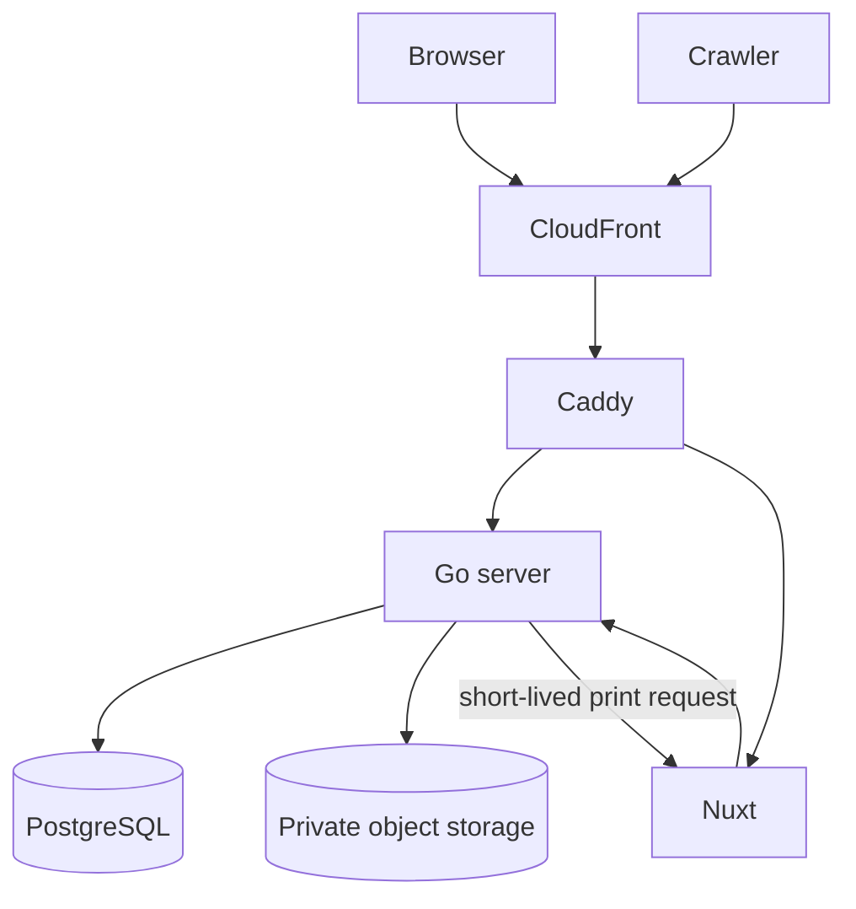

# 2. System architecture

The system separates identity and data operations from presentation while
sharing one renderer across every visual output.

## Components

| Component      | Responsibility                                                                                    |
| -------------- | ------------------------------------------------------------------------------------------------- |
| Caddy          | One origin, route dispatch, canonical client IP, production origin-secret check, and edge headers |
| Go server      | Authentication, sessions, resume API, validation, publishing, realtime, media, and render jobs    |
| Nuxt           | Public server-side rendering (SSR), editor application, internal print route, and Vue renderer    |
| PostgreSQL     | Accounts, sessions, resume aggregates, slug state, idempotency, and operational records           |
| Object storage | Private account avatars and resume photos; Go controls every read and write                       |
| CloudFront     | Production viewer edge, TLS entry, route-specific cache policy, and origin restriction            |

## Route ownership

Caddy owns the route table. OpenAPI owns the exact implemented HTTP contract.

| Path group                                               | Backend | Rule                                                                  |
| -------------------------------------------------------- | ------- | --------------------------------------------------------------------- |
| `/api/v1/*`                                              | Go      | Product API; route-specific auth, cache, rate, and body policies      |
| `/api/v1/events`, `/api/v1/live/*`                       | Go      | Server-Sent Events (SSE); long origin timeout and 25-second heartbeat |
| `/sitemap.xml`, `/robots.txt`, `/llms.txt`, `/{slug}.md` | Go      | Generated from current publish state                                  |
| `/healthz`, `/readyz`                                    | Go      | Unversioned infrastructure probes; both accept `GET` and `HEAD`       |
| `/print/*`                                               | Nuxt    | Internal only; Caddy denies viewer requests                           |
| Everything else                                          | Nuxt    | Landing, account UI, editor, and public SSR pages                     |

`/healthz` is liveness and never touches PostgreSQL. `/readyz` checks required
dependencies and render-queue saturation. A dependency outage must remove the
task from service without causing a liveness restart loop. Probe responses use
the standard JSON envelope.
[ADR 0007](../adr/0007-unversioned-health-endpoints.md) records why these routes
are outside `/api/v1`.

## Renderer boundary

The renderer is a pure Vue component tree. The editor renders it in the browser,
Nuxt renders it for public HTML, and Chromium prints an internal Nuxt route for
PDF and images. Go never implements resume layout. This removes a second
rendering authority; [ADR 0002](../adr/0002-go-api-nuxt-ssr-split.md) records
the choice.

Editor pagination is an approximation. Chromium print pagination is the PDF
authority. Public pages are continuous and have no page boundaries.

## Failure boundaries

- A database outage makes Go unready, not dead.
- Render saturation makes readiness fail before the queue grows without bound.
- An object-store failure fails the media operation without weakening resume
  authorization.
- A Nuxt failure does not expose Go or PostgreSQL around Caddy.
- A missed SSE notification is repaired by an unconditional refetch on every
  reconnect.
- Production fails closed when trusted-proxy or origin-secret configuration is
  absent.
