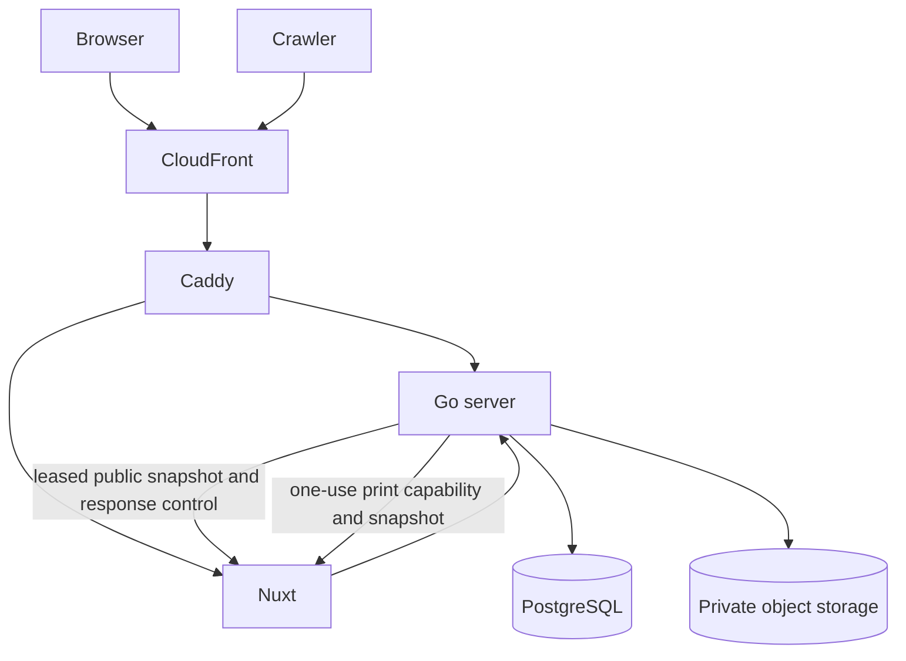

# 2. System architecture

The system separates identity and data operations from presentation while
sharing one renderer across every visual output.

## Components

| Component      | Responsibility                                                                                    |
| -------------- | ------------------------------------------------------------------------------------------------- |
| Caddy          | One origin, route dispatch, canonical client IP, production origin-secret check, and edge headers |
| Go server      | Authentication, sessions, resume API, public-state gates, media, and authorized render jobs       |
| Nuxt           | Public server-side rendering (SSR), editor application, capability-gated print, and Vue renderer  |
| PostgreSQL     | Accounts, sessions, resume aggregates, slug state, idempotency, and operational records           |
| Object storage | Private account avatars and resume photos; Go controls every read and write                       |
| CloudFront     | Production viewer edge, TLS entry, route-specific cache policy, and origin restriction            |

## Route ownership

Caddy owns the route table. OpenAPI owns the exact implemented HTTP contract.
Literal first-segment precedence and slug reservation consume the same generated
public-root registry defined in [Product scope](product.md#public-namespace).
The generated dispatch and route-parity fixtures must change with that registry;
a new fixed root cannot be added only to Caddy, Go, or Nuxt.

| Path group                                               | Backend | Rule                                                                  |
| -------------------------------------------------------- | ------- | --------------------------------------------------------------------- |
| `/api/v1/*`                                              | Go      | Product API; route-specific auth, cache, rate, and body policies      |
| `/api/v1/events`, `/api/v1/live/*`                       | Go      | Server-Sent Events (SSE); long origin timeout and 25-second heartbeat |
| `/sitemap.xml`, `/robots.txt`, `/llms.txt`, `/{slug}.md` | Go      | Generated from current publish state                                  |
| `/{slug}`                                                | Go→Nuxt | Go holds the generation lease and origin response; Nuxt renders bytes |
| `/healthz`, `/readyz`                                    | Go      | Unversioned infrastructure probes; both accept `GET` and `HEAD`       |
| `/print/*`                                               | Nuxt    | One-use Go capability required; Caddy also denies viewer requests     |
| `/internal-render/public`                                | Nuxt    | Direct bounded Go POST only; Caddy denies every viewer request        |
| `/.well-known/oauth-*`                                   | Go      | RFC 8414 and RFC 9728 metadata; GET only, from the canonical origin   |
| `/oauth/*`                                               | Go      | Agent authorization server; only `/oauth/authorize` reads a session   |
| `/mcp`                                                   | Go      | Remote MCP endpoint; bearer only, cookies never parsed                |
| `/authorize`                                             | Nuxt    | Agent consent page; session required, decision posted through CSRF    |
| Everything else                                          | Nuxt    | Landing, account UI, and editor                                       |

`/healthz` is liveness and never touches PostgreSQL. `/readyz` checks required
dependencies and render-queue saturation. A dependency outage must remove the
task from service without causing a liveness restart loop. Probe responses use
the standard JSON envelope.
[ADR 0007](../adr/0007-unversioned-health-endpoints.md) records why these routes
are outside `/api/v1`.

Public resume, discovery, media, and generated-artifact routes revalidate
current live state before reusing cached bytes. The internal print route accepts
only a 60-second one-use capability bound to an authorized render snapshot; a
resume ID and network location grant nothing. These boundaries are defined by
[ADR 0022](../adr/0022-public-artifact-revocation.md) and
[ADR 0023](../adr/0023-private-print-capability.md).

## Renderer boundary

The renderer is a pure Vue component tree. The editor renders it in the browser,
Nuxt renders it for public HTML, and Chromium prints an internal Nuxt route for
PDF and images. Go never implements resume layout. This removes a second
rendering authority; [ADR 0002](../adr/0002-go-api-nuxt-ssr-split.md) records
the choice.

For public HTML, Go remains the response controller while Nuxt remains the sole
renderer. Go freezes a leased snapshot, calls the direct Nuxt origin at exact
`POST /internal-render/public`, and sends Nuxt's bytes to the viewer. The
internal handler renders only the bounded supplied snapshot. Public Caddy denies
that root before its default Nuxt proxy. Go releases the lease only when the
origin response completes or aborts. Aggregate discovery routes use their
separate generation fence.

Editor pagination is an approximation. Chromium print pagination is the PDF
authority. Public pages are continuous and have no page boundaries.

## Failure boundaries

- A database outage makes Go unready, not dead.
- Render saturation makes readiness fail before the queue grows without bound.
- An object-store failure fails the media operation without weakening resume
  authorization.
- A public-cache or invalidation failure cannot bypass the origin live-state
  gate.
- A print capability expiry or replay fails that render job without falling back
  to a session cookie or ID-only read.
- A completed public render is discarded unless the controlling Go job accepts
  its digest against the still-current public generation; Nuxt cannot publish.
- A Nuxt failure does not expose Go or PostgreSQL around Caddy.
- A missed SSE notification is repaired by an unconditional refetch on every
  reconnect.
- Production fails closed when trusted-proxy or origin-secret configuration is
  absent.
