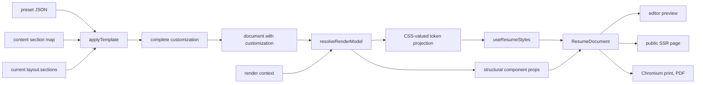

# Template contract

Status: **Approved v2** (2026-08-12).

What a template is, what it may decide, and how it renders the versioned
[resume document](../data.md#resume-aggregate).

## 1. A template is data, not code

A template is a **customization preset**: a JSON file in
`packages/schema/templates/*.json` which, applied to a document, yields a
complete `customization` object. The [web design](../web.md#templates) fixes
presets as repository data with no v1 database table. Three consequences follow
for every concrete template design.

1. **There is one renderer.** `components/resume/` is a single pure component
   tree (`ResumeDocument` → `ResumeHeader` → `LayoutColumns` → `SectionRenderer`
   → `sections/*` + `primitives/*`). No template ships its own components, its
   own CSS file, or its own section markup.
2. **The document stores no template identity.** `resume.schema.json`'s
   `customization` object is `additionalProperties: false` with eight required
   keys, none of which names a template; the `resumes` table has no template
   column. After apply, the preset that produced the values is unrecoverable.
3. Therefore **a template is a point in token space.** Every visual difference
   between two templates must be expressible as a difference in `customization`
   values, because at render time nothing else distinguishes them. A template
   cannot introduce a token the schema lacks. See
   [Known contract limits](limitations.md).

## 2. The decision boundary

Three domains, disjoint by construction.

| Domain            | Holds                                                                                                                                                                                         | Written by                                        | Template apply       |
| ----------------- | --------------------------------------------------------------------------------------------------------------------------------------------------------------------------------------------- | ------------------------------------------------- | -------------------- |
| **Document**      | `personalDetails`, `content` (entries, `displayName`, `iconKey`, `sectionType`)                                                                                                               | the user, through entry/section/details endpoints | never touched        |
| **Customization** | the 25 leaf values under `customization` (§2 of `tokens.md`; 8 optional, including the two `spacing.pageMargin` axes, two optional colors, `layout.surfaceTarget`, and three `header` leaves) | the user, and a preset on apply                   | replaced wholesale   |
| **Renderer**      | everything else: type scale ratios, weights, rule geometry, the absent-margin 15 mm fallback and derived page geometry, column ratio, photo shape                                             | the codebase                                      | identical everywhere |

The boundary in one line each:

- The **document** owns what the resume says. No template or token may add,
  remove, reorder, or reword content.
- The **user** owns every value in `customization` and may change any of them
  individually at any time.
- A **preset** owns the same values collectively: it is a saved point in that
  same space, not a separate layer above it.
- The **renderer** owns everything not in `customization`, and owns it for all
  templates at once.
- `layout.sections` is jointly derived, not directly owned: `applyTemplate`
  computes it (ADR 0008) and `PATCH /resumes/{id}/structure` is the only
  endpoint that may rewrite it (ADR 0009).

Because the user's customization _is_ the template, applying a template replaces
it. That is not data loss through carelessness; it is the definition. The
document content survives; section placement follows the preset's rule (§3). The
editor is responsible for making the replacement visible and undoable; the
renderer and the preset schema are not.

## 3. Apply semantics — ADR 0008 and placement order

ADR 0008 imposes:

> A preset does not carry section keys. It carries a **placement rule**, and
> `applyTemplate` computes `layout.sections` as a total function of the
> document's actual content keys.

and

> Everything else in §5's sentence stands: applying a template replaces the rest
> of `customization` wholesale, and `content` is untouched.

Consequences a template design must respect:

- A preset declares `layout.placement` as either `"keep"` (preserve the
  document's current `main`/`sidebar` arrays) or `"byType"` with an ordered
  `sidebarSectionTypes` list. One-column presets use `"keep"`.
- Proposed [ADR 0021](../../adr/0021-template-placement-order.md) fixes ADR
  0008's missing tie-breaks. Current visual order is `main` followed by
  `sidebar`. A `byType` apply visits the unique `sidebarSectionTypes` in list
  order and places matching keys in their current visual order. Unselected keys
  and all custom sections remain in `main`, in current visual order.
- Before either rule runs, the current arrays must contain every content key
  exactly once and no unknown key. Invalid placement, duplicate selectors, or a
  `custom` selector fails with a typed error. `keep` returns the validated
  arrays byte-for-byte.
- Each valid output key lands in exactly one array, so §3's exactly-once
  aggregate invariant holds by construction rather than through a repair pass.
- A preset must therefore be renderable against a document it has never seen,
  including one whose only sections are custom sections with UUID keys.
- The preset shape is **not** the document's `customization` shape: it adds
  `layout.placement`/`sidebarSectionTypes` and omits `layout.sections`.
  `applyTemplate(currentCustomization, preset, content)` is a pure function
  returning either a complete, schema-valid `customization` or a typed
  validation error.
- A preset must supply every one of the eight required `customization` keys,
  including `pageFormat` and `dateFormat`, because the replace is wholesale.
  Applying a template therefore resets page size and date format. See
  [Known contract limits](limitations.md#9-known-contract-limits).
- The one-column ↔ two-column toggle in the customize panel is a **different
  operation** with its own preserve-and-move semantics. It is not an apply and
  must not route through `applyTemplate`.

## 4. Section order — ADR 0009 is binding

ADR 0009 imposes:

> **`customization.layout.sections` is the sole authority for section order and
> placement. `content` is an unordered map keyed by section key.**

The renderer iterates `layout.sections.main`, then `layout.sections.sidebar`,
looking each key up in `content`. It never iterates `content` to emit sections;
that is the defect the ADR names in advance. Entry order within a section is the
`entries` array order, which is preserved everywhere and is unaffected by this
rule.

A key present in `layout.sections` but absent from `content` renders nothing —
the store rejects that state on write, and the renderer must not crash on it.

Template application is stricter than rendering stale input. It validates both
arrays before apply and never derives an order by iterating `content`. Proposed
[ADR 0021](../../adr/0021-template-placement-order.md) defines the exact apply
order and fail-closed cases.

### 4.1 Resolved render model

`ResumeDocument` calls one pure
`resolveRenderModel(currentDocument, renderContext)` boundary before it emits
HTML. The returned model contains:

- ordered `main` and `sidebar` section models plus `layout.columns`;
- resolved header behavior, including optional-field fallbacks;
- `sectionDisplay`, `dateFormat`, `pageFormat`, language, pagination mode, and
  authorized photo state; and
- scoped CSS properties produced from a CSS-valued token projection by
  `useResumeStyles`.

Structural customization drives model fields and component props. In particular,
layout arrays and column count choose section order and layout; header settings
choose header DOM behavior; `sectionDisplay` chooses widget DOM shape; and
`dateFormat` chooses date output. `useResumeStyles` handles only CSS-valued
leaves such as font, colors, spacing, heading treatment, page geometry, and
surface treatment. After resolution, no component reads raw `customization`;
child components receive only the model slice they render.

## 5. Rendering the document contract

### 5.1 Header

`ResumeHeader` renders, in this order: photo (if present), `fullName`,
`headline`, then `personalDetails.details`. Detail order is the **array order**
of `details`; the schema carries no separate order field, which supersedes §5's
reference to a `detailsOrder` — ratified by ADR 0013. A detail with
`isHidden: true` is omitted entirely. `isHidden` is required on a detail and
optional on an entry; an entry without the key is visible.

Details of type `website`, `linkedin`, `github`, `twitter` render as an
**underlined** anchor with `rel="noopener noreferrer"`, and the renderer
re-checks the exact lowercase `https://` prefix itself — a value that fails
renders as text. The underline is renderer-fixed on every inline link
([Geometry](geometry.md), [Known contract limits](limitations.md)). `email`,
`phone`, `location`, and `custom` render as **plain text** in v1: no `mailto:`
and no `tel:` links from values the schema defines no format for (ADR 0013).
`label`, when present and non-empty, replaces the type's default label.

### 5.2 Entry anatomy

Every entry renders into at most four slots. A template varies their type,
color, and spacing; it never varies which field feeds which slot.

| Slot       | Content                                             |
| ---------- | --------------------------------------------------- |
| `title`    | the entry's primary line, bold                      |
| `subtitle` | the organization or issuer                          |
| `meta`     | dates, place, level indicator                       |
| `body`     | sanitized rich text, or the level widget for skills |

Mapping — restates §3's entry-field table, adds nothing to it:

| sectionType   | title      | subtitle   | meta                       | body          | notes                                       |
| ------------- | ---------- | ---------- | -------------------------- | ------------- | ------------------------------------------- |
| `profile`     | —          | —          | —                          | `text`        | no per-entry heading; body blocks only      |
| `work`        | `jobTitle` | `employer` | `dates`, `city`, `country` | `description` | `employerLink` wraps `subtitle`             |
| `education`   | `degree`   | `school`   | `dates`, `city`, `country` | `description` | `schoolLink` wraps `subtitle`               |
| `skill`       | `name`     | —          | `level` widget             | `infoHtml`    | widget style from `sectionDisplay.skill`    |
| `language`    | `name`     | —          | `level` widget             | —             | no rich-text field exists                   |
| `certificate` | `title`    | `issuer`   | `date` (single `{y,m?}`)   | `description` | `titleLink` wraps `title`                   |
| `project`     | `title`    | —          | `dates`                    | `description` | `link` wraps `title`; no place fields       |
| `custom`      | `title`    | `subtitle` | `dates`, `city`            | `description` | `titleLink` wraps `title`; **no `country`** |

Every rich-text fragment is contained by one `.rich-text` element. Sanitized
markup may create descendants only inside that element; it cannot add siblings
or attributes outside the component boundary. This class is the shared styling
and conformance-test boundary, not a second sanitizer.

Asymmetries a designer will otherwise assume away: `custom` has `city` but no
`country`; `project` has neither; `certificate` carries a single `{y,m?}` and
never a range; `language` has no body.

### 5.3 Section heading

The heading text is `displayName`. `iconKey` renders as an inline lucide SVG
before it. `heading.style` maps to `text-transform: uppercase` / title case /
none, and `heading.showRule` toggles the divider ([Color roles](colors.md)).

A section whose `displayName` is absent or `""` renders **no heading text** and
no substitute: not the `sectionType`, not "Untitled". The icon and rule still
render if the section itself renders.

### 5.4 Dates

`dateFormat` selects `MM/YYYY`, `Mon YYYY`, or `YYYY`. Rules:

- A range renders `start – end`. `present: true` renders `start – Present`. The
  word is a label derived from the boolean, not a sentinel.
- A `{y}` without `m` renders as the year alone regardless of `dateFormat`;
  never invent a month.
- An absent `dates`/`date` object renders no date line and no separator.
- `Mon` is a fixed English three-letter table in the renderer, not
  `Intl.DateTimeFormat` — §5 forbids locale calls in the renderer, and the print
  container's locale must not be able to change the output.

### 5.5 Rich text

`description` / `text` / `infoHtml` are the sanitized HTML subset. The renderer
re-sanitizes with DOMPurify **on the client only**, against the same versioned
allowlist and before any `innerHTML` assignment. On SSR it passes the string
through because Go is the sole sanitization authority for anything SSR renders
(ADR 0012). Both the public-page controller and the internal print controller
must re-sanitize the current document immediately before that handoff. Either
way the renderer styles only the permitted tags. It never rewrites, truncates,
or reflows the markup. Anchors inside rich text get `rel="noopener noreferrer"`.

### 5.6 Level widgets

`skill.level` and `language.level` are optional integers 0–5.
`sectionDisplay.<type>.style` selects `text` / `tag` / `bar` / `dots`.

- Level **absent** → render the name only, in every style. No zero bar, no empty
  dots row, no "N/A".
- Level **`0`** → an explicit value; render the non-text widget container with
  zero of five filled. `0` and absent remain different even when the visual
  track equals the surface: every `tag`, `bar`, and `dots` widget with a present
  level has `role="img"` and the exact accessible name `<entry name>: <n> of 5`;
  absent level emits neither the widget nor that accessible name.
- Levels **`1`–`5`** use the same widget role and accessible-name rule. The
  visible fill also carries their visual meaning.
- `text` style renders no widget at all; the level is not spelled out, because
  the schema defines no label vocabulary for 0–5.

## 6. Absence, clearing, hiding, emptiness

The [resume aggregate](../data.md#resume-aggregate) distinguishes a missing key
from an explicitly cleared `""`. The renderer never fabricates a sentinel year,
date, or level.

| Input state                               | Rendered output                                                    |
| ----------------------------------------- | ------------------------------------------------------------------ |
| optional field absent                     | slot omitted, with its separators and punctuation                  |
| optional field `""`                       | identical to absent                                                |
| `isHidden: true` entry or detail          | omitted from the DOM entirely                                      |
| section with no entries                   | section omitted entirely, including heading, rule, and section gap |
| section whose every entry is hidden       | same as no entries                                                 |
| section key in `content`, not in `layout` | nothing; the store forbids this state                              |

Rules the above encodes:

- **Absent and `""` render identically.** There is no glyph for "explicitly
  cleared". The distinction is meaningful in storage and in the editor; it is
  not observable in output, and the renderer must never normalize one to the
  other in the document, because the renderer never writes.
- **Hidden means absent from the HTML, not `display: none`.** A hidden entry
  under `display: none` still reaches the accessibility tree of some tools, the
  copy buffer, crawlers, and the `/{slug}.md` variant. `fixtures/full.json`
  contains a hidden work entry precisely so a snapshot catches this.
- **No placeholder text, ever.** No "Company Name", no em dash standing in for a
  missing employer, no "—" for an absent date.
- **Separators are emitted between two present values, never beside one.**
  `city` present with `country` absent renders `Hanoi`, not `Hanoi` followed by
  a trailing comma and space. This is where the sentinel bug reappears as a
  punctuation bug.
- Colors and levels have no cleared form: `hexColor` cannot be `""` and `level`
  cannot be `""`. For those, absence is the only unset state. `colors.accent`
  and `colors.surface` are the two optional colors ([Color roles](colors.md)).
- Entry `id` is never rendered and never emitted as an HTML attribute.

## 7. Columns

`layout.columns` is `1` or `2`; `layout.sections` names what goes where.

- **`columns: 2`** renders `main` and `sidebar` as two independent flows side by
  side, at the renderer-fixed width ratio. Both flows start at the top of the
  body; the sidebar continues in place across page breaks (`print.md` §5).
- **`columns: 1` with a populated `sidebar` is valid by design.** The renderer
  emits `main` sections in order, then `sidebar` sections in order, all at full
  width. Nothing is silently unrendered in either mode, and toggling 1 ↔ 2
  preserves placement rather than destroying it.
- **Nothing moves between columns during a template apply** unless the preset's
  placement rule is `"byType"`, in which case the movement is the total function
  of ADR 0008 and is fully determined by section types.
- Section type does not imply a column. `skill` in `main` and `work` in
  `sidebar` are both legal documents and must render acceptably. A template
  design may not assume the sidebar holds only short entries.
- In one-column mode any sidebar-specific treatment (tint, narrower measure)
  degrades to the main treatment. There is no second visual language for
  sections that happen to be in the `sidebar` array.

## 8. Conformance — what a preset must ship

| Artifact                              | Requirement                                                                               |
| ------------------------------------- | ----------------------------------------------------------------------------------------- |
| `packages/schema/templates/<id>.json` | validates against the preset schema; all eight customization keys plus `layout.placement` |
| golden HTML snapshots                 | populated one- and two-column starting states of `full` × both modes × this preset        |
| browser screenshot diff               | build-only renderer harness, for the named representative subset in `colors.md` §4.2      |
| focused renderer tests                | draft emptiness, optional fields, one and two columns, and empty-sidebar behavior         |
| contrast check                        | the preset's own colors satisfy `colors.md` §5 before clamping                            |

A preset that needs a renderer change is not a preset. Raise it as a contract
change, not as a template.
