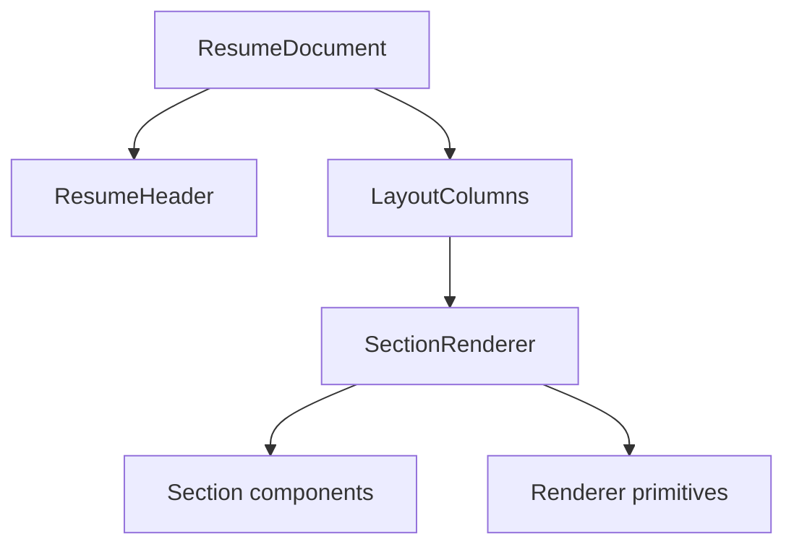

# 5. Web application and rendering

Nuxt serves the public site and the authenticated application. The resume
renderer is isolated from editor state and network code so the same input
produces the same document everywhere.

## Application surfaces

| Surface            | Route class   | Rendering model                                              |
| ------------------ | ------------- | ------------------------------------------------------------ |
| Landing and login  | `/`, `/login` | Nuxt SSR                                                     |
| Account and editor | `/app/**`     | Client application; authenticated requests never run in SSR  |
| Public resume      | `/{slug}`     | Nuxt SSR followed by client hydration and live refetch       |
| Print              | `/print/**`   | Internal Nuxt route called only by the bounded Go render job |

Authenticated fetches are client-only. A server-side fetch could rotate a
session and lose the successor cookie inside the SSR process.

## Pure renderer

The contract is `(currentDocument, renderContext) -> deterministic HTML`.
`renderContext` contains only explicit presentation input: pagination mode, the
server-normalized resume language, and an already-authorized photo URL when
needed. It never contains a store, API client, clock, random source, locale
default, or network capability. The renderer fails closed when
`currentDocument.schemaVersion` is not the generated current version. CSS custom
properties are derived once from `customization`; leaf components do not invent
their own token values.

The print browser has no general outbound network access. Fonts and renderer
assets are local. Its controller supplies an authorized photo as same-origin or
inline data and waits for every requested font and image to finish loading.

The server supplies `renderContext.lng` from the total language projection in
[the data design](data.md#relational-model). Null, empty, and invalid legacy
values become `und`; valid values use their canonical BCP 47 form. Preview,
public SSR, and internal print use that same value as the resume root's `lang`
attribute. Locale-sensitive CSS therefore never depends on the host locale.

The component tree is:

`ResumeHeader` displays visible contact details in array order. A non-empty
custom label replaces the type label. Website, LinkedIn, GitHub, and Twitter
values link only after an exact lowercase `https://` check. Email, phone,
location, and custom values are plain text in v1. Every inline link is
underlined and carries `rel="noopener noreferrer"`.
[ADR 0013](../adr/0013-contact-detail-rendering.md) owns these rules.

`LayoutColumns` reads order only from `customization.layout.sections`. In
one-column mode it renders `main` then `sidebar`, preserving all sections. No
stored content becomes invisible because a column mode changed.

## Templates

A template is data, not a component. A preset sets supported customization
values and carries a placement rule instead of literal section keys. Applying a
preset computes placement against the current document and leaves content
untouched. [ADR 0008](../adr/0008-template-apply-semantics.md) defines the
algorithm; the detailed contract lives in [templates/](templates/README.md).

V1 accepts these limits explicitly:

- The document stores no template identity.
- A preset cannot hide a present photo, hide a whole section, or globally
  suppress section icons.
- Sidebar width is renderer-owned.
- The editor warns about very small type and risky print margins; stored drafts
  remain permissive.

These require a later document version after the font-only v2 release; they are
not silent renderer exceptions.

The renderer never derives a media URL from `personalDetails.photo.key`.
Authenticated, public, and local-preview controllers pass the applicable URL in
`renderContext`; object keys remain server-side storage references. A photo URL
is required exactly when photo metadata is present. A mismatch returns a typed
render error before HTML is produced.

## Font catalog

Fonts are user choices. The catalog may include families with different script
coverage, styles, and weights; the UI states that coverage instead of claiming
that every family supports every language.

Every bundled family must meet the license gate:

- No purchase, subscription, usage charge, or per-document fee.
- Self-hosting, redistribution with the application, and embedding in generated
  PDFs are permitted. Modification is required only when the asset policy
  changes the upstream bytes.
- The exact upstream source, version or commit, license text, available styles,
  coverage label, and file hashes are committed in a manifest.
- Required attribution or license files ship with the font.

Vietnamese coverage is preferred because the initial community is Vietnamese. It
is not used to eliminate otherwise useful font choices. A bundled fallback chain
covers the declared English, Vietnamese, and renderer-punctuation set. Other
scripts remain accepted but may reach platform fonts, and the UI states that
limit. The service loads no third-party font CDN at runtime. Print waits for
every requested face and fallback to load.

The [font catalog](fonts.md) defines the exact license and provenance gate. It
expands through a dedicated, reviewed data change. Adding a family updates the
schema enum, manifest, license files, generated types, UI labels, and
representative renderer tests together.

## Rich text

Go sanitizes writes and re-sanitizes every document passed to public or internal
print SSR with the versioned allowlist. On client render paths, `RichText` runs
DOMPurify before assigning `innerHTML`. During SSR, it renders the already
Go-sanitized string and ships no Node DOM implementation. The shared hostile
corpus proves Go, client, public SSR, internal print SSR, and a real browser
surface. See
[Authentication and security](security.md#untrusted-document-content).

## Pagination and print

- Editor preview measures rendered entries and breaks at entry boundaries. It is
  approximate and visually marks pages.
- Public HTML is continuous.
- Chromium and CSS `@page` own PDF pagination.

Content, order, type, color, and visibility must agree across targets; only page
break placement may differ. If Chromium cannot fragment the supported two-column
layout deterministically, P3 is blocked until a print-specific layout with the
same content and order passes. Divergent or clipped output is not an accepted
residual risk.

Golden HTML covers every preset and both display modes against two in-memory
starting states of the `full` fixture: populated one-column and populated two-
column layouts, as ADR 0008 requires. Focused tests cover draft emptiness and
optional fields. A pinned browser, fonts, timezone, locale, and representative
screenshot subset cover visual output, including Vietnamese text.

## Freshness

Normal public HTML may remain at the edge for up to 60 seconds. Unpublish,
delete, rename, and publish-state changes request invalidation for every
affected representation. An open page also listens for SSE invalidations,
refetches uncached public JSON, and renders in place. Clients never treat an SSE
event as document data.
