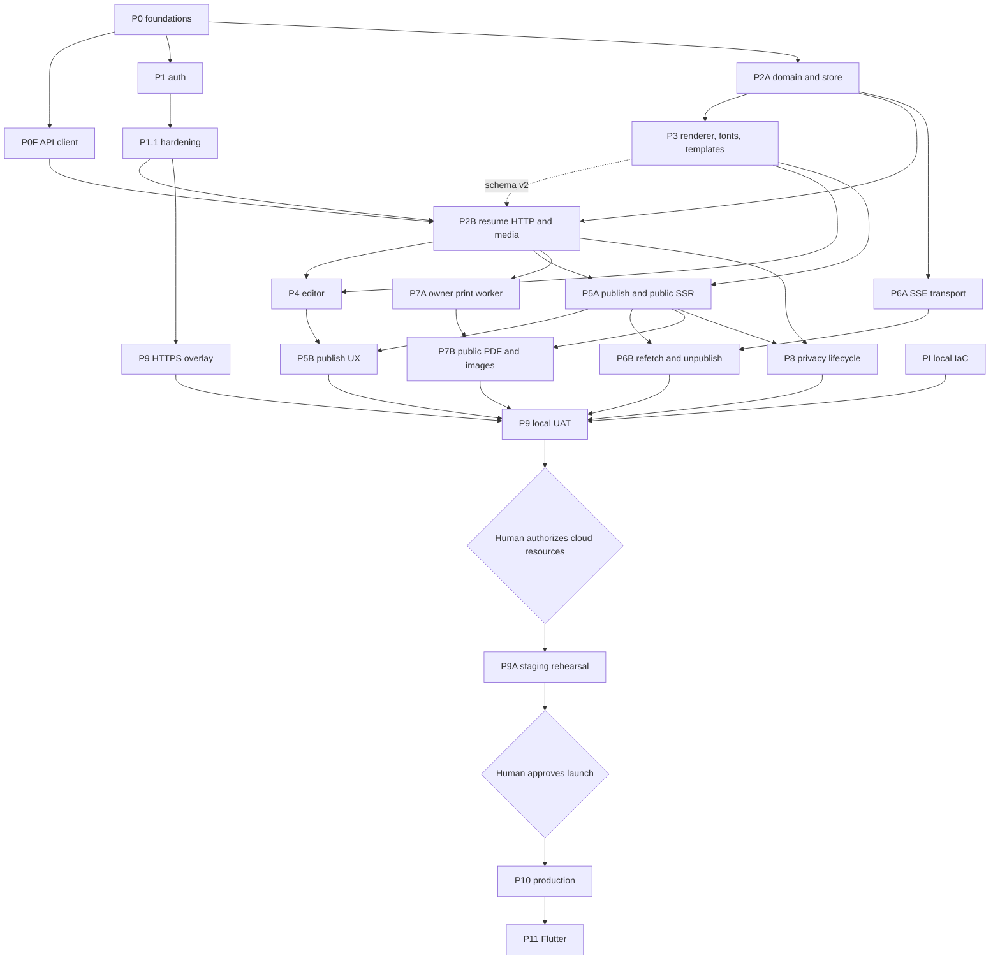

# aboutme implementation plan

Status: **Revision 12, active** (2026-08-13).

The goal is a tested v1 deployed in AWS `ap-southeast-1`. The
[design](../design/README.md) owns intended behavior; it is approved at v4. This
plan owns delivery order, task state, and gates. A plan cannot redefine the
design.

We work agile and local-first: build a working slice, review it, improve it, and
keep everything runnable on the laptop until the whole product works there.

## Current baseline

| Slice                         | State                                      | Remaining work                                  |
| ----------------------------- | ------------------------------------------ | ----------------------------------------------- |
| P0 foundations                | Complete                                   | None                                            |
| P0F TypeScript API client     | Complete                                   | None                                            |
| P1 authentication             | Complete                                   | None                                            |
| P1.1 authentication hardening | Complete                                   | None                                            |
| P2A resume domain and store   | Complete                                   | None                                            |
| P3 renderer lane              | Sanitizer and fonts landed; **active**     | Schema v2, renderer, pagination, presets        |
| P2B server lane               | T1–T11 implemented; **exit gate active**   | Fresh review, candidate CI and security scan    |
| P9 HTTPS overlay              | Needed before authenticated browser checks | Small overlay lane, pulled in when P4 starts    |
| PI infrastructure             | Adopted, not executed                      | Refresh after runtime phases; no cloud mutation |

The settings page uses authenticated CSRF-protected POST for provider linking
and reauthentication. P1.1's contract, tests, browser proof, and gates agree.

## Delivery order

Two lanes run in parallel. They own disjoint paths: the renderer lane owns
`apps/web/**` and `packages/schema/**`; the server lane owns `apps/server/**`
and `docs/api/openapi.yaml`.

| Lane          | Phase | Work                                                     |
| ------------- | ----- | -------------------------------------------------------- |
| Renderer lane | P3    | Fonts, document schema v2, renderer, pagination, presets |
| Server lane   | P2B   | Resume HTTP surface, write-safety kernel, private photos |

One sync point: P3 Task 5B releases document schema v2, after which P2B's
wire-version tasks (T9 and the version cases in T1) can close. Every other P2B
task depends only on the Go sanitizer package, which has landed. P2B does not
edit `packages/schema/**`; it consumes generated types.

After both lanes close their phase review and exit checklist:

1. P4 editor and P5A publish/public SSR, plus the P9 HTTPS overlay so
   authenticated flows can be browser-checked as they land.
2. P6 realtime, P7 print and images, P8 privacy lifecycle.
3. P9 local UAT over the complete product, then human cloud authorization, PI
   activation, P9A staging rehearsal, and P10 production.

## Remaining gates

| Gate                              | Owner                                     | Due                                        |
| --------------------------------- | ----------------------------------------- | ------------------------------------------ |
| Human authorization of cloud work | Human owner                               | After local UAT, before any AWS/DNS change |
| Product name and trademark review | Human owner                               | Before P10 production promotion            |
| Privacy and disclosure review     | Qualified privacy counsel and human owner | Before P10 production promotion            |

No other approval blocks development. Design v4, the template contract v2, and
ADRs 0001–0024 are accepted.

## Dependency graph

P8 security controls are delivered inside every route-owning phase and verified
end to end in P9 and P9A.

P3 supplies the Go sanitizer package. P2B calls it on every write. P5A
re-sanitizes the public read that feeds public SSR. P7A proves the same
conformance on the document read that feeds internal print SSR.

## Gates

[ADR 0024](../adr/0024-single-pass-delivery-gates.md) governs. Per task: the
author writes the failing test first, implements the smallest correct change,
and runs the narrowest affected checks; the adversarial cases listed in the task
file are the author's job. Per phase: one fresh reviewer reads the integrated
diff, then the integration owner runs the phase `exit-criteria.md`, `make ci`,
and connected `make scan` at one unchanged candidate commit before pushing.

Classify authentication, authorization, sessions, CSRF, concurrency, CAS,
idempotency, migrations, schema, sanitizing, publish and cache invalidation,
SSE, render and resource bounds, and secret handling as high risk. The phase
reviewer confirms those invariants by name.

## Environment

Daily work uses the native stack at `http://localhost:20080` and one shared
PostgreSQL container. `make dev` stays HTTP-only for image and network smoke
checks. Authenticated browser flows need Secure `__Host-` cookies, so they wait
for the P9 HTTPS overlay on port 443; until it exists, cover those flows with
server and component tests and say what was not browser-checked.

P9 validates complete user workflows locally and records browser, network,
console, server, and database evidence. Only after it passes may the human owner
authorize AWS, Cloudflare, certificate, DNS, image-push, or staging changes. P9A
proves production topology and the restore, rollback, alarm, origin-secret,
migration-lock, and edge-routing drills. Production promotion needs a separate
human approval.

## Phase plan index

| Phase | Plan                                                                          |
| ----- | ----------------------------------------------------------------------------- |
| P0    | Historical [P0A](phase-0a-contracts.md) and [P0B/C](phase-0bc-foundations.md) |
| P1    | Historical [P1](phase-1-auth.md); [P1.1](phase-1-deferred.md)                 |
| P2A   | [Resume domain and store](phase-2a/README.md)                                 |
| P2B   | [Resume HTTP and media](phase-2b/README.md)                                   |
| P3    | [Renderer, sanitizer, templates, and fonts](phase-3/README.md)                |
| PI    | [Infrastructure](phase-pi/README.md)                                          |
| P9    | [HTTPS overlay and local UAT](phase-9/README.md)                              |

Before dispatching a future phase, create its directory, task files, and
acceptance rows. [Traceability](traceability/README.md) owns acceptance
ownership; [`budgets.md`](budgets.md) owns numeric limits.
