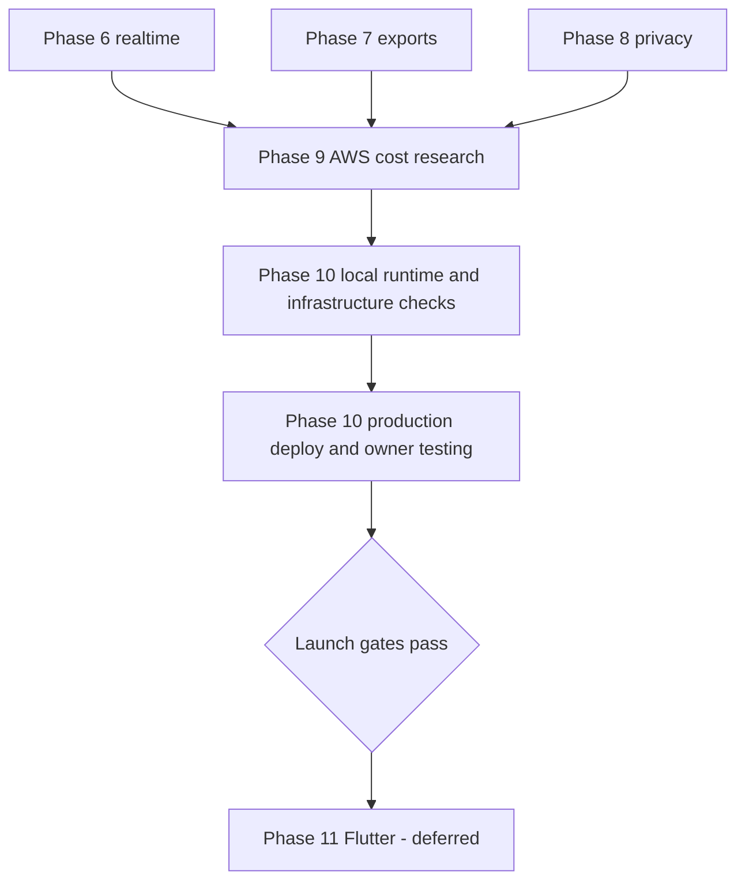

# aboutme implementation plan

Status: **Revision 41, active** (2026-09-16).

The goal is a tested v1 in production at `https://aboutme.vn`, hosted in AWS
Singapore (`ap-southeast-1`). The [design](../design/README.md) owns intended
behavior. This plan owns delivery order, phase state, and gates. A plan cannot
redefine the design: a changed decision needs an ADR first.

Features are built and verified locally. The first release then deploys straight
to production on one host, and the owner tests there, under
[ADR 0037](../adr/0037-single-host-production-without-hosted-uat.md). A separate
UAT environment returns at about 500 users.

A phase's plan lives in `phase-<number>/` while the phase is active. When the
phase exits, its plan directory is deleted; git history keeps it. What the phase
built is described by [the architecture](../architecture.md), the code, and the
[traceability rows](traceability/README.md) it proved.

## v1 release scope

Decided 2026-09-01 by the human owner:

- **v1 authentication is password-only.** Provider (OAuth) login stays in the
  code base behind a configuration flag and is disabled for v1. The entry phase
  added the flag and UI gating; the provider code and tests remain so providers
  can return without a new phase.
- **MCP agent access ships in v1.** Users bring their own agents, which build
  resumes through an authenticated MCP server over the resume API. The MCP phase
  delivered it and its native HTTPS proof.

## State

Complete and pushed: foundations, the TypeScript API client, provider
authentication and its hardening, the resume domain and store, the renderer
lane, resume HTTP and media, the authenticated editor, publish and public SSR,
password authentication, the native HTTPS development harness, and the v1 entry
experience, including MCP agent access and the owner publish UX, the application
UI toolkit, and the application visual identity.

| Phase | Work                                                                   | State                                                  |
| ----- | ---------------------------------------------------------------------- | ------------------------------------------------------ |
| 6     | [Realtime: SSE transport, refetch, unpublish](../runbooks/realtime.md) | Complete locally                                       |
| 7     | [Print worker, public PDF and images](../runbooks/exports.md)          | Complete and merged                                    |
| 8     | [Privacy lifecycle](../runbooks/privacy.md)                            | Complete and merged                                    |
| 9     | [AWS Singapore cost research](../research/aws-cost/recommendation.md)  | Complete and merged                                    |
| 10    | [Production deployment](phase-10/README.md)                            | In progress: single-host plan; no deployment performed |
| 11    | Flutter app                                                            | Deferred beyond web v1                                 |

Active phases and tasks use numbers, such as Phase 7 and task 7.1. Completed
lettered identifiers remain historical evidence and are not reassigned.

## Delivery order

1. Phase 10: close the local replica work, land the three hosted-database and
   image changes, build the infrastructure in `deploy/aws/`, deploy production,
   and test the product there.
2. Before the public announcement: restore drill, SES production access, privacy
   and name reviews.

Security controls are delivered inside every route-owning phase and verified end
to end in production. The Go sanitizer runs on every write and on the public
read that feeds public SSR and the read that feeds internal print SSR.

## Remaining gates

| Item                              | Owner                                     | Due                            |
| --------------------------------- | ----------------------------------------- | ------------------------------ |
| SES production access             | Human owner                               | Before the public announcement |
| Product name and trademark review | Human owner                               | Before the public announcement |
| Privacy and disclosure review     | Qualified privacy counsel and human owner | Before the public announcement |

ADR 0037 is the production approval. Design v4, the template contract v2, and
ADRs 0001–0037 are accepted, subject to recorded supersessions.

## Dependency graph

## Gates

[ADR 0024](../adr/0024-single-pass-delivery-gates.md) governs. Per task: the
author writes the failing test first, implements the smallest correct change,
and runs the narrowest affected checks; the adversarial cases listed in the task
file are the author's job. Per phase: one fresh reviewer reads the integrated
diff, then the integration owner runs the phase `exit-criteria.md`, `make ci`,
and connected `make scan` at one unchanged candidate commit before pushing.

Classify authentication, authorization, sessions, CSRF, concurrency, CAS,
idempotency, migrations, schema, sanitizing, publish and cache invalidation,
SSE, render and resource bounds, secret handling, and production deployment as
high risk. The phase reviewer confirms those invariants by name.

## Environment

Daily work uses the native stack at `http://localhost:20080` and one shared
PostgreSQL container. Authenticated browser checks use the native HTTPS harness
at `https://localhost:20443`; see the
[local checks runbook](../runbooks/local-uat.md). Preserve TLS, network
restrictions, and the laptop's resource limits. Run heavy gates serially.

The [single-host design](../design/single-host-production.md) owns the image
build, deploy steps, and production checks. The
[email runbook](../runbooks/email.md) records the owner's SES setup.

Before dispatching a phase, create its directory, task files, and acceptance
rows. [Traceability](traceability/README.md) owns acceptance ownership;
[`../design/budgets.md`](../design/budgets.md) owns numeric limits.
