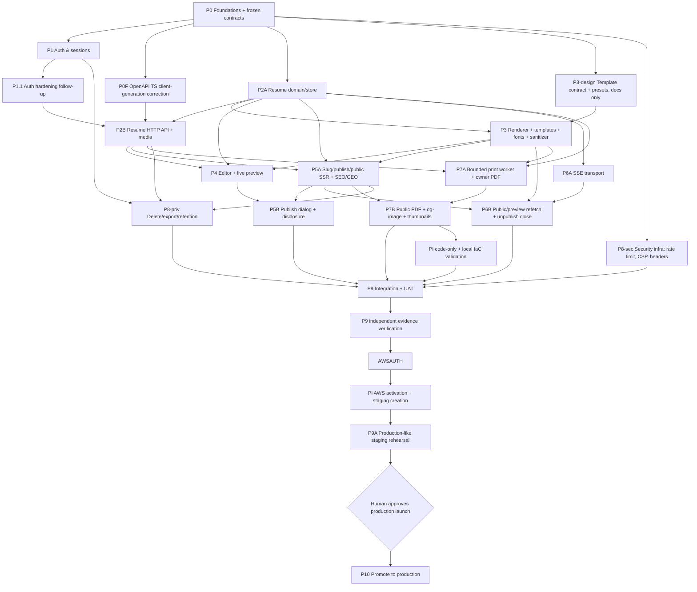

# aboutme — implementation plan (scaffold → deploy)

> **For agentic workers:** this is the **master plan**. Each phase is a vertical
> slice that produces working, tested software and is expanded into a detailed
> bite-sized TDD task plan (`docs/plans/phase-<id>-<name>.md`) via
> superpowers:writing-plans immediately before it is executed, then run with
> superpowers:subagent-driven-development. Steps track with `- [ ]`.

**Goal:** Advance aboutme from the current Phase 2A checkpoint to a deployed,
well-tested v1 on AWS ap-southeast-1.

**Architecture:** Go API + Nuxt SSR sharing one Vue renderer; Postgres jsonb
resume docs; SSE live refresh; chromedp PDF/og. Full design:
[`../specs/aboutme-design.md`](../specs/aboutme-design.md).

**Source of truth:** the spec. Where this plan and the spec disagree, the spec
wins and the plan is corrected. Status: Rev 7 (2026-08-11) — P0 and P1 are
complete; P2A is active.

Rev 7 adopts ADR 0011: delivery gates are risk-tiered, phases carry two gates
rather than five, `make ci` is the local gate of record, `gitleaks` runs per
commit while Semgrep batches to phase gates, browser checks move earlier, and
design work runs parallel to implementation. It also adopts ADR 0010: migrations
are goose-only, with `apps/server/migrations/` as the single schema source for
both goose and sqlc. Roles are named by capability, not by model or harness.

Rev 6 reserved **UAT** for user-like browser validation of a complete
deployment, run locally through Playwright MCP before any request for AWS
authorization. Earlier `uat-phase-*` names are retained as immutable history but
mean automated phase acceptance, not manual browser UAT. Rev 5 added the
numbered delivery index, restored P1.1, and recorded the P2A checkpoint. The
Tasks 1–7 checkpoint on `main` does not mark P2A complete or unlock any
dependent phase.

## Global constraints (apply to every task)

- **Versions:** latest stable at scaffold, then pinned exactly (toolchain +
  image digests). Go, Node LTS, Nuxt 4/Vue 3, Postgres 18.x, Flutter latest.
- **Style:** Google style guides (Go; Google TS via ESLint). gofmt/goimports
  mandatory. Data layer = sqlc (`pgx/v5`); migrations = hand-written goose, one
  migration dir, CI append-only. `apps/server/migrations/` is the single schema
  source for both goose and sqlc (ADR 0010) — there is no `sql/schema.sql` and
  no Atlas.
- **Security defaults:** sanitized rich text (one versioned allowlist,
  bluemonday + DOMPurify), CSRF (header + Origin), `__Host-` cookies, rate
  limits, CSP, no secrets in repo (`.env` git-ignored).
- **Quality gates:** `make ci` is the gate of record and runs locally —
  golangci-lint, govulncheck, ESLint, `vue-tsc --noEmit`, unit + integration
  tests, golden/snapshot tests, OpenAPI + schema drift, sqlc drift, migration
  harness, append-only check, route table, docs-lint. It must pass before any
  handoff. Push once per phase; GitHub Actions covers fork PRs and jobs needing
  repository secrets. `gitleaks` runs per commit via `.githooks/pre-commit`
  (`make hooks-install`); `make scan` runs connected Semgrep (SAST + Supply
  Chain SCA + secrets) plus full-history gitleaks at each phase gate.
- **Determinism (mandatory for agent-run tests):** inject clock/RNG/UUID; pin
  container + Chromium + font + timezone + locale versions; no assertion
  retries. Flaky = broken.
- **API:** everything under `/api/v1`; envelope `{data}` /
  `{error:{code,message}}`; `If-Match`/`412` + idempotency on writes; revision
  serialized as string.
- **Commit style:** small commits, Conventional Commits, no AI/agent mentions.

## Agent workflow (who does what)

Roles are named by capability, not by model or harness. Use the strongest
available reasoning for defect, adversarial, and evidence work.

**Per task — classify by risk first (ADR 0011).**

| Tier          | Applies to                                                                                                                                                                                       | Passes                                                                                                                                                                                                                                            |
| ------------- | ------------------------------------------------------------------------------------------------------------------------------------------------------------------------------------------------ | ------------------------------------------------------------------------------------------------------------------------------------------------------------------------------------------------------------------------------------------------- |
| **High risk** | auth, authorization, sessions, CSRF; concurrency, CAS, idempotency; migrations and schema; sanitizer; publish and cache invalidation; SSE; render and resource bounds; any code handling secrets | 1. Author TDD. 2. A fresh worker derives black-box, property, or fuzz tests from the spec acceptance IDs **before reading the implementation diff**. 3. A fresh reviewer reads the diff for defects; blocking findings are fixed and re-reviewed. |
| **Normal**    | everything else: UI, editor surfaces, docs, refactors, scaffolding, configuration, tooling                                                                                                       | Author TDD, then `make ci`. No second worker.                                                                                                                                                                                                     |

Ambiguous cases are classified high risk. The tier list is deliberately concrete
so that classification is a lookup rather than a judgment call.

**Per phase — two gates.**

| Gate                | Who                                                                                | Contents                                                                                                                                                                                                 |
| ------------------- | ---------------------------------------------------------------------------------- | -------------------------------------------------------------------------------------------------------------------------------------------------------------------------------------------------------- |
| Phase defect review | a fresh reviewer that authored none of the phase                                   | Defects in the phase diff, plus spec consistency, interface stability, traceability closure, and adversarial challenge of the phase's assumptions and tradeoffs — one reading, not four separate passes. |
| Phase acceptance    | a fresh worker that cannot edit product code, tests, snapshots, seeds, or criteria | Runs the immutable criteria catalog and emits the machine-readable fail-closed report defined below.                                                                                                     |

**Deployment steps.**

| Step                                  | Who                           | Rule                                                                                                                                           |
| ------------------------------------- | ----------------------------- | ---------------------------------------------------------------------------------------------------------------------------------------------- |
| P9 local manual UAT                   | main-session UAT executor     | autonomously exercises the full local Podman deployment through the project-scoped Playwright MCP server; the human owner does not execute UAT |
| P9 local-UAT evidence review          | fresh independent reviewer    | verifies the frozen report and artifacts without editing the candidate or UAT criteria                                                         |
| AWS activation and staging deployment | integration owner or delegate | only after P9 local UAT and evidence review pass and the human owner records AWS resource-creation authorization                               |
| Production promotion                  | integration owner or delegate | only after P9A passes and the human owner separately approves production launch                                                                |

Independence rule: in the high-risk tier the code author never signs off its own
correctness, and cannot weaken an adversarial test without review. Every phase
gets an independent defect review and independent fail-closed acceptance. P9 UAT
remains a separate user-workflow gate over the complete deployed application.

Before accepting any worker's result, re-run its key claim and read the diff. A
worker's report states what was attempted; it is not a review.

### Acceptance and UAT terminology

- **Automated phase acceptance** proves a bounded implementation slice. Legacy
  `uat-phase-*` catalogs and completed `UAT` records keep their filenames and
  verdicts, but they are interpreted this way.
- **Local manual UAT** means the main-session UAT executor operates the product
  like a user through Playwright MCP against the full Podman Compose deployment
  at `http://localhost:8080`. It is not delegated to the human owner and is not
  a substitute for scripted Playwright E2E tests.
- **Staging rehearsal** reruns applicable UAT scenarios and infrastructure
  drills on AWS only after the human owner authorizes AWS resource creation.

## Integration discipline (all-agent, parallel execution)

- **P0 freezes the contracts** (JSON Schema, OpenAPI, route table, config env,
  ports). A contract change afterwards is a dedicated reviewed commit +
  regeneration — never a side effect.
- **Isolated worktrees per phase**; declared file ownership; migrations,
  snapshots, and lockfiles serialized through one integration owner.
- **One schema-head change merges at a time**; later work rebases and re-runs
  the migration harness.
- Each phase plan states: base commit, spec clauses + acceptance IDs it
  implements, and the migration head it targets. The phase defect review rejects
  a phase plan with unresolved traceability rows.

## Testing strategy (pyramid + gates)

| Layer                      | Tooling                                                                                                                                                                          | Owner             | Gate              |
| -------------------------- | -------------------------------------------------------------------------------------------------------------------------------------------------------------------------------- | ----------------- | ----------------- |
| Unit                       | Go `testing` (table-driven); Vitest                                                                                                                                              | author, TDD       | per task          |
| Integration                | Go `httptest` plus the explicit podman-managed Postgres test database and fail-closed live-DB helper                                                                             | author            | per task          |
| Contract                   | OpenAPI examples validated and linted now; generated TS client compile + drift correction in P0F                                                                                 | P0/P0F            | CI                |
| Migration                  | empty→head, prev-release→head, concurrent advisory-lock, partial-failure recovery                                                                                                | P0                | CI                |
| Write-safety/concurrency   | If-Match matrix, idempotency replay/reject/rollback, CAS-vs-autosave races                                                                                                       | P2A               | CI + soak         |
| Security                   | OAuth replay/mix-up/expiry, CSRF matrix, XSS hostile corpus (bluemonday+DOMPurify+SSR+real browser), spoofed-header rate limits                                                  | P1/P3/P5          | CI                |
| Renderer golden            | SSR string snapshots (fixtures × templates × pagination modes)                                                                                                                   | P3                | CI diff = review  |
| Visual regression          | Playwright screenshot diff per template on a standalone renderer harness in P3 (pinned browser image/platform + fonts); `/print` itself is P7A's artifact and is diffed from P7B | P3/P7             | CI                |
| Resource bounds            | chromedp in production cgroup: 512 MiB, bounded queue, kill-on-timeout, readiness-on-saturation, no outbound                                                                     | P7A               | CI + P9A          |
| E2E                        | Playwright full flows                                                                                                                                                            | P4+               | per phase from P5 |
| Accessibility              | axe + keyboard-nav on editor + public page                                                                                                                                       | P4/P5             | per phase + P9    |
| Automated phase acceptance | Fresh worker, immutable catalog, machine-readable evidence                                                                                                                       | fresh worker      | phase gate        |
| Local manual UAT           | Main-session UAT executor through project-scoped Playwright MCP against the complete Podman deployment                                                                           | integration owner | P9                |
| Staging rehearsal          | Applicable browser UAT plus production-like infrastructure and operations checks                                                                                                 | integration owner | P9A               |
| Ops drills                 | real RDS restore, SSE soak under proxy, deploy/rollback, EIP recovery, secret rotation, alarm-fires-and-received                                                                 | P9A               | pre-deploy        |

Coverage target: ≥80% lines on Go domain packages and web composables/stores;
renderer covered by golden snapshots. Coverage is necessary, not sufficient —
the automated phase-acceptance catalog and later local UAT are both required.
**Numeric budgets** (API p95 latency, memory, render queue depth, pgx pool
ceiling, SSE connections/fd) are defined in P0 and enforced in P7A/P9A.

### Automated phase-acceptance report contract (fail-closed)

Each run records the commit, exact commands, timestamps, state changes, retry
count, and one expected/observed/**PASS|FAIL|BLOCKED** row per frozen criterion.
Evidence is appropriate to the slice: command output, test reports, database
queries, logs, or browser artifacts when a browser surface exists. `BLOCKED`
counts as failure. Missing evidence or undisclosed retries fails the gate.

### Local-UAT report contract (fail-closed)

P9 records the exact commit, image IDs, migration head, configuration names
without values, Podman/Chrome/Playwright-MCP versions, commands, timestamps, and
state changes. Each frozen scenario links its expected and observed result to
accessibility snapshots, screenshots, trace or video, console and network
evidence, request IDs, relevant server logs, and database verification where
needed. `BLOCKED` counts as failure; missing evidence, undisclosed retries, or
unexplained console/server errors fails the gate. Mock providers and fake users
make local auth deterministic. Real-provider smoke is staging-only.

## Phase graph

**P3-design runs in parallel with P2A and P2B.** It depends only on the frozen
document contract, so the template system contract (`docs/specs/templates/`) and
the committed presets in `packages/schema/templates/` are authored while the
store and API phases are built. P3 itself stays serialized behind P2A because it
contests `packages/schema/scripts/generate.mjs`, `packages/schema/gen/**`,
`packages/schema/test/gen.test.ts`, and `apps/server/go.{mod,sum}`. Design work
is docs and data, not code, so it contests nothing.

Security infra (P8-sec) starts at P0 as middleware; each route adds its policy
in its owning phase. **PI code-only work starts after P7B** so the runtime shape
is settled, and completes before the P9 candidate is frozen. No AWS or
Cloudflare mutation occurs until P9 local UAT and independent evidence
verification pass and the human owner authorizes AWS resource creation. PI then
activates staging for P9A; P10 only promotes. P0 executes as three review units:
**P0A** contracts/budgets/mobile → **P0B**
server/data/migrations/security-middleware → **P0C** web/dev-stack/fixtures/CI.

---

## Numbered delivery index

These step numbers are the owner-facing navigation order; they do not rename
phase IDs. A row containing several phases is a parallel delivery wave once its
incoming edges in the phase graph are satisfied. P8-sec continues inside every
route-owning phase rather than appearing as a one-time step.

| Step | Phase or wave                   | State                          | Completion / next gate                                                                                                            |
| ---- | ------------------------------- | ------------------------------ | --------------------------------------------------------------------------------------------------------------------------------- |
| 01   | P0 foundations                  | **Complete** ✅                | P0A/P0B/P0C merged; all five phase gates passed                                                                                   |
| 02   | P1 auth and sessions            | **Complete** ✅                | Merged; four exit gates passed                                                                                                    |
| 03   | P2A resume domain/store         | **Current on `main`** ▶        | Reviewed Tasks 1–7 checkpoint integrated; Tasks 2b, 6a/6b, 8–12, independent suites, and phase gates remain                       |
| 04   | P0F + P1.1 + P3 preflight/build | **Next**                       | After P2A: add missing OpenAPI TS client generation; close auth follow-ups; resolve P3 contracts, refresh its base, then build it |
| 05   | P2B resume HTTP API/media       | **Waiting on 03 + P0F + P1.1** | Authenticated CRUD, write-safety HTTP contract, granular saves, and media                                                         |
| 06   | P4 + P5A + P6A + P7A            | **Parallel feature wave**      | Editor, publish/public SSR, SSE transport, and bounded owner print worker after their graph dependencies                          |
| 07   | P5B + P6B + P7B + P8-priv       | **Parallel closure wave**      | Publish UX/disclosure, live refetch, public render artifacts, and privacy lifecycle                                               |
| 08   | PI code-only infrastructure     | **Deferred until after P7B**   | Refresh and validate IaC locally with mock providers; no AWS or Cloudflare mutation                                               |
| 09   | P9 local manual UAT             | **Waiting on 08**              | Main-session UAT executor validates the full Podman deployment through Playwright MCP                                             |
| 10   | P9 evidence verification        | **Waiting on 09**              | Fresh independent reviewer verifies artifacts and reruns a deterministic subset                                                   |
| 11   | Human AWS authorization         | **Waiting on 08 + 10**         | Human authorizes resource creation, credentials, naming, DNS scope, and staging spend; the human does not run UAT                 |
| 12   | PI AWS activation + P9A         | **Waiting on 11**              | Create staging, then prove the production-like topology and real operations drills                                                |
| 13   | Human production approval       | **Waiting on 12**              | Separate go/no-go for public production launch                                                                                    |
| 14   | P10 production promotion        | **Waiting on 13**              | Promote staging-proven images/migrations; no new infrastructure authored here                                                     |
| 15   | P11 Flutter                     | **Post-launch**                | Mobile client against the versioned API                                                                                           |

### Current decision and quality blockers

1. P2A Tasks 1–7 plus the title/lint/callback/TTL/CAS corrections are committed
   on `main` and independently reviewed. Execute Task 2b, Tasks 6a/6b and 8–12,
   and every phase gate before declaring P2A complete or starting P2B.
2. The design document still says `DRAFT v3`, while older narrative text calls
   it approved/frozen. The design owner must explicitly approve/freeze it or
   keep it draft; accepted ADRs remain authoritative for their individual
   decisions either way.
3. P0 claimed generated OpenAPI TypeScript client drift/compile coverage, but
   only OpenAPI lint and conformance tests exist. P0F must add the pinned
   generator, committed path/schema types, typed transport, request/response
   proof, compile proof, and drift gate before P2B.
4. P1.1 missed its intended pre-P2A window. It needs no migration, so it now
   runs immediately after P2A and blocks P2B rather than being silently lost.
5. Before P3 dispatch, resolve its two spec/plan disagreements (SSR sanitizer
   authority and contact ordering), replace missing companion-note references
   with committed authority, and refresh its base/shared-file inventory.
6. Traceability is not yet one-row-per-normative-statement despite the target
   claim below. At minimum mobile, template thumbnails, cache invalidation,
   publish disclosure, media/avatar upload, and audit retention still need
   acceptance rows during their owning phase-plan refresh; no affected phase may
   dispatch with those rows absent.

---

## Phase status (kept current by the integration owner)

| Phase                  | State                                             | Notes                                                                                                                                                                                                                                                                                                                                                                                                                                                                                                                                                                                                                                                                                                                                                                                                                                                                                                                                              |
| ---------------------- | ------------------------------------------------- | -------------------------------------------------------------------------------------------------------------------------------------------------------------------------------------------------------------------------------------------------------------------------------------------------------------------------------------------------------------------------------------------------------------------------------------------------------------------------------------------------------------------------------------------------------------------------------------------------------------------------------------------------------------------------------------------------------------------------------------------------------------------------------------------------------------------------------------------------------------------------------------------------------------------------------------------------- |
| P0A contracts          | **Implemented, with P0F correction queued**       | Schema (draft-permissive, schema-derived codegen, conformance + hostile corpus), OpenAPI lint/conformance, budgets, traceability. The audit found generated OpenAPI TS client/drift tooling was never implemented; P0F closes that gap before P2B                                                                                                                                                                                                                                                                                                                                                                                                                                                                                                                                                                                                                                                                                                  |
| P0F API client tooling | **Queued; must precede P2B**                      | Pin OpenAPI TypeScript generation and typed transport, commit generated types, prove a request/response contract plus web compilation, and add a non-mutating drift check; no HTTP contract change                                                                                                                                                                                                                                                                                                                                                                                                                                                                                                                                                                                                                                                                                                                                                 |
| P0B server + data      | **Implemented**                                   | Go skeleton, rate-limit/security/cache middleware, sqlc + Atlas + goose, 4-scenario migration harness                                                                                                                                                                                                                                                                                                                                                                                                                                                                                                                                                                                                                                                                                                                                                                                                                                              |
| P0C web + stack        | **Implemented**                                   | Nuxt 4 SSR, podman stack with migration service, full route table, client-IP trust boundary                                                                                                                                                                                                                                                                                                                                                                                                                                                                                                                                                                                                                                                                                                                                                                                                                                                        |
| **P0 exit gate**       | **5 of 5 passed** ✅ · **merged**                 | Design review ✅ · adversarial review ✅ · traceability closure ✅ · independent fail-closed automated phase acceptance ✅ · Opus 5 evidence verification ✅ — the historical report retains its `UAT` label. Corroborated at pre-squash pin `4e3a2b9` (local ledger `.superpowers/sdd/phase-0bc/gate-verification-final.txt`; not in public history). Merged to `main` as squashed public initial commit `9382c86` (2026-08-02); full gate suite re-run green at `9382c86`                                                                                                                                                                                                                                                                                                                                                                                                                                                                        |
| PI infrastructure      | **Plan adopted; execution deferred to after P7B** | Two Opus review rounds applied; traceability rows AC-INF-001…008 + AC-OPS-015…019 ratified. Resequenced 2026-08-02: PI blocks only P9A, and building it before the runtime shape is settled (S3 media in P2B, the print worker's cgroup in P7A, SSE timeouts in P6A) would mean building it twice while paying for idle staging. Needs a refresh pass at execution time. Human-owner escalations (spend, credentials, naming) deferred with it                                                                                                                                                                                                                                                                                                                                                                                                                                                                                                     |
| P1 auth                | **4 of 4 exit gates passed** ✅ · **merged**      | Google/GitHub/LinkedIn OIDC+OAuth2 login, session lifecycle with FK-tracked rotation lineage, fail-closed CSRF, `/me` + session device management, explicit linking with email-merge rejection, web login/session pages. Six independent blind adversarial suites (AC-AUTH-001…005, AC-SEC-002); schema head `00003_add_sessions_rotated_from`; decisions DD-C1…DD-C17 recorded in the phase plan's appendix. Gates: whole-branch review ✅ (2 blocking findings fixed) · adversarial review ✅ (PROCEED WITH CHANGES; follow-ups scoped in `phase-1-deferred.md`) · independent fail-closed automated phase acceptance ✅ (historical `UAT` run 1 FAIL found a real gate-command defect; run 2 16/16 PASS at `2d17f77`) · Opus evidence verification ✅ (both runs; UPHELD WITH CORRECTIONS, corrections applied to future runs). Merged to `main` as `ad357d3` (2026-08-02). Deferred follow-ups are preserved as P1.1 and must close before P2B |
| P1.1 auth follow-up    | **Queued; must precede P2B**                      | Missed its intended pre-P2A window. Owns auth-route limits, opportunistic OAuth-transaction reaping, CSRF-protected link/reauth start, typed auth-funnel reasons, and the rotation single-delivery reliability fix; see `phase-1-deferred.md`                                                                                                                                                                                                                                                                                                                                                                                                                                                                                                                                                                                                                                                                                                      |
| P2A resume store       | **Executing on `main`** (checkpoint integrated)   | Owner-directed checkpoint `5805ddc` integrates independently reviewed Tasks 1–7, including title/lint and callback/TTL/CAS-convergence corrections. Task 2b, Tasks 6a/6b and 8–12, independent suites, and all phase gates remain; this partial integration is not phase completion and does not unlock P2B                                                                                                                                                                                                                                                                                                                                                                                                                                                                                                                                                                                                                                        |
| P3 renderer            | **Queued behind P2A; refresh required**           | Plan `phase-3/` was adopted with ADR 0008 and serialized behind P2A because `packages/schema/scripts/generate.mjs`, `packages/schema/gen/**`, `packages/schema/test/gen.test.ts`, and `apps/server/go.{mod,sum}` are contested. Before dispatch, reconcile SSR sanitizer authority and contact ordering with the design/ADRs, remove missing companion-note dependencies, correct stale traceability prose, and refresh the base/shared-file inventory                                                                                                                                                                                                                                                                                                                                                                                                                                                                                             |

Both exit-gate reviews returned no-ship on first run; every finding was applied
to the spec and implemented. The corrected contract is recorded in
`../specs/aboutme-design.md` and ADRs 0004–0007.

## Phase 0 — Foundations & frozen contracts

Executes as three sequential review units — **P0A** (0.1, 0.1b, 0.8, 0.11) →
**P0B** (0.2, 0.3, 0.3b, 0.6) → **P0C** (0.4, 0.5, 0.7, 0.10) — each with its
own Opus 5 review; P0A's contracts are frozen before P0B starts.

**Original exit contract:** `make dev` brings up the podman stack on one origin;
`/healthz` + `/readyz` green; web renders a page; `packages/schema` generates
committed Go/TS types; `docs/api/openapi.yaml` is linted, tested, and generates
a committed TypeScript client (Dart is P11); rate-limit middleware,
deterministic test factories, and numeric budgets exist; all CI jobs green on
the empty slice. The 2026-08-03 audit found the OpenAPI
client-generation/compile/drift part was never implemented. Historical P0 gate
evidence remains unchanged; P0F below is the blocking corrective task.

| Task                                 | Files                                                              | Deliverable / test                                                                                                                                                     |
| ------------------------------------ | ------------------------------------------------------------------ | ---------------------------------------------------------------------------------------------------------------------------------------------------------------------- |
| 0.1 schema contract                  | `packages/schema/resume.schema.json`, `gen/{go,ts}/`, generator    | doc shape + sanitizer-allowlist version; codegen committed; CI drift check (Dart in P11)                                                                               |
| 0.1b OpenAPI contract                | `docs/api/openapi.yaml`, client-gen                                | Contract/lint/conformance complete; generated TS client compile/drift was missed and is recovered by P0F                                                               |
| 0.2 Go server skeleton               | `apps/server/{go.mod,cmd/server,internal/{config,store,api}}`      | pgx pool; `/healthz` (liveness) + `/readyz` (DB, no restart-loop); error envelope; slog; unit+httptest                                                                 |
| 0.3 sqlc+Atlas+goose                 | `apps/server/{sql/schema.sql,sqlc.yaml,cmd/migrate}`, Make targets | `make generate`/`migrate-gen`/`migrate`; CI append-only check                                                                                                          |
| 0.3b migration harness               | `apps/server/migrations/*_test.go`                                 | empty→head, prev→head, concurrent advisory-lock, partial-failure recovery                                                                                              |
| 0.4 Nuxt skeleton                    | `apps/web/**`                                                      | SSR page; ESLint(Google-TS)+vue-tsc+one Vitest green                                                                                                                   |
| 0.5 dev stack                        | `deploy/{compose.yml,caddy/Caddyfile,*.Dockerfile}`                | one-origin routing mirrors prod; `make dev`/`dev-down`                                                                                                                 |
| 0.6 rate-limit + security middleware | `apps/server/internal/api/middleware/`                             | reusable rate-limit + security-headers/CSP scaffolding (policies added per route later)                                                                                |
| 0.7 test factories + fixtures        | `apps/server/internal/testutil`, `apps/web/test/factories`         | deterministic seed + reset command used by all later tests/UAT                                                                                                         |
| 0.8 numeric budgets                  | `docs/plans/budgets.md`                                            | p95 latency, memory, render queue, pgx pool, SSE conn/fd targets (enforced P7A/P9A)                                                                                    |
| 0.10 CI completion                   | `.github/workflows/ci.yml`                                         | server/web/schema/openapi/migration/semgrep/data-drift/route-table/docs jobs green                                                                                     |
| 0.11 traceability matrix             | `docs/plans/traceability/`                                         | **row per normative spec statement** with a stable acceptance ID (`AC-<area>-<nnn>`) → owning phase/task → test/UAT reference; seeded in P0A, kept current every phase |

---

## Phase 0F — OpenAPI TypeScript client-generation correction

**Status:** queued in delivery step 04 and a hard predecessor of P2B. This is a
correction to the P0 tooling gate, not a change to the existing HTTP contract.

**Acceptance:** AC-API-001.

**Exit:** a pinned generator produces a committed, versioned TypeScript API
surface from `docs/api/openapi.yaml`; a pinned typed transport turns that
surface into the Nuxt app's real API client and a mocked request/response
contract test proves it; `make api-check` fails on generated drift without
modifying the worktree; and a fresh independent review confirms the artifact,
client, and gate cannot silently diverge.

1. **0F.1 — Prove the gap first.** Add a failing contract/tooling test that
   requires the expected generated file and a Nuxt compile-time import. Observe
   failure before adding the generator or artifact.
2. **0F.2 — Pin and generate.** Pin the latest stable `openapi-typescript` at
   execution time exactly in the root tooling manifest and pin `openapi-fetch`
   exactly in the web package. Add `make api-gen`, wire it into `.PHONY` and the
   canonical `make generate` target, and commit
   `apps/web/app/api/generated/openapi.ts` plus a small
   `apps/web/app/api/client.ts` typed-client factory. A regression check must
   fail if `api-gen` is later omitted from `generate`.
3. **0F.3 — Make drift fail closed.** Extend `make api-check` with a script that
   creates a directory via `mktemp -d`, traps its removal, generates to a file
   there, and byte-compares it with the committed artifact. It must never
   regenerate the tracked output in place, must leave dirty/shared worktrees
   untouched, and must retain the current Redocly and Vitest checks.
4. **0F.4 — Prove the client at the consumer.** With an injected mock fetch,
   exercise a representative generated path through the typed client and assert
   its method/path, envelope decoding, and error type; keep compile-time request
   and response assertions beside it. Run
   `make api-check web-typecheck web-test web-build`.
5. **0F.5 — Review and integrate.** Run an independent defect review, fix and
   freshly re-review any blocker, then update current documentation/evidence.
   P2B cannot start until this exit is green.

---

## Phase PI — Infrastructure as code (code-only after P7B; AWS after P9)

**Why before P9A:** P9A's staging gate can only exist if the infrastructure
exists first. PI code and mock-provider validation run after P7B and complete
before the P9 candidate freeze. Real AWS activation starts only after P9 local
UAT and evidence verification pass and the human owner authorizes resource
creation. PI then **builds** staging; P9A **exercises** it; P10 **promotes**.

> **Sequencing corrected 2026-08-02 (owner decision).** Rev 3 scheduled PI to
> start immediately after P0. That was a hedge against late-deployment risk, and
> it was wrong: PI blocks nothing except P9A, which sits after the whole product
> is built and integration-tested. Starting it now would burn spend on an idle
> staging environment for months, and would build the modules against a runtime
> shape that is not settled — P2B adds S3 media, P7A adds the chromedp worker
> with a hard 512 MiB cgroup and no outbound network, P6A adds long-lived SSE
> connections with their own origin timeouts. Each would force a rewrite. **PI
> code-only work now executes after P7B**, when the runtime shape is known. The
> adopted plan (`phase-pi/`) needs a refresh pass at dispatch. Bootstrap apply,
> ECR push, AWS/Cloudflare mutation, DNS mutation, staging apply, and
> deployment-workflow dispatch remain locked until P9 passes, its evidence is
> independently verified, and the human owner records AWS authorization. Local
> development and P9 use Podman and need no cloud account.

**BLOCKING (from the Phase 0 security review):** the production Caddy config
**must** derive the viewer address from CloudFront's validated inbound chain
after verifying `X-Origin-Secret`, and send exactly one canonical header. The
dev Caddyfile sets `X-Real-IP` to the immediate peer — correct in dev, where the
peer _is_ the viewer, but behind CloudFront that is the **edge**. Promoting the
dev config unchanged would recreate the cross-tenant denial of service (one
attacker exhausting the bucket shared by every viewer behind an edge). PI must
ship a production Caddy configuration and an end-to-end test with two viewers
through one simulated edge plus forged forwarding headers.

**Exit:** Terraform modules apply cleanly to a staging environment: VPC, ECS on
EC2 Graviton (host networking for the edge/API tier — web tier bridge-mode per
PI D24 — fixed ports per P0 contract), RDS Postgres (gp3), S3 (media),
CloudFront + ACM (us-east-1) with the **cookie/cache/origin behavior matrix**
from spec §6, Caddy origin `origin.aboutme.vn` (DNS-01 via Cloudflare), EIP +
auto-reassociation, origin-secret + prefix-list ingress, **SSM secrets (IAM
scoping + rotation)**, **CloudWatch alarms + dashboards + SNS/on-call**,
scheduled retention + RDS restore-verification jobs (overlap-locked, alarmed),
arm64 (Graviton) image build + ECS deploy pipeline with drain→readiness,
migration advisory-lock sequence. `terraform validate`/`plan` in CI; modules are
environment-parameterized so staging and production differ only by variables.

---

## Phase 1 — Auth & sessions

**Exit:** sign in with Google/GitHub/LinkedIn; `__Host-` session; `/me` returns
user + CSRF token; **session list + per-session revoke + logout-everywhere +
`Clear-Site-Data`**; explicit provider-linking (recent-reauth); no-email
LinkedIn rejected. Phase acceptance: all providers login/logout, link, revoke a
device.

Tasks: users/identities/sessions migrations; OAuth core (`x/oauth2` +
`coreos/go-oidc/v3`), server-side transaction store + `__Host-oauth-tx`, PKCE
S256, state, OIDC nonce (Google/LinkedIn only), iss/audience checks, GitHub
distinct callback (no OIDC checks); session issue + **atomic rotation >24h with
grace interval**, sha256 hash, idle-30d/absolute-90d; CSRF middleware (token in
`/me` body, exact Origin, fail-closed); session-device list + revoke + logout-
everywhere + `Clear-Site-Data`; explicit cross-provider link with reauth; web
login/session pages. Adversarial (independent agent, spec-derived): OAuth
replay/mix-up/expiry, concurrent rotation, CSRF matrix, **email-merge
rejection** across all providers (verified-email negatives),
no-provider-token-persistence invariant.

---

## Phase 1.1 — Auth hardening follow-up

**Exit:** the bounded follow-up in [`phase-1-deferred.md`](phase-1-deferred.md)
is implemented, independently reviewed, and covered by the affected server/web
gates before P2B adds more authenticated mutation paths. It requires no schema
head change and may run in parallel with P3 once P2A is integrated.

Scope: route-specific auth limits; opportunistic expiry reaping for
`oauth_transactions`; CSRF-protected `POST` start for link/reauth; typed funnel
reason constants; and the session-rotation single-delivery reliability fix.
P8-priv still owns dead-session retention, the scheduled/global sweep, and audit
retention; it does not duplicate P1.1's request-path transaction reaping.

---

## Phase 2A — Resume domain & store

**Exit:** store layer + migrations for resumes/slug_tombstones with all
constraints/trigger; title ≤160 Unicode-code-point enforcement in DB and store;
validated invariants; write-safety + doc-migration primitives; immutable v1
schema and retained versioned Go/TS types; declared accepted/emitted versions;
and bidirectional adjacent conversion with synthetic old-client preparation and
emission — all covered against the explicit podman-managed test Postgres.

Tasks: resumes table + `slug_tombstones` + constraints + 3-resume trigger; sqlc
queries; store invariants (entry-id uniqueness whole-resume, date-range rules,
cleared-contact draft round-trip, **all size bounds with limit+1 tests**);
revision CAS + convergent idempotency store; mechanically restricted generated
write methods; **doc-migration backfill = projection-only on read, CAS on write,
with CAS-vs-autosave race tests**; immutable schema/type registry plus
bidirectional converters.

> **Carried from Phase 0 (drift-gate limitation), superseded by ADR 0010:** the
> P0 data-drift gate originally only failed _closed_ on undiffable object
> classes (`CREATE TRIGGER|FUNCTION|VIEW|SEQUENCE`) because Atlas community
> silently dropped them from a diff, and closing that gap for the 3-resume
> trigger would have meant extending the keyword-reject in
> `apps/server/cmd/migrate/gen/main.go` (invoked by
> `scripts/check-data-drift.sh`) into a real cross-check. **ADR 0010
> (2026-08-11) removed that whole mechanism**: `sql/schema.sql`,
> `cmd/migrate/gen`, `migrations/atlas.sum`, and `scripts/check-data-drift.sh`
> are deleted, and `apps/server/migrations/` is now the single schema source for
> both goose and sqlc, with `make sqlc-check` as the only drift gate. The
> 3-resume trigger landed as hand-written DDL in migration
> `00005_add_resume_cap_trigger.sql`, reviewed under ADR 0011's high-risk tier
> (migrations and schema) rather than through the retired Atlas cross-check.

## Phase 2B — Resume HTTP API + media

**Exit:** authenticated CRUD (≤3, DB-enforced); granular PATCH (entry/section/
personal-details/customization deltas) with If-Match/412 + idempotency + size
bounds; AC-SAVE-004 old-version accept→project→full-current-document persist and
declared-version emit over the real HTTP/OpenAPI surface; **avatar/photo upload
API → storage** (per-resume photo per spec §3/§5). Phase acceptance:
create/edit/delete via API; 4th resume rejected; concurrent-write 412;
idempotent replay; old-client write/emit; oversized payload rejected.

Tasks: each endpoint TDD + integration; media upload endpoint + storage
abstraction (local in dev, S3 in prod) — this covers the **per-resume photo**;
the account-level `users.avatar_key` is populated from the OAuth profile fetch
in P1 (no separate upload); **write-safety matrix** (missing/malformed/stale
If-Match; idempotency replay/reject/rollback; 412 returns current doc); 3-resume
race test (`FOR UPDATE` + trigger).

---

## Phase 3 — Renderer, templates, fonts, sanitizer (after P2A)

**Exit:** pure Vue renderer → deterministic HTML across sections × templates ×
**both pagination modes** (editor approximate vs continuous public); golden
snapshots committed; **self-hosted VN-diacritic fonts** load offline
deterministically; sanitizer enforced both sides against a shared hostile
corpus. Phase acceptance: render every template; verify golden snapshots,
screenshot diffs, and hostile-corpus neutralization.

Tasks: sanitizer allowlist module (shared w/ bluemonday config) + **versioned
hostile corpus** run through bluemonday+DOMPurify+SSR+real browser + CSP
conformance; `useResumeStyles` (CSS vars); `components/resume/*`; pagination
modes; self-hosted font assets + `document.fonts.ready`; template JSON presets +
apply; golden harness; editor→renderer one-way import lint rule.

**Thumbnails are NOT here** (they need the print worker): P3 owns only a
standalone Playwright screenshot harness for its own visual-regression tests;
production template thumbnails are generated in **P7B** via the real print
pipeline.

---

## Phase 4 — Editor with live preview & autosave client

**Exit:** instant zero-network preview; debounced coalesced PATCH; retry queue +
idempotency + 412 rebase; customize panel; ProseMirror sanitized; **core a11y
(semantics/keyboard/contrast)**. Phase acceptance: full edit session,
offline/reconnect, conflict rebase, unsaved indicator, axe + keyboard pass.

Tasks: Pinia doc store (single source of truth); `useAutosave` (debounce,
coalesce, queue, idempotency, 412); `useApi`; editor forms + ProseMirror;
customize panel; component + store tests; a11y tests.

---

## Phase 5A — Slug, publish, public SSR + SEO/GEO

**Exit:** slug service (global-unique, reserved-root corpus, tombstones,
rate-limited, advisory-lock reclaim); public SSR `/[slug]` + JSON-LD +
OG/Twitter + canonical; `/{slug}.md`, sitemap, robots, llms.txt honor toggles;
`X-Robots-Tag: noindex` when SEO off; **cache-invalidation abstraction
enumerating all surfaces** (old+new HTML, .md, og, public PDF, sitemap, llms).
Phase acceptance: publish/unpublish/rename; crawler-visible HTML + headers +
robots correct; schema.org validates.

## Phase 5B — Publish dialog + disclosure

**Exit:** publish dialog drives the 3-toggle state matrix with **explicit
defaults** and **CDN/crawler disclosure wording** (spec §6). Phase acceptance:
each toggle combination yields correct availability; disclosure copy asserted
present.

---

## Phase 6A — SSE transport

**Exit:** SSE over `LISTEN/NOTIFY` fan-out; heartbeat; **connection caps + fd
budget + slow-client eviction + restart behavior**; reconnect always refetches
(NOTIFY non-durable). CI stress within P0 budgets.

## Phase 6B — Public/preview refetch + unpublish

**Exit:** open public/preview tab auto-refreshes on save; conditional-polling
fallback; **stream closes immediately on unpublish**. Phase acceptance: two-tab
refresh; kill stream → polling; unpublish closes stream.

---

## Phase 7A — Bounded print worker + owner PDF

**Exit:** chromedp bounded per spec §2 proven **in the production cgroup** (512
MiB, 1 concurrent, kill-on-timeout, readiness-on-saturation, **no outbound
network**); `/print` internal-only + single-audience token; owner PDF export
matches web layout. Phase acceptance: export PDF; saturation → readiness
unhealthy; outbound blocked.

## Phase 7B — Public PDF + og-image + template thumbnails

**Exit:** public PDF gated by `download_enabled` (else 404); og-image 1200×630;
**template thumbnails generated at build time through the real print pipeline**
(moved here from P3 — the print worker only exists from P7A). Phase acceptance:
gating correct; og-image valid; every template has a current thumbnail.

---

## Phase 8-sec — Security infrastructure (starts at P0)

Per-route rate-limit policies (spoofed-header-resistant), CSP/HSTS/security
headers, origin-secret handling. Delivered incrementally in each owning phase;
verified end-to-end in P9/P9A.

## Phase 8-priv — Privacy lifecycle

**Exit:** `DELETE /me` (recent reauth) purges account+resumes+media+sessions +
tombstones + invalidation; `GET /me/export` full bundle; **audit retention
(180d) + session ip/ua redaction + orphan-media sweep** as idempotent jobs
(overlap-locked); metrics + audit events emitted. Phase acceptance: delete →
public pages 404 + data gone; export complete.

---

## Phase 9 — Main-session local manual UAT (functional gate)

Detailed execution authority: [`phase-9-local-uat.md`](phase-9-local-uat.md).

**Role boundary:** the main-session UAT executor autonomously performs user-like
browser UAT on this laptop against the complete image-based Podman Compose
deployment at `http://localhost:8080`, using the project-scoped Playwright MCP
server. The human owner does not execute UAT. Scripted Playwright E2E,
accessibility, and all automated development/phase gates must already be green.

**Exit:** every frozen scenario below is `PASS` with a fail-closed report and
complete evidence; a fresh independent reviewer verifies the artifacts and
reruns a deterministic subset. `FAIL`, `BLOCKED`, missing evidence, unavailable
MCP tooling, or changed product code keeps the gate closed. The integration
owner preserves failure evidence, delegates diagnosis to a fresh agent rather
than guessing, implements reviewed fixes with TDD, recreates the local
deployment, and reruns every affected scenario.

Local UAT catalog (each item → an acceptance ID + evidence):

1. Auth: each provider login/logout; link second provider; **email-merge
   rejected**; device list + per-session revoke + logout-everywhere.
2. Resumes: create 3, 4th rejected; edit all section types; rich text sanitized;
   every size bound rejects at limit+1.
3. Autosave: rapid edits coalesce; offline queue; concurrent-tab 412 rebase;
   idempotent replay.
4. Publish matrix: every toggle combo → correct HTML/headers/robots/md/pdf;
   unpublish 404s + closes SSE; disclosure copy present.
5. SEO/GEO: JSON-LD valid, sitemap/llms correct, canonical + og-image present.
6. Realtime: second tab refreshes; fallback ladder; unpublish closes stream.
7. PDF matches preview; public PDF gating correct; og-image valid.
8. Account delete purges everything; export complete.
9. Security: CSRF blocked cross-origin; XSS corpus neutralized; rate limits bite
   under spoofed headers.
10. A11y: axe clean + keyboard-only edit and publish.

Only after this UAT and its independent evidence review pass does the
integration owner ask the human owner to authorize AWS resource creation. P9
performs no AWS or Cloudflare mutation.

## Human AWS resource-creation authorization checkpoint

After the integration owner reports the exact P9 candidate and independent
evidence verdict, the human owner decides whether the integration owner may
create or change AWS/Cloudflare resources for staging. Until that authorization
is recorded, bootstrap apply, ECR push, ACM/DNS mutation, staging apply, and
deployment-workflow dispatch are forbidden. The human owner reviews the evidence
and deployment scope; the human owner does not run UAT. A later production
launch still needs its own approval.

## Phase 9A — Production-like staging rehearsal (pre-deploy gate)

**Precondition:** the human owner has recorded AWS resource-creation
authorization after P9 and its evidence review passed. That authorization is not
production-launch approval.

**Exit (the staging deploy gate):** the **same Terraform modules and ARM64 image
digests** intended for production are deployed to a staging environment; the
integration owner reruns applicable browser UAT and the ops drills pass there.
Gate on: CloudFront behavior matrix (cookie/cache/origin per spec §6);
origin-bypass rejection + secret rotation; SSE heartbeat/reconnect **through
CloudFront**; chromedp under production cgroup; **two-runner advisory-lock
migration**; **real RDS snapshot restore** into an isolated instance; EIP
recovery; drain/deploy/rollback; **each critical alarm deliberately triggered
and receipt proven**; CloudFront→Caddy→app→DB synthetic check. No promotion to
P10 until this report is green.

---

## Human production launch checkpoint (between P9A and P10)

A separate human go/no-go decision — it cannot waive a failed technical gate,
and it is not the earlier AWS resource-creation authorization. It is required
before public DNS cutover for naming/trademark resolution (spec §10 open item),
CDN/crawler disclosure wording sign-off, production credentials, DNS cutover
timing, and production spend.

## Phase 10 — Promote to production (AWS ap-southeast-1)

**Exit:** the **staging-proven image + migration digests** are promoted to
production behind CloudFront at aboutme.vn; post-deploy smoke green; rollback
rehearsed. Deployed by the integration owner or a delegate.

Infrastructure is **built in PI and proven in P9A** — P10 does not author new
Terraform. Tasks: apply PI modules with production variables; promote the exact
image digest; run the migration advisory-lock sequence; Cloudflare DNS cutover
via `cf` (grey-cloud); post-deploy smoke (CloudFront→Caddy→app→DB synthetic,
publish/unpublish round trip); confirm alarms/dashboards live; **AGPL release
verification**; publish the rollback runbook entry.

---

## Phase 11 — Mobile (Flutter) — after deployment

Owner decision (2026-08-01): mobile compilation and release move **after** the
web v1 deploy. P11 generates Dart resume types from `resume.schema.json` and the
AC-API-002 Dart API client from `docs/api/openapi.yaml`, with committed
artifacts and drift/compile gates. It scaffolds the Flutter app, implements the
OAuth authorization-code flow with PKCE deep linking and bearer access/refresh
tokens (the contract reserved in spec §1), and adds the Dart CI job. Nothing in
P0–P10 depends on it.

---

## Spec traceability (standing artifact — kept current every phase)

`docs/plans/traceability/` (created in task 0.11) is the standing mapping from
normative statements to owning phase/task, acceptance ID, and evidence. A phase
plan is rejected if its own rows are absent or unresolved. The matrix is **not
yet complete across future phases**: mobile client (P11), template thumbnails
(P7B), cache-invalidation surfaces (P5A), disclosure wording (P5B), media/avatar
upload (P2B), and audit retention (P8-priv) are named ownership gaps whose rows
must be minted during each plan's refresh, before dispatch. Session device
management is already AC-AUTH-005; doc-migration/wire compatibility is
AC-DOC-010/012; pagination/fonts are AC-REN-002/003. Infrastructure rows were
ratified at Phase PI plan adoption: AC-INF-001…008 (PI — production client-IP
boundary, CloudFront behavior matrix as code, env parity, secret scoping, alarm
inventory, scheduled jobs, plus the PI-originated staging access gate and
staging noindex controls per PI decision D25) and AC-OPS-015…019 (P9A — live
CloudFront matrix, origin-secret rotation drill, live two-runner migration, real
restore, alarm receipt); live origin-bypass rejection remains AC-OPS-002 (P9A).

## Deferred (documented, not v1-blocking)

- i18n beyond preserving the `lng` field (document the boundary).
- Renovate automation (post-launch is fine; deps still pinned + osv-scanned).
- CONTRIBUTING/issue templates polish (near P10).
