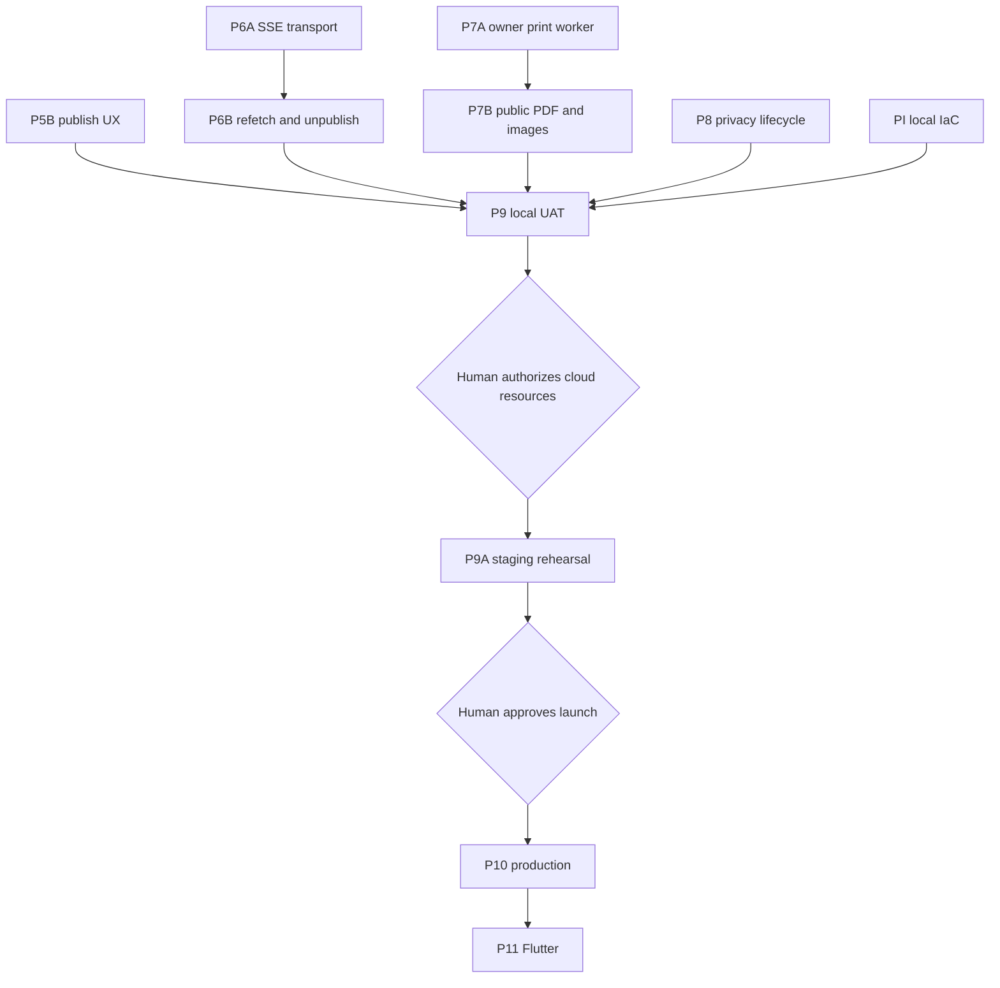

# aboutme implementation plan

Status: **Revision 25, active** (2026-09-03).

The goal is a tested v1 deployed in AWS `ap-southeast-1`. The
[design](../design/README.md) owns intended behavior and is approved at v4. This
plan owns delivery order, phase state, and gates. A plan cannot redefine the
design: a phase that changes a decision amends the Approved v4 text and records
an ADR first.

We work agile and local-first: build a working slice, review it, improve it, and
keep everything runnable on the laptop until the whole product works there.

A phase's plan lives in `phase-<id>/` while the phase is active. When the phase
exits, its plan directory is deleted; git history keeps it. What the phase built
is described by [the architecture](../architecture.md), the code, and the
[traceability rows](traceability/README.md) it proved.

## v1 release scope

Decided 2026-09-01 by the human owner:

- **v1 authentication is password-only.** Provider (OAuth) login stays in the
  code base behind a configuration flag and is disabled for v1. Phase PF added
  the flag and UI gating; the provider code and tests remain so providers can
  return without a new phase.
- **MCP agent access ships in v1.** Users bring their own agents, which build
  resumes through an authenticated MCP server over the resume API. Phase PM
  delivered it and its native HTTPS proof.

## State

Complete and pushed: foundations, the TypeScript API client, provider
authentication and its hardening, the resume domain and store, the renderer
lane, resume HTTP and media, the authenticated editor, publish and public SSR,
password authentication, the native HTTPS development harness, and the v1 entry
experience, including MCP agent access.

| Phase | Work                                        | State                                           |
| ----- | ------------------------------------------- | ----------------------------------------------- |
| P5B   | [Publish UX](phase-5b/README.md)            | Plan active                                     |
| P6    | Realtime: SSE transport, refetch, unpublish | Not started                                     |
| P7    | Print worker, public PDF and images         | Not started                                     |
| P8    | Privacy lifecycle                           | Not started                                     |
| P9    | [Local UAT](phase-9/README.md)              | Harness complete; isolated port-443 UAT remains |
| PI    | [Infrastructure](phase-pi/README.md)        | Adopted, not executed; no cloud mutation        |

## Delivery order

1. P5B publish UX and P6 realtime.
2. P7 print and images, and P8 privacy lifecycle.
3. P9 local UAT over the complete product, then human cloud authorization, PI
   activation, P9A staging rehearsal, and P10 production.

Security controls are delivered inside every route-owning phase and verified end
to end in P9 and P9A. The Go sanitizer runs on every write and on the public
read that feeds public SSR; P7 proves the same conformance on the read that
feeds internal print SSR.

## Remaining gates

| Gate                              | Owner                                     | Due                                        |
| --------------------------------- | ----------------------------------------- | ------------------------------------------ |
| Human authorization of cloud work | Human owner                               | After local UAT, before any AWS/DNS change |
| Product name and trademark review | Human owner                               | Before P10 production promotion            |
| Privacy and disclosure review     | Qualified privacy counsel and human owner | Before P10 production promotion            |

No other approval blocks development. Design v4, the template contract v2, and
ADRs 0001–0028 are accepted.

## Dependency graph

## Gates

[ADR 0024](../adr/0024-single-pass-delivery-gates.md) governs. Per task: the
author writes the failing test first, implements the smallest correct change,
and runs the narrowest affected checks; the adversarial cases listed in the task
file are the author's job. Per phase: one fresh reviewer reads the integrated
diff, then the integration owner runs the phase `exit-criteria.md`, `make ci`,
and connected `make scan` at one unchanged candidate commit before pushing.

Classify authentication, authorization, sessions, CSRF, concurrency, CAS,
idempotency, migrations, schema, sanitizing, publish and cache invalidation,
SSE, render and resource bounds, and secret handling as high risk. The phase
reviewer confirms those invariants by name.

## Environment

Daily work uses the native stack at `http://localhost:20080` and one shared
PostgreSQL container. Authenticated browser checks use the native HTTPS harness
at `https://localhost:20443`; see the
[local UAT runbook](../runbooks/local-uat.md). Neither may bypass TLS or the
external-request firewall. The isolated port-443 whole-product UAT belongs to
P9.

P9 validates complete user workflows locally and records browser, network,
console, server, and database evidence. Only after it passes may the human owner
authorize AWS, Cloudflare, certificate, DNS, image-push, or staging changes. P9A
proves production topology and the restore, rollback, alarm, origin-secret,
migration-lock, and edge-routing drills. Production promotion needs a separate
human approval.

Before dispatching a phase, create its directory, task files, and acceptance
rows. [Traceability](traceability/README.md) owns acceptance ownership;
[`../design/budgets.md`](../design/budgets.md) owns numeric limits.
