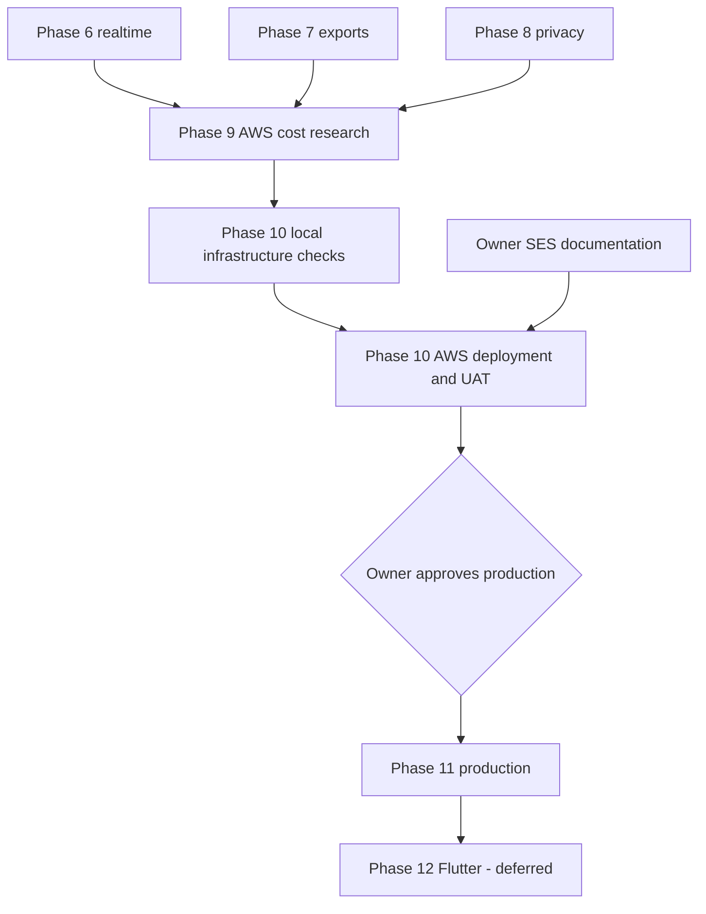

# aboutme implementation plan

Status: **Revision 32, active** (2026-09-05).

The goal is a tested v1 deployed in AWS Singapore (`ap-southeast-1`). The
[design](../design/README.md) owns intended behavior and is approved at v4. This
plan owns delivery order, phase state, and gates. A plan cannot redefine the
design: a phase that changes a decision amends the Approved v4 text and records
an ADR first.

We build and verify features locally. Complete user acceptance testing (UAT)
runs in AWS at `https://uat.aboutme.vn`, under
[ADR 0031](../adr/0031-aws-cost-research-and-hosted-uat.md).

Use OpenTofu for infrastructure and prefer managed AWS services. Phase 9
compares their cost, workload fit, and operating effort before selecting sizes.
Deployment code will live in a separate private `aboutme-infra` repository. This
is future planning; the next implementation work is Phase 7, then Phase 8.

A phase's plan lives in `phase-<number>/` while the phase is active. When the
phase exits, its plan directory is deleted; git history keeps it. What the phase
built is described by [the architecture](../architecture.md), the code, and the
[traceability rows](traceability/README.md) it proved.

## v1 release scope

Decided 2026-09-01 by the human owner:

- **v1 authentication is password-only.** Provider (OAuth) login stays in the
  code base behind a configuration flag and is disabled for v1. The entry phase
  added the flag and UI gating; the provider code and tests remain so providers
  can return without a new phase.
- **MCP agent access ships in v1.** Users bring their own agents, which build
  resumes through an authenticated MCP server over the resume API. The MCP phase
  delivered it and its native HTTPS proof.

## State

Complete and pushed: foundations, the TypeScript API client, provider
authentication and its hardening, the resume domain and store, the renderer
lane, resume HTTP and media, the authenticated editor, publish and public SSR,
password authentication, the native HTTPS development harness, and the v1 entry
experience, including MCP agent access and the owner publish UX, the application
UI toolkit, and the application visual identity.

| Phase | Work                                                                   | State                                                  |
| ----- | ---------------------------------------------------------------------- | ------------------------------------------------------ |
| 6     | [Realtime: SSE transport, refetch, unpublish](../runbooks/realtime.md) | Complete locally                                       |
| 7     | [Print worker, public PDF and images](phase-7/README.md)               | Active: contracts and bounded queue                    |
| 8     | Privacy lifecycle                                                      | Not started                                            |
| 9     | [AWS Singapore cost research](phase-9/README.md)                       | Planned; research not run                              |
| 10    | [Infrastructure and AWS UAT](phase-10/README.md)                       | Planned; UAT scope authorized; no deployment performed |
| 11    | Production promotion                                                   | After Phase 10 and separate launch approval            |
| 12    | Flutter app                                                            | Deferred beyond web v1                                 |

Active phases and tasks use numbers, such as Phase 7 and task 7.1. Completed
lettered identifiers remain historical evidence and are not reassigned.

## Delivery order

1. Phase 7: task 7.1 owner print worker, then 7.2 public PDF and images; Phase 8
   privacy lifecycle.
2. Phase 9 cost research using the completed runtime's resource measurements.
   Read-only pricing research may start earlier; final sizing uses those
   results.
3. Phase 10: refresh infrastructure contracts from Phase 9, build and check them
   locally, deploy AWS UAT, then run complete workflows and operational drills.
4. Phase 11 production promotion after its legal and launch gates.

Security controls are delivered inside every route-owning phase and verified end
to end in Phase 10. The Go sanitizer runs on every write and on the public read
that feeds public SSR; task 7.1 proves the same conformance on the read that
feeds internal print SSR.

## Remaining gates

| Item                                                      | Owner                                     | State or due                                                                                               |
| --------------------------------------------------------- | ----------------------------------------- | ---------------------------------------------------------------------------------------------------------- |
| AWS UAT in Singapore; Cloudflare DNS for `uat.aboutme.vn` | Human owner                               | Authorized 2026-09-05; scope in ADR 0031                                                                   |
| Sizes, cost assumptions, UAT lifetime and spending limit  | Phase 9 and human owner                   | Before Phase 10 activation; no amount approved yet                                                         |
| SES application integration                               | Phase 10                                  | [Email runbook](../runbooks/email.md) available; sandbox, runtime IAM and controlled stack adoption remain |
| Product name and trademark review                         | Human owner                               | Before Phase 11 promotion                                                                                  |
| Privacy and disclosure review                             | Qualified privacy counsel and human owner | Before Phase 11 promotion                                                                                  |
| Production launch authorization                           | Human owner                               | After Phase 10 passes                                                                                      |

No other approval blocks development. Design v4, the template contract v2, and
ADRs 0001–0032 are accepted, subject to recorded supersessions.

## Dependency graph

## Gates

[ADR 0024](../adr/0024-single-pass-delivery-gates.md) governs. Per task: the
author writes the failing test first, implements the smallest correct change,
and runs the narrowest affected checks; the adversarial cases listed in the task
file are the author's job. Per phase: one fresh reviewer reads the integrated
diff, then the integration owner runs the phase `exit-criteria.md`, `make ci`,
and connected `make scan` at one unchanged candidate commit before pushing.

Classify authentication, authorization, sessions, CSRF, concurrency, CAS,
idempotency, migrations, schema, sanitizing, publish and cache invalidation,
SSE, render and resource bounds, and secret handling as high risk. The phase
reviewer confirms those invariants by name.

## Environment

Daily work uses the native stack at `http://localhost:20080` and one shared
PostgreSQL container. Authenticated browser checks use the native HTTPS harness
at `https://localhost:20443`; see the
[local checks runbook](../runbooks/local-uat.md). Preserve TLS, network
restrictions, and the laptop's resource limits. Run heavy gates serially.

GitHub Actions builds deployment images natively on `ubuntu-24.04-arm` for
`linux/arm64`. The existing AMD64 browser baseline gate stays on AMD64. Tasks
10.8 and 10.13 cover native image smoke checks and workflow checks; task 10.12
deploys the tested digests without a rebuild. The private `aboutme-infra` build
minutes and storage are part of task 9.1's cost model. See the
[build contract](phase-10/infrastructure/contracts.md#build-and-runner-contract).

Phase 10 uses `https://uat.aboutme.vn`, Cloudflare DNS, and AWS Singapore. It
proves complete workflows, SES delivery, edge routing, restore, rollback,
alarms, origin-secret rotation, and concurrent migration safety. It replaces the
separate local port-443 UAT and staging rehearsal. Its local infrastructure
checkpoint precedes activation; completed UAT is not a provisioning
prerequisite.

The [email runbook](../runbooks/email.md) records the owner's SES setup. Phase
10 consumes that handoff and inventories existing resources before adding
missing integration. Production promotion needs separate human approval after
Phase 10 passes.

Before dispatching a phase, create its directory, task files, and acceptance
rows. [Traceability](traceability/README.md) owns acceptance ownership;
[`../design/budgets.md`](../design/budgets.md) owns numeric limits.
