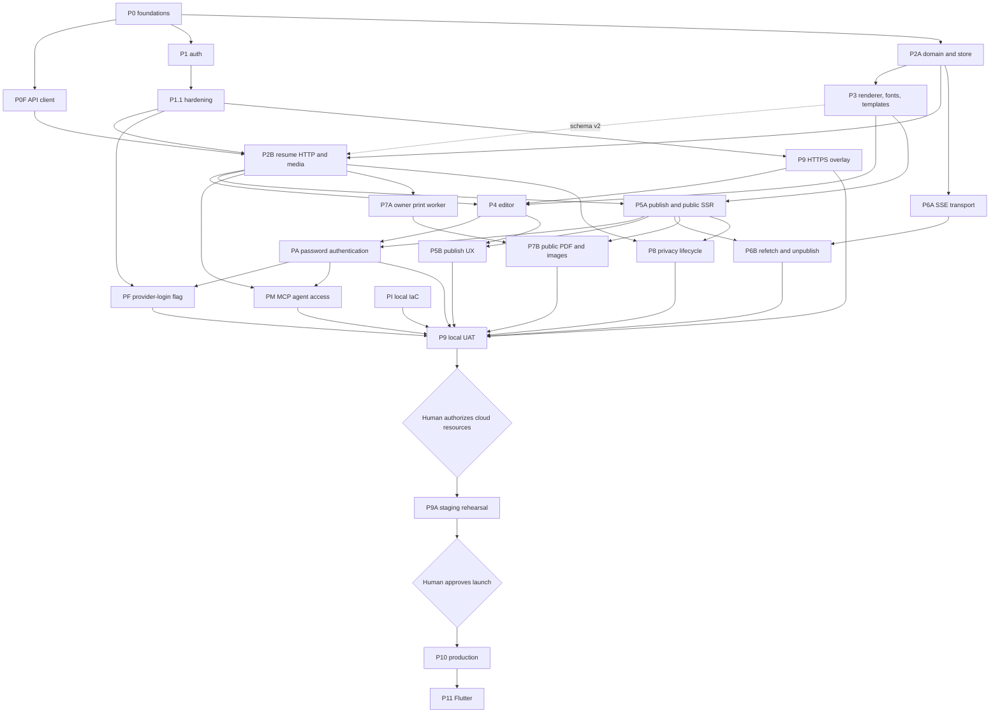

# aboutme implementation plan

Status: **Revision 19, active** (2026-09-01).

The goal is a tested v1 deployed in AWS `ap-southeast-1`. The
[design](../design/README.md) owns intended behavior; it is approved at v4. This
plan owns delivery order, task state, and gates. A plan cannot redefine the
design.

We work agile and local-first: build a working slice, review it, improve it, and
keep everything runnable on the laptop until the whole product works there.

## v1 release scope

Decided 2026-09-01 by the human owner:

- **v1 authentication is password-only.** Provider (OAuth) login stays in the
  code base behind a configuration flag and is disabled for v1. Phase PF owns
  the flag and UI gating; the P1 provider code and tests remain so providers can
  return without a new phase.
- **MCP agent access ships in v1.** Users bring their own agents, which build
  resumes through an authenticated MCP server over the resume API. Phase PM owns
  it and blocks P9 local UAT.

A plan cannot redefine the design: each phase's T00 amends the Approved v4 text
and records the decision as an ADR, following the PA/ADR 0025 pattern.

## Current baseline

| Slice                         | State                           | Remaining work                                    |
| ----------------------------- | ------------------------------- | ------------------------------------------------- |
| P0 foundations                | Complete                        | None                                              |
| P0F TypeScript API client     | Complete                        | None                                              |
| P1 authentication             | Complete                        | None                                              |
| P1.1 authentication hardening | Complete                        | None                                              |
| P2A resume domain and store   | Complete                        | None                                              |
| P3 renderer lane              | Complete                        | None                                              |
| P2B server lane               | Complete                        | None                                              |
| P4 authenticated editor       | Complete                        | None                                              |
| P5A publish and public SSR    | Complete                        | None                                              |
| PA password authentication    | Complete                        | None                                              |
| PF provider-login flag        | Not started                     | ADR, design amendment, config flag, UI gating     |
| PM MCP agent access           | Planned                         | Plan approved; dispatch T00 (ADR, roots, budgets) |
| P9 native HTTPS harness       | Complete for development checks | Full isolated port-443 UAT remains later          |
| PI infrastructure             | Adopted, not executed           | Refresh after runtime phases; no cloud mutation   |

The settings page uses authenticated CSRF-protected POST for provider linking
and reauthentication. P1.1's contract, tests, browser proof, and gates agree.

## Delivery order

P3, P2B, P4, and P5A are complete. The two lanes below closed their phase
reviews and definitive exit gates:

| Lane        | Phase | Work                                                        |
| ----------- | ----- | ----------------------------------------------------------- |
| Editor      | P4    | Authenticated editor, autosave, conflicts, private photos   |
| Public read | P5A   | Publish state, revocation, public artifacts, and public SSR |

The lanes consume the same released document schema and renderer but own
different implementation paths. Root manifests, generated contracts, Caddy,
native harness scripts, migrations, and shared traceability indexes use the
serialized integration-owner windows named by their phase plans. Full gates run
once per phase, never concurrently.

Shared-path windows use this total order across both phase graphs:

1. P4 Task 00 lands the authenticated cache/validator prerequisite, editor
   dependencies, and its generated-client baseline.
2. P5A Task 00 lands render topology, generated public-root routing, and native
   harness parity on that baseline.
3. P5A Tasks 01 and 04 run the migration/sqlc and OpenAPI/client owner windows,
   in that order, before P4 transport work or public route authors consume the
   generated interfaces.
4. The P5A Task 09 manifest/lock/Nuxt owner subwindow runs after P4 Task 00 and
   before either phase starts its final browser window.
5. P4 Task 15 owns the first final native-HTTPS harness window. P5A Task 12
   follows with the native-public capture window and must preserve the P4
   scenario.

No worker edits a shared path during these windows. The integration owner
finishes and verifies one window before opening the next. Disjoint phase tasks
may continue in parallel between them.

After both lanes close their phase review and exit checklist:

1. PA password authentication — complete (local encrypted mail/capture UAT
   proven).
2. PF provider-login flag — small; its ADR and design amendment land first, and
   the flag may land any time before P9.
3. P5B publish UX and P6 realtime.
4. PM MCP agent access — design pass (ADR, agent credential model, tool surface,
   rate bounds) before task planning; implementation runs as its own lane beside
   P5B/P6/P7/P8.
5. P7 print and images and P8 privacy lifecycle.
6. P9 local UAT over the complete product, then human cloud authorization, PI
   activation, P9A staging rehearsal, and P10 production.

## Remaining gates

| Gate                              | Owner                                     | Due                                        |
| --------------------------------- | ----------------------------------------- | ------------------------------------------ |
| Human authorization of cloud work | Human owner                               | After local UAT, before any AWS/DNS change |
| Product name and trademark review | Human owner                               | Before P10 production promotion            |
| Privacy and disclosure review     | Qualified privacy counsel and human owner | Before P10 production promotion            |

No other approval blocks development. Design v4, the template contract v2, and
ADRs 0001–0024 are accepted.

## Dependency graph

P8 security controls are delivered inside every route-owning phase and verified
end to end in P9 and P9A.

P3 supplies the Go sanitizer package. P2B calls it on every write. P5A
re-sanitizes the public read that feeds public SSR. P7A proves the same
conformance on the document read that feeds internal print SSR.

## Gates

[ADR 0024](../adr/0024-single-pass-delivery-gates.md) governs. Per task: the
author writes the failing test first, implements the smallest correct change,
and runs the narrowest affected checks; the adversarial cases listed in the task
file are the author's job. Per phase: one fresh reviewer reads the integrated
diff, then the integration owner runs the phase `exit-criteria.md`, `make ci`,
and connected `make scan` at one unchanged candidate commit before pushing.

Classify authentication, authorization, sessions, CSRF, concurrency, CAS,
idempotency, migrations, schema, sanitizing, publish and cache invalidation,
SSE, render and resource bounds, and secret handling as high risk. The phase
reviewer confirms those invariants by name.

## Environment

Daily work uses the native stack at `http://localhost:20080` and one shared
PostgreSQL container. `make dev` stays HTTP-only for image and network smoke
checks. Authenticated browser flows need Secure `__Host-` cookies. The landed
native HTTPS harness serves trusted local checks at `https://localhost:20443`;
P4 owns its editor scenario and must not bypass TLS or the external-request
firewall. P5A's unauthenticated public SSR may use the native HTTP origin. The
later P9 overlay still owns isolated port-443 whole-product UAT and is not a
P4/P5A implementation prerequisite.

P9 validates complete user workflows locally and records browser, network,
console, server, and database evidence. Only after it passes may the human owner
authorize AWS, Cloudflare, certificate, DNS, image-push, or staging changes. P9A
proves production topology and the restore, rollback, alarm, origin-secret,
migration-lock, and edge-routing drills. Production promotion needs a separate
human approval.

## Phase plan index

| Phase | Plan                                                                          |
| ----- | ----------------------------------------------------------------------------- |
| P0    | Historical [P0A](phase-0a-contracts.md) and [P0B/C](phase-0bc-foundations.md) |
| P1    | Historical [P1](phase-1-auth.md); [P1.1](phase-1-deferred.md)                 |
| P2A   | [Resume domain and store](phase-2a/README.md)                                 |
| P2B   | [Resume HTTP and media](phase-2b/README.md)                                   |
| P3    | [Renderer, sanitizer, templates, and fonts](phase-3/README.md)                |
| P4    | [Authenticated editor](phase-4/README.md)                                     |
| P5A   | [Publish and public SSR](phase-5a/README.md)                                  |
| PA    | [Password authentication](phase-pa/README.md)                                 |
| PF    | Provider-login flag — directory created at dispatch                           |
| PM    | [MCP agent access](phase-pm/README.md)                                        |
| PI    | [Infrastructure](phase-pi/README.md)                                          |
| P9    | [HTTPS overlay and local UAT](phase-9/README.md)                              |

Before dispatching a future phase, create its directory, task files, and
acceptance rows. [Traceability](traceability/README.md) owns acceptance
ownership; [`budgets.md`](budgets.md) owns numeric limits.
