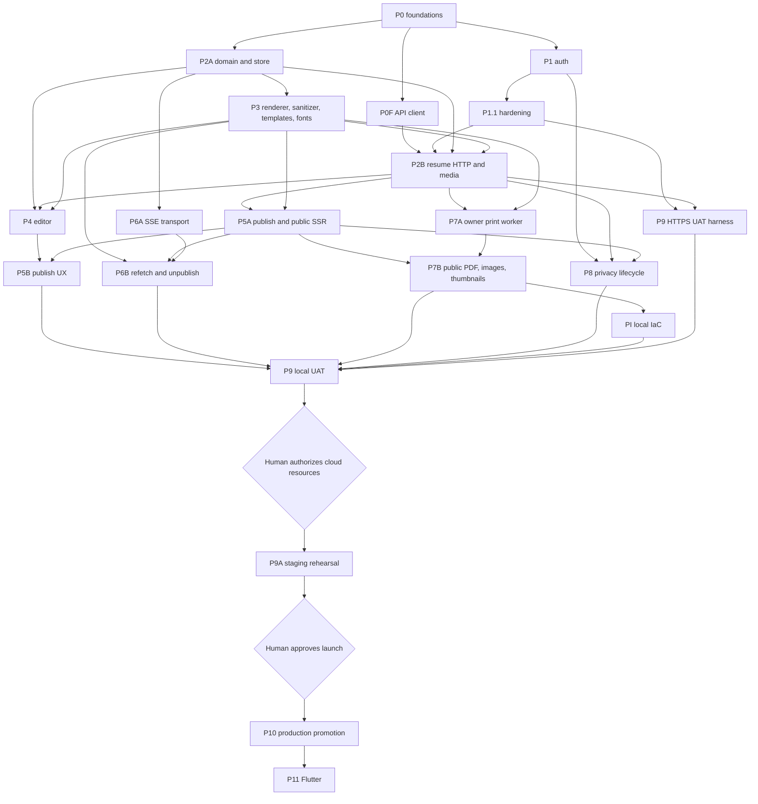

# aboutme implementation plan

Status: **Revision 9, active** (2026-08-12).

The goal is a tested v1 deployed in AWS `ap-southeast-1`. The
[design](../design/README.md) owns intended behavior. This plan owns delivery
order, task state, and gates. A plan cannot redefine the design.

## Current baseline

The status below is verified against `main` at `b230e96`.

| Slice                         | Repository state            | Work still required before closure                                      |
| ----------------------------- | --------------------------- | ----------------------------------------------------------------------- |
| P0 foundations                | Complete                    | None; historical gates remain unchanged                                 |
| P0F TypeScript API client     | Landed at `38ecfd5`         | Record correction review and acceptance evidence                        |
| P1 authentication             | Complete                    | None; historical gates remain unchanged                                 |
| P1.1 authentication hardening | Server changes landed       | Close AC-AUTH-006/007, review, and run the gate                         |
| P2A resume domain and store   | Tasks 1–11 landed           | Task 12 traceability closure, defect review, and phase acceptance       |
| P3 design and preset data     | Draft design and 20 presets | Approve contract; add licensed font catalog through schema v2           |
| P2B resume HTTP and media     | Draft plan only             | Close the dispatch blockers listed below                                |
| PI infrastructure             | Adopted plan, not executed  | Refresh after runtime phases; no cloud mutation before P9 authorization |
| P9 HTTPS UAT harness          | Exact task lane drafted     | Approve and execute U1–U10 before any local UAT run                     |

The settings page currently starts provider linking and reauthentication with
GET links. The server and OpenAPI require authenticated CSRF-protected POST. Its
default reauthentication provider also depends on an identity query whose
creation-time order lacks an `id` tiebreaker. P1.1 remains open until the UI,
query, contract prose, tests, and independent review agree.

## Immediate delivery order

1. Approve Draft v4 design and the template contract after independent design
   and plan reviews close every blocking finding.
2. Close P2A Task 12, run the phase defect review, then run immutable automated
   phase acceptance at the shipping commit.
3. Close P1.1 and P0F correction evidence. P1.1 includes the settings UI POST
   flow and its browser check.
4. Refresh P3 against the approved design and follow its dependency graph. Run
   the sanitizer and font-license lanes in parallel; vendor the final font
   catalog before releasing document v2 from its stable IDs, then run the
   renderer and template consumers.
5. Adopt and execute P2B only after P2A, P0F, P1.1, all P3 tasks, and both P3
   phase gates are closed.
6. Implement and review the isolated HTTPS UAT Compose overlay before P9. This
   harness work does not authorize a UAT verdict or any cloud mutation.

## Current blockers

| Blocker                    | Required resolution                                                                             |
| -------------------------- | ----------------------------------------------------------------------------------------------- |
| Design approval state      | Draft v4 needs explicit dated owner approval after independent reviews                          |
| Template approval state    | `docs/design/templates/` remains draft until its contract review passes                         |
| P2A evidence               | Task 12 and both phase gates remain                                                             |
| P1.1 auth/browser mismatch | Use POST for privileged starts and make identity order `(created_at, id)`                       |
| Font expansion             | Fee-free license verification, local assets, choice metadata, manifest, and immutable schema v2 |
| P2B sanitizer edge         | P3 Task 2 must land before P2B Task 5                                                           |
| P2B plan adoption          | Design-owner approval must adopt the independently reviewed plan and its fixed resource budgets |
| P9 HTTPS harness           | Execute the reviewed U1–U10 isolated HTTPS UAT Compose-overlay lane                             |

Draft v4 proposes private live-gated media for the old `/assets` question. The
proposed P2B contract also defines `Error.details`, exact photo intake and
normalization bounds, and a local S3-compatible test service. Neither is an
approved contract; dispatch still requires owner approval after independent
review.

## Dependency graph

P8 security controls are delivered inside every route-owning phase and are
verified end to end in P9 and P9A.

P3 supplies the Go sanitizer package. P5A re-sanitizes the public read that
feeds public SSR. P7A independently proves the same conformance on the document
read that feeds internal print SSR.

## Delivery index

| Step | Phase or wave                | State                        | Exit                                               |
| ---- | ---------------------------- | ---------------------------- | -------------------------------------------------- |
| 01   | P0 + P1                      | Complete                     | Historical phase evidence remains pinned           |
| 02   | P2A                          | Active                       | Task 12 and both phase gates pass                  |
| 03   | P0F + P1.1 corrections       | Landed, not closed           | Contract, UI, review, and acceptance agree         |
| 04   | P3                           | Waiting on 02 and design     | Renderer, sanitizer, fonts, and preset gates pass  |
| 05   | P2B                          | Blocked from dispatch        | HTTP and media phase gates pass                    |
| 06   | P4 + P5A + P6A + P7A         | Future parallel wave         | Each phase passes its own gates                    |
| 07   | P5B + P6B + P7B + P8 privacy | Future parallel closure wave | Product surface and lifecycle close                |
| 08   | PI local infrastructure      | Deferred                     | IaC validates locally; no external mutation        |
| 09   | P9 HTTPS UAT harness         | Draft, not executed          | U1–U10 implementation, review, and local gate pass |
| 10   | P9 local UAT                 | Waiting                      | HTTPS UAT and evidence review pass                 |
| 11   | Human cloud authorization    | Waiting                      | Exact resource scope and spend approved            |
| 12   | PI activation + P9A          | Waiting                      | Staging and real operations drills pass            |
| 13   | Human production approval    | Waiting                      | Separate public-launch approval                    |
| 14   | P10 production               | Waiting                      | Proven artifacts promoted and smoke tests pass     |
| 15   | P11 Flutter                  | Post-launch                  | Mobile contract and release gates pass             |

## Task and phase gates

Classify authentication, authorization, sessions, CSRF, concurrency, CAS,
idempotency, migrations, schema, sanitizing, publish/cache invalidation, SSE,
render/resource bounds, and secret handling as high risk.

For a high-risk task:

1. The author observes a failing test, implements the smallest change, and runs
   the affected checks.
2. A fresh worker derives black-box, property, or fuzz tests from the design and
   acceptance IDs before reading the implementation diff.
3. A different fresh reviewer inspects the diff. The author fixes blocking
   findings; an independent reviewer rechecks them.

Normal tasks use author TDD and the affected checks. The integration owner alone
runs `make ci` before integration.

Every phase has two gates:

| Gate                | Evidence                                                                                |
| ------------------- | --------------------------------------------------------------------------------------- |
| Phase defect review | Fresh review of defects, design fit, interface stability, assumptions, and traceability |
| Phase acceptance    | Fresh fail-closed run of a frozen catalog at the exact candidate commit                 |

Acceptance records the commit, commands, timestamps, state changes, retry count,
and one expected/observed/`PASS | FAIL | BLOCKED` result per criterion.
`BLOCKED`, missing evidence, or an undisclosed retry fails. A later code change
invalidates evidence for every changed path.

## Environment and deployment gates

Daily work uses the native stack at `http://localhost:20080` and the one shared
PostgreSQL container. The current `make dev` Compose stack stays HTTP-only and
is reserved for image/network smoke checks and self-hosting evaluation. P9 will
use the planned isolated HTTPS UAT Compose overlay through the future
`make uat-up` target on port 443 and the project Playwright server because
authentication uses Secure `__Host-` cookies. The `uat-*` targets do not exist
yet.

P9 validates complete user workflows and records browser, network, console,
server, and database evidence. A fresh reviewer verifies it. Only then may the
human owner authorize AWS, Cloudflare, certificate, DNS, image-push, or staging
changes. P9A proves the production topology and real restore, rollback, alarm,
origin-secret, migration-lock, and edge-routing drills. Production promotion
requires a separate human approval.

## Phase plan index

| Phase | Detailed plan                                                                 |
| ----- | ----------------------------------------------------------------------------- |
| P0    | Historical [P0A](phase-0a-contracts.md) and [P0B/C](phase-0bc-foundations.md) |
| P1    | Historical [P1](phase-1-auth.md); active [P1.1](phase-1-deferred.md)          |
| P2A   | [Resume domain and store](phase-2a/README.md)                                 |
| P2B   | [Resume HTTP and media](phase-2b/README.md)                                   |
| P3    | [Renderer, sanitizer, templates, and fonts](phase-3/README.md)                |
| PI    | [Infrastructure](phase-pi/README.md)                                          |
| P9    | [HTTPS UAT harness and local UAT](phase-9/README.md)                          |

Before dispatching a future phase without a detailed plan, create its directory
and acceptance rows. [Traceability](traceability/README.md) owns the mapping;
[`budgets.md`](budgets.md) owns numeric limits.
