# Phase 1 — Auth & sessions (implementation plan)

> **For agentic workers:** execute with superpowers:subagent-driven-development,
> one task per fresh subagent, Opus 5 review between tasks. Steps are `- [ ]`.
> Every task's tests are written **before** its implementation (TDD): write the
> failing test, run it and see it fail, implement, run it and see it pass,
> commit.

**Goal:** sign-in with Google, GitHub, and LinkedIn; server-side Postgres
sessions with a `__Host-session` cookie; CSRF protection; session device
list/revoke/logout-everywhere; explicit cross-provider account linking with **no
automatic email merge**.

**Base:** `main`, commit `9382c86` (the squashed public initial commit,
2026-08-02). The drafting-time base (`phase-0a-contracts` @ `94c95f5`) no longer
exists — Phase 0 history was squashed for the public release. The P0B task 0.3
tooling this plan depends on (`sql/schema.sql`, `sqlc.yaml`, `cmd/migrate`,
`make migrate-gen`/`migrate`) is present at this base with its gates green, so
the drafting-time blocker on Task 1, Step 1 is **resolved**. Workers must run
`git rev-parse HEAD` and confirm their worktree is at this base (or a descendant
of it) before starting; do not improvise a parallel migration mechanism.

**Spec:** `../specs/aboutme-design.md` §3 "OAuth (RFC 9700 / OAuth 2.1-aligned)"
and "Sessions (OWASP-aligned)" subsections, the `users`/`identities`/`sessions`
rows of the §3 data-model table, and the "No automatic email merge" rule.
**Master plan:** `implementation-plan.md` — "Phase 1 — Auth & sessions" (exit
criteria + task summary), "Global constraints", "Agent workflow", "Testing
strategy". **Traceability:** `traceability.md` rows `AC-AUTH-001`…`005`,
`AC-SEC-002` (the only IDs seeded for this phase — many normative statements
below have none; each task says so explicitly rather than inventing an ID).

**Existing server skeleton this plan builds on** (`apps/server/README.md`,
module `github.com/dannyota/aboutme/apps/server`, Go 1.26):

| Package              | What's already there                                                                                                                                                                                   |
| -------------------- | ------------------------------------------------------------------------------------------------------------------------------------------------------------------------------------------------------ |
| `internal/config`    | `Config` struct + `Load(getenv func(string) string) (Config, error)` / `LoadEnv()`; `PORT`, `DATABASE_URL`, `LOG_LEVEL`, `ENV`                                                                         |
| `internal/store`     | `store.Pool` (embeds `*pgxpool.Pool`), `NewPool(ctx, databaseURL)` capped at `store.MaxPoolSize` (20), context-aware `Close`                                                                           |
| `internal/api`       | `router.New(logger, pinger DBPinger, opts Options) http.Handler`; `WriteData`/`WriteError` envelope helpers; `Middleware` type; `RequestID`, `Logging`, `BodyLimit` middleware; `RequestIDFromContext` |
| `cmd/server/main.go` | wiring only: config → store → router → HTTP server, graceful shutdown                                                                                                                                  |

## Environment facts (verified 2026-08-01, re-verified 2026-08-02 at `9382c86`)

- Go 1.26.5, Node 24.18.1, podman 5.8.4 available locally.
- Postgres 18.4 (`docker.io/library/postgres:18.4-alpine`, per
  `make test-db-up`) — this matters directly: **Postgres 18 has a native
  `uuidv7()` SQL function**, used below for every new surrogate key instead of
  generating UUIDs in Go.
- Integration tests against a live Postgres use `TEST_DATABASE_URL` and are
  skipped otherwise (`internal/store/integration_test.go`'s pattern); run
  `make test-db-up` first, `make server-test-integration`, then
  `make test-db-down`. The master plan's testing-strategy table says
  "testcontainers" generically — **the repo's actual mechanism is this Makefile
  pair**, not testcontainers-go; follow the existing pattern, don't add a new
  one.
- No mocking of real Google/GitHub/LinkedIn in CI, ever (see Task 3). Real
  provider accounts are reserved for the P9A staging smoke test per the master
  plan's UAT report contract — that is out of this phase's scope.

## Global constraints (inherited, plus phase-specific)

- Latest stable, pinned exactly (`go get x@latest`, then commit the resolved
  `go.mod`/`go.sum` — do not hand-write version numbers).
- Google style guides; `gofmt`/`goimports`; table-driven tests.
- Conventional Commits; no AI/agent mentions; no trailers.
- Determinism: inject clock (a `now func() time.Time` field, defaulting to
  `time.Now`) and RNG (`crypto/rand` is fine directly, but expiry/rotation
  windows must be testable without real sleeps) into every type that has a
  timeout, expiry, or rotation window. No `time.Sleep`-based tests for
  grace-interval or expiry logic — advance an injected clock instead.
- No real network calls to `accounts.google.com`, `github.com`, or
  `linkedin.com` from any test that runs in CI (Task 3 covers the mock OIDC
  harness; Task 6 covers a stub GitHub REST server). A test that silently starts
  making real HTTP calls to a provider is a bug, not a skip candidate.
- `apps/server` must keep passing
  `go build ./... && go vet ./... && go test ./...` after every task.
- `make docs-fmt` before committing any `.md` this plan's execution touches.

## Design decisions this plan makes beyond the spec

The spec (§3) states the OAuth/session **policy** precisely but leaves several
**mechanisms** unspecified. Rather than leaving TODOs, this plan makes an
explicit call for each and flags it so Fable/Opus 5 can challenge it in review
instead of discovering it mid-implementation:

| #   | Gap in the spec                                                                                                                                                                                      | Decision made here                                                                                                                                                                       |
| --- | ---------------------------------------------------------------------------------------------------------------------------------------------------------------------------------------------------- | ---------------------------------------------------------------------------------------------------------------------------------------------------------------------------------------- |
| 1   | `sessions` table lists 9 columns; none of them can express "old token still valid for a grace window after rotation" without conflating it with explicit revocation                                  | Add **one** column beyond the spec's list: `rotation_grace_until timestamptz NULL`, orthogonal to `revoked_at` (Task 1, Task 7)                                                          |
| 2   | Spec doesn't say how "recent reauthentication" (required for linking, unlink, delete, logout-everywhere) is tracked                                                                                  | Add `sessions.reauthenticated_at`; sensitive ops require `now() - reauthenticated_at ≤ 15 min`; a step-up OAuth flow (`purpose=reauth`) refreshes it (Task 7, Task 10)                   |
| 3   | Spec doesn't say whether the `__Host-oauth-tx` handle is hashed at rest like the session token                                                                                                       | Yes — it's a bearer credential (Task 2). `state` itself is stored in cleartext: it's a correlator already visible in the redirect URL, not an independent secret                         |
| 4   | Spec's §4 API table doesn't list session-device-list / per-session-revoke / logout-everywhere endpoints, though the Phase 1 exit criteria require them                                               | Invented: `GET /api/v1/sessions`, `DELETE /api/v1/sessions/{id}`, `POST /api/v1/sessions/revoke-all` (Task 9) — implementer must add these to `docs/api/openapi.yaml`                    |
| 5   | Spec doesn't define the mechanical response when an unauthenticated login attempt's verified email collides with an existing (different-provider) account                                            | `302` redirect with `?error=email_already_registered`; **no** user/identity row is created; the existing account is never touched by an unauthenticated request (Task 10)                |
| 6   | Master-plan global constraint says every write carries `If-Match`/idempotency                                                                                                                        | Session endpoints are exempted: they aren't revision-tracked resources, and logout/revoke are naturally idempotent (repeat = no-op). Flagged for Opus 5 to confirm, not silently skipped |
| 7   | `router.New` currently has zero internal-package dependencies; `internal/auth` needs `internal/api`'s `Middleware`/`WriteError` types, so `internal/api` **must not** import `internal/auth` (cycle) | `router.New` gains a variadic `register ...func(*http.ServeMux)` parameter; `cmd/server/main.go` (the composition root) passes `auth.RegisterRoutes(svc)` (Task 4)                       |

## File structure produced by this phase

| File                                                                                                                  | Responsibility                                                                         |
| --------------------------------------------------------------------------------------------------------------------- | -------------------------------------------------------------------------------------- |
| `apps/server/sql/schema.sql` (append)                                                                                 | `users`, `identities`, `sessions`, `oauth_transactions` tables                         |
| `apps/server/sql/queries.sql` (append)                                                                                | sqlc queries for the four tables above                                                 |
| `apps/server/internal/store/*.go` (generated)                                                                         | sqlc models + query methods                                                            |
| `apps/server/internal/user/`                                                                                          | `User` type, `Store` (get/create by id/email) over `internal/store`                    |
| `apps/server/internal/auth/`                                                                                          | transaction store, provider clients, session lifecycle, CSRF middleware, HTTP handlers |
| `apps/server/internal/auth/oidctest/`                                                                                 | in-process mock OIDC provider (test-only, not imported by production code)             |
| `apps/server/internal/api/router.go` (modify)                                                                         | `register` extension point (design decision 7)                                         |
| `apps/server/internal/config/config.go` (modify)                                                                      | `PublicOrigin` + per-provider client id/secret fields                                  |
| `apps/server/.env.example` / repo-root `.env.example` (append)                                                        | new env vars, empty values                                                             |
| `docs/api/openapi.yaml` (append, by the implementer — not this plan)                                                  | `/api/v1/auth/*`, `/api/v1/me`, `/api/v1/sessions*` paths                              |
| `apps/web/app/pages/login.vue`, `apps/web/app/pages/app/settings/sessions.vue`, `apps/web/app/composables/useAuth.ts` | login + device-list pages exercising the flow                                          |

---

### Task 1: `users`/`identities`/`sessions`/`oauth_transactions` schema + store layer

No acceptance ID — this is the structural prerequisite for AC-AUTH-001,
AC-AUTH-004, and AC-AUTH-005; nothing here is independently user-observable.

**Files:**

- Modify: `apps/server/sql/schema.sql`, `apps/server/sql/queries.sql`,
  `apps/server/sqlc.yaml`
- Create (generated, committed):
  `apps/server/internal/store/{models,auth.sql}.go` (exact filenames per sqlc's
  output — do not hand-edit generated files)
- Create: `apps/server/internal/user/user.go`,
  `apps/server/internal/user/user_test.go`
- Modify: `apps/server/go.mod`/`go.sum` (add `github.com/google/uuid` for the
  Go-side UUID type sqlc binds `uuid` columns to)

**Interfaces:**

- Consumes: `sql/schema.sql`/`sqlc.yaml`/`make migrate-gen`/`make migrate` from
  P0B task 0.3 (assumed complete — see header note).
- Produces: sqlc-generated
  `store.User{ID uuid.UUID, Email string, Name string, AvatarKey *string, CreatedAt, UpdatedAt time.Time}`,
  `store.Identity{ID, UserID uuid.UUID, Provider, ProviderUserID string, CreatedAt time.Time}`,
  `store.Session{ID, UserID uuid.UUID, TokenHash, CSRFSecret []byte, CreatedAt, LastSeenAt, ReauthenticatedAt, AbsoluteExpiresAt time.Time, RotationGraceUntil *time.Time, RevokedAt *time.Time, UA *string, IP *netip.Addr}`,
  `store.OAuthTransaction{...}` plus one `store.Queries` method per query below.
  Later tasks import these names verbatim.

  > **Decision (2026-08-01, design owner):** nullable `text` and `timestamptz`
  > columns generate Go-native pointers (`*string`, `*time.Time`), matching the
  > committed `sqlc.yaml` overrides — not `pgtype.Text`/`pgtype.Timestamptz` as
  > an earlier draft of this plan said. Rationale: call sites stay free of
  > `Valid`-flag handling, JSON marshalling needs no adapters, and the pointer
  > style is already what this contract uses for `IP *netip.Addr`. The
  > compile-time assertions in Step 1 pin the exact field shapes so any drift
  > fails the build, not a code review.

- [ ] **Step 1: Write the failing schema test**

  sqlc generation itself is the "test" that the schema is well-formed
  (`sqlc generate` fails loudly on bad SQL). Before writing schema, add a
  table-driven Go test that will fail to compile until the generated types
  exist:

  `apps/server/internal/user/user_test.go` (failing at this point — package
  `internal/store` doesn't yet export these symbols):

  ```go
  package user_test

  import (
      "testing"
      "time"

      "github.com/dannyota/aboutme/apps/server/internal/store"
  )

  // Compile-time assertions that the generated shapes match what internal/user
  // and internal/auth build on. A failure here means schema.sql, queries.sql,
  // or the sqlc.yaml overrides drifted from what later tasks expect. The
  // field-level lines pin the nullable-column contract (native pointers, per
  // the design decision above), not just the type names.
  var (
      _ store.User     = store.User{}
      _ store.Identity = store.Identity{}
      _ store.Session  = store.Session{}

      _ *string    = store.User{}.AvatarKey
      _ *time.Time = store.Session{}.RotationGraceUntil
      _ *time.Time = store.Session{}.RevokedAt
      _ *string    = store.Session{}.UA
  )

  func TestPlaceholder(t *testing.T) {
      // Real behavior tests land in Step 5 once the store compiles.
      t.Skip("scaffolding — replaced once store.Queries exists")
  }
  ```

  Run `cd apps/server && go build ./... && go test ./internal/user/...`.
  Expected: **FAIL** — `store.User` etc. do not exist.

- [ ] **Step 2: Append the four tables to `sql/schema.sql`**

  ```sql
  CREATE TABLE users (
      id uuid PRIMARY KEY DEFAULT uuidv7(),
      email citext NOT NULL,
      name text NOT NULL,
      avatar_key text,
      created_at timestamptz NOT NULL DEFAULT now(),
      updated_at timestamptz NOT NULL DEFAULT now(),
      CONSTRAINT users_email_key UNIQUE (email)
  );

  CREATE TABLE identities (
      id uuid PRIMARY KEY DEFAULT uuidv7(),
      user_id uuid NOT NULL REFERENCES users (id) ON DELETE CASCADE,
      provider text NOT NULL CHECK (provider IN ('google', 'github', 'linkedin')),
      provider_user_id text NOT NULL,
      created_at timestamptz NOT NULL DEFAULT now(),
      CONSTRAINT identities_provider_subject_key UNIQUE (provider, provider_user_id)
  );
  CREATE INDEX identities_user_id_idx ON identities (user_id);

  CREATE TABLE sessions (
      id uuid PRIMARY KEY DEFAULT uuidv7(),
      user_id uuid NOT NULL REFERENCES users (id) ON DELETE CASCADE,
      token_hash bytea NOT NULL,
      csrf_secret bytea NOT NULL,
      created_at timestamptz NOT NULL DEFAULT now(),
      last_seen_at timestamptz NOT NULL DEFAULT now(),
      -- design decision 2: tracks the last full OAuth login this session's
      -- lineage completed; gates sensitive operations (link, unlink, delete,
      -- revoke-all).
      reauthenticated_at timestamptz NOT NULL DEFAULT now(),
      absolute_expires_at timestamptz NOT NULL,
      -- design decision 1: set only during >24h rotation; NULL for a session
      -- that has never rotated. Orthogonal to revoked_at.
      rotation_grace_until timestamptz,
      -- explicit hard revoke (logout, per-session revoke, revoke-all). Never
      -- set by rotation.
      revoked_at timestamptz,
      ua text,
      ip inet
  );
  CREATE UNIQUE INDEX sessions_token_hash_key ON sessions (token_hash);
  CREATE INDEX sessions_user_id_active_idx ON sessions (user_id)
      WHERE revoked_at IS NULL;

  CREATE TABLE oauth_transactions (
      id uuid PRIMARY KEY DEFAULT uuidv7(),
      -- sha256 of the __Host-oauth-tx cookie value; the handle is a bearer
      -- credential, hashed at rest like the session token (design decision 3).
      handle_hash bytea NOT NULL,
      provider text NOT NULL CHECK (provider IN ('google', 'github', 'linkedin')),
      purpose text NOT NULL CHECK (purpose IN ('login', 'link', 'reauth')),
      linking_user_id uuid REFERENCES users (id) ON DELETE CASCADE,
      -- cleartext: a correlator already visible in the redirect URL, not an
      -- independent secret (design decision 3).
      state text NOT NULL,
      pkce_verifier text NOT NULL,
      nonce text,
      redirect_uri text NOT NULL,
      created_at timestamptz NOT NULL DEFAULT now(),
      expires_at timestamptz NOT NULL,
      consumed_at timestamptz,
      CONSTRAINT oauth_transactions_handle_hash_key UNIQUE (handle_hash),
      CONSTRAINT oauth_transactions_link_needs_user CHECK (
          (purpose IN ('link', 'reauth') AND linking_user_id IS NOT NULL)
          OR (purpose = 'login' AND linking_user_id IS NULL)
      )
  );
  CREATE INDEX oauth_transactions_expires_at_idx ON oauth_transactions (expires_at);
  ```

  Note: nothing in this phase prunes expired `oauth_transactions` rows — flag
  this as an open item for P8-priv's retention-jobs task rather than building a
  one-off cleanup job here.

- [ ] **Step 3: Append queries to `sql/queries.sql` and configure sqlc output**

  Also delete the Phase 0 placeholder `Ping` query from `sql/queries.sql`,
  regenerate, and assert it is gone from `store.Querier` and every mock — Phase
  0 shipped it only so the store package was non-empty, and nothing else tracks
  its removal.

  One `-- name: X :one|:many|:exec` block per method listed in the "Produces"
  section above, e.g.:

  ```sql
  -- name: CreateUser :one
  INSERT INTO users (email, name, avatar_key) VALUES ($1, $2, $3) RETURNING *;

  -- name: GetIdentityByProviderSubject :one
  SELECT * FROM identities WHERE provider = $1 AND provider_user_id = $2;

  -- name: BeginSessionRotation :one
  UPDATE sessions SET rotation_grace_until = $2
  WHERE id = $1 AND rotation_grace_until IS NULL AND revoked_at IS NULL
  RETURNING id;
  ```

  `sqlc.yaml`: add `overrides` mapping the Postgres `uuid` type to
  `github.com/google/uuid.UUID` (the idiomatic sqlc+pgx pairing) — check whether
  P0B's `sqlc.yaml` already has this override before adding a duplicate.

- [ ] **Step 4: Generate, verify it fails then passes**

  `cd apps/server && sqlc generate && go build ./...` — expected to now compile.
  Rerun `go test ./internal/user/...`: the compile-time assertions now pass; the
  `t.Skip` placeholder still reports SKIP (expected at this step).

- [ ] **Step 5: Write and pass real `internal/user` tests**

  Replace the placeholder test with real integration tests against
  `TEST_DATABASE_URL` (`go test ./internal/user/... -run Integration`, per the
  existing `internal/store` pattern): create-user round-trip, duplicate email
  rejected (`users_email_key`), `GetByID`/`GetByEmail` not-found returns a typed
  `user.ErrNotFound`. Also add a unit test (no DB) asserting
  `identities_provider_subject_key` and `oauth_transactions_link_needs_user` are
  present in `sql/schema.sql` via a plain string-contains check — cheap
  regression guard against an accidental constraint drop.

- [ ] **Step 6: `go vet ./... && go test ./...` clean, then commit**

  ```bash
  git add apps/server/sql apps/server/sqlc.yaml apps/server/internal/store apps/server/internal/user apps/server/go.mod apps/server/go.sum
  git commit -m "feat(auth): add users, identities, sessions, oauth_transactions schema and store layer"
  ```

---

### Task 2: OAuth transaction core (tx store, `__Host-oauth-tx` cookie, PKCE/state/nonce)

No acceptance ID — spec's OAuth paragraph (§3) is normative but has no row in
`traceability.md`; flag this to the integration owner as a traceability gap to
backfill.

**Files:**

- Create: `apps/server/internal/auth/transaction.go`,
  `apps/server/internal/auth/transaction_test.go`,
  `apps/server/internal/auth/cookie.go`
- Modify: `apps/server/internal/config/config.go`,
  `apps/server/internal/config/config_test.go` (add `PublicOrigin string`, env
  var `PUBLIC_ORIGIN`, required like `ENV`)

**Interfaces:**

- Consumes: `store.Queries` (Task 1), `internal/api.WriteError`/`WriteData`.
- Produces:

  ```go
  package auth

  type Provider string
  const (
      ProviderGoogle   Provider = "google"
      ProviderGitHub   Provider = "github"
      ProviderLinkedIn Provider = "linkedin"
  )

  type Purpose string
  const (
      PurposeLogin  Purpose = "login"
      PurposeLink   Purpose = "link"
      PurposeReauth Purpose = "reauth"
  )

  const OAuthTxCookieName = "__Host-oauth-tx"
  const oauthTxTTL = 10 * time.Minute // Max-Age=600 on the cookie, per spec

  type Transaction struct {
      Provider      Provider
      Purpose       Purpose
      LinkingUserID uuid.UUID // zero value iff Purpose == PurposeLogin
      State         string
      PKCEVerifier  string
      Nonce         string // empty for ProviderGitHub
      RedirectURI   string
  }

  var (
      ErrTransactionInvalid = errors.New("auth: oauth transaction invalid") // not
      // found / expired / already consumed / provider mismatch — one sentinel
      // deliberately; see the adversarial-test note below on not giving an
      // attacker an oracle.
  )

  type TransactionStore struct {
      q   *store.Queries
      now func() time.Time
  }

  func NewTransactionStore(q *store.Queries) *TransactionStore

  // Begin creates a transaction row, returning the raw cookie handle (never
  // persisted in cleartext) and the Transaction for the caller to build the
  // provider authorize URL from.
  func (s *TransactionStore) Begin(ctx context.Context, provider Provider, purpose Purpose, linkingUserID uuid.UUID, redirectURI string) (handle string, tx Transaction, err error)

  // Consume atomically marks the transaction consumed and returns it, or
  // ErrTransactionInvalid. expectedProvider must equal tx.Provider — this is
  // the RFC 9700 §4.4 mix-up defense: a transaction created for one provider
  // must never validate against a different provider's callback endpoint,
  // even though the __Host-oauth-tx cookie is Path=/ and would be sent to any
  // /api/v1/auth/*/callback path.
  func (s *TransactionStore) Consume(ctx context.Context, handle string, expectedProvider Provider) (Transaction, error)
  ```

  `cookie.go`: `SetOAuthTxCookie(w http.ResponseWriter, handle string)` (sets
  `Secure; HttpOnly; SameSite=Lax; Path=/; Max-Age=600`),
  `ReadOAuthTxCookie(r *http.Request) (string, error)`, and
  `ClearOAuthTxCookie(w http.ResponseWriter)` — called on both success and
  failure of `/callback` so a consumed or dead transaction cookie never lingers
  in the browser.

- [ ] **Step 1: Write the failing `PUBLIC_ORIGIN` config test**

  Table-driven, following `config_test.go`'s existing style exactly (a fake
  `getenv` map): assert `PUBLIC_ORIGIN` unset → `Load` returns an error naming
  the variable; `PUBLIC_ORIGIN=http://localhost` →
  `Config.PublicOrigin == "http://localhost"`. Run
  `go test ./internal/config/...` → **FAIL** (field doesn't exist).

- [ ] **Step 2: Add `PublicOrigin` to `Config`, make Step 1 pass**

  Same fail-fast pattern as `DatabaseURL`/`Env`. Run again → PASS. Commit is
  deferred to the end of this task (small logically-related changes land
  together, per the master plan's "small commits" — this one is small enough to
  fold in).

- [ ] **Step 3: Write the failing `Begin`/`Consume` round-trip test**

  ```go
  package auth_test

  func TestTransactionStore_BeginThenConsume_ReturnsSameData(t *testing.T) {
      // integration: TEST_DATABASE_URL, skip otherwise (existing pattern)
      ts := auth.NewTransactionStore(q)
      handle, tx, err := ts.Begin(ctx, auth.ProviderGoogle, auth.PurposeLogin, uuid.Nil, "https://aboutme.vn/api/v1/auth/google/callback")
      // assert err nil, handle is 43-char base64url (32 raw bytes), tx.PKCEVerifier
      // non-empty, tx.Nonce non-empty (google requires OIDC nonce), tx.State non-empty

      got, err := ts.Consume(ctx, handle, auth.ProviderGoogle)
      // assert err nil, got.State == tx.State, got.PKCEVerifier == tx.PKCEVerifier
  }
  ```

  Run → **FAIL** (package doesn't exist yet). Then implement `transaction.go`
  and `cookie.go`: `Begin` generates handle/state/nonce via `crypto/rand` (32
  bytes each, base64url, no padding — `base64.RawURLEncoding`), PKCE via
  `oauth2.GenerateVerifier()` (the pinned `golang.org/x/oauth2`'s built-in
  helper — verify the exact function name against the version that resolves at
  `go get` time; it has shipped official PKCE support since v0.15). Nonce is
  generated only when `provider != ProviderGitHub`. Run → **PASS**.

- [ ] **Step 4: Adversarial tests — replay, expiry, mix-up**

  All three are required by the master plan's "Independent adversarial tests"
  row and should be written by whichever agent did **not** write Step 3's happy
  path, from the spec, before reading `transaction.go`'s diff:

  | Test                                  | Setup                                                                     | Assert                                                                                                                               |
  | ------------------------------------- | ------------------------------------------------------------------------- | ------------------------------------------------------------------------------------------------------------------------------------ |
  | `TestConsume_RejectsReplay`           | `Begin` then `Consume` twice with the same handle                         | 1st call succeeds; 2nd returns `ErrTransactionInvalid`; no second row mutation                                                       |
  | `TestConsume_RejectsExpired`          | `Begin` with an injected clock, advance the clock past `oauthTxTTL`       | `Consume` returns `ErrTransactionInvalid`                                                                                            |
  | `TestConsume_RejectsProviderMismatch` | `Begin(..., ProviderGitHub, ...)`, then `Consume(handle, ProviderGoogle)` | returns `ErrTransactionInvalid` — this is the mix-up regression test; it must fail even though the raw handle is valid and unexpired |
  | `TestConsume_UnknownHandle`           | random 32-byte handle never begun                                         | returns `ErrTransactionInvalid`, not a different error (no oracle)                                                                   |

- [ ] **Step 5: `go vet ./... && go test ./...`, then commit**

  ```bash
  git add apps/server/internal/auth apps/server/internal/config
  git commit -m "feat(auth): add oauth transaction store with PKCE, state, and nonce"
  ```

---

### Task 3: Mock OIDC provider test harness (`internal/auth/oidctest`)

No acceptance ID — infrastructure for Tasks 4/5's tests. This is the concrete
answer to "how are OAuth flows tested without hitting real providers": Google
and LinkedIn are OIDC, so a real (test-only) signing key + a real
discovery/JWKS/token HTTP surface lets `coreos/go-oidc/v3` run its actual
signature/issuer/audience verification code path against a fake IdP, instead of
stubbing that verification out. GitHub (Task 6) needs no signing — a plain
`httptest.Server` stub of its two REST endpoints suffices and is built there,
not here.

**Files:**

- Create: `apps/server/internal/auth/oidctest/oidctest.go`

**Interfaces:**

- Consumes: `github.com/coreos/go-oidc/v3/oidc` (Google/LinkedIn client under
  test imports this too — the mock must be a real OIDC-shaped server, not a
  hand-rolled fake of go-oidc's internals). Signs tokens with
  `github.com/go-jose/go-jose/v4`, already resolved transitively via go-oidc's
  `go.sum` — add it as a direct `go.mod` entry rather than pulling in a second
  JWT library (spec's stated "minimal supply-chain surface" reasoning for the
  OAuth library choice applies here too).
- Produces:

  ```go
  package oidctest

  type Claims struct {
      Subject       string
      Email         string
      EmailVerified *bool // nil = omit the claim entirely (LinkedIn's optional case)
      Nonce         string
      Audience      string // defaults to the registered client id if empty
      Issuer        string // defaults to the server's own URL if empty — set
                            // explicitly to test issuer mismatch
      ExpiresAt     time.Time // defaults to now+1h if zero
      SigningKey    *rsa.PrivateKey // defaults to the server's key — set a
                                    // different key to test a bad signature
  }

  type Provider struct {
      URL string // discovery issuer == this server's URL
      // ...
  }

  func NewProvider(t *testing.T) *Provider
  // RegisterCode makes the /token endpoint return an id_token/access_token
  // for exactly this authorization code, once.
  func (p *Provider) RegisterCode(code string, claims Claims)
  ```

- [ ] **Step 1: Write the failing self-test**

  ```go
  package oidctest_test

  func TestProvider_DiscoveryAndTokenRoundTrip(t *testing.T) {
      p := oidctest.NewProvider(t)
      p.RegisterCode("test-code", oidctest.Claims{Subject: "user-1", Email: "a@example.com", EmailVerified: ptrTrue()})

      ctx := context.Background()
      provider, err := oidc.NewProvider(ctx, p.URL) // real go-oidc discovery
      // assert err nil

      // exchange "test-code" against p's /token endpoint directly (no real
      // browser redirect needed for this self-test), verify the returned
      // id_token with provider.Verifier(&oidc.Config{ClientID: "test-client"}),
      // assert claims round-trip: Subject, Email, EmailVerified == true.
  }
  ```

  Run `go test ./internal/auth/oidctest/...` → **FAIL** (package doesn't exist).

- [ ] **Step 2: Implement `oidctest.go`**

  `NewProvider` starts an `httptest.Server`, generates an ephemeral RSA-2048
  key, serves `/.well-known/openid-configuration` (self-referencing URLs),
  `/jwks.json` (the public key as a JWK Set via go-jose), `/token` (looks up the
  registered code, mints and signs a JWT via go-jose with the claims'
  `iss`/`aud`/`exp` defaults filled in, returns
  `{id_token, access_token, token_type, expires_in}`), and registers
  `t.Cleanup(server.Close)` so no server outlives its test.

- [ ] **Step 3: Run Step 1 again — verify it passes**

  Expected: PASS, including a real signature/issuer/audience check performed by
  `go-oidc` itself (not asserted by the test directly — if `go-oidc` rejects the
  mock's token, the test fails, which is exactly the point: this proves the
  harness produces genuinely valid OIDC responses, not just shaped-like-JSON
  ones).

- [ ] **Step 4: Commit**

  ```bash
  git add apps/server/internal/auth/oidctest apps/server/go.mod apps/server/go.sum
  git commit -m "test(auth): add in-process mock OIDC provider for CI"
  ```

---

### Task 4: Google OAuth login

**Files:**

- Create: `apps/server/internal/auth/google.go`,
  `apps/server/internal/auth/google_test.go`,
  `apps/server/internal/auth/handlers.go`,
  `apps/server/internal/auth/handlers_test.go`
- Modify: `apps/server/internal/api/router.go` (design decision 7),
  `apps/server/internal/api/router_test.go`,
  `apps/server/internal/config/config.go` (`GoogleClientID`,
  `GoogleClientSecret`), `apps/server/cmd/server/main.go`,
  `apps/server/.env.example`

**Interfaces:**

- Consumes: `TransactionStore` (Task 2), `oidctest` (Task 3, tests only),
  `internal/user.Store` (Task 1), `internal/store.Queries` (identities).
- Produces:

  ```go
  package api // router.go

  // register lets callers (the composition root in cmd/server/main.go) attach
  // additional routes without internal/api importing the packages that
  // define them — internal/auth imports internal/api, so the reverse import
  // would cycle. Each fn receives the same mux New() already built, before
  // the middleware chain is wrapped around it, so extra routes get the same
  // RequestID/Logging/BodyLimit treatment as /healthz and /readyz.
  func New(logger *slog.Logger, pinger DBPinger, opts Options, register ...func(*http.ServeMux)) http.Handler
  ```

  ```go
  package auth // handlers.go

  type Service struct { /* holds TransactionStore, user.Store, store.Queries,
      SessionManager (Task 7), config: PublicOrigin + per-provider oauth2.Config */ }

  func NewService(cfg config.Config, q *store.Queries) (*Service, error)

  // RegisterRoutes matches api.New's register signature.
  func (s *Service) RegisterRoutes(mux *http.ServeMux)
  ```

  Registers (literal paths, same `route(method, handler)` helper style as
  `/healthz`): `GET /api/v1/auth/google/start`,
  `GET /api/v1/auth/google/callback`.

- [ ] **Step 1: Write the failing router extension-point test**

  `router_test.go`: call
  `api.New(logger, pinger, Options{}, func(mux *http.ServeMux) { mux.Handle("/probe", ...) })`,
  request `/probe`, assert it responds (proves the registration hook works and
  still goes through the standard middleware chain — assert `X-Request-Id` is
  set on the response). Run → **FAIL** (`New` doesn't accept the parameter yet).
  Implement the signature change. Run → **PASS**.

- [ ] **Step 2: Write the failing Google login happy-path test**

  Using `oidctest.NewProvider`, point a `Service` at it (issuer override — the
  `Service` needs a way to use a non-`https://accounts.google.com` issuer in
  tests; add an unexported `googleIssuerOverride` field or accept the issuer URL
  as a constructor parameter rather than hardcoding it, so tests and production
  both go through the same code path):

  ```go
  func TestGoogleCallback_NewUser_CreatesUserAndSession(t *testing.T) {
      p := oidctest.NewProvider(t)
      p.RegisterCode("code-1", oidctest.Claims{Subject: "g-sub-1", Email: "new@example.com", EmailVerified: ptrTrue()})
      svc := newTestService(t, withGoogleIssuer(p.URL))

      // simulate GET /api/v1/auth/google/start: capture the Set-Cookie
      // (__Host-oauth-tx) and the state param from the redirect Location.
      startResp := doGet(t, svc, "/api/v1/auth/google/start")
      txCookie := extractCookie(startResp, auth.OAuthTxCookieName)
      state := extractQueryParam(startResp.Location, "state")

      // simulate the provider redirecting back with code + matching state
      cbResp := doGet(t, svc, "/api/v1/auth/google/callback?code=code-1&state="+state, withCookie(txCookie))

      // assert: __Host-session cookie set; a users row exists with
      // email=new@example.com; an identities row exists with
      // provider=google, provider_user_id=g-sub-1; __Host-oauth-tx cookie
      // cleared (Max-Age=0 in the response).
  }
  ```

  Run → **FAIL**. Implement `google.go` (`oidc.NewProvider` discovery,
  `oauth2.Config` with `Endpoint: provider.Endpoint()`,
  `provider.Verifier(&oidc.Config{ClientID: cfg.GoogleClientID})`,
  `oauth2Config.Exchange(ctx, code, oauth2.VerifierOption(tx.PKCEVerifier))`,
  extract `id_token` from `token.Extra("id_token")`, `verifier.Verify`,
  **manually** compare `idToken.Nonce != tx.Nonce` — `go-oidc` does not check
  nonce automatically, this is an application-level check and an easy thing to
  accidentally skip) and `handlers.go` (the two HTTP handlers, wiring
  `Begin`/`Consume`, the login-vs-existing-user branch from Task 10's algorithm
  — stub the "email collision" branch as a `TODO(Task 10)` for now and return an
  unconditional new-user-create for a not-found identity; Task 10 replaces that
  stub). Run → **PASS**.

- [ ] **Step 3: Adversarial tests (independent agent, spec-derived)**

  | Test                                          | Assert                                                                                                                                                                                                |
  | --------------------------------------------- | ----------------------------------------------------------------------------------------------------------------------------------------------------------------------------------------------------- |
  | `TestGoogleCallback_RejectsUnverifiedEmail`   | `EmailVerified: ptrFalse()` → `302` with `?error=email_not_verified`; no user/identity row created                                                                                                    |
  | `TestGoogleCallback_RejectsWrongIssuer`       | `oidctest.Claims{Issuer: "https://evil.example"}` — go-oidc's own verification must reject this; assert no session cookie is set                                                                      |
  | `TestGoogleCallback_RejectsWrongAudience`     | `Audience: "some-other-client-id"` → rejected                                                                                                                                                         |
  | `TestGoogleCallback_RejectsTamperedSignature` | `SigningKey:` a different RSA key than the provider's registered key → rejected                                                                                                                       |
  | `TestGoogleCallback_RejectsNonceMismatch`     | swap the nonce the mock signs into the token vs. what the transaction stored → rejected — this is the one go-oidc does **not** catch for you, so it's the highest-value regression test in this table |
  | `TestGoogleCallback_RejectsExpiredIDToken`    | `ExpiresAt: time.Now().Add(-1*time.Hour)` → rejected                                                                                                                                                  |

- [ ] **Step 4: `go vet ./... && go test ./...`, then commit**

  ```bash
  git add apps/server/internal/auth apps/server/internal/api apps/server/internal/config apps/server/cmd/server apps/server/.env.example
  git commit -m "feat(auth): add Google OIDC login"
  ```

---

### Task 5: LinkedIn OAuth login (optional email, registration-blocking rule)

Satisfies **AC-AUTH-002** ("LinkedIn registration without verified email
rejected"). Builds directly on Task 4's pattern — same OIDC mechanics, same
`oidctest` harness — so this task is scoped to LinkedIn's one real difference:
`email`/`email_verified` are optional claims.

**Files:**

- Create: `apps/server/internal/auth/linkedin.go`,
  `apps/server/internal/auth/linkedin_test.go`
- Modify: `apps/server/internal/auth/handlers.go` (register
  `/api/v1/auth/linkedin/{start,callback}`),
  `apps/server/internal/config/config.go` (`LinkedInClientID/Secret`)

**Interfaces:**

- Consumes: same `TransactionStore`/`oidctest`/`user.Store` as Task 4.
- Produces: `linkedin.go` mirrors `google.go`'s shape but the claims struct
  makes `EmailVerified` a `*bool` (nil = absent) rather than `bool`, and the
  registration-path check is:
  `email == "" || emailVerified == nil || !*emailVerified` → reject
  registration. **Never** `emailVerified == nil` treated as true — this is the
  exact wording of the spec's "absent `email_verified` is never treated as true"
  rule, and the one line of code most likely to get this backwards
  (`if emailVerified != nil && *emailVerified` reads correct;
  `if emailVerified == nil || *emailVerified` is the classic bug — inverted, and
  looks almost identical at a glance).

- [ ] **Step 1: Write the failing LinkedIn-specific matrix test**

  ```go
  func TestLinkedInCallback_RegistrationEmailRule(t *testing.T) {
      cases := []struct {
          name          string
          email         string
          emailVerified *bool // nil = claim absent
          wantCreated   bool
      }{
          {"verified email present", "a@example.com", ptrTrue(), true},
          {"unverified email present", "a@example.com", ptrFalse(), false},
          {"email present, verified claim absent", "a@example.com", nil, false},
          {"email absent entirely", "", nil, false},
      }
      for _, tc := range cases {
          t.Run(tc.name, func(t *testing.T) {
              // fresh oidctest provider + fresh subject per case (avoid
              // identities collision across subtests); assert a users row
              // exists iff tc.wantCreated, and the callback response is 302
              // with ?error=email_not_verified iff !tc.wantCreated.
          })
      }
  }
  ```

  Run → **FAIL** (package doesn't exist). Implement `linkedin.go` + registration
  in `handlers.go`. Run → **PASS**.

- [ ] **Step 2: Adversarial test — linking still allowed without verified
      email**

  `TestLinkedInCallback_PurposeLink_AllowsUnverifiedEmail`: start a
  `purpose=link` transaction (Task 10 provides the authenticated-session
  precondition; this test can construct the transaction directly via
  `TransactionStore.Begin` to stay scoped to LinkedIn's rule rather than
  depending on Task 10's HTTP surface) with `EmailVerified: nil` — assert the
  identity is linked to the existing user despite the absent claim, per spec's
  explicit "linking to an existing account still allowed" carve-out. This is the
  test that would catch an over-eager fix that makes the email-verified check
  unconditional.

- [ ] **Step 3: Standard OIDC adversarial matrix**

  Same table as Task 4 Step 3 (wrong issuer/audience/signature/nonce/expiry),
  re-run against LinkedIn's issuer. Don't skip these on the theory that "it's
  the same code as Google" — `linkedin.go` is a separate file with its own
  issuer/config wiring and could independently regress.

- [ ] **Step 4: `go vet ./... && go test ./...`, then commit**

  ```bash
  git add apps/server/internal/auth apps/server/internal/config
  git commit -m "feat(auth): add LinkedIn OIDC login with optional-email registration rule"
  ```

---

### Task 6: GitHub OAuth login (plain OAuth2, no OIDC)

Satisfies **AC-AUTH-003** ("GitHub receives no OIDC nonce/iss checks").

**Files:**

- Create: `apps/server/internal/auth/github.go`,
  `apps/server/internal/auth/github_test.go`
- Modify: `apps/server/internal/auth/handlers.go` (register
  `/api/v1/auth/github/{start,callback}`),
  `apps/server/internal/config/config.go` (`GitHubClientID/Secret`)

**Interfaces:**

- Consumes: `TransactionStore` (`Nonce` is empty for `ProviderGitHub` per Task
  2's `Begin`), plain `golang.org/x/oauth2.Config` (endpoint:
  `https://github.com/login/oauth/authorize` /
  `https://github.com/login/oauth/access_token` — no `coreos/go-oidc` import in
  this file at all, which is itself the enforceable invariant: **verify by grep,
  not just by reading the diff**, that `github.go` has zero references to
  `oidc.` or `jwt`).
- Produces: `github.go`'s callback fetches `GET https://api.github.com/user`
  (numeric `id` → `provider_user_id`) and
  `GET https://api.github.com/user/emails` (find the entry with
  `primary: true, verified: true`; absent → reject registration, same
  `email_not_verified` redirect as the other two providers, for a consistent
  client-side error contract even though the underlying check is entirely
  different).

- [ ] **Step 1: Write the failing GitHub stub-server test**

  No signing needed — GitHub's REST responses are plain JSON:

  ```go
  func TestGitHubCallback_NewUser_UsesVerifiedPrimaryEmail(t *testing.T) {
      gh := newGitHubStub(t, // httptest.Server
          withTokenResponse("code-1", "access-token-1"),
          withUser(42, "octocat"),
          withEmails([]ghEmail{
              {Email: "unverified@example.com", Primary: false, Verified: false},
              {Email: "secondary@example.com", Primary: false, Verified: true},
              {Email: "primary@example.com", Primary: true, Verified: true},
          }),
      )
      svc := newTestService(t, withGitHubEndpoint(gh.URL))
      // drive start -> callback as in Task 4 Step 2
      // assert users.email == "primary@example.com" (not the other two),
      // identities.provider_user_id == "42"
  }
  ```

  Run → **FAIL**. Implement `github.go` + `newGitHubStub` test helper. Run →
  **PASS**.

- [ ] **Step 2: Adversarial tests**

  | Test                                                             | Setup                                                                                               | Assert                                                                                                                                                                                                 |
  | ---------------------------------------------------------------- | --------------------------------------------------------------------------------------------------- | ------------------------------------------------------------------------------------------------------------------------------------------------------------------------------------------------------ |
  | `TestGitHubCallback_NoVerifiedPrimaryEmail`                      | emails list has no `primary && verified` entry                                                      | `302 ?error=email_not_verified`, no user created                                                                                                                                                       |
  | `TestGitHubCallback_MixUp_RejectsTransactionFromAnotherProvider` | begin a `ProviderGoogle` transaction, hit `/api/v1/auth/github/callback` with its cookie/state      | `ErrTransactionInvalid` via `Consume`'s provider check (Task 2) — GitHub's **actual** mix-up defense per spec, since it has no `iss` to check; direct evidence for AC-AUTH-003's "no OIDC checks" half |
  | `TestGitHubCallback_NoOIDCImportInPackage`                       | a `go list -deps` / grep-based test (or a `//go:build` guarded static check), not a runtime request | asserts `internal/auth/github.go` does not import `coreos/go-oidc` — makes AC-AUTH-003 regression-proof against someone "helpfully" adding an issuer check later                                       |

- [ ] **Step 3: `go vet ./... && go test ./...`, then commit**

  ```bash
  git add apps/server/internal/auth apps/server/internal/config
  git commit -m "feat(auth): add GitHub OAuth2 login with verified primary email"
  ```

---

### Task 7: Session lifecycle — issuance, hashing, idle/absolute expiry, atomic rotation with grace interval

Satisfies **AC-AUTH-004** ("Session rotation >24h is atomic with grace
interval").

**Files:**

- Create: `apps/server/internal/auth/session.go`,
  `apps/server/internal/auth/session_test.go`

**Interfaces:**

- Consumes: `store.Queries` (Task 1: `CreateSession`, `GetSessionByTokenHash`,
  `BeginSessionRotation`, `TouchLastSeenAt`, `RevokeSession`).
- Produces:

  ```go
  package auth

  const (
      sessionCookieName   = "__Host-session"
      sessionTokenBytes   = 32               // 256-bit CSPRNG
      idleTimeout         = 30 * 24 * time.Hour
      absoluteTimeout     = 90 * 24 * time.Hour
      rotationAge         = 24 * time.Hour
      rotationGrace       = 60 * time.Second
      lastSeenThrottle    = time.Hour
      reauthWindow        = 15 * time.Minute // design decision 2
  )

  type SessionManager struct {
      q   *store.Queries
      now func() time.Time
  }

  // Issue creates a brand-new session (fixation defense: always used at
  // login, never reuses an existing row) and returns the raw token for the
  // Set-Cookie.
  func (m *SessionManager) Issue(ctx context.Context, userID uuid.UUID, ua, ip string) (rawToken string, sess store.Session, err error)

  var (
      ErrSessionInvalid = errors.New("auth: session invalid") // not found /
      // revoked / idle-expired / absolute-expired — one sentinel, same
      // no-oracle reasoning as ErrTransactionInvalid
      ErrReauthRequired = errors.New("auth: recent reauthentication required")
  )

  // Authenticate looks up rawToken, enforces idle/absolute/revoked, performs
  // >24h rotation if due (see algorithm below), and throttles the
  // last_seen_at write to at most once per lastSeenThrottle. Returns the
  // *governing* session — the successor only when THIS call won the
  // rotation; a CAS loser gets the existing (predecessor) row, per the
  // algorithm below. (Corrected 2026-08-02 at Task 7 review: the earlier
  // "or observed a rotation" wording contradicted the algorithm and would
  // break CSRF binding — a loser's client cannot hold the successor's
  // secret.) When a rotation this call triggered mints a new raw token,
  // that token is returned for the caller to Set-Cookie.
  func (m *SessionManager) Authenticate(ctx context.Context, rawToken string) (sess store.Session, rotatedToken string, err error)

  func (m *SessionManager) Revoke(ctx context.Context, sessionID uuid.UUID) error
  func (m *SessionManager) RevokeAll(ctx context.Context, userID uuid.UUID) (int64, error)
  func (m *SessionManager) TouchReauthenticated(ctx context.Context, sessionID uuid.UUID) error
  func RequireRecentReauth(sess store.Session, now time.Time) error // returns
  // ErrReauthRequired if now.Sub(sess.ReauthenticatedAt) > reauthWindow
  ```

**Rotation algorithm** (the core of AC-AUTH-004 — write this exactly, it's the
trickiest concurrency logic in the phase):

```mermaid
stateDiagram-v2
    [*] --> Active: Issue()
    Active --> Active: Authenticate() age < 24h\n(last_seen_at throttled touch)
    Active --> RotationWon: Authenticate() age > 24h\nUPDATE ... WHERE rotation_grace_until IS NULL\n(1 row affected)
    Active --> RotationLost: Authenticate() age > 24h\nsame UPDATE, 0 rows affected\n(another request already won)
    RotationWon --> GraceWindow: INSERT successor row\n(same user_id, same absolute_expires_at)\nSet-Cookie: successor's raw token
    RotationLost --> GraceWindow: proceed using the existing row\n(no new row, no new cookie —\nthe winner's response already carries one)
    GraceWindow --> Dead: now > rotation_grace_until\n(old row's token no longer authenticates;\nclients have the successor's cookie by now)
    Active --> Revoked: explicit revoke / logout / revoke-all\n(revoked_at set — immediate, no grace)
    Active --> IdleExpired: now - last_seen_at > 30d
    Active --> AbsoluteExpired: now > absolute_expires_at
    Dead --> [*]
    Revoked --> [*]
    IdleExpired --> [*]
    AbsoluteExpired --> [*]
```



Concretely: `Authenticate` first does the idle/absolute/revoked checks (reject
fast on any of them — a session already dead never enters rotation logic). If
`now - sess.CreatedAt > rotationAge` **and** `sess.RotationGraceUntil` is null,
attempt `BeginSessionRotation(id, now+rotationGrace)` — a single-row
`UPDATE ... WHERE rotation_grace_until IS NULL AND revoked_at IS NULL RETURNING id`
(Task 1 Step 3). If it affects one row, this call **won**: insert a successor
session (new token/csrf_secret, `user_id` and `absolute_expires_at` copied
unchanged from the predecessor — absolute expiry is anchored to the original
login, rotation must never extend it), return the successor plus its raw token
for `Set-Cookie`. If it affects zero rows, another concurrent request already
won; this call just authenticates against the **existing** row (still valid —
`rotation_grace_until` being non-null doesn't itself invalidate the row; only
`now > rotation_grace_until` does) and returns no new token. A request
presenting an **old, already-in-grace** token later in the same window
authenticates the same way, against the same row, until `rotation_grace_until`
passes.

- [ ] **Step 1: Write the failing `Issue`/`Authenticate` happy-path test**

  Standard round trip: `Issue`, then `Authenticate` with the returned raw token,
  assert same session id, no rotation (age 0). Run → **FAIL** (package doesn't
  exist), implement the non-rotation parts of `session.go`, run → **PASS**.

- [ ] **Step 2: Write the failing concurrent-rotation adversarial test**

  This is one of the explicitly named adversarial tests in the task description
  — write it from the spec/design above, not from `session.go`'s eventual diff:

  ```go
  func TestAuthenticate_ConcurrentRotation_MintsExactlyOneSuccessor(t *testing.T) {
      clock := &fakeClock{t: time.Now()}
      m := newTestSessionManager(t, clock.Now)
      raw, sess, _ := m.Issue(ctx, userID, "ua", "1.2.3.4")
      clock.Advance(25 * time.Hour) // past rotationAge

      const n = 20
      var wg sync.WaitGroup
      results := make([]struct {
          sess         store.Session
          rotatedToken string
          err          error
      }, n)
      for i := range n {
          wg.Add(1)
          go func(i int) {
              defer wg.Done()
              results[i].sess, results[i].rotatedToken, results[i].err = m.Authenticate(ctx, raw)
          }(i)
      }
      wg.Wait()

      for _, r := range results {
          if r.err != nil {
              t.Errorf("Authenticate() error = %v, want nil (old token still valid within grace)", r.err)
          }
      }
      gotSuccessors := 0
      for _, r := range results {
          if r.rotatedToken != "" {
              gotSuccessors++
          }
      }
      if gotSuccessors != 1 {
          t.Errorf("exactly one goroutine should have won rotation and returned a new token, got %d", gotSuccessors)
      }
      // and: query sessions WHERE user_id = userID — expect exactly 2 rows
      // total (original + the one successor), not up to 20.
  }
  ```

  Run → **FAIL** (naive implementations either mint N successors or 401 the
  losers). Implement the algorithm above. Run → **PASS**, deterministically, not
  just "usually" — if it's flaky under `-race -count=20`, the CAS isn't actually
  atomic; fix it, don't retry it (global constraint: flaky = broken).

- [ ] **Step 3: Adversarial tests — expiry and grace-window edges**

  | Test                                                   | Setup                                                                                 | Assert                                                                                                                                                                                                |
  | ------------------------------------------------------ | ------------------------------------------------------------------------------------- | ----------------------------------------------------------------------------------------------------------------------------------------------------------------------------------------------------- |
  | `TestAuthenticate_RejectsIdleExpired`                  | fake clock advanced 31d past `last_seen_at` with no intervening requests              | `ErrSessionInvalid`                                                                                                                                                                                   |
  | `TestAuthenticate_RejectsAbsoluteExpired`              | clock advanced 91d past `created_at`, even with recent `last_seen_at`                 | `ErrSessionInvalid` — proves absolute is a hard ceiling independent of activity                                                                                                                       |
  | `TestAuthenticate_RotationDoesNotExtendAbsoluteExpiry` | rotate at 25h, then advance clock to 90d1h from **original** `created_at`             | successor is now rejected too — the whole lineage dies together                                                                                                                                       |
  | `TestAuthenticate_OldTokenRejectedAfterGraceWindow`    | rotate, advance clock past `rotationGrace`, `Authenticate` with the **old** raw token | `ErrSessionInvalid`                                                                                                                                                                                   |
  | `TestAuthenticate_LastSeenAtThrottled`                 | two `Authenticate` calls 1 minute apart                                               | `last_seen_at` unchanged after the second (throttle window is 1h)                                                                                                                                     |
  | `TestRevoke_IsImmediate_NoGraceWindow`                 | `Revoke` then `Authenticate` immediately                                              | `ErrSessionInvalid` — confirms `revoked_at` and `rotation_grace_until` are genuinely orthogonal (design decision 1); a bug that conflates them would let a revoked session's token still work briefly |

- [ ] **Step 4: `go vet ./... && go test ./... -race`, then commit**

  Run with `-race` specifically because of Step 2's concurrency claim.

  ```bash
  git add apps/server/internal/auth
  git commit -m "feat(auth): add session issuance, expiry, and atomic rotation with grace interval"
  ```

---

### Task 8: CSRF middleware

Satisfies **AC-SEC-002** ("CSRF: token + exact Origin, fail closed").

**Files:**

- Create: `apps/server/internal/auth/csrf.go`,
  `apps/server/internal/auth/csrf_test.go`

**Interfaces:**

- Consumes: `internal/api.Middleware`, `internal/api.WriteError`,
  `config.PublicOrigin` (Task 2).
- Produces:

  ```go
  package auth

  const CSRFHeaderName = "X-CSRF-Token"

  // RequireCSRF wraps a handler that has already passed through session
  // authentication (it reads the session from context — see Task 9's
  // sessionContextKey). Only applies to mutating methods; GET/HEAD/OPTIONS
  // pass through untouched.
  func RequireCSRF(allowedOrigin string) api.Middleware
  ```

  Ordering in the chain (documented in `handlers.go` where routes are wired):
  `RequestID → Logging → BodyLimit → RequireSession → RequireCSRF → handler` —
  `RequireCSRF` must run after `RequireSession` because it reads the session's
  `csrf_secret` from context.

- [ ] **Step 1: Write the failing CSRF matrix test**

  The explicitly requested "CSRF matrix" — one table-driven test covering every
  combination:

  ```go
  func TestRequireCSRF_Matrix(t *testing.T) {
      validToken := csrfTokenFor(sess) // base64url(sess.CSRFSecret)
      cases := []struct {
          name        string
          method      string
          origin      string
          referer     string
          contentType string
          token       string
          wantStatus  int
      }{
          {"valid same-origin", "POST", "http://localhost", "", "application/json", validToken, 200},
          {"GET never needs CSRF", "GET", "https://evil.example", "", "", "", 200},
          {"missing origin, valid referer fallback", "POST", "", "http://localhost/app", "application/json", validToken, 200},
          {"missing both origin and referer", "POST", "", "", "application/json", validToken, 403},
          {"cross-origin", "POST", "https://evil.example", "", "application/json", validToken, 403},
          {"referer wrong origin", "POST", "", "https://evil.example/x", "application/json", validToken, 403},
          {"missing content-type", "POST", "http://localhost", "", "", validToken, 403},
          {"wrong content-type", "POST", "http://localhost", "", "text/plain", validToken, 403},
          {"missing token", "POST", "http://localhost", "", "application/json", "", 403},
          {"wrong token", "POST", "http://localhost", "", "application/json", "not-the-real-token", 403},
          {"another session's valid-shaped token", "POST", "http://localhost", "", "application/json", csrfTokenFor(otherSess), 403},
          {"PATCH also enforced", "PATCH", "https://evil.example", "", "application/json", validToken, 403},
          {"DELETE also enforced", "DELETE", "https://evil.example", "", "application/json", validToken, 403},
      }
      for _, tc := range cases {
          t.Run(tc.name, func(t *testing.T) { /* ... */ })
      }
  }
  ```

  Run → **FAIL**. Implement `csrf.go`: exact `Origin` string match against
  `allowedOrigin`; when `Origin` is absent, parse `Referer` and compare its
  scheme+host against `allowedOrigin`, reject if neither header is usable
  (fail-closed, per spec verbatim); require `Content-Type` to be exactly
  `application/json` (reject `application/json; charset=utf-8` too, **or**
  explicitly allow that one common variant — pick one and write the test for it;
  recommend allowing the `; charset=utf-8` suffix since browsers/`fetch` add it,
  and note this as a small spec-interpretation call in the PR description);
  compare the header token against `sess.CSRFSecret` via
  `crypto/subtle.ConstantTimeCompare` on the raw bytes (decode
  `base64.RawURLEncoding` first — comparing the encoded strings directly is not
  equivalent to constant-time-comparing the secret and is a common subtle bug).
  Run → **PASS**.

- [ ] **Step 2: `go vet ./... && go test ./...`, then commit**

  ```bash
  git add apps/server/internal/auth
  git commit -m "feat(auth): add fail-closed CSRF middleware"
  ```

---

### Task 9: `GET /me`, logout, session device list, per-session revoke, logout-everywhere, `Clear-Site-Data`

Satisfies **AC-AUTH-005** ("Device list, per-session revoke, logout-everywhere,
Clear-Site-Data").

**Files:**

- Create: `apps/server/internal/auth/me.go`,
  `apps/server/internal/auth/sessions_handlers.go`,
  `apps/server/internal/auth/me_test.go`,
  `apps/server/internal/auth/sessions_handlers_test.go`
- Modify: `apps/server/internal/auth/handlers.go` (register new routes),
  `docs/api/openapi.yaml` (implementer adds the paths below — not built by this
  plan)

**Interfaces:**

- Consumes: `SessionManager` (Task 7), `RequireCSRF` (Task 8).
- Produces HTTP surface (design decision 4 — none of these paths exist in the
  spec's §4 table):

  | Method + path                      | Auth                           | Purpose                                                                                                                                                                                              |
  | ---------------------------------- | ------------------------------ | ---------------------------------------------------------------------------------------------------------------------------------------------------------------------------------------------------- |
  | `GET /api/v1/me`                   | session                        | `{data:{user, csrfToken, identities:[{provider}]}}` — CSRF token **only** here, in the body, never cookie/URL/log (spec verbatim)                                                                    |
  | `POST /api/v1/auth/logout`         | session + CSRF                 | revoke current session, clear `__Host-session`, `Clear-Site-Data: "cookies", "storage"`                                                                                                              |
  | `GET /api/v1/sessions`             | session                        | list caller's non-revoked sessions: `id, createdAt, lastSeenAt, ua, ip, current:bool`                                                                                                                |
  | `DELETE /api/v1/sessions/{id}`     | session + CSRF                 | revoke one session (must belong to caller — 404, not 403, if it belongs to someone else, to avoid confirming the id exists); revoking the **current** session also clears its cookie in the response |
  | `POST /api/v1/sessions/revoke-all` | session + CSRF + recent reauth | logout-everywhere: `SessionManager.RevokeAll`; clears current cookie + `Clear-Site-Data`                                                                                                             |

  `RequireSession(m *SessionManager) api.Middleware` — the counterpart to Task
  8's ordering note — reads `__Host-session`, calls `m.Authenticate`, stores the
  session in context (new `sessionContextKey`), and — if `Authenticate` returned
  a `rotatedToken` — sets the new `Set-Cookie` on the response before calling
  the next handler. On `ErrSessionInvalid`: `401` + clear the cookie (don't
  leave a dead cookie around for the browser to keep resending).

- [ ] **Step 1: Write the failing `GET /me` test**

  Assert the envelope shape above, and specifically that `csrfToken` is present
  in the body **and absent from every response header and from any
  `Set-Cookie`** — a direct regression test for "never cookie/URL/log". Run →
  **FAIL**, implement `me.go` + `RequireSession`, run → **PASS**.

- [ ] **Step 2: Write the failing device-list / revoke / revoke-all tests**

  Table-driven across the five endpoints above, including: revoking another
  user's session id returns `404`; revoking the current session clears its
  cookie in that same response; `revoke-all` without a recent
  `reauthenticated_at` (Task 7's `RequireRecentReauth`) returns
  `403 reauth_required` **before** touching any session row (verify via a spy /
  row-count assertion — a bug here could revoke everything and then discover it
  should have refused). Implement, run → **PASS**.

- [ ] **Step 3: Adversarial tests**

  | Test                                               | Assert                                                                                                                                                                                 |
  | -------------------------------------------------- | -------------------------------------------------------------------------------------------------------------------------------------------------------------------------------------- |
  | `TestLogout_ClearsSiteDataHeader`                  | response has `Clear-Site-Data: "cookies", "storage"` exactly                                                                                                                           |
  | `TestRevokeAll_WithoutRecentReauth_TouchesNothing` | as above — 0 rows revoked, session still authenticates afterward                                                                                                                       |
  | `TestSessionsList_NeverLeaksOtherUsersSessions`    | two users, each with sessions; `GET /sessions` for user A never includes user B's rows even by row-count coincidence                                                                   |
  | `TestMe_CSRFTokenNotInAnyHeaderOrLog`              | as Step 1, made explicit as its own adversarial case rather than folded into the happy path, since the master plan wants adversarial tests written independently of the implementation |

- [ ] **Step 4: `go vet ./... && go test ./...`, then commit**

  ```bash
  git add apps/server/internal/auth
  git commit -m "feat(auth): add /me, logout, and session device management"
  ```

---

### Task 10: Explicit cross-provider account linking + email-merge rejection

Satisfies **AC-AUTH-001** ("No automatic email merge across providers") and
reinforces AC-AUTH-002. This is the highest-risk task in the phase — it
implements the exact rule the spec calls an account-takeover vector if done
wrong — and should get the master plan's full independent-adversarial-agent
treatment: whoever writes this task's happy-path implementation should **not**
also write Step 2's rejection matrix.

**Files:**

- Create: `apps/server/internal/auth/link.go`,
  `apps/server/internal/auth/link_test.go`
- Modify: `apps/server/internal/auth/handlers.go` (the login-callback stub left
  in Task 4 Step 2 is replaced with the real three-way branch below;
  `purpose=link`/`purpose=reauth` handling added to `start`)

**Interfaces:**

- Consumes: `TransactionStore.Begin/Consume` (Task 2, `PurposeLink` /
  `PurposeReauth`), `SessionManager.RequireRecentReauth` (Task 7),
  `store.Queries` (`GetIdentityByProviderSubject`, `GetUserByEmail`,
  `CreateIdentity`).
- Produces: the **login-callback algorithm**, replacing Task 4's stub for every
  provider's callback (one shared function, called by all three provider files):

  ```go
  // resolveLoginIdentity implements design decision 5 and AC-AUTH-001. It
  // never merges by email. Given a verified (provider, providerUserID, email)
  // from a successful token exchange:
  func (s *Service) resolveLoginIdentity(ctx context.Context, provider Provider, providerUserID, email string) (loginResult, error)

  type loginResult struct {
      Kind loginResultKind // NewUser | ExistingIdentity | EmailCollision
      User store.User      // set for NewUser and ExistingIdentity
  }
  ```

  Algorithm: (1) `GetIdentityByProviderSubject(provider, providerUserID)` —
  found → `ExistingIdentity`, done, **no email comparison at all** (identities
  are keyed by provider+sub, never touched again by email). (2) Not found →
  `GetUserByEmail(email)` — found (a **different** account already owns this
  email) → `EmailCollision`, create nothing. (3) Not found either → create a new
  `users` row + a new `identities` row, `NewUser`. The
  `email_already _registered` collision case in the HTTP layer becomes
  `302 ?error=email_already_registered&provider=<p>` — again a redirect, never a
  raw JSON 409, because `/callback` is a top-level browser navigation (same
  reasoning as Task 4/5/6's `email_not_verified` redirects).

  **Link algorithm** (`link.go`, called only when the transaction's
  `Purpose == PurposeLink`): (1) `RequireRecentReauth` on the caller's current
  session — `403 reauth_required` if stale. (2) `GetIdentityByProviderSubject` —
  if it belongs to `tx.LinkingUserID` already, idempotent success (no-op). If it
  belongs to a **different** user, reject (`409 identity_already_linked` — this
  is the case that prevents hijacking someone else's already-claimed provider
  identity by linking it onto your own account). If unclaimed, `CreateIdentity`
  with `user_id = tx.LinkingUserID`. **No email check at all for linking** — per
  spec, LinkedIn linking is allowed without a verified email, and nothing in the
  spec restricts linking a provider identity whose email differs from the
  account's registered email; `users.email` is never modified by a link.

- [ ] **Step 1: Write the failing new-account / existing-identity / no-merge
      happy-path tests**

  Three cases per provider (only Google needs full detail here; Task 5/6 already
  proved LinkedIn/GitHub's own OIDC/REST mechanics — this task's job is the
  shared `resolveLoginIdentity` logic, exercised once per provider to confirm
  wiring, not re-proving provider mechanics): first-ever login creates
  user+identity; second login with the same `(provider, sub)` reuses the
  existing user, creates no second identity row (unique constraint would catch a
  bug here anyway — assert on row count, not just absence of an error). Run →
  **FAIL**, implement, run → **PASS**.

- [ ] **Step 2: The email-merge rejection matrix — independent agent, from the
      spec, before reading `link.go`'s diff**

  Explicitly requested by the task description as "across all three providers":

  | Existing account via | New unauthenticated login attempt via | Email relationship  | Expected                                                                                                                                                                                                  |
  | -------------------- | ------------------------------------- | ------------------- | --------------------------------------------------------------------------------------------------------------------------------------------------------------------------------------------------------- |
  | Google               | GitHub                                | same verified email | `302 ?error=email_already_registered`; **zero** new rows in `users`/`identities`; the Google-linked user's row is byte-identical before/after (assert via a full-row comparison, not just "still exists") |
  | Google               | LinkedIn                              | same verified email | same as above                                                                                                                                                                                             |
  | GitHub               | Google                                | same verified email | same as above                                                                                                                                                                                             |
  | GitHub               | LinkedIn                              | same verified email | same as above                                                                                                                                                                                             |
  | LinkedIn             | Google                                | same verified email | same as above                                                                                                                                                                                             |
  | LinkedIn             | GitHub                                | same verified email | same as above                                                                                                                                                                                             |
  | Google               | GitHub                                | different email     | ordinary `NewUser` — two independent accounts, this is not a merge scenario and must **not** be accidentally blocked                                                                                      |

  Add one more case that isn't about a _second_ provider at all, because it's
  the easiest way to accidentally reintroduce email-merge: a **same-provider**
  login where the provider's own `sub` differs but the email happens to collide
  (e.g. two different Google Workspace accounts somehow reporting the same email
  — edge case, but the code path is identical to the cross-provider one and
  should be covered by the same test rather than assumed).

  A regression here is exactly what the spec calls "an account-takeover vector"
  — an attacker who can get _any_ verified email address from _any_ provider
  (their own, freely creatable) matching a victim's account email would
  otherwise walk straight into the victim's account. Do not weaken this test to
  "eventually consistent" or "usually rejected" — it must be unconditional.

- [ ] **Step 3: Link + reauth adversarial tests**

  | Test                                                                    | Setup                                                                          | Assert                                                                                                                |
  | ----------------------------------------------------------------------- | ------------------------------------------------------------------------------ | --------------------------------------------------------------------------------------------------------------------- |
  | `TestLink_RejectsWithoutRecentReauth`                                   | session with `reauthenticated_at` 20 minutes ago attempts `purpose=link` start | `403 reauth_required`, no transaction even created                                                                    |
  | `TestLink_RejectsIdentityAlreadyClaimedByAnotherUser`                   | user B tries to link a `(provider, sub)` already owned by user A's identity    | `409`, no row mutated                                                                                                 |
  | `TestLink_IdempotentWhenAlreadyLinkedToSelf`                            | user links the same identity twice                                             | second call succeeds as a no-op, no duplicate row (unique constraint would 500 a naive re-insert — assert it doesn't) |
  | `TestPurposeReauth_RefreshesReauthenticatedAt_ButDoesNotCreateIdentity` | a `purpose=reauth` round trip against an **already-linked** provider           | bumps `sessions.reauthenticated_at` and creates/touches nothing in `identities`                                       |

- [ ] **Step 4: `go vet ./... && go test ./...`, then commit**

  ```bash
  git add apps/server/internal/auth
  git commit -m "feat(auth): add explicit account linking and reject automatic email merge"
  ```

---

### Task 11: Web login/session pages

No acceptance ID (UI) — but required to let the UAT agent exercise
AC-AUTH-001–005 end to end through a browser rather than only via `httptest`.
Deliberately dependency-light: this task does **not** add Pinia (P4 owns the
app-wide store) or any editor-related scaffolding.

**Files:**

- Create: `apps/web/app/pages/login.vue`,
  `apps/web/app/pages/app/settings/sessions.vue`,
  `apps/web/app/composables/useAuth.ts`, and their Vitest specs

**Interfaces:**

- Consumes:
  `GET/POST /api/v1/{me,auth/logout,sessions,sessions/{id}, sessions/revoke-all}`,
  `GET /api/v1/auth/{provider}/start`.
- Produces: `useAuth()` composable —
  `{ user, csrfToken, identities, refresh, logout }`, backed by
  `useFetch('/api/v1/me', {credentials: 'include'})` (same-origin in dev/prod
  per the existing Caddy one-origin setup, so this is mostly the default
  already, but state it explicitly since it's security-relevant); mutating calls
  (`logout`, revoke, revoke-all) send `X-CSRF-Token: csrfToken.value` and
  `Content-Type: application/json`.

- [ ] **Step 1: Write the failing `login.vue` component test**

  Following `test/placeholder-hero.test.ts`'s existing pattern (a real assertion
  on rendered output, not a tautology): render `login.vue`, assert three
  provider buttons exist with `href` values `/api/v1/auth/google/start`,
  `/api/v1/auth/github/start`, `/api/v1/auth/linkedin/start` (plain `<a>` tags,
  not JS-driven navigation — the start endpoint sets a cookie and redirects,
  which needs a real top-level navigation, not a `fetch`). Run
  `cd apps/web && npm test` → **FAIL** (component doesn't exist). Implement, run
  → **PASS**.

- [ ] **Step 2: Write the failing `sessions.vue` device-list test**

  Mock `useFetch('/api/v1/sessions')` returning two sessions, one flagged
  `current: true`; assert the current session's revoke button is either absent
  or distinctly labeled (revoking your own current session is logout, not a
  generic device removal — the UI should not present it as an identical action),
  and that clicking another session's revoke button calls
  `DELETE /api/v1/sessions/{id}` with the CSRF header set. Implement, run →
  **PASS**.

- [ ] **Step 3: Reauth-required UX for linking**

  Add a minimal "confirm your identity" state to `sessions.vue`: an "add
  provider" action that first calls `GET /api/v1/me`, and — if the server's
  `purpose=link` start would 403 with `reauth_required` (surfaced by attempting
  the navigation and having the callback bounce back with an error query param,
  since `start` for `purpose=link` is itself a top-level navigation, not a
  fetchable JSON call) — shows a "sign in again to confirm it's you" prompt that
  re-triggers `purpose=reauth` against one of the user's existing linked
  providers before retrying the link. Keep this intentionally minimal (a single
  component, no new route) — polish is P5B's register of "disclosure wording"
  concerns, not this task's.

- [ ] **Step 4: `npm run lint && npm run typecheck && npm test`, then commit**

  ```bash
  git add apps/web/app/pages apps/web/app/composables
  git commit -m "feat(web): add login and session device management pages"
  ```

---

## Phase exit criteria

- [ ] `go build ./... && go vet ./... && go test ./... -race` clean in
      `apps/server`; `npm run lint && npm run typecheck && npm test` clean in
      `apps/web`.
- [ ] Sign in with Google/GitHub/LinkedIn (mock providers in CI) issues a
      `__Host-session` cookie; `/me` returns the user + CSRF token.
- [ ] Session list, per-session revoke, logout-everywhere, and `Clear-Site-Data`
      all work and are covered by the Task 9 adversarial table.
- [ ] Explicit provider linking requires recent reauthentication; automatic
      email-based merging is proven rejected across all six cross-provider
      combinations in Task 10 Step 2.
- [ ] LinkedIn registration without a verified email is rejected; linking
      without one is allowed. Absent `email_verified` is never treated as true
      (Task 5's four-case matrix all pass).
- [ ] GitHub's callback path contains no OIDC import and no iss/nonce checks,
      and the mix-up regression test (Task 6 Step 2) passes.
- [ ] Concurrent session rotation mints exactly one successor under a 20-way
      race (Task 7 Step 2), verified under `-race`.
- [ ] The CSRF matrix (Task 8 Step 1) passes in full, including the fail-closed
      no-Origin-no-Referer case.
- [ ] `docs/api/openapi.yaml` has been extended (by the implementer, not this
      plan) with `/api/v1/auth/*`, `/api/v1/me`, `/api/v1/sessions*`;
      `make     api-check` passes.
- [ ] `docs/plans/traceability.md` rows `AC-AUTH-001`…`005` and `AC-SEC-002`
      have their `(pending)` test references filled in by the implementer (out
      of scope for this plan document itself).
- [ ] Opus 5 has reviewed every task diff; blocking findings resolved. The Task
      10 diff specifically gets independent adversarial review per the master
      plan's workflow table (author never signs off its own correctness on the
      highest-risk task in the phase).
