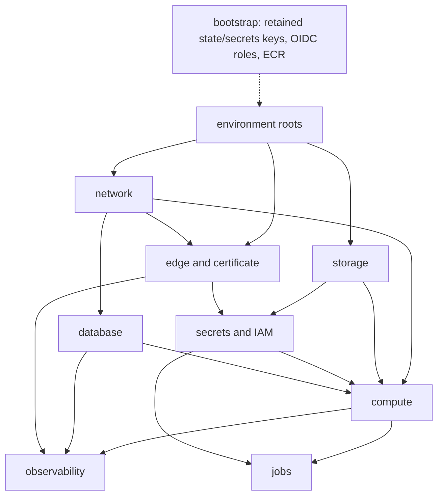

# Contracts, budgets, and structure

## Required pre-dispatch refresh

The [runtime handoff](../runtime-refresh.md) records the final Phase 8 inputs
and concrete gaps in this baseline. Apply its private print, provider startup,
ARM64, and build-plan checks together with the Phase 9 cost recommendation.

This baseline is proposed until Phase 9 cost research and the final Phase 6.1,
6.2, 7.1, 7.2, and 8 contracts are available. Before any task dispatch, record
the refresh outputs in the phase plan:

- quantified AWS cost, selected UAT sizing, and the resulting budget decision;
- a managed-service cost and suitability comparison, including ECS/Fargate, RDS,
  S3, and SES. The existing ECS-on-EC2 topology is only a proposed baseline; any
  superseded task is rewritten from the Phase 9 result before dispatch;
- `PUBLIC_RENDER_ORIGIN` versus stale `NUXT_RENDER_ORIGIN` usage, password and
  MCP settings, mail runtime, SES handoff, and the provider-login-disabled
  startup credentials fix;
- final MCP routes and the UAT Basic Authorization interaction; and
- the resolved UAT access mechanism and secret runtime contract. Neither is
  chosen silently here. Reconcile secret details with the current mandatory
  secret-skill instructions before implementation; do not handle secret values.

The user-owned [email runbook](../../../runbooks/email.md) is the SES handoff:
SES is configured in the Singapore sandbox with `aboutme-auth`,
`danny@aboutme.vn`, and the existing `aboutme-email` CloudFormation stack.
Before OpenTofu creates overlapping SES, SNS, SQS, or CloudWatch resources, the
refresh must define controlled adoption/import blocks for that stack and verify
them against the pinned OpenTofu import documentation. Preserve the Google
Workspace root MX/SPF and the separate `bounce.aboutme.vn` MAIL FROM records.
Runtime IAM is still absent and must be designed with least privilege; the
encrypted feedback queue has no consumer and must not be described as
application processing. UAT smoke uses the SES simulator; real signup/reset mail
requires owner-approved verified recipients, and production SES access waits for
public HTTPS signup/contact flows.

### Existing email ownership

The local checkpoint must choose and document one management strategy before
activation. Import alone does not transfer ownership away from CloudFormation:

1. Adopt the existing stack itself into OpenTofu while CloudFormation remains
   the sole manager of its child resources. OpenTofu must not also declare or
   import those children as individually managed resources.
2. If individual resources need OpenTofu ownership, prepare a
   resource-by-resource transfer: inventory physical IDs and dependencies,
   record the original stack template, apply and verify retention protection,
   remove the retained resources from CloudFormation management, verify they
   still exist, then import them into OpenTofu. Require a no-change post-import
   plan and a rollback procedure before any follow-on resource update. Never
   delete the email stack as a shortcut.

Use the official
[CloudFormation retention rules](https://docs.aws.amazon.com/AWSCloudFormation/latest/TemplateReference/aws-attribute-deletionpolicy.html)
and [OpenTofu import contract](https://opentofu.org/docs/language/import/) when
writing the exact transfer runbook. Only one controller may manage each
resource. The selected strategy and its non-destructive checks are required
inputs to task 10.15 and must preserve sending, feedback, and Google Workspace
DNS.

Adopt shared mail infrastructure into a separate persistent root/state, planned
as `deploy/aws/shared-email/`, outside the disposable UAT environment. Its
resource protections and UAT teardown tests must prove that the email stack,
identities, feedback queue, and associated DNS cannot be destroyed by a UAT
reset or cleanup.

Local-only tasks use fake AMI data and OpenTofu mocks. Task 10.15 resolves the
real AWS AMI only during authorized UAT activation.

The task contracts retain the exact boundary, private-media and IAM, retention
and heartbeat, image, deploy-pipeline, parity, and operational handoff checks.
The exit criteria gate their affected checks; it does not replace those task
contracts with an abbreviated checklist.

The Phase 8 job handoff has four exact server commands:
`idempotency-expiry-sweep` and `media-deletion-sweep` hourly,
`media-orphan-sweep` weekly, and `privacy-retention-sweep` daily. Together with
the existing `restore-verify.sh`, `tls-expiry-check.sh`, and
`cidr-drift-check.sh` ops jobs, Task 10.10 owns seven schedules. Hosted schedule
activation, heartbeat and failure alarms, 180-day log retention, and
backup-retention enforcement remain Phase 10 evidence.

## Build and runner contract

The owner selected native `ubuntu-24.04-arm` runners and then public image
builds under
[ADR 0033](../../../adr/0033-public-image-builds-private-deployment.md). AWS
sizing and spending still come from Phase 9.

| Work                                         | Execution location                                      | Owner                                     |
| -------------------------------------------- | ------------------------------------------------------- | ----------------------------------------- |
| Development and affected feature checks      | Laptop, native stack and one shared database container  | Public app repository                     |
| Existing app CI and pinned browser baselines | Existing GitHub runners; AMD64 for baseline comparison  | Public app repository                     |
| Deployment image build and runtime smoke     | Native `ubuntu-24.04-arm`, Podman, `linux/arm64`        | Public `dannyota/aboutme`, task 10.8      |
| Image publication and AWS UAT deployment     | Protected manual workflows after the activation handoff | Private `aboutme-infra`, tasks 10.8/10.12 |

Task 10.8's public `images-arm64.yml` takes an exact reviewed app commit and
requires the canonical protected candidate branch and expected check identities.
One job builds all four images sequentially, then runs native smoke for
server/migrate, Nuxt, Caddy, ops, and the Phase 7 Chromium/font PDF and image
path against those local Podman images. There is no intermediate artifact or
cross-job image transfer. All inputs are public; fixtures are synthetic. It has
no private checkout, AWS identity, registry write, or `id-token: write`. QEMU is
not used. Local image checks use the laptop architecture; AMD64 browser
baselines remain separate.

After smoke succeeds, upload a versioned public OCI bundle and evidence with a
14-day retention limit (7 days for the low-cost scenario). Its manifest records
the app and workflow commits, workflow path/ref, run ID/attempt, runner image,
`linux/arm64`, and exactly four image names with archive checksums and OCI
manifest/config digests. Capture GitHub's artifact ID and digest after upload in
the private handoff; do not embed a not-yet-assigned artifact ID in the bundle.
Failed, canceled, or incomplete runs cannot authorize publication.

Private `publish-images.yml` is a separate manual workflow. Its credential-free
validation job fetches only the selected canonical public run/attempt/artifact
through GitHub's API, using only read access where authentication is required.
Validate successful run status, workflow/source provenance, artifact identity
and service-reported digest, bounded schema/archive contents, smoke evidence,
and all image digests. A checksum supplied inside the same bundle alone is not
proof of provenance. Reject fork/PR-only commits, wrong workflow/ref/attempt,
arbitrary URLs, substituted archives, path traversal, and missing/extra images.

Only the subsequent protected publication job receives `id-token: write` for
private `ci-publish-staging`. It rechecks the approved artifact identity and
pushes the exact validated images without rebuilding. Treat archives as data; do
not execute their scripts or images in the credentialed publisher. Record both
the OCI and resulting ECR digests, verifying the same manifest/config and layers
after upload rather than assuming a tag or digest conversion is safe.

The private release manifest binds public build provenance to the reviewed
infrastructure commit, successful publication run/attempt, and four ECR digests.
The integration owner archives the exact manifests, checksums, API identity,
approval, and successful-run/smoke evidence in a reviewed private release record
before artifacts expire. Private Actions retains only small metadata artifacts;
OCI archives are downloaded to the job workspace, not uploaded again privately.
If an unpublished public bundle expires, run a new public build and repeat its
approval. After publication, task 10.12 can deploy from the protected private
release record after artifact expiry. Retain referenced ECR images through UAT,
Phase 11, and rollback; never reconstruct evidence from tags or rebuild during
promotion. Task 10.13 tests these rejection and retention paths as task
obligations; they do not add acceptance IDs or change AC-INF-003's
environment-parity scope.

Use caches keyed by OS, architecture, exact tool versions, and dependency
lockfile hashes. Keep ARM64 native outputs separate from AMD64 outputs and
release caches separate from untrusted pull-request caches. Cancel superseded
read-only PR checks; serialize image publication and deploys with
`cancel-in-progress: false`, so cancellation cannot interrupt a migration. Set
explicit job timeouts and artifact retention. Cap public caches at the included
10 GiB; private jobs start without caches. Measure build duration and
disk/memory use before changing the standard runner or sequential-build design.

GitHub's
[runner reference](https://docs.github.com/en/actions/reference/runners/github-hosted-runners)
and
[billing rules](https://docs.github.com/en/billing/concepts/product-billing/github-actions)
(checked 2026-09-06) distinguish free standard public-repository builds from
private publication/deployment usage. Task 9.1 records private usage before
account allowances; activation verifies enough remaining quota with no paid
Actions usage selected. Private approval-feature eligibility is a separate
check. Runner labels select architecture/OS, not an immutable machine image or
AWS region; pin tools and container digests and record the actual runner image.
Follow GitHub's
[concurrency rules](https://docs.github.com/en/actions/concepts/workflows-and-actions/concurrency)
when implementing cancellation.

## Traceability position

The committed authority is direct: **AC-INF-001…008** are Phase 10
infrastructure-owned rows in [`traceability/`](../../traceability/), and
**AC-OPS-015…019** are the Phase 10 operational rehearsal-owned rows for the
live CloudFront matrix, origin-secret rotation drill, live two-runner migration,
real restore, and alarm receipt. The current sequencing and arm64 build wording
live in [`implementation-plan.md`](../../implementation-plan.md); no companion
patch file is required or present.

| Row                | Owner                                                           | This plan's obligation                                                                                                                                                   |
| ------------------ | --------------------------------------------------------------- | ------------------------------------------------------------------------------------------------------------------------------------------------------------------------ |
| AC-INF-001         | Phase 10 infrastructure Task 10.7                               | Fail-closed boundary + validated-chain viewer derivation + single canonical header and secret-free access logs, proven by CI e2e rows 1–22                               |
| AC-INF-002         | Phase 10 infrastructure Task 10.6                               | Caddy-only behavior matrix, with no S3 origin or `/assets` behavior, encoded and asserted by mocked `tofu test`                                                          |
| AC-INF-003         | Phase 10 infrastructure Task 10.1/10.13                         | Env parity: byte-identical roots + tfvars key-set equality, CI-enforced                                                                                                  |
| AC-INF-007         | Phase 10 infrastructure Task 10.6 (Phase 10 infrastructure D25) | Proposed UAT viewer gate (access mechanism remains a refresh output, disabled in production) — Phase 10 infrastructure-local control, no design-clause attribution       |
| AC-INF-008         | Phase 10 infrastructure Task 10.6 (Phase 10 infrastructure D25) | Blanket `X-Robots-Tag: noindex, nofollow` on UAT via the response-headers policy — Phase 10 infrastructure-local control, no design-clause attribution                   |
| AC-INF-004         | Phase 10 infrastructure Task 10.4                               | Secrets absent from repo/state; SSM paths disjoint; only the server role gets prefix-scoped media operations                                                             |
| AC-INF-005         | Phase 10 infrastructure Task 10.9                               | Alarm inventory + dashboards + SNS provisioned, incl. drift + heartbeat alarms                                                                                           |
| AC-INF-006         | Phase 10 infrastructure Task 10.10                              | Enabled privacy, media, restore, TLS, and drift schedules with exact roles, overlap locks, heartbeats, and failure alarms                                                |
| AC-OPS-001         | P0B (done)                                                      | Reused, not re-implemented (D16); live two-runner staging drill is AC-OPS-017                                                                                            |
| AC-OPS-002         | Phase 10 operational rehearsal                                  | Phase 10 infrastructure builds the mechanism (D8/D9, Tasks 10.6–10.7) and proves it in CI simulation; live bypass rejection stays Phase 10 operational rehearsal         |
| AC-OPS-015…019     | Phase 10 operational rehearsal                                  | Phase 10 infrastructure leaves the interfaces (alarm-trigger table, rotation runbook, restore job, deploy workflow); the drills are out of Phase 10 infrastructure scope |
| AC-OPS-008/009/014 | P0 (done)                                                       | Phase 10 infrastructure's task env (`TRUSTED_PROXY_CIDRS=127.0.0.1/32`, `LISTEN_HOST=127.0.0.1`, `ENV=staging`/`prod`) is the deployed instantiation                     |

## Budget wiring (numeric budgets → infrastructure parameters)

| Budget (budgets.md)                                        | Infrastructure parameter (task)                                                                                                                                                                         |
| ---------------------------------------------------------- | ------------------------------------------------------------------------------------------------------------------------------------------------------------------------------------------------------- |
| Server task ≤ 512 MiB (Go + Chromium)                      | ECS **task-definition-level** `memory = 512` (the task cgroup — budgets.md's whole-task semantics); container-level limits left unset or equal so a container can never out-budget the task (Task 10.5) |
| pgx pool ≤ 20 < `max_connections`                          | RDS parameter group asserts `max_connections` ≥ 100 on the chosen class (Task 10.3, `tofu test` assertion)                                                                                              |
| SSE ≤ 2000 conns, ≥ 25 % fd headroom                       | `ulimits { nofile soft/hard = 65536 }` on caddy + server containers (Task 10.5)                                                                                                                         |
| SSE heartbeat 25 s < CF idle timeout                       | `caddy-sse` origin read timeout 60 s; default origin 30 s (Task 10.6, D22)                                                                                                                              |
| API/SSR p95 SLOs (Phase 10 operational rehearsal-measured) | Instance classes are tfvars (D21) so Phase 10 operational rehearsal benchmark evidence can change them without module edits                                                                             |
| Request body ≤ 256 KB                                      | App-enforced (P0 middleware); no CloudFront/Caddy override introduced                                                                                                                                   |

## Module/file structure produced by this phase

| Path                                                                            | Responsibility                                                                                                                                                   |
| ------------------------------------------------------------------------------- | ---------------------------------------------------------------------------------------------------------------------------------------------------------------- |
| `deploy/aws/bootstrap/`                                                         | One-time retained state/secrets KMS roots, state bucket, exact GitHub OIDC publication/plan/deploy roles + boundary, and shared ECR repos (local state)          |
| `deploy/aws/modules/network/`                                                   | VPC, public + **private (DB)** subnets, SG (443 from CloudFront origin-facing prefix list), EIP + ASG(1) auto-reassociation                                      |
| `deploy/aws/modules/database/`                                                  | RDS Postgres (gp3, PITR, write-only master password + version), parameter group, **private** subnet group                                                        |
| `deploy/aws/modules/storage/`                                                   | Private unversioned S3 media bucket, public-access block, encryption, bucket and prefix outputs                                                                  |
| `deploy/aws/modules/secrets/`                                                   | SSM name contract, retained-key input, scoped task/execution roles, server-only media and one-distribution invalidation permissions                              |
| `deploy/aws/modules/compute/`                                                   | ECS cluster, capacity provider (ASG, ECS-optimized arm64 AMI), task definitions (host-mode caddy/server, **bridge-mode web — D24**), log groups                  |
| `deploy/aws/modules/edge/`                                                      | CloudFront distribution with dual Caddy origins only, origin-request and response-header policies, **proposed UAT viewer gate — D25**, ACM us-east-1 certificate |
| `deploy/aws/modules/observability/`                                             | CloudWatch alarms (inventory below, with default thresholds), dashboards, SNS topic + subscription, EventBridge failure rules                                    |
| `deploy/aws/modules/jobs/`                                                      | Enabled bounded privacy/media jobs plus restore, TLS-expiry, and prefix-list drift; exact RunTask/PassRole/task-role boundaries                                  |
| `deploy/aws/envs/staging/`, `deploy/aws/envs/production/`                       | Thin, byte-identical roots (D4): `main.tf`, `variables.tf`, `outputs.tf`, `backend.hcl`, `<env>.auto.tfvars`                                                     |
| `deploy/aws/scripts/secrets-bootstrap.sh`                                       | After bootstrap, writes and decrypt-checks SSM SecureStrings under the retained environment key before the environment foundation apply                          |
| `deploy/aws/scripts/dns-apply.sh`                                               | Applies/diffs Cloudflare records from OpenTofu outputs via `cf` CLI (D19)                                                                                        |
| `deploy/aws/scripts/restore-verify.sh`                                          | RDS snapshot → isolated instance → verification query → teardown; overlap-guarded (D20)                                                                          |
| `deploy/aws/scripts/cidr-drift-check.sh`                                        | Compares deployed CloudFront origin-facing CIDR set vs the live managed prefix list; nonzero exit on drift (D6)                                                  |
| `deploy/aws/scripts/db-bootstrap.sh`                                            | Creates the database and exact migrator/app/restore roles and grants; idempotent and app-DDL-negative tested                                                     |
| `deploy/aws/scripts/tls-expiry-check.sh`                                        | Checks the local Caddy listener with origin SNI/hostname and emits bounded expiry/failure metrics                                                                |
| `deploy/caddy/routes.caddy`                                                     | Shared route table imported by dev + prod Caddyfiles; env-placeholder upstreams with dev defaults (D7)                                                           |
| `deploy/caddy/boundary.caddy`                                                   | Edge boundary: fail-closed origin-secret gate, trusted-chain client-IP, header strip/emit (D5/D8)                                                                |
| `deploy/caddy/Caddyfile.prod`                                                   | Production Caddyfile: `admin off`, DNS-01 TLS, internal SSR listener (D24), loopback health vhost, imports of the two snippets                                   |
| `deploy/caddy/Caddyfile.boundary-test`                                          | TLS-free wrapper importing the same snippets, driven by the CI e2e test (env-substituted listen port)                                                            |
| `deploy/caddy/Caddyfile` (modify)                                               | Dev file now imports `routes.caddy` (behavior unchanged; existing route-table test must stay green)                                                              |
| `deploy/caddy.Dockerfile` + `deploy/caddy/caddy-entrypoint.sh`                  | **Task 10.7:** xcaddy build (Caddy 2.11.4 + caddy-dns/cloudflare, pinned, arm64) + fail-closed env entrypoint guard                                              |
| `deploy/ops.Dockerfile`                                                         | Minimal arm64 image: aws-cli + postgresql-client + the ops scripts                                                                                               |
| `apps/server/internal/routetable/prod_boundary_test.go`                         | The BLOCKING e2e test (simulated edge, two viewers, forged + duplicated headers, fail-closed rows)                                                               |
| Private `.github/workflows/{iac.yml,publish-images.yml,deploy-staging.yml}`     | Authored by Tasks 10.8/10.12/10.13 as exact diffs, **applied by the integration owner**                                                                          |
| Public `.github/workflows/images-arm64.yml`                                     | Credential-free native builds/smoke and public OCI bundle; Task 10.8 diff applied by the integration owner                                                       |
| Root `Makefile` (diff for owner)                                                | `iac-fmt`, `iac-validate`, `iac-test`, `route-table-test-prod`, `staging-plan` targets                                                                           |
| `.env.example` (diff for owner — owner-serialized)                              | `CLOUDFLARE_API_TOKEN=` (Zone:DNS:Edit, `aboutme.vn` only), `AWS_PROFILE=` names-only additions                                                                  |
| `docs/runbooks/{deploy-rollback,eip-recovery,secret-rotation,restore-drill}.md` | Seeded runbooks (drilled in Phase 10 operational rehearsal)                                                                                                      |
| `docs/architecture.md` (update — **owner-serialized diff**)                     | Gains the deployed-UAT current-state section (Task 10.15, diff handed to owner)                                                                                  |

Module dependency graph:

## Master-plan exit bullet → task map

| Master-plan Phase 10 infrastructure exit bullet                                                                         | Task(s)           |
| ----------------------------------------------------------------------------------------------------------------------- | ----------------- |
| VPC                                                                                                                     | 10.2              |
| ECS on EC2 Graviton — host networking for the edge/API tier (web tier bridge-mode per D24), fixed ports per P0 contract | 10.5 (D24)        |
| RDS Postgres (gp3)                                                                                                      | 10.3              |
| Private S3 media, with access limited to the Go server role                                                             | 10.3, 10.4        |
| CloudFront + ACM (us-east-1) with the [CloudFront behavior contract](../../../design/deployment.md#cloudfront-behavior) | 10.6, 10.11       |
| Caddy origin `origin.aboutme.vn` (DNS-01 via Cloudflare)                                                                | 10.7, 10.11       |
| EIP + auto-reassociation                                                                                                | 10.2              |
| Origin-secret + prefix-list ingress                                                                                     | 10.2, 10.6, 10.7  |
| SSM secrets (IAM scoping + rotation)                                                                                    | 10.4              |
| CloudWatch alarms + dashboards + SNS/on-call                                                                            | 10.9              |
| Scheduled retention + RDS restore-verification (overlap, alarmed)                                                       | 10.10             |
| arm64 (Graviton) image build + ECS deploy pipeline drain→readiness                                                      | 10.7, 10.8, 10.12 |
| [Database release sequence](../../../design/deployment.md#database-and-releases), including backup and migration lock   | 10.5, 10.12       |
| `tofu validate`/`plan` in CI                                                                                            | 10.13             |
| Env-parameterized modules (staging/prod differ only by variables)                                                       | 10.1, 10.13       |
| **BLOCKING**: production Caddy client-IP boundary + e2e test                                                            | 10.7              |
| Modules apply cleanly to a UAT environment                                                                              | 10.15             |

---
