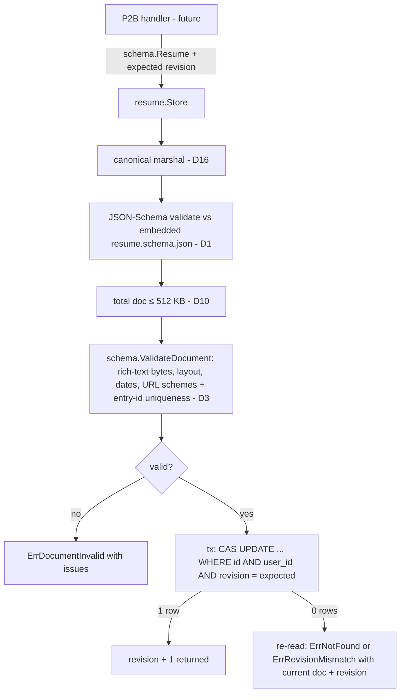

# The write path this phase builds



Backfill vs autosave (the D12 race, proven in Tasks 8/10):

```mermaid
sequenceDiagram
    participant BF as Backfill job
    participant DB as resumes row (v_old, rev 7)
    participant AS as Autosave (CAS rev 7)
    BF->>DB: read schema_version=v_old, revision=7
    AS->>DB: UPDATE ... SET doc(v_cur), revision=8 WHERE revision=7
    DB-->>AS: 1 row - autosave wins, doc now current version
    BF->>DB: UPDATE ... WHERE schema_version=v_old AND revision=7
    DB-->>BF: 0 rows - BackfillLostRace: retryable (observation stale; re-observe and retry)
```
