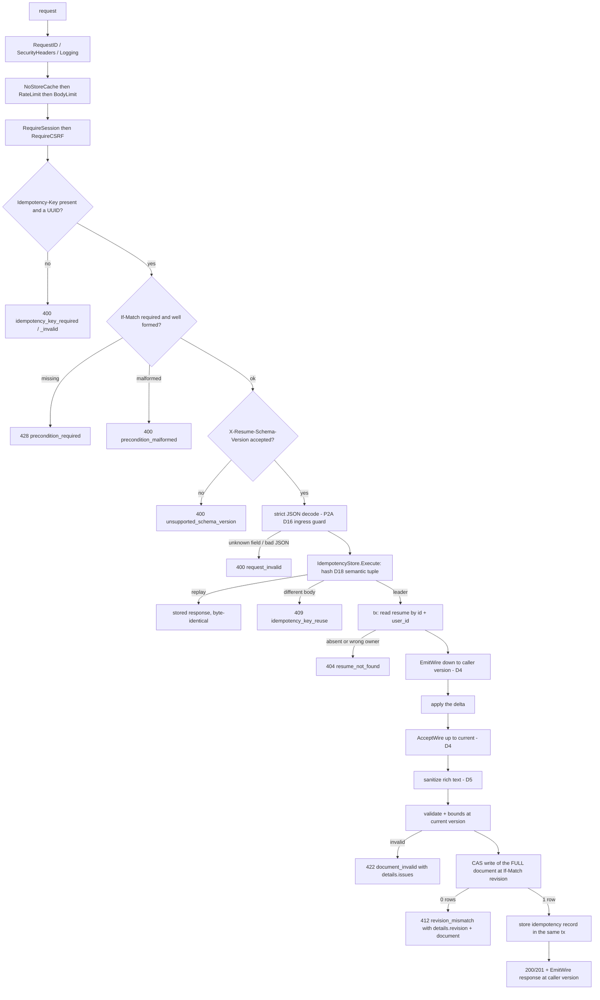
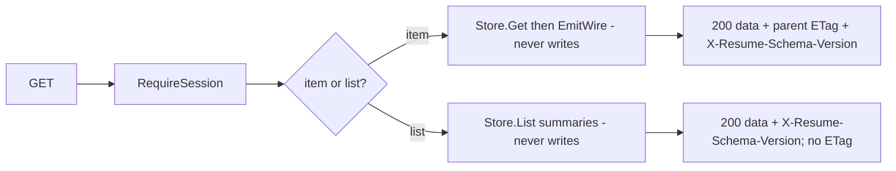

# The HTTP write path this phase builds

Every JSON mutation in this phase takes this path. The photo variant is defined
below. The store half (everything below `resume.Store`) is P2A's and is shown
only where P2B binds to it — see
[`../phase-2a/write-path.md`](../phase-2a/write-path.md).

Three properties this diagram is drawn to make checkable:

- **Nothing is written before every bound is checked.** Validation, sanitization
  and the size bounds all run inside the transaction and before the CAS
  statement, so a rejected request leaves the row byte-identical. The
  author-owned bounds coverage asserts exactly that (row equality before and
  after).
- **The idempotency record and the mutation share one transaction.** A replay
  returns the stored response without re-running the mutation; a rolled-back
  mutation leaves no record to replay. This is P2A's primitive, unchanged — P2B
  supplies D18's canonical operation identity (method, registered operation, and
  concrete target parameters) and a stable semantic hash of the resolved wire
  version, parsed precondition, declared semantic inputs, and exact bounded raw
  JSON body. Photo upload substitutes the bounded raw file-part bytes; multipart
  framing, headers, and filename are excluded so a new boundary does not turn
  the same logical retry into reuse. Each bodyless DELETE uses an exact
  zero-length payload; its optional singleton JSON `Content-Type` is transport
  metadata and does not change replay identity.
- **The caller's wire version bounds both ends.** The delta is applied at the
  caller's declared version and the response is emitted at it, while storage
  only ever holds a complete current-version document.

## The JSON read path

Reads never write: projection is pure (P2A D18). An item response's `ETag` is
the revision in the same `"r<n>"` form the client sends back as `If-Match`, so a
client never has to construct that string from a JSON field itself. The list has
no single parent revision and therefore emits no ETag.

## What "granular" means here

The [web design](../../design/web.md) defines the autosave model as keystroke →
store → debounce about one second → **one coalesced PATCH**. The endpoints are
granular so a save touches one entry, one section, the personal-details object,
or a customization delta list rather than the whole document. Storage remains
whole-document (D15), so "granular" describes the request, not the write.

Structural mutations are the exception the spec calls out: creating, deleting,
moving, or reordering a **section** changes `content` and
`customization.layout.sections` together, and the exactly-once placement
invariant must never be observably broken. Those go through
`PATCH /resumes/{id}/structure` alone, which applies the whole command or none
of it.

## Media mutation variant

Object storage cannot join the PostgreSQL transaction. The exact photo POST
bypasses the buffering `BodyLimit` chain. Authentication, CSRF, the upload rate
limit, header validation, and task-wide permit run before any body read. The
handler then streams one request through `http.MaxBytesReader` and the 60-second
read boundary, extracts one bounded raw part, hashes D18's complete identity,
and checks for a committed replay or reuse. A fresh request fully decodes and
normalizes the image synchronously before writing a private candidate. Five
seconds is a measured release gate, not a decoder-cancellation timer. Only a
proved-created object may proceed to the transactional idempotency and CAS
kernel. Replay, reuse, or a definite database failure best-effort deletes that
unreferenced candidate. An ambiguous database commit leaves it private because
the database may reference it. An unknown remote object-write outcome stops
before database mutation and is not deleted because the key may name a collision
winner. The scheduled orphan sweep deletes only old objects with no database
reference or pending deletion job.

No source container crosses the object-storage boundary. The stored object is a
bounded canonical JPEG or PNG with orientation applied and source metadata
removed. A successful replacement stores the new key with crop absent, because
the old normalized crop described different pixels. D19 defines the decoder,
dimension, pixel, time, concurrency, memory, and output ladders.

Photo crop is not part of the upload variant. It follows the ordinary bounded
JSON path and hashes exact `{crop: PhotoCrop|null}` bytes. Inside the
transaction it reads the current `PhotoRef`, changes or removes only `crop`,
preserves the key, and performs no object I/O. Photo delete and whole-resume
delete validate the old key and enqueue its exact `(resume_id, object_key)`
deletion job in the same transaction that removes the reference. Invalid or
cross-resume keys fail before either write. The P8-priv worker performs one
exact delete from the durable job; cleanup failure cannot replace stored success
or restore access.
