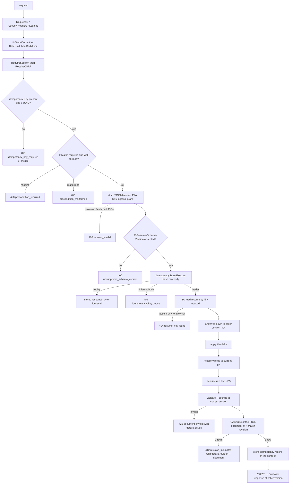
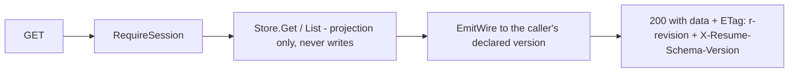

# The HTTP write path this phase builds

Every mutation in this phase takes exactly this path. The store half (everything
below `resume.Store`) is P2A's and is shown only where P2B binds to it — see
[`../phase-2a/write-path.md`](../phase-2a/write-path.md).

Three properties this diagram is drawn to make checkable:

- **Nothing is written before every bound is checked.** Validation, sanitization
  and the size bounds all run inside the transaction and before the CAS
  statement, so a rejected request leaves the row byte-identical. The blind
  bounds suite asserts exactly that (row equality before and after).
- **The idempotency record and the mutation share one transaction.** A replay
  returns the stored response without re-running the mutation; a rolled-back
  mutation leaves no record to replay. This is P2A's primitive, unchanged — P2B
  supplies the route string and the SHA-256 of the **raw** request body.
- **The caller's wire version bounds both ends.** The delta is applied at the
  caller's declared version and the response is emitted at it, while storage
  only ever holds a complete current-version document.

## The read path

Reads never write: projection is pure (P2A D18), and the response's `ETag` is
the revision in the same `"r<n>"` form the client sends back as `If-Match`, so a
client never has to construct that string from a JSON field itself.

## What "granular" means here

Spec §5's autosave model is: keystroke → store → debounce ~1 s → **one coalesced
PATCH**. The endpoints are granular so that a coalesced save touches one entry,
one section, the personal-details object, or a customization delta list — not
the whole document. Storage is still whole-document (D15), so "granular" is a
property of the request, never of the write.

Structural mutations are the exception the spec calls out: creating, deleting,
moving, or reordering a **section** changes `content` and
`customization.layout.sections` together, and the exactly-once placement
invariant must never be observably broken. Those go through
`PATCH /resumes/{id}/structure` alone, which applies the whole command or none
of it.
