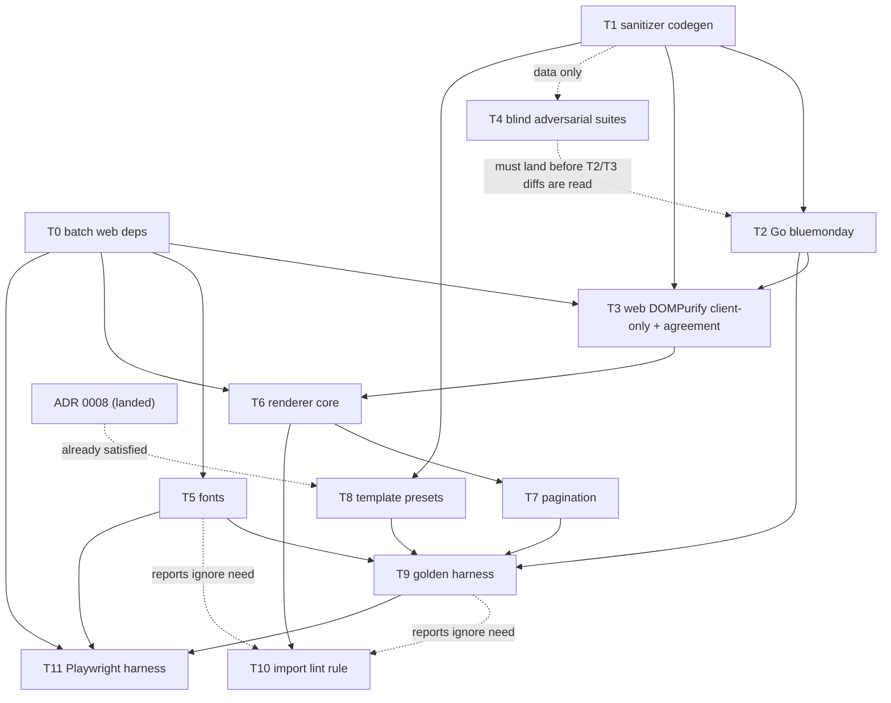

# Phase 3 — Renderer, templates, fonts, sanitizer (implementation plan)

**Rev 2 (2026-08-02)** — review round 1 (ADOPT WITH CHANGES) applied: DOMPurify
is client-only and Go is the SSR sanitization authority (jsdom demoted to a
test-only dependency); template presets carry a placement **rule** computed
against the document's content keys (ADR 0008, owner-authored, gates Task 8);
the renderer-surface CSP splits `style-src`/`style-src-attr` and is validated on
a production-shaped SSR build; blind suites author their **own** predicate with
negative controls.

> **Adopted Rev 2 (2026-08-02)** by the integration owner after an independent
> adversarial plan review (ADOPT WITH CHANGES, 12 blocking findings applied and
> audited). ADR 0008 is Accepted and Task 8 is unblocked; acceptance rows
> `AC-REN-001`…`AC-REN-006` are minted and `AC-SEC-003` records the P3/P2B
> split. Design decisions D1–D21 reflect the review-round-1 integration-owner
> rulings and are written as ratified per the owner's B12 direction; the
> owner-landing checklist (AC-REN rows, master-plan corrections, Make/CI
> artifacts, `docs/plans/uat-phase-3.md`) is in the companion note
> (`phase-3-draft-companion.md`). **Task 8's ADR 0008 block is satisfied**:
> `docs/adr/0008-template-apply-semantics.md` is Accepted (committed at this
> base) and its placement-rule semantics match D10 verbatim — verified during
> this audit — so Task 8 may proceed without waiting on the owner.
>
> **For agentic workers (once ratified):** execute with
> superpowers:subagent-driven-development, one task per fresh subagent, Opus 5
> review between tasks. Steps are `- [ ]`. Every task's tests are written
> **before** its implementation (TDD): write the failing test, run it and see it
> fail, implement, run it and see it pass, commit.

**Goal:** a pure Vue renderer (`apps/web/app/components/resume/`) that turns
`(personalDetails, content, customization)` into deterministic HTML across all
eight section types × template presets × **both pagination modes** (editor
approximate paged vs continuous public); committed golden snapshots; self-hosted
Vietnamese-diacritic fonts that load offline deterministically; the §5 sanitizer
contract enforced on **both** sides from one generated source of truth —
bluemonday as the write-path **and SSR** authority, DOMPurify guarding every
client-side render of user HTML — proven against the shared versioned hostile
corpus across all four surfaces: bluemonday, DOMPurify, SSR, and a real browser
with CSP conformance.

**Base:** `main`, commit `ad357d3` ("Merge Phase 1: authentication and
sessions", 2026-08-02) — contains all of Phase 0 and Phase 1. Workers must run
`git rev-parse HEAD` and confirm their worktree is at this base or a descendant
before starting (worktree-isolated agents have checked out stale bases before —
verify, don't assume).

**Spec:** `../specs/aboutme-design.md` §5 "Web app (Nuxt 4 / Vue 3)" — the
renderer-purity bullet, the whole "Renderer detail" subsection (contract, tree,
one-column placement, pagination, templates, fonts, sanitizer contract, guards)
— plus §2's "renderer written once" bullet and §3's entry-fields table and
customization mirror. **Master plan:** `implementation-plan.md` "Phase 3 —
Renderer, templates, fonts, sanitizer" (exit criteria + task list + the
"thumbnails are NOT here" carve-out), "Global constraints", "Agent workflow",
"Testing strategy" rows _Renderer golden_, _Visual regression_, _Security_.
**Traceability:** `traceability.md` rows **AC-SEC-001** (hostile corpus
neutralized by both sanitizers + browser — P3), **AC-SEC-003** (the "bluemonday

- DOMPurify wiring" half is P3; the data artifacts landed in P0), and the
  **NEW-M7** follow-up recorded inside AC-SEC-004 ("when the P3 renderer
  linkifies chips, re-check that non-URL types cannot reintroduce the vector;
  folds into AC-SEC-001"). **No AC rows exist for the renderer itself** — golden
  determinism, pagination modes, fonts, templates, and the import rule have
  normative spec statements but zero traceability rows, even though the master
  plan's traceability section claims "pagination modes + fonts (P3)" were
  assigned. Per the review-round-1 B12 ruling the integration owner is landing
  rows AC-REN-001…006 (text in the companion note's landing checklist); this
  plan cites them directly as ratified.

**Not in this phase (explicit):** template **thumbnails are P7B** (they need the
real print pipeline; P7A builds the print worker). P3 owns only a standalone
Playwright screenshot harness for its own visual regression. The `/print/[id]`
page with its single-audience token is **P7A**; the P3 harness uses its own
build-flag-gated route (D17). Wiring `internal/sanitize` into resume write
endpoints, and the Go public-read defence-in-depth re-sanitization that backs
the D3 SSR-authority model, are **P2B/P5A** (the endpoints don't exist yet —
D20). Editor, Pinia store, autosave, ProseMirror are **P4**.

## Environment facts (verified 2026-08-02 at `ad357d3`)

- Node 24.18.1 (`apps/web/.nvmrc`), Nuxt 4.5.1, Vue 3.5.40, Vitest 4.1.10 with
  `environment: 'nuxt'` (happy-dom), `@vue/test-utils` + `mountSuspended`
  patterns in `apps/web/test/`. TypeScript pinned **6.0.3** — do not bump
  (`vue-tsc` breaks against TS 7's package exports; CLAUDE.md gotcha).
- `packages/schema` is a real dependency of the web app
  (`"@aboutme/schema": "file:../../packages/schema"`, main =
  `gen/ts/resume.ts`); its package.json `exports` map has only `.` and
  `./package.json` — new subpath exports must be added deliberately (Task 1).
- The generator is `packages/schema/scripts/generate.mjs` (jstt for TS,
  quicktype for Go); output determinism is byte-compare-tested
  (`test/gen.test.ts`) and faithfulness conformance-tested
  (`test/conformance.test.ts`). ADR 0006 (schema-derived codegen) is the
  authority for extending it rather than hand-writing parallel artifacts.
- `packages/schema/validation/sanitizer-allowlist.v1.json` (tags
  p/br/strong/em/u/ol/ul/li/a; `a` attrs href/rel/target; schemes
  https/mailto/tel; forbidden tags/`on*`/schemes; linkHardening =
  `noopener noreferrer` on **every** emitted `<a>`) and
  `validation/hostile-corpus.json` (28 payloads, 10 categories, mechanically
  tied to the allowlist by `test/sanitizer-corpus.test.ts`) exist as **data
  only**. Verified directly: no `bluemonday`, `dompurify`, `playwright`, or
  `lucide` reference exists anywhere in `apps/` today.
- `packages/schema/templates/` exists but is empty and untracked — the preset
  JSONs are this phase's to create.
- `packages/schema/gen/go` is a separate Go module tied to `apps/server` via the
  root `go.work`. Run Go commands from inside `apps/server` (CLAUDE.md gotcha);
  a materialized `go.work.sum` goes to the integration owner, never deleted.
- The Go API's CSP (`apps/server/internal/api/security_headers.go`) is
  `default-src 'none'; …` and its own comment says the **SSR HTML CSP "is the
  Nuxt app's own concern"** — no HTML CSP exists anywhere in the repo today
  (verified: Caddyfile sets none for web routes). D5 fills this gap.
- Existing Make targets: `web-lint`, `web-typecheck`, `web-test`, `web-build`,
  `schema-check` (npm ci + full schema test suite), `server-build`,
  `server-vet`, `server-test`, `semgrep`. **No Playwright/screenshot target
  exists**; the Makefile and CI workflow are integration-owner-owned — Task 11
  _requests_ targets, it does not add them.
- `git check-ignore .claude/` confirms this draft's directory is git-ignored;
  nothing in `.claude/plans/` is ever committed.

## Global constraints (inherited, plus phase-specific)

- Latest stable, pinned exactly: add dependencies with
  `npm install <pkg>@latest --save-exact` / `go get <mod>@latest` and commit the
  resolved lockfiles — never hand-write version numbers. Every new dependency is
  named in its task and flagged in the design-decisions table — production:
  `bluemonday` + `golang.org/x/net` (Go), `dompurify`, `lucide-vue-next` (web);
  dev-only: `jsdom` (vitest environment — never production, D3), `fontkit`,
  `@playwright/test`. Supply-chain additions beyond that list need
  integration-owner sign-off first. **All five `apps/web` package.json additions
  are installed in one batch by Task 0** (B8) — T3/T5/T6/T11 never touch
  `package.json`/`package-lock.json` themselves, since four tasks editing the
  same lockfile concurrently is exactly the race this rule exists to prevent.
- Google style guides; `gofmt`/`goimports`; ESLint per the committed flat
  config; 80-col `max-len` is enforced — generated goldens and font binaries are
  data, not source, and are excluded from lint, never from review.
- Determinism is the phase's core deliverable: the renderer makes **no**
  `Date.now()`/`Math.random()`/`Intl`/`toLocale*` calls (lint-enforced, D19);
  goldens are byte-exact (D15); screenshots are pinned-container pixel-exact
  (D16). A flaky test is broken, not retried.
- The renderer never redefines the document shape: all types import from
  `@aboutme/schema` (`gen/ts/resume.ts`). Any shape gap goes to the integration
  owner as a schema question, never patched locally.
- **Test-environment purity (B7):** `apps/web/vitest.config.ts` sets
  `environment: 'nuxt'` (happy-dom) globally, so a test that must prove no
  `document`/`window` access is reachable — every renderer-purity test and every
  SSR/passthrough test — needs an explicit file-level
  `// @vitest-environment node` pragma. Without it the global happy-dom shim
  would silently let a stray `document.*` call succeed, defeating the exact
  proof the test exists to make. This applies to `golden.test.ts`,
  `sections.test.ts` (Task 6 Step 1), `ssr-passthrough.test.ts` (Task 3 Step 4),
  and `bounds.adversarial.test.ts` (Task 4 Step 3) — each task marks it
  explicitly.
- No real network calls in any CI test. The Playwright harness explicitly
  **blocks** non-localhost requests (that is itself the offline-fonts
  assertion).
- `make docs-fmt` before committing any `.md` this plan's execution touches.
- Commit discipline per CLAUDE.md: explicit owned paths only, Conventional
  Commits, no AI/agent mentions.

### Verification commands (per change area, run before every handoff)

| Change area                     | Commands                                                                                               |
| ------------------------------- | ------------------------------------------------------------------------------------------------------ |
| `packages/schema/**`            | `make schema-check`; if `gen/go` changed: `cd apps/server && go build ./... && go test ./...`          |
| `apps/server/internal/sanitize` | `make server-build server-vet server-test` + `make semgrep` (security-sensitive)                       |
| `apps/web/**`                   | `make web-lint web-typecheck web-test web-build`                                                       |
| Playwright harness              | `make web-e2e` (**requested** target — Task 11; until granted, the documented `podman run` invocation) |
| Docs                            | `make docs-fmt && make docs-lint`                                                                      |

## Design decisions this plan makes beyond the spec

The spec (§5) states the renderer/sanitizer **policy** precisely but leaves many
**mechanisms** unspecified, and two spec statements conflict with the frozen
schema (D10, D12 — see companion note). Rather than leaving TODOs, this plan
makes an explicit call for each and flags it for Fable/Opus 5 to challenge in
review instead of discovering it mid-implementation:

| #   | Gap in the spec                                                                                                                                                                                                                    | Decision made here                                                                                                                                                                                                                                                                                                                                                                                                                                                                                                                                                                                                                                                                                                                                                                                                                                                                                                                                                                                                                                                                                                                                                                                                                                                                                                                                                                                                                                                                                                                                                                                                                                                                                                 |
| --- | ---------------------------------------------------------------------------------------------------------------------------------------------------------------------------------------------------------------------------------- | ------------------------------------------------------------------------------------------------------------------------------------------------------------------------------------------------------------------------------------------------------------------------------------------------------------------------------------------------------------------------------------------------------------------------------------------------------------------------------------------------------------------------------------------------------------------------------------------------------------------------------------------------------------------------------------------------------------------------------------------------------------------------------------------------------------------------------------------------------------------------------------------------------------------------------------------------------------------------------------------------------------------------------------------------------------------------------------------------------------------------------------------------------------------------------------------------------------------------------------------------------------------------------------------------------------------------------------------------------------------------------------------------------------------------------------------------------------------------------------------------------------------------------------------------------------------------------------------------------------------------------------------------------------------------------------------------------------------ |
| D1  | "ONE versioned allowlist… both generated/conformance-tested against it" names no mechanism; two hand-maintained configs would satisfy a lazy reading                                                                               | Extend `generate.mjs` to emit `gen/go/sanitizer.go` and `gen/ts/sanitizer.ts` **from** `validation/sanitizer-allowlist.v1.json` + `hostile-corpus.json`. Both sanitizers build their configs from the generated artifacts at init — no runtime JSON reads, no hand-copied lists. Drift is caught by the existing byte-compare + `make schema-check` CI gate (Task 1)                                                                                                                                                                                                                                                                                                                                                                                                                                                                                                                                                                                                                                                                                                                                                                                                                                                                                                                                                                                                                                                                                                                                                                                                                                                                                                                                               |
| D2  | "Both sides agree" is not operationalized — bluemonday and DOMPurify will never emit byte-identical HTML                                                                                                                           | Agreement = four checks: (a) a **shared structural neutralization predicate** (no forbidden tag/attr-prefix/scheme survives; every `<a>` has rel per D4) implemented over real HTML parsers on both sides (Go `x/net/html`, TS `DOMParser`); (b) a **committed bluemonday corpus-output artifact** (Task 2); (c) DOMPurify is a **fixed point** over that artifact under DOM-canonical equality (Task 3) — the client pass must never visibly alter Go-sanitized content when a refetch re-renders it (P6B) or the editor previews stored content (P4); (d) `sanitize(sanitize(x)) == sanitize(x)` on both sides. **DOM-canonical equality is defined precisely (B5)**: parse both HTML strings with the same parser (TS `DOMParser`; Go `x/net/html`, used only for this comparison, never inside `RichText` itself); for each element, sort attributes by name in byte order before comparing; normalize the `rel` attribute by splitting its value on whitespace, sorting the tokens, and rejoining with a single space (so `noreferrer noopener` and `noopener noreferrer` compare equal — this does **not** loosen D4, which still requires the _emitted_ value to be exactly `noopener noreferrer`; it only makes the comparator order-insensitive); drop HTML comment nodes entirely; collapse any run of whitespace-only text nodes to a single space before comparing text content; tag names and every non-`rel` attribute value compare byte-exact. A mismatch under this definition is a **blocking defect on the producing side** (Task 2's or Task 3's output), repaired by changing that side's normalization — never by loosening this definition                                                  |
| D3  | Spec requires DOMPurify re-sanitize at render; public pages are SSR — where does sanitization execute? **Ruled by the integration owner (review round 1)**                                                                         | DOMPurify is **client-only** (`import.meta.client`): it guards every client-side render of user HTML (P4's ProseMirror preview, P6B's SSE-refetch re-render). On SSR the renderer passes the string through, and **Go is the sanitization authority for anything SSR renders** — P2B wires `sanitize.RichText` on write, and the Go public-read path re-sanitizes as defence in depth (owner-landing item). `jsdom` is a **test-only** devDependency (vitest environment), never a production one: it would drag an HTTP/cookie/WebSocket stack (~60 packages) into the SSR render path of a product whose posture is "the print browser has no outbound network". Rev 1's hydration rationale was factually wrong — Vue's `hydrateElement` re-applies only event handlers, value props, and `.prop` keys, never `innerHTML`, so a client pass contributes nothing on the SSR path and whatever the server serialized is what Blink keeps. **Removed risk recorded:** dropping jsdom removes one parser boundary — three parsers in series (x/net/html → parse5 → Blink) is where mutation-XSS lives. The master plan's "SSR" corpus surface names a surface to **prove neutralization on**, not a place DOMPurify must execute: it is satisfied by feeding Task 2's committed bluemonday-output artifact through `renderToString` (Task 9 Step 3)                                                                                                                                                                                                                                                                                                                                                                 |
| D4  | Allowlist permits `target` on `<a>` with no value constraint; corpus demands rel **overwrite**                                                                                                                                     | Every emitted `<a>` carries **exactly** `rel="noopener noreferrer"` (overwrite, both sides, normalized token order so D2(c) holds). `target` is allowed only with value `_blank`; any other value is stripped                                                                                                                                                                                                                                                                                                                                                                                                                                                                                                                                                                                                                                                                                                                                                                                                                                                                                                                                                                                                                                                                                                                                                                                                                                                                                                                                                                                                                                                                                                      |
| D5  | "Backstop: strict CSP" has no value and no owner — the Go CSP explicitly excludes SSR HTML, and no HTML CSP exists in the repo                                                                                                     | **(Ruled: P3 owns the renderer-surface value — P8-sec delivers CSP incrementally per owning phase.)** P3 defines the renderer-surface **baseline** CSP as an exported constant (`app/utils/csp.ts`): `default-src 'none'; script-src 'self'; style-src 'self'; style-src-attr 'unsafe-inline'; img-src 'self'; font-src 'self'; connect-src 'self'; frame-ancestors 'none'; base-uri 'none'; form-action 'none'` — `<style>` elements stay strict; only attribute styles (the renderer's `:style` CSS-var bindings) are open, shrinking what P8-sec inherits. **Accepted residual risk (recorded):** sanitized rich text can never carry a `style` attribute — the allowlist permits attributes only on `<a>` and `globalAttributes` is empty; on the `?raw=1` probe `style-src-attr` is reachable, but `default-src 'none'` blocks the exfiltration channels and `script-src` without `'unsafe-inline'` blocks the actual corpus payloads. Public-page enforcement is **P5A/P8-sec** consuming this constant (owner-landing note). Per B9 the value is validated on a **production-shaped SSR build**, not only the harness (Task 11)                                                                                                                                                                                                                                                                                                                                                                                                                                                                                                                                                                             |
| D6  | "JS measure-and-break at entry boundaries" cannot run deterministically in happy-dom/SSR (no layout engine)                                                                                                                        | Pagination is a **pure function** `paginate(measuredBlocks, pageContentHeightPx) → Page[]`; DOM measurement is a browser-only adapter behind an injected measurer. Goldens exercise the pure engine with a **committed synthetic measurer** (deterministic heights derived from content); the Playwright harness exercises the real measurement path                                                                                                                                                                                                                                                                                                                                                                                                                                                                                                                                                                                                                                                                                                                                                                                                                                                                                                                                                                                                                                                                                                                                                                                                                                                                                                                                                               |
| D7  | Page geometry unspecified beyond "fixed 794 px page"                                                                                                                                                                               | A4 = 794×1123 CSS px, Letter = 816×1056 (96 dpi); fixed 48 px page padding on all sides in every mode; breaks at entry boundaries only (a heading is never orphaned as the last block of a page); in 2-column layout each column paginates independently against the same content height and page count = max(columns)                                                                                                                                                                                                                                                                                                                                                                                                                                                                                                                                                                                                                                                                                                                                                                                                                                                                                                                                                                                                                                                                                                                                                                                                                                                                                                                                                                                             |
| D8  | "Self-hosted subset webfonts" — no sourcing, subsetting, or verification mechanism                                                                                                                                                 | Vendor 20 static woff2 files (5 families × 400/700/regular+italic), subset to latin + Vietnamese ranges, **committed** with a `manifest.json` recording upstream repo+commit, OFL license, subset tool+version+unicode-ranges, and per-file sha256. Tests: sha256 matches manifest; **cmap covers the pinned Vietnamese codepoint list** (via `fontkit`, devDep); `fonts.css` families mechanically equal the schema's `customization.font.family` enum                                                                                                                                                                                                                                                                                                                                                                                                                                                                                                                                                                                                                                                                                                                                                                                                                                                                                                                                                                                                                                                                                                                                                                                                                                                            |
| D9  | `document.fonts.ready` awaited "before chromedp prints" — but chromedp is P7A                                                                                                                                                      | P3 ships `app/utils/fontsReady.ts` and makes it a **written contract**: any screenshot/print consumer awaits it. The P3 harness enforces it now; P7A's `/print` page must call it (recorded for the P7A plan)                                                                                                                                                                                                                                                                                                                                                                                                                                                                                                                                                                                                                                                                                                                                                                                                                                                                                                                                                                                                                                                                                                                                                                                                                                                                                                                                                                                                                                                                                                      |
| D10 | Spec: "apply = full customization replace, content untouched" — **contradicts** §3's exactly-once layout invariant: a preset cannot know the doc's section keys                                                                    | **(Ruled; `docs/adr/0008-template-apply-semantics.md`, owner-authored, gates Task 8.)** A preset carries a placement **rule**, not a key list: `layout.placement` is `"keep"` (preserve current placement) or `{"byType": {"sidebarSectionTypes": [...]}}` (ordered). `applyTemplate(current, preset, content)` computes `layout.sections` as a **total function of the document's actual content keys** — exactly-once holds by construction for every input, and a 2-column preset yields a genuinely populated sidebar (Rev 1's keep-only resolution would have baked empty-sidebar 2-column layouts into three of the four golden fixtures' baselines). The customize panel's 1↔2-column toggle keeps preserve semantics — a different operation from applying a template. Preset JSONs are validated at generation time (shape + placement rule). **The ADR is Accepted and committed at this base** — Task 8's block is satisfied (verified this audit) — and Task 8 follows it verbatim                                                                                                                                                                                                                                                                                                                                                                                                                                                                                                                                                                                                                                                                                                                     |
| D11 | `dateFormat: "Mon YYYY"` needs month names; renderer may not call locale APIs; docs carry `lng` but i18n is deferred                                                                                                               | A fixed English month-abbreviation table (`Jan…Dec`), regardless of `lng`, v1. Flagged as a **product call** for the owner (a VN-market resume may want Vietnamese months); the mechanism (table keyed by lng) is a cheap later change                                                                                                                                                                                                                                                                                                                                                                                                                                                                                                                                                                                                                                                                                                                                                                                                                                                                                                                                                                                                                                                                                                                                                                                                                                                                                                                                                                                                                                                                             |
| D12 | Spec renderer tree says "contacts per `detailsOrder`" — the frozen schema **deleted** `detailsOrder` (order = array order); and which chip types linkify is unspecified (NEW-M7)                                                   | Chips render in `details[]` array order. Only the four https-validated types (`website`, `linkedin`, `github`, `twitter`) become `<a href>`, and the renderer **re-checks** the `https://` prefix itself (defense in depth per NEW-M7 — an out-of-schema value renders as text, never a link). `email`/`phone`/`location`/`custom` render as plain text v1 — no `mailto:`/`tel:` links from unconstrained strings. Flagged as a product call                                                                                                                                                                                                                                                                                                                                                                                                                                                                                                                                                                                                                                                                                                                                                                                                                                                                                                                                                                                                                                                                                                                                                                                                                                                                       |
| D13 | "Tree-shaken inline SVG (lucide) via `iconKey`" — dynamic lookup by string defeats tree-shaking                                                                                                                                    | `app/components/resume/icons.ts` statically imports an **allowlisted subset** (~40 icons) from `lucide-vue-next` (pinned) into a `Record<string, Component>`; unknown or absent `iconKey` renders no icon (never a fallback glyph, never an error)                                                                                                                                                                                                                                                                                                                                                                                                                                                                                                                                                                                                                                                                                                                                                                                                                                                                                                                                                                                                                                                                                                                                                                                                                                                                                                                                                                                                                                                                 |
| D14 | `photo.key` is an S3 object key; the renderer must produce a URL and a CSS crop                                                                                                                                                    | `ResumeDocument` takes `assetBase?: string` (default `/assets/`); photo URL = `assetBase + key` (schema's key pattern already excludes absolute URLs). Crop = container with fixed aspect + inner `` positioned/scaled from the crop rect via percentage transforms — pure CSS, no canvas                                                                                                                                                                                                                                                                                                                                                                                                                                                                                                                                                                                                                                                                                                                                                                                                                                                                                                                                                                                                                                                                                                                                                                                                                                                                                                                                                                                                                     |
| D15 | "Golden snapshots committed" — format unspecified                                                                                                                                                                                  | Explicit committed `.html` files (one per matrix cell), compared **byte-exact**; `UPDATE_GOLDEN=1` regenerates. Rendering uses plain `vue/server-renderer` (`createSSRApp`, no Nuxt runtime) — which doubles as the machine-checkable renderer-purity proof: any accidental store/API/Nuxt dependency fails the suite                                                                                                                                                                                                                                                                                                                                                                                                                                                                                                                                                                                                                                                                                                                                                                                                                                                                                                                                                                                                                                                                                                                                                                                                                                                                                                                                                                                              |
| D16 | "Pinned Chromium" for screenshots — no mechanism, and several silent nondeterminism sources beyond the container image itself (B6)                                                                                                 | The Playwright harness runs inside the official Playwright container image **pinned by digest AND by `--platform linux/arm64`** — a manifest-list digest still resolves per-architecture, and this project's **canonical baseline platform is ARM64** (matches production Graviton; an x86_64-generated baseline would silently diverge). `playwright.config.ts` defines a `webServer` that runs `nuxt build` then `nuxt preview` — **never** `nuxt dev` — inside that same pinned container, with fixed `use:` context: `timezoneId: 'Asia/Ho_Chi_Minh'`, `locale: 'en-US'`, `viewport` sized to each page geometry (D7), `deviceScaleFactor: 1`, `colorScheme: 'light'`, `reducedMotion: 'reduce'`, and Chromium launch args `--force-color-profile=srgb --font-render-hinting=none --disable-lcd-text` (subpixel/hinting variance is a known Chromium screenshot-flake source). `fonts.css` (Task 5) uses `font-display: block`, not `swap` — `swap` can repaint **after** `document.fonts.ready` resolves (the browser swaps the fallback glyph run for the webfont on the very next paint, which can land after a screenshot taken post-`fontsReady()`), so a screenshot captured after `fontsReady()` under `block` is guaranteed stable. Baselines are committed PNGs; diff tolerance is **zero**; retries are forbidden. `@playwright/test` pinned exactly; its bundled Chromium is the pinned Chromium. CI (owner-owned job) and this task's own setup both assert `UPDATE_GOLDEN` and `--update-snapshots`/`PLAYWRIGHT_UPDATE_SNAPSHOTS` are unset before invoking `web-e2e` — a baseline-regenerating flag left set would make every failing screenshot silently "pass" by overwriting its own baseline |
| D17 | The harness needs a page that renders arbitrary fixture×template×mode — which must not ship to production                                                                                                                          | `app/pages/_harness/render.vue`, registered only when the build runs with `NUXT_HARNESS=1` (Nuxt hook filtering the page in `nuxt.config.ts`). A build test asserts the route is absent from a normal `nuxt build` output                                                                                                                                                                                                                                                                                                                                                                                                                                                                                                                                                                                                                                                                                                                                                                                                                                                                                                                                                                                                                                                                                                                                                                                                                                                                                                                                                                                                                                                                                          |
| D18 | Draft-permissive docs mean half-empty content; spec doesn't say what renders                                                                                                                                                       | The renderer renders exactly what exists: absent `fullName` → header without a name (no placeholder text); empty sections render their heading only; entries with `isHidden: true` are excluded from output in **every** mode. Absence vs `""` never fabricates content (mirrors the schema's "never fabricate a sentinel" rule)                                                                                                                                                                                                                                                                                                                                                                                                                                                                                                                                                                                                                                                                                                                                                                                                                                                                                                                                                                                                                                                                                                                                                                                                                                                                                                                                                                                   |
| D19 | "Lint rule enforcing editor→renderer one-way imports" — no mechanism, and the editor doesn't exist yet                                                                                                                             | ESLint flat-config override scoped to `app/components/resume/**`: `no-restricted-imports` forbidding `pinia`, `#app`/`#imports`/`nuxt`, `~/stores/**`, `~/composables/**`, `~/components/**` except `~/components/resume/**`, and any api/fetch module; plus `no-restricted-syntax`/`no-restricted-properties` banning `Date.now`, `new Date` (no-arg), `Math.random`, `Intl`, `toLocale*`. Proven by a negative-fixture lint test (Task 10). The reverse direction (editor imports renderer) is allowed by construction                                                                                                                                                                                                                                                                                                                                                                                                                                                                                                                                                                                                                                                                                                                                                                                                                                                                                                                                                                                                                                                                                                                                                                                           |
| D20 | AC-SEC-003 makes P3 own "bluemonday wiring" — but the write path (resume PATCH endpoints) is P2B and hasn't been built                                                                                                             | P3 delivers `apps/server/internal/sanitize` complete and conformance-tested, with a one-paragraph integration contract in its package doc ("every rich-text field passes through `sanitize.RichText` before store validation"). **Calling it is a P2B acceptance obligation**, and under D3's SSR-authority model the Go **public-read path re-sanitizes rich-text fields as defence in depth** (P2B/P5A) — both are owner-landing master-plan lines (companion note). AC-SEC-003's P3 half is the package + conformance, not the endpoint wiring                                                                                                                                                                                                                                                                                                                                                                                                                                                                                                                                                                                                                                                                                                                                                                                                                                                                                                                                                                                                                                                                                                                                                                  |
| D21 | Spec §5's guard "renderer handles current `schema_version` only (server projects first)" (spec line ~347) has no mapping anywhere in this plan — `ResumeDocument`'s props carry no `schemaVersion` signal and no fail-closed check | **Decision (B10): projection is server-side; the renderer documents the assumption rather than re-enforcing it.** The spec's own doc-migration architecture states the server projects every stored document to the current `schema_version` before it is served (migrate-on-read); every caller of `ResumeDocument` in this phase and its known P4/P5A/P6B/P7A consumers receives an already-projected document. Task 6 adds this to `ResumeDocument.vue`'s prop-block doc comment verbatim: "Callers MUST pass an already-projected, current-`schema_version` document — the renderer performs no migration and exposes no `schemaVersion` prop." No runtime prop or fail-closed check is added v1: there is no known call path today that can hand the renderer a stale-version document, so a check would have nothing live to catch. Flagged as an architecture call for the owner: if a client-side path is later found that can reach the renderer with an unprojected document (e.g. an offline-cached SW payload), add the prop and a fail-closed guard then, not preemptively                                                                                                                                                                                                                                                                                                                                                                                                                                                                                                                                                                                                                            |

## File structure produced by this phase

| File                                                                                                                   | Responsibility                                                                                                        |
| ---------------------------------------------------------------------------------------------------------------------- | --------------------------------------------------------------------------------------------------------------------- |
| `packages/schema/scripts/generate.mjs` (modify)                                                                        | Also emit sanitizer + template artifacts (Tasks 1, 8)                                                                 |
| `packages/schema/gen/ts/sanitizer.ts`, `gen/go/sanitizer.go` (generated, committed)                                    | Allowlist + corpus as typed constants for both languages                                                              |
| `packages/schema/gen/ts/templates.ts` (generated, committed)                                                           | Typed template-preset registry                                                                                        |
| `packages/schema/templates/{classic,executive,sidebar,compact}.json`                                                   | Customization presets (D10 shape)                                                                                     |
| `packages/schema/fixtures/vn-full.json`                                                                                | Schema-valid full document exercising Vietnamese diacritics in every text field                                       |
| `packages/schema/package.json` (modify)                                                                                | `./sanitizer` and `./templates` subpath exports                                                                       |
| `packages/schema/test/{gen,sanitizer-corpus,templates}.test.ts` (extend/create)                                        | Drift + faithfulness for the new generated artifacts; preset validation                                               |
| `apps/server/internal/sanitize/{sanitize.go,sanitize_test.go,conformance_test.go}`                                     | bluemonday policy built from generated allowlist; corpus conformance; committed corpus-output artifact                |
| `apps/server/internal/sanitize/testdata/corpus-output.golden.json` (committed)                                         | Canonical bluemonday output per corpus payload id (D2 b)                                                              |
| `apps/server/internal/sanitize/adversarial_test.go` (blind author)                                                     | Independent spec-derived suite (Task 4)                                                                               |
| `apps/web/app/utils/{sanitizeRichText.ts,csp.ts,fontsReady.ts}`                                                        | Client-only render sanitizer (SSR passes through — D3); renderer-surface CSP baseline; fonts-ready contract           |
| `apps/web/app/components/resume/ResumeDocument.vue` + `ResumeHeader/LayoutColumns/SectionRenderer`                     | Renderer tree per spec §5                                                                                             |
| `apps/web/app/components/resume/sections/*.vue` (8 files)                                                              | One component per `sectionType`                                                                                       |
| `apps/web/app/components/resume/primitives/{EntryHeader,DateRange,RichText,SectionHeading,Icon,ContactChip,Photo}.vue` | Shared leaf components                                                                                                |
| `apps/web/app/components/resume/{useResumeStyles.ts,paginate.ts,measure.ts,icons.ts,formatDate.ts,pageMetrics.ts}`     | Styles composable; pure pagination engine; browser measurer; icon map; date table; page geometry                      |
| `apps/web/app/components/resume/PagedResume.vue`                                                                       | Editor-mode paged wrapper composing `paginate()` output                                                               |
| `apps/web/app/assets/fonts/**` (20 woff2 + `fonts.css` + `manifest.json` + `LICENSES/`)                                | Self-hosted VN-diacritic fonts (D8)                                                                                   |
| `apps/web/app/pages/_harness/render.vue` (build-flag-gated)                                                            | Fixture×template×mode harness page (D17)                                                                              |
| `apps/web/test/renderer/{golden.test.ts,golden/*.html,synthetic-measure.ts}`                                           | Golden harness + committed goldens + committed synthetic measurer                                                     |
| `apps/web/test/renderer/{styles,paginate,chips,icons,photo}.test.ts`                                                   | Unit tests per module                                                                                                 |
| `apps/web/test/sanitizer/{sanitize.test.ts,cross-agreement.test.ts,ssr-passthrough.test.ts}`                           | DOMPurify corpus conformance (client leg); fixed-point cross-check against the Go artifact; SSR passthrough contract  |
| `apps/web/test/sanitizer/adversarial.test.ts` (blind author)                                                           | Independent spec-derived suite (Task 4)                                                                               |
| `apps/web/test/{fonts.test.ts,import-rule.test.ts,harness-absent.test.ts}`                                             | Font coverage/sha256/enum-tie; lint-rule negative fixtures; production-build route absence                            |
| `apps/web/e2e/{playwright.config.ts,screenshot.spec.ts,corpus.spec.ts,fonts-offline.spec.ts,baselines/*.png}`          | Containerized visual regression + browser corpus + CSP + offline fonts                                                |
| `apps/web/eslint.config.mjs` (modify)                                                                                  | Renderer purity + one-way import overrides (D19)                                                                      |
| `apps/web/package.json` / `package-lock.json` (modify by Task 0 only — B8)                                             | New pinned deps: `dompurify`, `lucide-vue-next`; devDeps: `jsdom` (test env only — D3), `fontkit`, `@playwright/test` |
| `apps/server/go.mod` / `go.sum` (modify)                                                                               | `github.com/microcosm-cc/bluemonday`, `golang.org/x/net` (html parser)                                                |
| `docs/plans/traceability.md` (modify, after the owner lands the rows)                                                  | Fill AC-SEC-001/003 references and the AC-REN-001…006 rows the owner is landing (B12)                                 |

Requested from the integration owner (owner-only files — this plan must NOT edit
them): Make targets `web-e2e` / `web-e2e-update` (exact recipes in Task 11), a
`web-e2e` CI job that asserts `UPDATE_GOLDEN` and
`--update-snapshots`/`PLAYWRIGHT_UPDATE_SNAPSHOTS` are unset before invoking it
(B6), root `.gitattributes`/lint-ignore entries for goldens and font binaries if
needed, ratification of the AC-REN rows, and `docs/plans/uat-phase-3.md`
authored before this phase's UAT run and left unmodified during it (pattern:
`docs/plans/uat-phase-1.md` — B1; the companion note's item 7 lists exactly what
it must cover).

## Shared-file ownership (B8)

Four files are edited by more than one task. Concurrent edits to any of them is
exactly the index-contamination CLAUDE.md warns about, so each gets exactly one
rule:

| File                                          | Tasks that touch it | Rule                                                                                                                                                                                                                                                                                         |
| --------------------------------------------- | ------------------- | -------------------------------------------------------------------------------------------------------------------------------------------------------------------------------------------------------------------------------------------------------------------------------------------- |
| `apps/web/package.json` + `package-lock.json` | T3, T5, T6, T11     | **Batched.** Task 0 installs every dependency these four tasks need (`dompurify`, `lucide-vue-next` prod; `jsdom`, `fontkit`, `@playwright/test` dev) in one commit before any of T3/T5/T6/T11 starts. None of the four edit this file again.                                                |
| `apps/web/eslint.config.mjs`                  | T5, T9, T10         | **Task 10 is sole owner.** It lands the D19 override block plus the two known static ignore globs (`app/assets/fonts/**` for T5, `apps/web/test/renderer/golden/**` for T9) in one commit. T5 and T9 state the ignore they need in their task report; they do not edit this file themselves. |
| `apps/web/nuxt.config.ts`                     | T5, T11             | **Sequential**, by the existing T5→T11 execution-order edge. T5 lands its `css:` font registration first; T11 reads the landed file and adds its `NUXT_HARNESS` hook block additively — never a blind overwrite.                                                                             |
| `packages/schema/scripts/generate.mjs`        | T1, T8              | **Sequential**, by the existing T1→T8 execution-order edge (already required for T8's ADR-gated content; Task 8 Step 0/Step 4 state it explicitly).                                                                                                                                          |

## Execution order



Task 0 is a single-owner prerequisite for every task that touches
`apps/web/package.json` (B8) and has no other dependency, so it runs first. T5
(fonts) and T8 (templates) are parallelizable with T2/T3 once T1 lands. **T8's
ADR 0008 gate is already satisfied** — the ADR is Accepted and matches D10
(verified this audit) — so T8 needs no further wait. T9 consumes T2's committed
corpus-output artifact for its SSR-surface step, and adding `vn-full.json` under
T9 is serialized with P2A (B11 — see Task 9 Step 0). T4's author is dispatched
**at the same time as** T2/T3 and must finish authoring before reading either
implementation diff. The dashed `reports ignore need` edges are informational,
not blocking: T5 and T9 do not wait on T10 to proceed with their own work, they
only hand T10 the exact ignore glob to add (B8's `eslint.config.mjs`
single-ownership rule).

---

### Task 0: Batch web dependency additions (single owner — B8)

Serializes every new `apps/web` package.json/lockfile edit into one commit so
T3, T5, T6, and T11 never race on the same file. A single fresh implementer
executes this task alone, before any of T3/T5/T6/T11 begins. No test-first step:
this task installs packages and verifies the install, it does not add behavior.

**Files:** modify `apps/web/package.json`, `apps/web/package-lock.json`.

- [ ] **Step 1: Production dependencies.**
      `npm install dompurify@latest lucide-vue-next@latest --save-exact`
      (consumed by Task 3 — D3 — and Task 6 — D13).
- [ ] **Step 2: Dev dependencies.**
      `npm install -D jsdom@latest fontkit@latest @playwright/test@latest --save-exact`
      (consumed by Task 3's `jsdom` vitest environment — D3, test-only, never
      production — Task 5's `fontkit` cmap coverage — D8 — and Task 11's harness
      — D16).
- [ ] **Step 3: Verify + commit.** `make web-lint web-typecheck web-build` (a
      no-op source-wise pass that confirms the install alone doesn't break
      anything). Commit `apps/web/package.json` and `apps/web/package-lock.json`
      only.

---

### Task 1: Sanitizer allowlist + hostile corpus codegen

Satisfies the mechanism half of **AC-SEC-003** (single source of truth,
mechanically propagated). No new acceptance ID needed — AC-SEC-003's row is
updated with these test references.

**Files:** modify `packages/schema/scripts/generate.mjs`,
`packages/schema/package.json` (add `"./sanitizer"` export); create (generated,
committed) `packages/schema/gen/ts/sanitizer.ts`,
`packages/schema/gen/go/sanitizer.go`; extend `packages/schema/test/gen.test.ts`
and `test/sanitizer-corpus.test.ts`.

**Interfaces (produced):**

```ts
// gen/ts/sanitizer.ts — generated from validation/*.json. DO NOT EDIT.
export const SANITIZER_ALLOWLIST_VERSION: 1;
export const ALLOWED_TAGS: readonly string[];
export const ALLOWED_ATTRIBUTES: Readonly<Record<string, readonly string[]>>;
export const ALLOWED_URL_SCHEMES: readonly string[];
export const FORBIDDEN_TAGS: readonly string[];
export const FORBIDDEN_ATTRIBUTE_PREFIXES: readonly string[];
export const FORBIDDEN_URL_SCHEMES: readonly string[];
export const EXTERNAL_REL: "noopener noreferrer";
export interface HostilePayload {
  id: string;
  category: string;
  payload: string;
}
export const HOSTILE_CORPUS: readonly HostilePayload[];
```

```go
// gen/go/sanitizer.go — same shapes: SanitizerAllowlistVersion, AllowedTags,
// AllowedAttributes map[string][]string, AllowedURLSchemes, Forbidden*,
// ExternalRel, HostilePayload struct, HostileCorpus slice.
```

- [ ] **Step 1: Failing faithfulness test.** In `test/gen.test.ts` (or a new
      `sanitizer-gen.test.ts`): import `gen/ts/sanitizer.ts`, parse the two
      validation JSONs independently, assert deep equality (tags, attributes,
      schemes, forbidden sets, rel value, every corpus payload by id) and
      `SANITIZER_ALLOWLIST_VERSION === resume.schema.json's     sanitizerAllowlistVersion const`.
      Run `npm test` → **FAIL** (module absent).
- [ ] **Step 2: Extend `generate.mjs`.** Emit both artifacts from the JSON
      sources (sorted keys, stable ordering — same determinism bar as the
      existing outputs). Wire the Go emission into the same run so
      `npm run generate` produces everything. Regenerate; Step 1 passes.
- [ ] **Step 3: Drift + Go compile.** Extend the byte-compare drift test to the
      two new outputs. `cd apps/server && go build ./... && go test ./...`
      (workspace picks up gen/go). A Go-side test in `gen/go`
      (`sanitizer_test.go`, hand-written like `section.go`'s tests) re-parses
      the JSON with `encoding/json` and asserts equality with the generated
      constants — the same faithfulness check in the second language.
- [ ] **Step 4: Gate + commit.** `make schema-check`, then commit
      `packages/schema` paths only.

---

### Task 2: Go write-path sanitizer (`apps/server/internal/sanitize`)

Satisfies the bluemonday half of **AC-SEC-001** and **AC-SEC-003**. Wiring into
write endpoints is P2B (D20) — this task ships the package and its proof.

**Files:** create
`apps/server/internal/sanitize/{sanitize.go,sanitize_test.go, conformance_test.go,testdata/corpus-output.golden.json}`;
modify `apps/server/go.mod`/`go.sum` (add
`github.com/microcosm-cc/bluemonday@latest` pinned; `golang.org/x/net` for the
test-side HTML parser).

**Interfaces (produced):**

```go
package sanitize

// AllowlistVersion the policy is built against (== schema constant).
const AllowlistVersion = schemagen.SanitizerAllowlistVersion

// RichText sanitizes one rich-text HTML fragment per the generated
// allowlist. Output invariants (conformance-tested): only allowed tags;
// per-tag attribute allowlist; URL schemes https/mailto/tel with no
// relative or protocol-relative URLs; every <a> carries exactly
// rel="noopener noreferrer" (D4, token order normalized); target only
// ever "_blank". Idempotent: RichText(RichText(x)) == RichText(x).
func RichText(html string) string
```

- [ ] **Step 1: Failing conformance test.** `conformance_test.go` iterates
      `schemagen.HostileCorpus`, runs `RichText`, parses output with
      `x/net/html`, and asserts the **neutralization predicate** (D2 a): no node
      whose tag ∉ AllowedTags; no attribute outside the per-tag allowlist; no
      attribute name with a forbidden prefix; every `href` parses with an
      explicit scheme ∈ AllowedURLSchemes (protocol-relative and relative
      rejected); every `<a>` rel exactly `noopener noreferrer`; `target` only
      `_blank`. The predicate lives in an exported test helper
      (`sanitize/sanitizetest`) shared by the **author-side** suites (Tasks 2,
      3, 9, 11). Task 4's blind suite must **not** import or read it (B4) — it
      authors its own predicate from the spec and allowlist data. This helper
      also gets a **negative control** in this task: run it against raw corpus
      payloads and hand-built violations (a `<script>` element, an `on*`
      attribute, a `javascript:` href, a forged/absent `rel`) and assert it
      **rejects** every one — a predicate that vacuously accepts must fail the
      suite, never silently bless the sanitizer. Run → **FAIL** (package
      absent).
- [ ] **Step 2: Implement.** Build the bluemonday policy **from the generated
      constants** in a package-level constructor — iterating
      `AllowedTags`/`AllowedAttributes`/`AllowedURLSchemes`, never a literal
      list. Add `RequireParseableURLs(true)`, reject relative URLs, and a
      post-pass that normalizes `rel`/`target` per D4 (bluemonday's built-ins
      append rel tokens in their own order; normalize to the exact D4 string so
      the DOMPurify fixed point in Task 3 can hold). Run → **PASS**.
- [ ] **Step 3: Preservation + idempotence.** Table-driven positive tests:
      benign input using every allowed tag survives with text content intact;
      `sanitize(sanitize(x)) == sanitize(x)` across the corpus and the benign
      table; malformed/truncated HTML never panics (add `FuzzRichText` seed
      corpus from the hostile payloads — go fuzz seeds only, deterministic in
      CI).
- [ ] **Step 4: Commit the corpus-output artifact.** A test regenerates
      `testdata/corpus-output.golden.json` (payload id → `RichText(payload)`)
      when `UPDATE_GOLDEN=1`, otherwise asserts byte-equality with the committed
      file. This artifact is Task 3's cross-check input.
- [ ] **Step 5: Gate + commit.** `make server-build server-vet server-test`,
      `make semgrep`. Commit `apps/server/internal/sanitize`, `go.mod`, `go.sum`
      only.

---

### Task 3: Client-side render sanitizer (DOMPurify, browser-only) + cross-implementation agreement

Satisfies the DOMPurify half of **AC-SEC-001**/**AC-SEC-003** and D2's agreement
contract, under the D3 ruling: DOMPurify guards **client-side** renders of user
HTML (P4 ProseMirror preview, P6B SSE-refetch re-render); SSR passes
Go-sanitized content through unchanged.

**Files:** create `apps/web/app/utils/sanitizeRichText.ts`,
`apps/web/test/sanitizer/{sanitize.test.ts,cross-agreement.test.ts, ssr-passthrough.test.ts}`.
`dompurify` (dependency) and `jsdom` (devDependency only — the vitest DOM
environment for these tests, never a production import, D3) are already
installed by Task 0 (B8); this task does not touch `package.json`/lock.

**Interfaces (produced):**

```ts
// app/utils/sanitizeRichText.ts — CLIENT-ONLY sanitization (D3 ruling).
// Client (import.meta.client): DOMPurify over window; config built from
// @aboutme/schema/sanitizer constants — never a literal list. Hooks
// enforce D4 (rel overwritten to EXTERNAL_REL; target stripped unless
// "_blank"; per-tag attribute scoping, since DOMPurify's ALLOWED_ATTR is
// global). Server: returns the input UNCHANGED — Go is the sanitization
// authority for everything SSR renders (bluemonday on write, P2B;
// public-read defence in depth, P2B/P5A). A jsdom import anywhere under
// app/ is a defect (Task 10's lint scope + Step 4's build assertion).
export function sanitizeRichText(html: string): string;
```

- [ ] **Step 1: Failing corpus test (client leg).** `sanitize.test.ts` (run
      under the `jsdom` vitest environment via a file-level
      `// @vitest-environment jsdom` pragma — DOMPurify's supported test DOM;
      happy-dom stays the default elsewhere): iterate `HOSTILE_CORPUS`, assert
      the neutralization predicate (same D2(a) rules as Task 2) implemented over
      `DOMParser`. Run → **FAIL**. Include the same **negative control** as Task
      2: the TS predicate must reject raw corpus payloads and hand-built
      violations, so a vacuous predicate fails the suite (B4).
- [ ] **Step 2: Implement** with generated constants + hooks; make Step 1 pass.
      Also assert idempotence across the corpus. The real-browser (non-jsdom)
      execution of this exact code path is proven in Task 11 Step 4 — the test
      env here is a development proxy, not the AC-SEC-001 browser evidence.
- [ ] **Step 3: Cross-implementation agreement.** `cross-agreement.test.ts`
      reads `apps/server/internal/sanitize/testdata/corpus-output.golden.json`
      (repo-relative path, read-only — the same cross-package pattern
      `schema-contract.test.ts` already uses) and asserts, per payload:
      `sanitizeRichText(bluemondayOut)` is **DOM-canonically equal** to
      `bluemondayOut` per D2's precise definition (sorted attributes,
      whitespace-normalized `rel` token comparison, comments and whitespace-only
      text nodes ignored, everything else byte-exact) — the client pass must
      never visibly alter Go-sanitized content when P6B refetches or P4 previews
      it. A mismatch here is a **blocking cross-side defect**, resolved by
      changing one side's normalization, never by loosening the test.
- [ ] **Step 4: SSR passthrough contract.** `ssr-passthrough.test.ts` opens with
      a file-level `// @vitest-environment node` pragma (B7 — plain Node env, no
      DOM, proving nothing here depends on a browser shim): with the server
      branch active, `sanitizeRichText` returns its input **byte-identical**,
      and a minimal component using it with `v-html` rendered through
      `renderToString` (plain `vue/server-renderer`) emits an already-sanitized
      fragment byte-intact — no re-encoding, no mutation (Task 9 Step 3 extends
      this to whole documents). Additionally assert the built client bundle is
      the only place DOMPurify lands: `nuxt build` output's server bundle
      contains no `dompurify`/`jsdom` module (string scan of `.output/server` —
      cheap and direct evidence for D3's "not in the SSR path" claim).
- [ ] **Step 5: Gate + commit.**
      `make web-lint web-typecheck web-test     web-build`. Commit `apps/web`
      paths only.

---

### Task 4: Blind adversarial sanitizer + render-bounds suites (independent author)

The master plan's independence rule names the sanitizer and render bounds as
high-risk. A **second, fresh Sonnet 5 instance** authors these suites. Its
inputs are **only**: spec §5 (sanitizer contract + renderer detail),
`validation/sanitizer-allowlist.v1.json`, `validation/hostile-corpus.json`,
`resume.schema.json` (bounds), acceptance IDs AC-SEC-001/AC-SEC-003/AC-SEC-004
(NEW-M7), and **this plan's interface signatures** (`sanitize.RichText`,
`sanitizeRichText`, `ResumeDocument` props). It must **not** read Task 2/3/6
implementation diffs — **or the author-side `sanitizetest` predicate helpers**
(B4) — before its tests are authored and committed. The implementing authors may
not weaken these tests without Opus 5 review.

**Files:** `apps/server/internal/sanitize/adversarial_test.go`,
`apps/web/test/sanitizer/adversarial.test.ts`,
`apps/web/test/renderer/bounds.adversarial.test.ts`.

- [ ] **Step 0 (blind): author an independent neutralization predicate** on each
      side, derived **only** from spec §5 and the allowlist JSON — never by
      importing or transcribing Task 2/3's helper. Two independently derived
      predicates disagreeing about the same output is exactly the kind of
      finding this task exists to surface. Each blind predicate gets its own
      **negative control**: it must reject raw corpus payloads and hand-built
      violations, and the suite fails if it accepts any — a predicate that
      always returns true must fail the suite (B4: this is the difference
      between proving neutralization and proving nothing).
- [ ] **Step 1 (blind): derive payloads beyond the corpus** from the spec's
      forbidden list — at minimum: nested/mutation cases (mXSS-style
      `<noscript>`/`<template>`/foreign-content pivots), scheme obfuscation not
      in the corpus (URL-encoded colon, mixed entity+case), attribute smuggling
      (`formaction`, `srcdoc`, `xlink:href`, `style` attribute), namespace
      confusion (`<math>`, `<svg>` wrappers), and rel/target forgeries. Every
      payload must satisfy the **blind** predicate on **both** sides. With one
      parser boundary removed by D3 (no jsdom in the SSR path), the remaining
      cross-parser seam is x/net/html → Blink — the mutation payloads target it
      directly.
- [ ] **Step 2 (blind): property tests.** Both sides: for arbitrary strings
      (seeded PRNG, fixed seed — deterministic), output always satisfies the
      blind predicate; idempotence; output of one side fed to the other never
      reintroduces a violation.
- [ ] **Step 3 (blind): render bounds.** `bounds.adversarial.test.ts` opens with
      a file-level `// @vitest-environment node` pragma (B7). From schema bounds
      alone: a doc with 24 sections × 64 entries × 16 KB rich text (within the
      512 KB cap — the author computes a consistent max shape) renders via
      `renderToString` without error; every rich-text field in the output passed
      sanitization (predicate over the full document HTML); output size is
      finite and recorded (no numeric budget exists for renderer output —
      deliberately not invented; the recorded number goes to the integration
      owner).
- [ ] **Step 4: hand findings to the implementers** (never fix in-suite); Opus 5
      adjudicates disputes.

---

### Task 5: Self-hosted Vietnamese-diacritic fonts

Satisfies _(proposed)_ **AC-REN-003**.

**Files:** create `apps/web/app/assets/fonts/**` (20 woff2, `fonts.css`,
`manifest.json`, `LICENSES/` with each family's OFL),
`apps/web/app/utils/ fontsReady.ts`, `apps/web/test/fonts.test.ts`,
`apps/web/scripts/subset-fonts.md` (documented regeneration procedure —
`pyftsubset` invocation, pinned fonttools version, unicode ranges; the committed
binaries are the authority, the script is provenance). `fontkit` is already
installed by Task 0 (B8); this task does not touch `package.json`. This task
also modifies `apps/web/nuxt.config.ts` (`css:` registration of `fonts.css` — B8
ownership: T5 lands first, T11 reads the landed file before adding its own
block) and reports its `eslint.config.mjs` ignore need (`app/assets/fonts/**`)
to Task 10 rather than editing it directly (B8).

Families (must equal the schema enum, mechanically tested): Be Vietnam Pro,
Inter, Source Sans 3, Alegreya, Roboto Serif. Subset ranges (recorded in the
manifest and used by the coverage test): Basic Latin U+0020–007E; Latin-1
letters U+00C0–00FF; U+0102–0103, U+0110–0111, U+0128–0129, U+0168–0169
(Ă/Đ/Ĩ/Ũ); U+01A0–01B0 (Ơ/Ư); **U+1EA0–1EF9 complete** (Vietnamese precomposed
additions); general punctuation subset U+2018–201D, U+2026.

- [ ] **Step 1: Failing coverage test.** `fonts.test.ts`: read `manifest.json`;
      for each entry assert the file exists, sha256 matches, and (via `fontkit`)
      the cmap contains **every** codepoint in the pinned Vietnamese list above
      (exported as a constant in the test file, derived from the ranges — write
      it out, don't compute it from the manifest, so the manifest can't
      self-certify). Also assert the set of `font-family` names in `fonts.css`
      equals the schema's `customization.font.family` enum exactly. Run →
      **FAIL** (nothing exists).
- [ ] **Step 2: Vendor + subset.** Fetch each family from its upstream source
      (google/fonts repo at a recorded commit), subset with pinned fonttools to
      the ranges above, four instances per family (400/700 × roman/italic —
      static instances even for variable-font upstreams), emit woff2, write
      `manifest.json` (upstream repo+commit, license, tool+version, ranges,
      sha256 per file). Write `fonts.css` (`@font-face`, `font-display: block` —
      not `swap`, since `swap` can repaint after `fonts.ready` resolves and
      destabilize pinned-tolerance screenshots, D16/B6 — `unicode-range`
      matching the subset) and register it globally in `nuxt.config.ts` `css:`.
      Run Step 1 → **PASS**.
- [ ] **Step 3: `fontsReady`.** `app/utils/fontsReady.ts`:
      `export async function fontsReady(doc: Document = document):     Promise<void>`
      — awaits `doc.fonts.ready` **and** explicit `doc.fonts.load()` for the
      five families at the sizes the renderer uses (fonts.ready alone resolves
      early if nothing requested the face yet). Unit test with a stubbed
      FontFaceSet. The offline/real-browser proof is Task 11's.
- [ ] **Step 4: Gate + commit.** Full web gate. If binary files or `fonts.css`
      need an `eslint.config.mjs` ignore, state the exact glob
      (`app/assets/fonts/**`) in the task report for Task 10 to land (B8 — this
      task does not edit `eslint.config.mjs`). Commit fonts + test +
      `nuxt.config.ts` paths only.

---

### Task 6: Renderer core (continuous mode)

Satisfies _(proposed)_ **AC-REN-006** (purity) and the NEW-M7 re-check inside
**AC-SEC-001**; structural prerequisite for AC-REN-001/002.

**Files:** create the renderer tree per the file-structure table
(`ResumeDocument.vue`, `ResumeHeader.vue`, `LayoutColumns.vue`,
`SectionRenderer.vue`, `sections/*.vue` ×8, `primitives/*` ×7,
`useResumeStyles.ts`, `icons.ts`, `formatDate.ts`, `pageMetrics.ts`);
`apps/web/test/renderer/{styles,chips,icons,photo,dates,sections}.test.ts`.
`lucide-vue-next` is already installed by Task 0 (B8); this task does not touch
`package.json`.

**Interfaces (produced):**

```ts
// ResumeDocument.vue props — the renderer contract (spec §5). Types come
// from @aboutme/schema; the renderer never redefines the document shape.
// Callers MUST pass an already-projected, current-schema_version document —
// the renderer performs no migration and exposes no schemaVersion prop (D21;
// spec §5's "handles current schema_version only" guard is satisfied by the
// server's migrate-on-read projection, not by a renderer-side check).
interface Props {
  personalDetails: PersonalDetails;
  content: Content;
  customization: Customization;
  mode: "continuous" | "paged"; // Task 6 implements continuous; Task 7 paged
  assetBase?: string; // default '/assets/' (D14)
}

// useResumeStyles.ts — pure: Customization → Record<'--r-*', string>
// (font family/size, colors, spacing, heading style, line height). All
// styling flows through these CSS custom properties; components consume
// var(--r-*), never customization directly (keeps golden diffs local).
export function useResumeStyles(c: Customization): Record<string, string>;
```

Rendering rules pinned here (all golden-visible): sections render in
`layout.sections` order — `columns: 1` renders `main` then `sidebar` in order
(spec's one-column decision: nothing silently unrendered); `SectionRenderer`
dispatches on `sectionType` with an exhaustive switch (compile-time `never`
check, mirroring the existing schema-contract pattern); `DateRange` formats via
`formatDate.ts` (D11 fixed table, `dateFormat` variants `MM/YYYY`, `Mon YYYY`,
`YYYY`; `present` renders the fixed string `Present` — flagged with D11);
`RichText` calls `sanitizeRichText` (Task 3) on every render; chips per D12;
photo per D14; icons per D13; hidden entries per D18; heading style
(`uppercase`/`titlecase`/`normal`) implemented via CSS transform driven by a CSS
var, `showRule` a bottom border; `skill`/`language` `sectionDisplay.style`
variants `text`/`tag`/`bar`/`dots` each a distinct DOM shape (level absent →
name only, never a zero-width bar — absence is meaningful).

- [ ] **Step 1: Failing purity + smoke test.** `sections.test.ts` opens with a
      file-level `// @vitest-environment node` pragma (B7 — the global
      `environment: 'nuxt'` happy-dom would otherwise let a stray `document.*`
      call in the renderer tree silently succeed, defeating this test's
      purpose). Render `ResumeDocument` with `fixtures/minimal.json` via
      **plain** `renderToString(createSSRApp(...))` — no Nuxt, no
      `mountSuspended`. Assert non-empty HTML containing the fixture's
      `fullName`. Run → FAIL.
- [ ] **Step 2: Build bottom-up with TDD per module** (each module: failing unit
      test → implement → pass): `useResumeStyles` (table: customization →
      expected var map), `formatDate` (all three formats × y-only/y+m ×
      present/closed ranges), `icons` (known key → component, unknown → null),
      `ContactChip` (D12 matrix: four URL types linkify **only** with
      `https://`-prefixed values — a `javascript:`/`//`/`mailto:` value in a
      URL-typed chip renders as text, direct NEW-M7 evidence; email/phone/
      location/custom always text), `Photo` (crop math from a fixed rect →
      expected style bindings; assetBase composition), `DateRange`,
      `EntryHeader`, `SectionHeading`, then the eight sections, then
      `LayoutColumns` (2-col placement; 1-col main-then-sidebar order), then
      `ResumeHeader`, then `ResumeDocument` (continuous mode only; `paged`
      throws `not implemented` until Task 7).
- [ ] **Step 3: Draft-permissiveness rendering tests** (D18): render
      `fixtures/draft-cleared-name-empty-section.json` and `draft-partial.json`
      — no placeholder text, no crash, empty section renders heading only,
      hidden entries absent from output.
- [ ] **Step 4: Gate + commit.** Full web gate. Commit renderer + test paths.

---

### Task 7: Pagination — pure engine + editor paged mode

Satisfies _(proposed)_ **AC-REN-002** (with Task 9's goldens and Task 11's
real-browser measurement).

**Files:** create
`apps/web/app/components/resume/{paginate.ts,measure.ts, PagedResume.vue}`,
`apps/web/test/renderer/paginate.test.ts`; modify `ResumeDocument.vue`
(`mode: 'paged'` delegates to `PagedResume`).

**Interfaces (produced):**

```ts
// paginate.ts — pure, deterministic, no DOM.
export interface BlockRef {
  sectionKey: string;
  kind: "heading" | "entry";
  entryIndex?: number; // present iff kind === 'entry'
  column: "main" | "sidebar";
}
export interface MeasuredBlock extends BlockRef {
  heightPx: number;
}
export interface Page {
  main: BlockRef[];
  sidebar: BlockRef[];
}
// Breaks at entry boundaries only; a heading never ends a page with zero
// of its entries following on the same page (pulled to the next page);
// a block taller than one page occupies its own page (overflow clipped —
// approximate by design, the PDF is authoritative). Per-column pagination,
// page count = max(columns) (D7).
export function paginate(
  blocks: MeasuredBlock[],
  pageContentHeightPx: number,
): Page[];

// measure.ts — browser-only adapter: measures rendered block heights via
// getBoundingClientRect on a hidden measurement pass. Never imported by
// paginate.ts or any test that must stay deterministic.
```

`PagedResume.vue` renders `paginate()` output as fixed-size page boxes
(`pageMetrics.ts`: A4 794×1123 / Letter 816×1056, 48 px padding — D7), each page
re-rendering its blocks' section/entry slices. It accepts an injectable
`measure` function prop (defaulting to the DOM adapter) so SSR/tests supply the
synthetic measurer.

- [ ] **Step 1: Failing engine tests.** Table-driven `paginate` cases: empty
      input → one empty page; blocks exactly filling a page → break after;
      heading-orphan pull; oversized block; two-column independent flow with
      unequal page counts; determinism (same input twice → deep-equal output).
      Run → FAIL; implement; PASS.
- [ ] **Step 2: `PagedResume` with synthetic measurer.** Component test: render
      paged mode with the committed synthetic measurer
      (`test/renderer/synthetic-measure.ts`: height = fixed base per kind +
      deterministic function of text length — committed, versioned, referenced
      by Task 9's goldens) and assert page count and block distribution for
      `fixtures/full.json`.
- [ ] **Step 3: Boundary rule evidence.** Assert no entry is ever split across
      pages (block granularity is the invariant; the master plan's "editor
      approximate" honesty note goes in the component doc comment).
- [ ] **Step 4: Gate + commit.**

---

### Task 8: Template presets + registry + apply — ADR 0008 gate satisfied

Satisfies **AC-REN-004**. This task was previously **hard-blocked on
`docs/adr/0008-template-apply-semantics.md`** (owner-authored — resolves the
frozen-spec §5 "full customization replace" vs §3 exactly-once conflict). **That
block is now satisfied: the ADR is Accepted and committed at this base**, and
its placement-rule semantics (`"keep"` /
`{"byType": {"sidebarSectionTypes": [...]}}`, `layout.sections` a total function
of the document's content keys, exactly-once by construction, the 1↔2-column
toggle as a separate preserve-semantics operation) match D10 verbatim — verified
during this audit, not merely asserted. Step 0 below still re-confirms this at
execution time (the base commit could move between this audit and execution); if
the landed ADR ever diverges from the D10 summary below, **stop and report** —
the ADR wins, this plan is corrected, no improvisation.

**Files:** create
`packages/schema/templates/{classic,executive,sidebar, compact}.json`,
`packages/schema/test/templates.test.ts`; modify `generate.mjs` (validate
presets — shape, placement rule, fonts — generation **fails** on an invalid
preset — and emit `gen/ts/templates.ts`); modify `packages/schema/package.json`
(`./templates` export); create
`apps/web/app/components/resume/applyTemplate.ts` +
`apps/web/test/renderer/apply-template.test.ts`.

Preset shape (D10 / ADR 0008): a preset carries a placement **rule**, never a
key list. Four v1 presets (ids/fonts/columns flagged for owner sign-off):
`classic` (1-col, Inter, `keep`), `executive` (1-col, Alegreya, `keep`),
`sidebar` (2-col, Be Vietnam Pro, `byType`), `compact` (2-col, Source Sans 3,
tight spacing, `byType`) — the two `byType` presets list e.g.
`["skill", "language", "certificate"]` as sidebar types.

```ts
// gen/ts/templates.ts (generated)
export type TemplatePlacement =
  "keep" | { byType: { sidebarSectionTypes: readonly SectionType[] } };
export interface TemplatePreset {
  id: string;
  name: string;
  customization: Omit<Customization, "layout"> & {
    layout: { columns: 1 | 2; placement: TemplatePlacement };
  };
}
export const TEMPLATES: readonly TemplatePreset[];

// applyTemplate.ts (hand-written, pure — semantics per ADR 0008)
export function applyTemplate(
  current: Customization,
  preset: TemplatePreset,
  content: Content,
): Customization;
// Computes layout.sections as a TOTAL function of content's actual keys:
//   'keep'   → current placement preserved verbatim;
//   'byType' → sidebar = content keys whose sectionType is in
//              sidebarSectionTypes (ordered by that list, then by current
//              visual order within a type); main = every remaining key in
//              current visual order (main then sidebar).
// Exactly-once holds BY CONSTRUCTION for every input. Everything else is
// replaced from the preset. Content is read, never written. The customize
// panel's 1↔2-column toggle is a DIFFERENT operation (preserve semantics),
// not an applyTemplate call.
```

- [ ] **Step 0: ADR gate.** Confirm `docs/adr/0008-template-apply-semantics.md`
      exists on the base commit and matches the semantics above; record its
      status line in the task report. Divergence → stop, report to the
      integration owner.
- [ ] **Step 1: Failing registry test** (`templates.test.ts`): `TEMPLATES` has
      the four ids; each preset's customization, with a computed placement
      injected, validates against `resume.schema.json`'s customization `$def`
      via ajv; every preset's font family ∈ the schema enum; every `byType` list
      ⊆ the schema's `sectionType` enum with no duplicates; ids unique.
- [ ] **Step 2: Author presets + generator validation/emission**; regenerate;
      pass. Negative generator tests: an out-of-enum font and an out-of-enum
      `sidebarSectionTypes` entry each fail generation loudly.
- [ ] **Step 3: `applyTemplate` tests**: `keep` preserves `layout.sections`
      byte-for-byte; `byType` — property test over generated content-key sets
      (seeded, deterministic): result always satisfies exactly-once, sidebar
      holds exactly the byType-matched keys in rule order, main holds the rest
      in current visual order; empty content → two empty arrays; everything else
      replaced from the preset; inputs never mutated; output (with real content)
      validates against the schema.
- [ ] **Step 4: Gates + commit.** `make schema-check` and the full web gate.
      Serialize `generate.mjs` edits with Task 1 through the integration owner
      if concurrent.

---

### Task 9: Golden snapshot harness (both modes × templates × fixtures)

Satisfies _(proposed)_ **AC-REN-001** and the golden half of AC-REN-002; the
master plan's "Renderer golden" CI row.

**Files:** create `apps/web/test/renderer/golden.test.ts`,
`apps/web/test/renderer/golden/*.html` (committed),
`packages/schema/fixtures/vn-full.json` (schema-valid; Vietnamese diacritics in
`fullName`, headline, every section type's text fields, dates, chips — also Task
11's screenshot subject).

**Matrix** (32 goldens — name = `<fixture>--<template>--<mode>.html`):

| Fixtures                                                         | Templates | Modes                 |
| ---------------------------------------------------------------- | --------- | --------------------- |
| `minimal`, `full`, `vn-full`, `draft-cleared-name-empty-section` | all 4     | `continuous`, `paged` |

- [ ] **Step 0: Fixture addition gate, serialized with P2A (B11).**
      `packages/schema/fixtures/vn-full.json` lands in the shared top-level
      fixtures directory that `packages/schema/test/schema.test.ts` enumerates
      via `readdirSync` (it will pick up and schema-validate the new file
      automatically) and that `packages/schema/gen/go/store_validate_test.go` —
      **P2A-owned** — reads fixtures from by name. Before committing this file:
      coordinate the add through the integration owner if P2A is running
      concurrently (both tasks must observe the same directory contents mid-run,
      not a partial add), then run `make schema-check` **and**
      `cd apps/server && go test ./...` (workspace resolves `gen/go`) and
      confirm both remain green. If
      `TestValidateDocument_CleanFixturesProduceNoIssues`'s explicit fixture
      list needs `vn-full.json` added to stay meaningful, that edit belongs to
      P2A's ownership of `store_validate_test.go`, not this task — report the
      need rather than editing it directly.
- [ ] **Step 1: Failing harness.** `golden.test.ts` opens with a file-level
      `// @vitest-environment node` pragma (B7 — this suite renders via plain
      `vue/server-renderer`, and the golden diff itself is the renderer-purity
      proof; happy-dom silently masking a stray DOM call would defeat that). For
      each cell: build props from the fixture +
      `applyTemplate(fixtureCustomization, preset)`, render via plain
      `renderToString` (paged mode uses the committed synthetic measurer),
      compare byte-exact against the committed golden;
      `UPDATE_GOLDEN=1 npm test` writes instead of compares. First run FAILs (no
      goldens); generate; re-run compares clean.
- [ ] **Step 2: Determinism proof.** The suite renders every cell **twice** in
      one run and asserts identity, and CI compares against the committed bytes
      (double protection: intra-run and cross-environment). Any `TZ`/locale
      sensitivity is a bug — verify by running the suite once with
      `TZ=Pacific/Kiritimati LANG=vi_VN.UTF-8` locally and recording the clean
      result in the task report.
- [ ] **Step 3: Hostile-document SSR surface.** Build an in-memory document
      embedding every corpus payload in every rich-text field (generated from
      `HOSTILE_CORPUS`, not hand-written), render it, and assert the
      neutralization predicate over the full page HTML — this is the **SSR** leg
      of AC-SEC-001's four-surface requirement. Not a golden (corpus changes
      shouldn't churn goldens).
- [ ] **Step 4: Review ergonomics.** Goldens are committed reviewable HTML; note
      in the test header that a golden diff **is** the review artifact (master
      plan: "CI diff = review"). If the golden dir needs a lint ignore, state
      the exact glob (`apps/web/test/renderer/golden/**`) in the task report for
      Task 10 to land — this task does not edit `eslint.config.mjs` itself (B8).
- [ ] **Step 5: Gate + commit.**

---

### Task 10: Editor→renderer one-way import lint rule + purity lint

Satisfies _(proposed)_ **AC-REN-005**.

**Files:** modify `apps/web/eslint.config.mjs` (D19 override block); create
`apps/web/test/import-rule.test.ts`.

- [ ] **Step 1: Failing rule test.** Using the `eslint` API (`ESLint` / `Linter`
      with the project flat config — already a devDep), lint **virtual** file
      contents at paths under `app/components/resume/` containing:
      `import { useAppStore } from '~/stores/app'`;
      `import { useApi } from '~/composables/useApi'`; `from 'pinia'`;
      `from '#app'`; `from '~/components/editor/Toolbar.vue'`; plus
      `Date.now()`, `Math.random()`, `x.toLocaleDateString()`,
      `new     Intl.DateTimeFormat()` — assert each reports an error. Lint a
      clean renderer-style snippet (imports from `vue`, `@aboutme/schema`,
      sibling `./primitives/…`) — assert zero errors. Also lint the same bad
      imports at a **non**-renderer path and assert they are _not_ flagged (the
      rule is scoped, not global). Run → FAIL.
- [ ] **Step 2: Implement the override** in `eslint.config.mjs`; pass. Then run
      `make web-lint` over the real tree — the renderer built in Tasks 6–7 must
      already satisfy the rule (if not, that's a Task 6/7 defect to fix, not a
      rule to weaken).
- [ ] **Step 3: Gate + commit.**

---

### Task 11: Playwright harness — visual regression, offline fonts, browser corpus + CSP

Satisfies **AC-SEC-001**'s real-browser + CSP legs, _(proposed)_ AC-REN-003's
offline proof, and the master plan's "Visual regression" row.

**Files:** create
`apps/web/e2e/{playwright.config.ts,screenshot.spec.ts, fonts-offline.spec.ts,corpus.spec.ts,baselines/*.png}`,
`apps/web/app/pages/_harness/render.vue` (D17 gating in `nuxt.config.ts`),
`apps/web/app/utils/csp.ts`, `apps/web/test/harness-absent.test.ts`.
`@playwright/test` is already installed by Task 0 (B8); this task does not touch
`package.json`.

**Requested from the integration owner (Makefile + CI are owner-owned; exact
text to hand over):**

```make
web-e2e: ## Renderer visual regression + browser corpus (pinned container, ARM64 baseline)
 podman run --rm --platform linux/arm64 --network=host \
   -v $(PWD):/work -w /work/apps/web \
   -e UPDATE_GOLDEN= -e PLAYWRIGHT_UPDATE_SNAPSHOTS= \
   mcr.microsoft.com/playwright:<pinned-version>@sha256:<digest> \
   npx playwright test --config e2e/playwright.config.ts

web-e2e-update: ## Regenerate committed screenshot baselines (same container)
 # identical, plus --update-snapshots
```

plus a CI `web-e2e` job running `make web-e2e` after `web`, with the job
definition itself asserting `UPDATE_GOLDEN` and
`--update-snapshots`/`PLAYWRIGHT_UPDATE_SNAPSHOTS` are unset before the step
runs (B6 — a stray CI env var left set would silently rewrite baselines instead
of comparing against them). The `<pinned version>@sha256:<digest>` is resolved
at implementation time from the pinned `@playwright/test` version, is an **ARM64
manifest-list digest** (this project's canonical baseline platform — D16/B6),
and is recorded in `playwright.config.ts`'s header comment; local runs use the
identical `--platform linux/arm64` container so baselines never diverge by
architecture.

`playwright.config.ts` (D16/B6) defines: a `webServer` block that runs
`nuxt build` followed by `nuxt preview` — never `nuxt dev` — inside the pinned
container before tests start; a fixed `use:` context
(`timezoneId: 'Asia/Ho_Chi_Minh'`, `locale: 'en-US'`, `viewport` per D7 page
geometry, `deviceScaleFactor: 1`, `colorScheme: 'light'`,
`reducedMotion: 'reduce'`); and Chromium launch args
`--force-color-profile=srgb --font-render-hinting=none --disable-lcd-text`. A
global setup step asserts `process.env.UPDATE_GOLDEN` and
`process.env.PLAYWRIGHT_UPDATE_SNAPSHOTS` are both unset and throws if either is
set, so a local `web-e2e` run gets the same protection as the requested CI job
even before that job exists (B6).

Harness page contract: `/_harness/render?fixture=<id>&template=<id>&mode=<m>`
renders `ResumeDocument` from the named fixture (served from
`packages/schema/fixtures`), plus `?payload=<corpus-id>` mode rendering a single
`RichText` with that payload, and `?raw=1` rendering the payload **unsanitized**
(CSP-backstop probe only — the page carries a visible warning comment and exists
only under the build flag). All `_harness` responses carry `HTML_CSP` via route
rules.

- [ ] **Step 1: Failing gating test.** `harness-absent.test.ts`: a normal
      `nuxt build` output contains no `_harness` route; a `NUXT_HARNESS=1` build
      does. Implement the page + gating; pass.
- [ ] **Step 2: Offline fonts.** `fonts-offline.spec.ts`: route-block every
      non-`localhost` request and **fail the test if any is attempted**; load
      the vn-full harness page; await `fontsReady()`; assert
      `document.fonts.check()` true for all five families; assert zero blocked
      external requests — the self-hosted/offline proof (AC-REN-003).
- [ ] **Step 3: Screenshot baselines.** `screenshot.spec.ts`: vn-full × 4
      templates × both modes (8 baselines) + `full` × `classic` × continuous (9
      total), full-page screenshots after `fontsReady()`, compared with **zero**
      tolerance against committed baselines. First run generates via the update
      target; committed; CI compares. Vietnamese diacritic fidelity is judged in
      baseline review (tofu/misplaced marks in a baseline = task failure, not a
      later discovery).
- [ ] **Step 4: Browser corpus + CSP conformance.** `corpus.spec.ts`, per corpus
      payload: (a) sanitized page (`?payload=`) — collect `page.on('dialog')`,
      `pageerror`, console errors, and `securitypolicyviolation` events; assert
      **zero** of each; assert the neutralization predicate via `page.evaluate`
      over the live DOM (the real-browser leg of AC-SEC-001); (b) raw backstop
      (`?raw=1`) — the CSP alone must still prevent script execution: zero
      dialogs/pageerrors even though markup is unsanitized (violation events are
      _expected_ here and recorded, not asserted zero). Assert the response
      actually carried `HTML_CSP` byte-exact (a silently missing header must
      fail, not vacuously pass). (c) **CSP baseline compatibility on a normal
      build (B9).** Using this same `webServer`'s **normal**
      (non-`NUXT_HARNESS`) build, navigate to the already-existing `/login` page
      and inject the `HTML_CSP` header via `page.route()` response fulfillment —
      real route-rule wiring for production pages is P5A/P8-sec's job (D5), this
      step only proves the exported **value** is compatible with genuinely
      Nuxt-emitted output, not just the harness's purpose-built markup. Collect
      `securitypolicyviolation` events across the page's full load and hydration
      and assert **zero** — the regression this catches is a future Nuxt-emitted
      resource (e.g. a payload script needing a nonce) that `script-src 'self'`
      would silently break. `csp.ts`'s doc comment states this constant is the
      renderer-surface baseline and names P5A/P8-sec as its
      production-enforcement owner.
- [ ] **Step 5: Gate + commit.**
      `make web-lint web-typecheck web-test     web-build` plus the harness
      invocation (via the granted target, or the documented `podman run` line
      with the result recorded verbatim if the target is not yet granted — never
      claim the gate ran without output).

---

## Phase exit criteria

- [ ] `make schema-check` green, including the new generated sanitizer/template
      artifacts and their faithfulness tests;
      `cd apps/server && go build     ./... && go vet ./... && go test ./...`
      green (workspace resolves `gen/go`).
- [ ] `make server-build server-vet server-test` and `make semgrep` green with
      `internal/sanitize` present; the corpus-output artifact committed and
      byte-stable across two runs.
- [ ] `make web-lint web-typecheck web-test web-build` green — including all 32
      goldens byte-stable (rendered twice per run), the DOMPurify corpus +
      cross-agreement fixed-point suite, fonts sha256/cmap/enum tests, the
      import-rule negative fixtures, and the harness-absence build test.
- [ ] `make web-e2e` (or the documented container invocation, output recorded)
      green: 9 zero-tolerance screenshots, offline-fonts proof with zero
      external request attempts, all corpus payloads neutralized in the real
      browser with zero dialogs/pageerrors/CSP violations on the sanitized path,
      and the CSP backstop holding on the raw path.
- [ ] Both blind adversarial suites (Task 4) authored before implementation
      diffs were read (attested in the task reports), landed unweakened, and
      green; the render-bounds number recorded and handed to the integration
      owner.
- [ ] All four sanitizer surfaces demonstrated: bluemonday (Task 2), DOMPurify
      (Task 3), SSR (Task 9 Step 3), real browser + CSP (Task 11 Step 4) — the
      complete AC-SEC-001 evidence set.
- [ ] `docs/plans/traceability.md`: AC-SEC-001 and AC-SEC-003 references filled;
      AC-SEC-004's NEW-M7 note resolved to the Task 6 chip tests; AC-REN-001…006
      rows ratified by the integration owner and filled (or the phase gate
      records why not).
- [ ] Requested integration-owner artifacts resolved: `web-e2e`/`web-e2e-update`
      targets + CI job exist (or the gate records the standing exception).
- [ ] Every task diff Opus 5-reviewed; blocking findings fixed and re-reviewed;
      the sanitizer tasks additionally covered by the Task 4 independence trail.
      No author signed off its own work anywhere in the phase.
- [ ] **UAT catalog (B1).** `docs/plans/uat-phase-3.md` exists, authored by the
      integration owner **before** this phase's UAT run and left unmodified
      during it (pattern: `docs/plans/uat-phase-1.md` — run preconditions,
      acceptance-ID-mapped scenarios, `BLOCKED` counts as `FAIL`); a UAT worker
      with no product-code/test/snapshot/seed edit rights executes it
      fail-closed and its report is attached to the gate.
- [ ] **Adversarial review (B1).** A fresh Fable-or-Opus-5 instance that did not
      author this phase's design or implementation has challenged its
      assumptions and tradeoffs (at minimum: the D3/D5/D10 owner rulings, D2's
      agreement definition, and the blind-suite independence claims) — separate
      from, and in addition to, the per-task Opus 5 defect reviews.
- [ ] **Evidence pinned to the shipping commit (B1).** Every UAT row and the
      adversarial review's findings are pinned to the exact commit being
      shipped; any product-code commit landing after they ran makes every row or
      finding that probes a changed path stale, and those scenarios are re-run
      at a new pinned commit before this bullet is satisfied.
- [ ] `make docs-fmt && make docs-lint` green for every `.md` touched.
