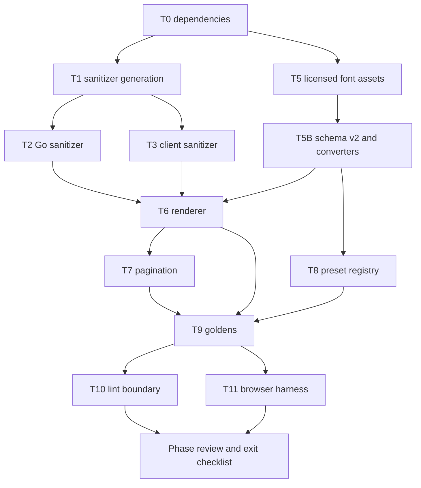

# Phase 3 — Renderer, sanitizer, templates, and fonts

Status: **Revision 7, complete** (2026-08-13). Implementation, fresh review, and
phase gates have passed.

This phase builds the pure Vue resume renderer, both display pagination modes,
the shared sanitizer implementations, self-hosted font catalog, template
registry, deterministic HTML goldens, and browser visual checks. Production
print routes and thumbnails remain P7.

Design v4 and template contract v2 are approved, so every task in this phase is
dispatchable in dependency order. The 20 preset JSON files and the
`header.iconStyle` enum (`none | outline`) already exist; reverify both at the
execution base.

All task implementations and their narrow checks have landed. Shared-file
ownership follows the exclusive windows below.

## Scope boundaries

- P3 Go sanitizer code is the hard input to P2B's write-boundary wiring and the
  P5A public-read and P7A internal-print read boundaries.
- DOMPurify is client-only. Go is the authority for every rich-text value that
  reaches public or internal-print SSR. ADR 0012 owns that split.
- P3 uses a build-flagged renderer harness. It does not ship `/print/**`.
- P7 owns production PDF/image workers and template thumbnails.
- P4 owns the editor, Pinia state, autosave, and ProseMirror.
- Fonts are admitted only by the exact fee-free license rule. Coverage, faces,
  axes, and category are truthful catalog metadata.

## Task index

| Task | Deliverable                                                 | Tier   | State  |
| ---- | ----------------------------------------------------------- | ------ | ------ |
| 0    | Batch pinned web dependencies                               | Normal | Landed |
| 1    | Generate sanitizer allowlist and corpus artifacts           | High   | Landed |
| 2    | Go sanitizer package                                        | High   | Landed |
| 3    | Client DOMPurify wrapper and agreement tests                | High   | Landed |
| 5    | Licensed font assets, manifest, coverage, and readiness     | Normal | Landed |
| 5B   | Immutable document v2 font catalog and converters           | High   | Landed |
| 6    | Pure renderer in continuous mode                            | High   | Landed |
| 7    | Pure pagination engine and editor paged wrapper             | High   | Landed |
| 8    | Preset registry, validation, and apply semantics            | Normal | Landed |
| 9    | Deterministic HTML golden harness                           | Normal | Landed |
| 10   | Renderer import and nondeterminism lint rules               | Normal | Landed |
| 11   | Pinned-browser screenshot, offline-font, sanitizer, CSP run | High   | Landed |
| Gate | Phase review and exit checklist                             | —      | Passed |

Task 4's independent suites are folded into their owning tasks; the required
cases live in [adversarial coverage](adversarial-coverage.md).

Task files:

- [Dependencies](task-00-batch-web-dependencies.md),
  [sanitizer generation](task-01-sanitizer-codegen.md),
  [Go sanitizer](task-02-go-write-path-sanitizer.md), and
  [client sanitizer](task-03-client-render-sanitizer.md)
- [Font assets](task-05-self-hosted-fonts.md) and
  [font schema v2](task-05b-font-schema-v2.md)
- [Renderer](task-06-renderer-core.md), [pagination](task-07-pagination.md),
  [presets](task-08-template-presets.md),
  [goldens](task-09-golden-snapshot-harness.md),
  [lint boundary](task-10-import-lint-rule.md), and
  [browser harness](task-11-playwright-harness.md)

## Execution order

T0 through T11 and the phase gate have landed. Downstream production read and
print integrations remain with P5A and P7A.

## Exclusive shared-file windows

These paths are intentionally serialized. A task may edit them only during its
window; later tasks start from the prior task's verified output.

| Paths                                                                               | Order                               |
| ----------------------------------------------------------------------------------- | ----------------------------------- |
| `packages/schema/scripts/generate.mjs`, `packages/schema/test/gen.test.ts`          | T1 → T5B → T8                       |
| `packages/schema/package.json`                                                      | T1 → T5B → T8                       |
| `packages/schema/{resume.schema.json,resume.v2.schema.json,released-versions.json}` | T5B only                            |
| `packages/schema/gen/go/{resume.go,rawschema.go,released.go,v2/**}`                 | T5B only                            |
| `packages/schema/gen/ts/{resume.ts,released.ts,v2/**}`                              | T5B only                            |
| `packages/schema/templates/*.json`                                                  | T5B → T8                            |
| `apps/web/package.json`, `apps/web/package-lock.json`                               | T0 only                             |
| `apps/web/nuxt.config.ts`                                                           | T5 → T11                            |
| `apps/server/go.mod`, `apps/server/go.sum`, root `go.work.sum`                      | owner pre-T2 pin, then post-T2 tidy |
| root `Makefile`, CI workflows, and root lint configuration                          | integration owner                   |

T1 must finish before T5B, and T5B must finish before T8. This ordering is a
file-ownership rule as well as a data dependency; workers do not coordinate
concurrent edits to these paths.

## Determinism contract

The renderer accepts only a current resume document and an explicit render
context containing the resume language, pagination mode, and an already-
authorized photo URL when the document has photo metadata. It imports no API,
store, editor, Nuxt runtime, clock, random source, locale default, or network
dependency. It renders under plain `vue/server-renderer`.

HTML goldens cover every preset and both display modes. Screenshot baselines use
the named representative subset in the template contract. The Playwright image,
platform, Chromium, viewport, timezone, locale, color profile, font bytes, and
font readiness are pinned. Baseline update flags are absent in verification runs
and retries are forbidden.

Font readiness waits for the selected face and bundled fallback. The declared
English, Vietnamese, and renderer punctuation fixtures cannot reach platform
fonts. Other scripts remain valid content but carry a visible coverage and
platform-fallback warning.

## Acceptance ownership

P3 owns its evidence slices for AC-SEC-001 and AC-SEC-003, rechecks the renderer
half of AC-SEC-004, extends AC-DOC-012 for the v2 release, and owns
AC-REN-001…009 and AC-FONT-001. It does not mark the cross-phase security rows
complete by itself. P2B owns calling the Go sanitizer on every write. P5A owns
defence-in-depth sanitizing on public reads. P7A owns the same re-sanitize
conformance check for the document read that feeds internal print SSR.

Every row needs exact state and evidence before the phase gate. The
[exit criteria](gates.md) adjudicate the candidate commit.

## Authorities

- [Web and renderer design](../../design/web.md)
- [Font catalog](../../design/fonts.md)
- [Template contract](../../design/templates/README.md)
- [Security design](../../design/security.md) and
  [ADR 0012](../../adr/0012-ssr-sanitizer-authority.md)
- [Document versioning](../../adr/0017-resume-document-versioning.md)
- [Decisions](decisions.md), [file structure](file-structure.md), and
  [traceability](../traceability/README.md)
