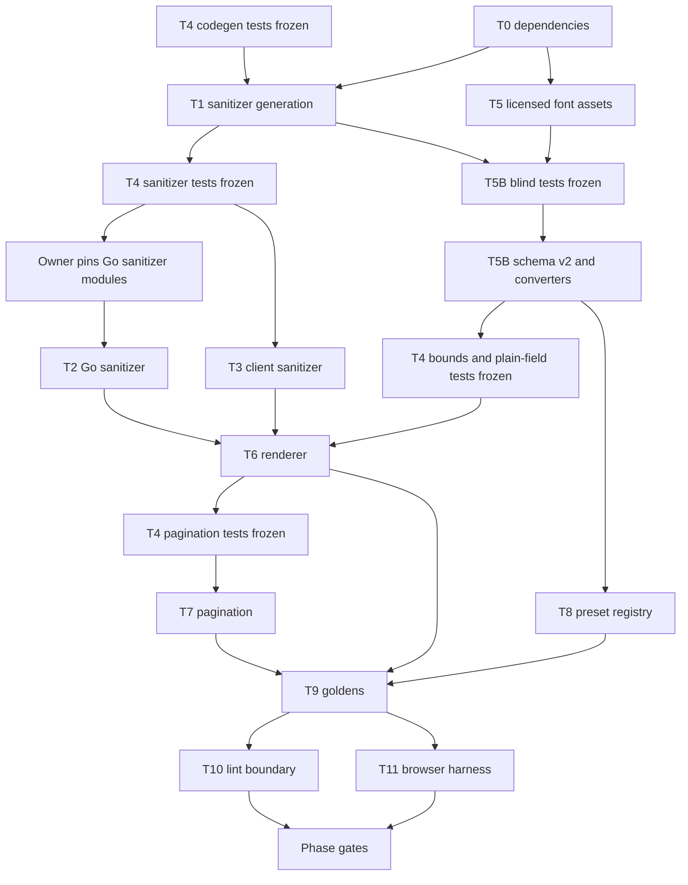

# Phase 3 — Renderer, sanitizer, templates, and fonts

Status: **Draft revision 4; waiting on P2A correction and design approval**
(2026-08-12).

This phase builds the pure Vue resume renderer, both display pagination modes,
the shared sanitizer implementations, self-hosted font catalog, template
registry, deterministic HTML goldens, and browser visual checks. Production
print routes and thumbnails remain P7.

The template documents and 20 preset JSON files have landed, but the template
contract is still draft. “Landed” is not design approval or phase acceptance.

## Preconditions

| Input                 | Required state                                                        |
| --------------------- | --------------------------------------------------------------------- |
| P2A                   | Task 12 and both phase gates passed                                   |
| Draft v4 design       | Independent reviews closed and explicit owner approval recorded       |
| Template contract     | Exact approved revision recorded before renderer goldens are authored |
| Font catalog research | License sources and asset policies frozen                             |
| Shared-file ownership | The exclusive windows below are assigned in their declared order      |
| Acceptance catalog    | Authored and frozen before the phase acceptance run                   |

The `header.iconStyle` enum already permits `none | outline`, and the 20 preset
files exist. Reverify both at the execution base.

## Scope boundaries

- P3 Go sanitizer code is the hard input to P2B's write-boundary wiring and the
  P5A public-read and P7A internal-print read boundaries.
- DOMPurify is client-only. Go is the authority for every rich-text value that
  reaches public or internal-print SSR. ADR 0012 owns that split.
- P3 uses a build-flagged renderer harness. It does not ship `/print/**`.
- P7 owns production PDF/image workers and template thumbnails.
- P4 owns the editor, Pinia state, autosave, and ProseMirror.
- Fonts are admitted only by the exact fee-free license rule. Coverage, faces,
  axes, and category are truthful catalog metadata.

## Task index

| Task | Deliverable                                                 | Tier   | State       |
| ---- | ----------------------------------------------------------- | ------ | ----------- |
| 0    | Batch pinned web dependencies                               | Normal | Landed      |
| 1    | Generate sanitizer allowlist and corpus artifacts           | High   | Implemented |
| 2    | Go sanitizer package                                        | High   | Implemented |
| 3    | Client DOMPurify wrapper and agreement tests                | High   | Implemented |
| 4    | Independent sanitizer, renderer, and pagination suites      | High   | Pending     |
| 5    | Licensed font assets, manifest, coverage, and readiness     | Normal | Pending     |
| 5B   | Immutable document v2 font catalog and converters           | High   | Pending     |
| 6    | Pure renderer in continuous mode                            | High   | Pending     |
| 7    | Pure pagination engine and editor paged wrapper             | High   | Pending     |
| 8    | Preset registry, validation, and apply semantics            | Normal | Pending     |
| 9    | Deterministic HTML golden harness                           | Normal | Pending     |
| 10   | Renderer import and nondeterminism lint rules               | Normal | Pending     |
| 11   | Pinned-browser screenshot, offline-font, sanitizer, CSP run | High   | Pending     |
| Gate | Phase defect review and phase acceptance                    | —      | Pending     |

Task files:

- [Dependencies](task-00-batch-web-dependencies.md),
  [sanitizer generation](task-01-sanitizer-codegen.md),
  [Go sanitizer](task-02-go-write-path-sanitizer.md),
  [client sanitizer](task-03-client-render-sanitizer.md), and
  [independent suites](task-04-blind-adversarial-suites.md)
- [Font assets](task-05-self-hosted-fonts.md) and
  [font schema v2](task-05b-font-schema-v2.md)
- [Renderer](task-06-renderer-core.md), [pagination](task-07-pagination.md),
  [presets](task-08-template-presets.md),
  [goldens](task-09-golden-snapshot-harness.md),
  [lint boundary](task-10-import-lint-rule.md), and
  [browser harness](task-11-playwright-harness.md)

## Execution order

Task 4 has four test-only freeze points. Its codegen-faithfulness suite is
frozen before T1. Its runtime sanitizer suite is frozen after T1 and before Task
2 or 3. Its plain-field and bounds suites freeze in one test-only diff after T5B
and before T6. T6 then passes its renderer-only gate with no pagination test in
the tree. A different fresh author freezes the still-failing pagination suite in
a second, pagination-only diff before T7. No blind author reads the
implementation diff it tests. The implementation authors fix findings; a fresh
reviewer rechecks them.

## Exclusive shared-file windows

These paths are intentionally serialized. A task may edit them only during its
window; later tasks start from the prior task's verified output.

| Paths                                                                               | Order                               |
| ----------------------------------------------------------------------------------- | ----------------------------------- |
| `packages/schema/scripts/generate.mjs`, `packages/schema/test/gen.test.ts`          | T1 → T5B → T8                       |
| `packages/schema/package.json`                                                      | T1 → T8                             |
| `packages/schema/{resume.schema.json,resume.v2.schema.json,released-versions.json}` | T5B only                            |
| `packages/schema/gen/go/{resume.go,rawschema.go,released.go,v2/**}`                 | T5B only                            |
| `packages/schema/gen/ts/{resume.ts,released.ts,v2/**}`                              | T5B only                            |
| `packages/schema/templates/*.json`                                                  | T5B → T8                            |
| `apps/web/package.json`, `apps/web/package-lock.json`                               | T0 only                             |
| `apps/web/nuxt.config.ts`                                                           | T5 → T11                            |
| `apps/server/go.mod`, `apps/server/go.sum`, root `go.work.sum`                      | owner pre-T2 pin, then post-T2 tidy |
| root `Makefile`, CI workflows, and root lint configuration                          | integration owner                   |

T1 must finish before T5B, and T5B must finish before T8. This ordering is a
file-ownership rule as well as a data dependency; workers do not coordinate
concurrent edits to these paths.

## Determinism contract

The renderer accepts only a current resume document and an explicit render
context containing the resume language, pagination mode, and an already-
authorized photo URL when the document has photo metadata. It imports no API,
store, editor, Nuxt runtime, clock, random source, locale default, or network
dependency. It renders under plain `vue/server-renderer`.

HTML goldens cover every preset and both display modes. Screenshot baselines use
the named representative subset in the template contract. The Playwright image,
platform, Chromium, viewport, timezone, locale, color profile, font bytes, and
font readiness are pinned. Baseline update flags are absent in verification runs
and retries are forbidden.

Font readiness waits for the selected face and bundled fallback. The declared
English, Vietnamese, and renderer punctuation fixtures cannot reach platform
fonts. Other scripts remain valid content but carry a visible coverage and
platform-fallback warning.

## Acceptance ownership

P3 owns AC-SEC-001, the P3 half of AC-SEC-003, AC-REN-001…009, and AC-FONT-001.
P2B owns calling the Go sanitizer on every write. P5A owns defence-in-depth
sanitizing on public reads. P7A owns the same re-sanitize conformance check for
the document read that feeds internal print SSR.

Every row needs exact state and evidence before the phase gate. The
[exit criteria](gates.md) and frozen acceptance catalog adjudicate the exact
candidate commit.

## Authorities

- [Web and renderer design](../../design/web.md)
- [Font catalog](../../design/fonts.md)
- [Template contract](../../design/templates/README.md)
- [Security design](../../design/security.md) and
  [ADR 0012](../../adr/0012-ssr-sanitizer-authority.md)
- [Document versioning](../../adr/0017-resume-document-versioning.md)
- [Decisions](decisions.md), [file structure](file-structure.md), and
  [traceability](../traceability/README.md)
