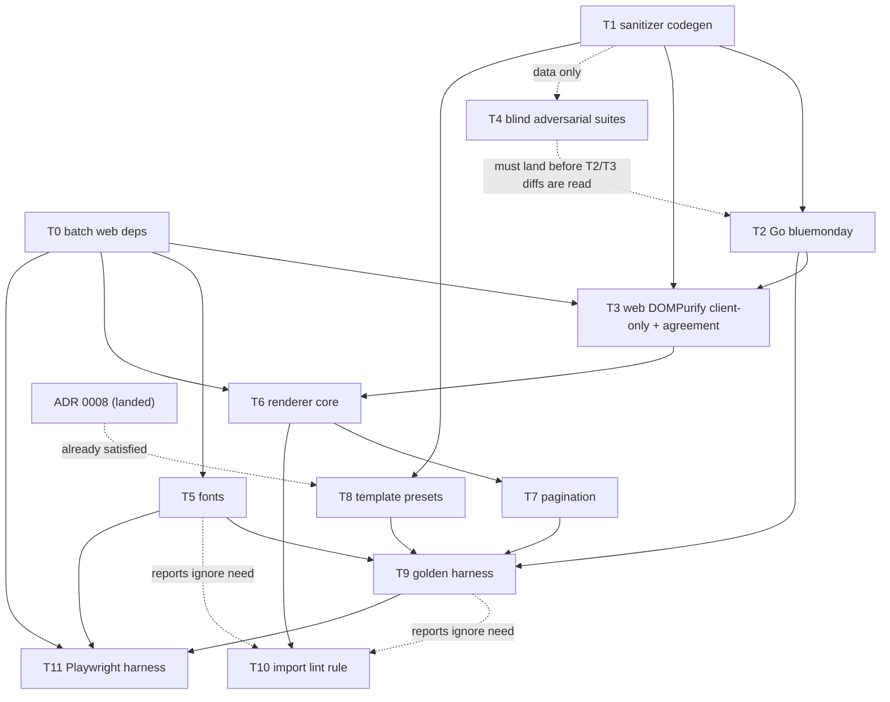

# Phase 3 — Renderer, templates, fonts, sanitizer (implementation plan)

**Rev 2 (2026-08-02)** — review round 1 (ADOPT WITH CHANGES) applied: DOMPurify
is client-only and Go is the SSR sanitization authority (jsdom demoted to a
test-only dependency); template presets carry a placement **rule** computed
against the document's content keys (ADR 0008, owner-authored, gates Task 8);
the renderer-surface CSP splits `style-src`/`style-src-attr` and is validated on
a production-shaped SSR build; blind suites author their **own** predicate with
negative controls.

> **Adopted Rev 2 (2026-08-02)** by the integration owner after an independent
> adversarial plan review (ADOPT WITH CHANGES, 12 blocking findings applied and
> audited). ADR 0008 is Accepted and Task 8 is unblocked; acceptance rows
> `AC-REN-001`…`AC-REN-006` are minted and `AC-SEC-003` records the P3/P2B
> split. Design decisions D1–D21 reflect the review-round-1 integration-owner
> rulings and are written as ratified per the owner's B12 direction. **Task 8's
> ADR 0008 block is satisfied**: `docs/adr/0008-template-apply-semantics.md` is
> Accepted (committed at this base) and its placement-rule semantics match D10
> verbatim — verified during this audit — so Task 8 may proceed without waiting
> on the owner.
>
> **Pre-execution status (updated 2026-08-11).** The two spec disagreements that
> held this plan are **resolved by committed authority**: **ADR 0012** makes Go
> the sole SSR sanitization authority and DOMPurify client-only, ratifying D3;
> **ADR 0013** fixes contact details as array-ordered plain text with `label`
> shipping in P3, ratifying D12 and superseding design spec §5's `detailsOrder`.
> Both are Accepted, and `contract.md` §§5.1/5.5 now restate them, so nothing in
> this plan depends on an unapproved supersession.
>
> Two preconditions remain before dispatch:
>
> 1. **P2A completes.** P3's code half is serialized behind it because
>    `generate.mjs`, `gen/**`, `test/gen.test.ts`, and
>    `apps/server/go.{mod,sum}` are contested files.
> 2. **The D4 schema change lands.** `header.iconStyle` becomes `none|outline`
>    (`solid` dropped — lucide ships no filled family), with
>    `high-contrast.json` and `startup-bold.json` re-authored to `outline`. Task
>    6 and Task 8 both read that enum.
>
> Dispatch itself still re-pins the base and re-verifies the environment-facts
> block below, and `../uat-phase-3.md` is authored by the integration owner
> before the acceptance run (B1). The uncommitted `phase-3-draft-companion.md`
> named by earlier revisions is not authority and must not be required to
> execute this plan.
>
> **What P3-design already landed (Rev 7):** P3-design runs in parallel with
> P2A/P2B and depends only on the frozen document contract, so it has already
> delivered `docs/specs/templates/{contract,tokens,print}.md`, their per-preset
> rationale docs in `docs/specs/templates/presets/`, and the 20 committed preset
> JSONs in `packages/schema/templates/`. Only the _code_ half of P3 stays
> serialized behind P2A (it contests `generate.mjs`, `gen/**`,
> `test/gen.test.ts`, `apps/server/go.{mod,sum}`). P3's remaining scope is
> wiring and rendering — Task 8 validates/generates/wires the 20 presets rather
> than authoring any, and Task 6/7's renderer must be built to match the landed
> templates spec — not template design.
>
> **For agentic workers (once those two preconditions clear):** execute with
> superpowers:subagent-driven-development, one task per fresh subagent, each
> task delivered per its ADR 0011 risk tier — the per-task tiers are the
> risk-tier column of the task index below — high-risk: author TDD, then a fresh
> worker deriving tests from the spec before reading the diff, then a fresh
> reviewer; normal: author TDD plus `make ci`. Steps are `- [ ]`. Every task's
> tests are written **before** its implementation (TDD): write the failing test,
> run it and see it fail, implement, run it and see it pass, commit.

**Goal:** a pure Vue renderer (`apps/web/app/components/resume/`) that turns
`(personalDetails, content, customization)` into deterministic HTML across all
eight section types × template presets × **both pagination modes** (editor
approximate paged vs continuous public); committed golden snapshots; self-hosted
Vietnamese-diacritic fonts that load offline deterministically; the §5 sanitizer
contract enforced on **both** sides from one generated source of truth —
bluemonday as the write-path **and SSR** authority, DOMPurify guarding every
client-side render of user HTML — proven against the shared versioned hostile
corpus across all four surfaces: bluemonday, DOMPurify, SSR, and a real browser
with CSP conformance.

**Base:** `main`, commit `3f4da6f` ("feat(templates): add twenty resume template
presets", 2026-08-11) — contains all of Phase 0, Phase 1, ADR 0010, ADR 0011,
and the P3-design templates-spec/presets landing. Workers must run
`git rev-parse HEAD` and confirm their worktree is at this base or a descendant
before starting (worktree-isolated agents have checked out stale bases before —
verify, don't assume). Re-pin this base and re-verify the whole environment
facts block below at dispatch time.

**Spec:** `../../specs/aboutme-design.md` §5 "Web app (Nuxt 4 / Vue 3)" — the
renderer-purity bullet, the whole "Renderer detail" subsection (contract, tree,
one-column placement, pagination, templates, fonts, sanitizer contract, guards)
— plus §2's "renderer written once" bullet and §3's entry-fields table and
customization mirror. **`docs/specs/templates/{contract,tokens,print}.md`** is
the more specific, later authority for every template, token, and print
statement (landed 2026-08-11 by P3-design) — consult it alongside
`aboutme-design.md` §5, not instead of it. **Master plan:**
`../implementation-plan.md` "Phase 3 — Renderer, templates, fonts, sanitizer"
(exit criteria + task list + the "thumbnails are NOT here" carve-out), "Global
constraints", "Agent workflow", "Testing strategy" rows _Renderer golden_,
_Visual regression_, _Security_. **Traceability:** `../traceability/` rows
**AC-SEC-001** (hostile corpus), **AC-SEC-003** (P3 sanitizer implementations,
with endpoint wiring in P2B), the renderer-link follow-up inside **AC-SEC-004**,
and **AC-REN-001…008** for deterministic rendering, pagination, fonts,
templates, the import boundary, renderer purity, the accessibility floor, and
the 2026-08-11 tokens.

**Not in this phase (explicit):** template **thumbnails are P7B** (they need the
real print pipeline; P7A builds the print worker). P3 owns only a standalone
Playwright screenshot harness for its own visual regression. The `/print/[id]`
page with its single-audience token is **P7A**; the P3 harness uses its own
build-flag-gated route (D17). Wiring `internal/sanitize` into resume write
endpoints, and the Go public-read defence-in-depth re-sanitization that backs
the D3 SSR-authority model, are **P2B/P5A** (the endpoints don't exist yet —
D20). Editor, Pinia store, autosave, ProseMirror are **P4**.

## Plan files

This plan is split across the files below. The tiers are the integration owner's
2026-08-11 ruling under ADR 0011: the sanitizer chain (Tasks 1–4) and the
renderer pair that produces public HTML and its page geometry (Tasks 6–7) are
**high risk**; the rest are **normal**. Ambiguous cases were classified high,
per ADR 0011's own instruction.

| File                                                                         | Contents                                                                                        | Risk tier (ADR 0011) |
| ---------------------------------------------------------------------------- | ----------------------------------------------------------------------------------------------- | -------------------- |
| [`decisions.md`](decisions.md)                                               | Design decisions this plan makes beyond the spec                                                | —                    |
| [`file-structure.md`](file-structure.md)                                     | File structure produced by this phase                                                           | —                    |
| [`task-00-batch-web-dependencies.md`](task-00-batch-web-dependencies.md)     | Task 0: Batch web dependency additions (single owner — B8)                                      | **normal**           |
| [`task-01-sanitizer-codegen.md`](task-01-sanitizer-codegen.md)               | Task 1: Sanitizer allowlist + hostile corpus codegen                                            | **high**             |
| [`task-02-go-write-path-sanitizer.md`](task-02-go-write-path-sanitizer.md)   | Task 2: Go write-path sanitizer (`apps/server/internal/sanitize`)                               | **high**             |
| [`task-03-client-render-sanitizer.md`](task-03-client-render-sanitizer.md)   | Task 3: Client-side render sanitizer (DOMPurify, browser-only) + cross-implementation agreement | **high**             |
| [`task-04-blind-adversarial-suites.md`](task-04-blind-adversarial-suites.md) | Task 4: Blind adversarial sanitizer + render-bounds suites (independent author)                 | **high**             |
| [`task-05-self-hosted-fonts.md`](task-05-self-hosted-fonts.md)               | Task 5: Self-hosted Vietnamese-diacritic fonts                                                  | **normal**           |
| [`task-06-renderer-core.md`](task-06-renderer-core.md)                       | Task 6: Renderer core (continuous mode)                                                         | **high**             |
| [`task-07-pagination.md`](task-07-pagination.md)                             | Task 7: Pagination — pure engine + editor paged mode                                            | **high**             |
| [`task-08-template-presets.md`](task-08-template-presets.md)                 | Task 8: Template presets + registry + apply — ADR 0008 gate satisfied                           | **normal**           |
| [`task-09-golden-snapshot-harness.md`](task-09-golden-snapshot-harness.md)   | Task 9: Golden snapshot harness (both modes × templates × fixtures)                             | **normal**           |
| [`task-10-import-lint-rule.md`](task-10-import-lint-rule.md)                 | Task 10: Editor→renderer one-way import lint rule + purity lint                                 | **normal**           |
| [`task-11-playwright-harness.md`](task-11-playwright-harness.md)             | Task 11: Playwright harness — visual regression, offline fonts, browser corpus + CSP            | **normal**           |
| [`gates.md`](gates.md)                                                       | Phase exit criteria                                                                             | —                    |

## Environment facts (verified 2026-08-11 at `3f4da6f`; re-verify at dispatch)

- Node 24.19.0 (`apps/web/.nvmrc`), Nuxt 4.5.1, Vue 3.5.40, Vitest 4.1.10 with
  `environment: 'nuxt'` (happy-dom), `@vue/test-utils` + `mountSuspended`
  patterns in `apps/web/test/`. TypeScript pinned **6.0.3** — do not bump
  (`vue-tsc` breaks against TS 7's package exports; CLAUDE.md gotcha).
- `packages/schema` is a real dependency of the web app
  (`"@aboutme/schema": "file:../../packages/schema"`, main =
  `gen/ts/resume.ts`); its package.json `exports` map has only `.` and
  `./package.json` — new subpath exports must be added deliberately (Task 1).
- The generator is `packages/schema/scripts/generate.mjs` (jstt for TS,
  quicktype for Go); output determinism is byte-compare-tested
  (`test/gen.test.ts`) and faithfulness conformance-tested
  (`test/conformance.test.ts`). ADR 0006 (schema-derived codegen) is the
  authority for extending it rather than hand-writing parallel artifacts.
- `packages/schema/validation/sanitizer-allowlist.v1.json` (tags
  p/br/strong/em/u/ol/ul/li/a; `a` attrs href/rel/target; schemes
  https/mailto/tel; forbidden tags/`on*`/schemes; linkHardening =
  `noopener noreferrer` on **every** emitted `<a>`) and
  `validation/hostile-corpus.json` (28 payloads, 10 categories, mechanically
  tied to the allowlist by `test/sanitizer-corpus.test.ts`) exist as **data
  only**. Verified directly: no `bluemonday`, `dompurify`, `playwright`, or
  `lucide` reference exists anywhere in `apps/` today.
- `packages/schema/templates/` holds 20 preset JSONs, already tracked and
  committed by P3-design (`git ls-files packages/schema/templates` returns 20),
  with rationale docs in `docs/specs/templates/presets/`. Nothing in `packages/`
  or `apps/` outside those JSON files consumes them yet — Task 8's remaining
  scope is wiring (preset schema/validation, `generate.mjs` emission, the
  `./templates` subpath export, `templates.test.ts`, `applyTemplate.ts`), not
  authoring.
- `packages/schema/gen/go` is a separate Go module tied to `apps/server` via the
  root `go.work`. Run Go commands from inside `apps/server` (CLAUDE.md gotcha);
  a materialized `go.work.sum` goes to the integration owner, never deleted.
- The Go API's CSP (`apps/server/internal/api/security_headers.go`) is
  `default-src 'none'; …` and its own comment says the **SSR HTML CSP "is the
  Nuxt app's own concern"** — no HTML CSP exists anywhere in the repo today
  (verified: Caddyfile sets none for web routes). D5 fills this gap.
- Existing Make targets: `web-lint`, `web-typecheck`, `web-test`, `web-build`,
  `schema-check` (npm ci + full schema test suite), `server-build`,
  `server-vet`, `server-test`, `semgrep`, plus `ci`, `check`, `scan`,
  `hooks-install`, `sqlc-gen`, `sqlc-check`, `semgrep-ci`, `migrate-check`,
  `server-test-db` (`Makefile`). **`make ci` is the ADR 0011 gate of record —
  required before any handoff.** **No Playwright/screenshot target exists**; the
  Makefile and CI workflow are integration-owner-owned — Task 11 _requests_
  targets, it does not add them.
- `git check-ignore .claude/` confirms this draft's directory is git-ignored;
  nothing in `.claude/plans/` is ever committed.

## Global constraints (inherited, plus phase-specific)

- Latest stable, pinned exactly: add dependencies with
  `npm install <pkg>@latest --save-exact` / `go get <mod>@latest` and commit the
  resolved lockfiles — never hand-write version numbers. Every new dependency is
  named in its task and flagged in the design-decisions table — production:
  `bluemonday` + `golang.org/x/net` (Go), `dompurify`, `lucide-vue-next` (web);
  dev-only: `jsdom` (vitest environment — never production, D3), `fontkit`,
  `@playwright/test`. Supply-chain additions beyond that list need
  integration-owner sign-off first. **All five `apps/web` package.json additions
  are installed in one batch by Task 0** (B8) — T3/T5/T6/T11 never touch
  `package.json`/`package-lock.json` themselves, since four tasks editing the
  same lockfile concurrently is exactly the race this rule exists to prevent.
- Google style guides; `gofmt`/`goimports`; ESLint per the committed flat
  config; 80-col `max-len` is enforced — generated goldens and font binaries are
  data, not source, and are excluded from lint, never from review.
- Determinism is the phase's core deliverable: the renderer makes **no**
  `Date.now()`/`Math.random()`/`Intl`/`toLocale*` calls (lint-enforced, D19);
  goldens are byte-exact (D15); screenshots are pinned-container pixel-exact
  (D16). A flaky test is broken, not retried.
- The renderer never redefines the document shape: all types import from
  `@aboutme/schema` (`gen/ts/resume.ts`). Any shape gap goes to the integration
  owner as a schema question, never patched locally.
- **Test-environment purity (B7):** `apps/web/vitest.config.ts` sets
  `environment: 'nuxt'` (happy-dom) globally, so a test that must prove no
  `document`/`window` access is reachable — every renderer-purity test and every
  SSR/passthrough test — needs an explicit file-level
  `// @vitest-environment node` pragma. Without it the global happy-dom shim
  would silently let a stray `document.*` call succeed, defeating the exact
  proof the test exists to make. This applies to `golden.test.ts`,
  `sections.test.ts` (Task 6 Step 1), `ssr-passthrough.test.ts` (Task 3 Step 4),
  and `bounds.adversarial.test.ts` (Task 4 Step 3) — each task marks it
  explicitly.
- No real network calls in any CI test. The Playwright harness explicitly
  **blocks** non-localhost requests (that is itself the offline-fonts
  assertion).
- `make docs-fmt` before committing any `.md` this plan's execution touches.
- Commit discipline per CLAUDE.md: explicit owned paths only, Conventional
  Commits, no AI/agent mentions.

### Verification commands (per change area, run before every handoff)

| Change area                       | Commands                                                                                               |
| --------------------------------- | ------------------------------------------------------------------------------------------------------ |
| `packages/schema/**`              | `make schema-check`; if `gen/go` changed: `cd apps/server && go build ./... && go test ./...`          |
| `apps/server/internal/sanitize`   | `make server-build server-vet server-test` + `make semgrep` (security-sensitive)                       |
| `apps/web/**`                     | `make web-lint web-typecheck web-test web-build`                                                       |
| Playwright harness                | `make web-e2e` (**requested** target — Task 11; until granted, the documented `podman run` invocation) |
| Docs                              | `make docs-fmt && make docs-lint`                                                                      |
| **Before any handoff (ADR 0011)** | `make ci` green — the gate of record; push once per phase, not once per commit                         |

## Shared-file ownership (B8)

Four files are edited by more than one task. Concurrent edits to any of them is
exactly the index-contamination CLAUDE.md warns about, so each gets exactly one
rule:

| File                                          | Tasks that touch it | Rule                                                                                                                                                                                                                                                                                         |
| --------------------------------------------- | ------------------- | -------------------------------------------------------------------------------------------------------------------------------------------------------------------------------------------------------------------------------------------------------------------------------------------- |
| `apps/web/package.json` + `package-lock.json` | T3, T5, T6, T11     | **Batched.** Task 0 installs every dependency these four tasks need (`dompurify`, `lucide-vue-next` prod; `jsdom`, `fontkit`, `@playwright/test` dev) in one commit before any of T3/T5/T6/T11 starts. None of the four edit this file again.                                                |
| `apps/web/eslint.config.mjs`                  | T5, T9, T10         | **Task 10 is sole owner.** It lands the D19 override block plus the two known static ignore globs (`app/assets/fonts/**` for T5, `apps/web/test/renderer/golden/**` for T9) in one commit. T5 and T9 state the ignore they need in their task report; they do not edit this file themselves. |
| `apps/web/nuxt.config.ts`                     | T5, T11             | **Sequential**, by the existing T5→T11 execution-order edge. T5 lands its `css:` font registration first; T11 reads the landed file and adds its `NUXT_HARNESS` hook block additively — never a blind overwrite.                                                                             |
| `packages/schema/scripts/generate.mjs`        | T1, T8              | **Sequential**, by the existing T1→T8 execution-order edge (already required for T8's ADR-gated content; Task 8 Step 0/Step 4 state it explicitly).                                                                                                                                          |

## Execution order

Task 0 is a single-owner prerequisite for every task that touches
`apps/web/package.json` (B8) and has no other dependency, so it runs first. T5
(fonts) and T8 (templates) are parallelizable with T2/T3 once T1 lands. **T8's
ADR 0008 gate is already satisfied** — the ADR is Accepted and matches D10
(verified this audit) — so T8 needs no further wait. T9 consumes T2's committed
corpus-output artifact for its SSR-surface step, and adding `vn-full.json` under
T9 is serialized with P2A (B11 — see Task 9 Step 0). T4's author is dispatched
**at the same time as** T2/T3 and must finish authoring before reading either
implementation diff. The dashed `reports ignore need` edges are informational,
not blocking: T5 and T9 do not wait on T10 to proceed with their own work, they
only hand T10 the exact ignore glob to add (B8's `eslint.config.mjs`
single-ownership rule).
