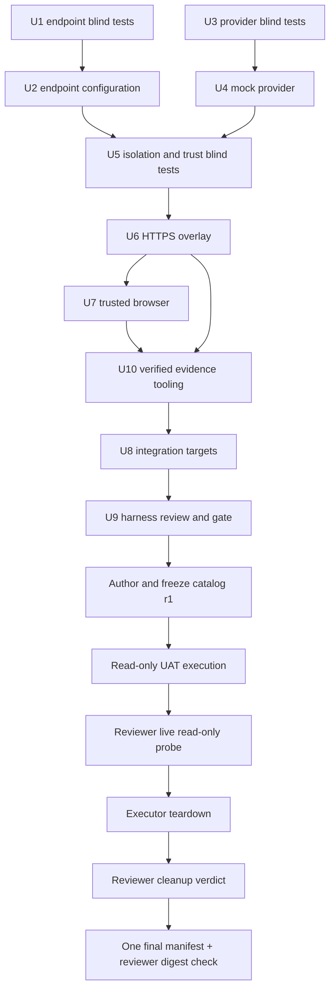

# Phase 9 — HTTPS local UAT

Status: **Revision 4, draft; harness implementation and UAT are blocked**
(2026-08-12).

P9 proves a release candidate through user-like browser actions before any AWS
resource exists. The main-session executor runs the UAT. The human owner does
not execute it.

The current `make dev` stack is HTTP-only. It remains an image/network smoke and
self-hosting check. P9 uses an isolated Podman Compose deployment at
`https://localhost` on port 443.

## Authority and files

The [design](../../design/README.md), OpenAPI, accepted ADRs, and
[traceability rows](../traceability/README.md) define expected behavior. This
plan defines task order, ownership, evidence, and gates. It cannot change a
product contract.

| File                                               | Purpose                                      |
| -------------------------------------------------- | -------------------------------------------- |
| [Harness](harness.md)                              | HTTPS stack, mock providers, and U1–U9 tasks |
| [Catalog contract](acceptance-catalog-contract.md) | Future immutable criterion catalog           |
| [Evidence tooling](evidence-tooling.md)            | U10 safe-export implementation and gate      |
| [Execution](execution.md)                          | Candidate preparation and scenario order     |
| [Evidence](evidence.md)                            | Safe export, review, teardown, and verdict   |

The future frozen catalog has the exact paths
`docs/plans/phase-9/acceptance-catalog-r1.{md,json}`. They do not exist yet
because the applicable P0–P8 criteria and U1–U10 implementation are not
complete.

## Role boundary

- Harness workers edit only their assigned files. They do not touch Git.
- The integration owner alone edits shared integration files and schedules the
  shared database and object-store handoff.
- The catalog author is fresh and did not implement the behavior or harness it
  specifies.
- The UAT executor is repository-read-only. It may change only the labeled
  `aboutme-uat` runtime and ignored volatile or evidence paths.
- The evidence reviewer is fresh and read-only except for one append-only
  `reviews/<stage>.json` write through U10's verified `review` mode. It cannot
  edit product code, tests, fixtures, snapshots, seeds, criteria, runtime state,
  executor evidence, or an existing review.

## Required order



No U6 or U7 work starts before U5 records all required expected failures. U10
starts only after U6 defines run-secret custody and U7 freezes the browser
output formats. U8 follows U10 because both require a serialized
integration-owner Makefile window. U9 reviews the combined result. P9 execution
stays blocked until U9 and U10 pass and catalog r1 is frozen.

## Host and shared-resource gate

These are pre-dispatch blockers, not setup actions for an agent or script:

1. A host administrator reads `sysctl net.ipv4.ip_unprivileged_port_start`. If
   it is greater than 443, the administrator runs
   `sysctl -w net.ipv4.ip_unprivileged_port_start=443` once and verifies the
   value is at most 443. Agents and project scripts never use `sudo` or change
   this setting.
2. The integration owner runs `make ci` at the candidate commit while the shared
   test services are still available.
3. The owner announces the UAT resource handoff to every worker using the live
   database, native stack, or S3-compatible test service and waits for each
   worker to acknowledge that it is idle.
4. The owner runs `make dev-native-down`, `make test-db-down`, and
   `make test-s3-down`. The owner verifies that no other aboutme PostgreSQL or
   S3-compatible container remains and that port 443 is free.

`make uat-up` repeats the read-only checks and fails closed if the sysctl is too
high, port 443 is occupied, another aboutme PostgreSQL or S3-compatible
container exists, or another aboutme stack is active. It never stops or changes
another project. This handoff preserves one PostgreSQL container and one local
S3-compatible service for the whole machine.

## UAT entry conditions

- The candidate is one clean exact commit containing completed P0–P8 web v1 and
  PI code-only/local-IaC work. Every affected phase gate and `make ci` passed at
  that commit.
- The candidate contains `apps/server/migrations/.uat-baseline`; the UAT run
  proves the migration history that becomes immutable when this commit lands.
- U9 and U10 passed at the same commit. The host and shared-resource gate above
  is complete.
- Catalog r1 maps every applicable acceptance row, is frozen, and has recorded
  Markdown and JSON SHA-256 digests.
- Podman, Compose, Chrome, Playwright MCP, image IDs, migration head, Caddy root
  digest, and the IPv4-only loopback policy are recorded.
- AWS and Cloudflare credentials are absent. No external mutation is authorized
  or required.

## Candidate identity initialization

Every task or new shell that consumes a P9 image sources the same U6-owned,
independently tested helper before use:

```sh
. scripts/uat-identities.sh <paths|images|final>
```

The helper derives `P9_COMMIT` from checked-out `HEAD`, rejects a different
supplied commit, and exports these commit-keyed paths:

- `P9_TOOLING_ROOT=.superpowers/uat/p9-tooling/$P9_COMMIT`;
- `P9_BROWSER_IID_FILE=$P9_TOOLING_ROOT/browser-image.iid`;
- `P9_EVIDENCE_IID_FILE=$P9_TOOLING_ROOT/evidence-image.iid`;
- `P9_BROWSER_OUTPUT_CONTRACT=$P9_TOOLING_ROOT/browser-output-contract.json`;
- `P9_IDENTITY_FILE=$P9_TOOLING_ROOT/identities.json`; and
- `P9_SENTINEL_COVERAGE_FILE=deploy/uat/sentinel-coverage.json`.

`paths` validates and exports paths before a build. `images` also reads both IID
files, exports `P9_BROWSER_IMAGE_ID` and `P9_EVIDENCE_IMAGE_ID`, and proves each
exact ID exists in Podman. `seal`, run as `scripts/uat-identities.sh seal`,
atomically writes a mode-`0600` closed identity file containing the candidate
commit, both image IDs, and SHA-256 digests of the browser-output contract and
sentinel coverage map. `final` repeats `images`, requires that identity file,
and recomputes every field and digest. Only `paths` accepts an uncommitted
authoring diff, and it never counts as release evidence. `images`, `seal`, and
`final` require a clean tree. A tag, missing file, changed digest, or wrong
commit fails closed. U9 rebuilds both images, runs `seal`, and passes `final` at
the release candidate. Every later shell sources `final`; it never relies on a
variable inherited from an earlier task or session.

## Exit

P9 passes only when every catalog row is `PASS`, the live evidence review passes
before teardown, teardown succeeds, and the reviewer gives a final cleanup
verdict at the same commit. `BLOCKED`, missing evidence, unsafe evidence, or an
undisclosed retry fails the run.

Only after that verdict may the integration owner ask the human owner to
authorize AWS resource creation. Production still requires a separate approval
after P9A.
