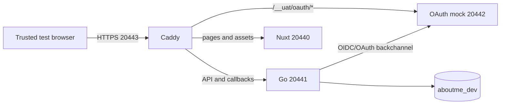

# Native HTTPS Authentication Harness Design

Status: Design approved for implementation on 2026-08-13.

## Purpose

Add a lightweight native development harness at `https://localhost:20443` so
real browser tests can prove Secure `__Host-` cookies, OAuth callbacks,
authenticated API calls, CSRF, and logout before the full Phase 9 UAT stack is
needed.

This harness enables Phase 4 editor work. It does not replace the isolated Phase
9 port-443 topology or its final resource-isolation gate.

## Boundaries

The harness:

- uses the shared `aboutme-test-db` container and its `aboutme_dev` database;
- runs Go, Nuxt, Caddy, and the OAuth mock as native processes;
- binds every process to IPv4 loopback;
- publishes one browser origin, `https://localhost:20443`;
- keeps certificates, process state, logs, media, and browser evidence under
  ignored `.dev/` paths;
- never changes the host trust store;
- never disables TLS verification;
- never uses real OAuth credentials or external provider endpoints.

It does not:

- claim the Phase 9 U1-U5 isolation criteria;
- run a second PostgreSQL or S3-compatible container;
- bind port 443;
- mutate AWS, Cloudflare, DNS, registries, or staging;
- add publish, editor, or public-resume product behavior.

## Architecture

`scripts/dev-https.sh` owns the harness lifecycle. It follows the existing
`dev-native.sh` process-group and PID-file model but uses a separate state root
and separate ports.

| Service    | Address           | Purpose                                     |
| ---------- | ----------------- | ------------------------------------------- |
| Caddy      | `127.0.0.1:20443` | Sole HTTPS browser origin                   |
| Go         | `127.0.0.1:20441` | API, OAuth callbacks, sessions, and CSRF    |
| Nuxt       | `127.0.0.1:20440` | Landing, login, settings, and future editor |
| OAuth mock | `127.0.0.1:20442` | Browser authorization and backchannel calls |
| PostgreSQL | `127.0.0.1:20432` | Existing shared development database        |

The harness refuses to start when the HTTP native stack is active or any owned
port is occupied. It does not stop either condition automatically.



## TLS trust

Caddy uses `tls internal` for `localhost`. Its config and data directories live
under `.dev/native-https/caddy/`, so its CA is project-local and disposable. The
lifecycle script exports the root certificate to
`.dev/native-https/input/caddy-root.crt` with mode `0600`.

The browser check uses `deploy/dev-https-browser.Dockerfile`, derived from the
existing digest-pinned Phase 3 Playwright image. The base image does not contain
`certutil`, so the derived image installs an exact pinned `libnss3-tools`
package and its identity is recorded by the build contract. A small browser
wrapper creates a disposable Network Security Services (NSS) database inside the
container, imports only that root, and launches the pinned Chromium against
`https://localhost:20443`. It must not pass `--ignore-certificate-errors`, use a
personal profile, or mount the repository, home directory, container socket, or
`.env`.

Only the CA input directory is mounted read-only. A scenario-specific ignored
evidence directory is the sole writable bind mount.

## OAuth configuration and mock

Runtime provider endpoints become explicit validated configuration, rather than
test-only service fields:

- `GOOGLE_OIDC_ISSUER_URL`
- `LINKEDIN_OIDC_ISSUER_URL`
- `GITHUB_OAUTH_AUTHORIZE_URL`
- `GITHUB_OAUTH_TOKEN_URL`
- `GITHUB_API_BASE_URL`

Production and staging reject these variables. Development validates overrides
per provider: Google and LinkedIn each require one issuer, while GitHub requires
all three GitHub URLs. Every backchannel URL must use a loopback listener, and
each browser authorize URL must use the exact public origin. Absence preserves
the current production endpoint for that provider and ordinary HTTP development
behavior.

The harness supplies visibly fake client IDs and secrets. The mock implements
one successful deterministic Google account first, using real OIDC discovery,
JWKS, authorization code, PKCE S256, nonce, token, issuer, audience, and
signature checks. Its browser authorization URL is
`https://localhost:20443/__uat/oauth/google/authorize`; its discovery and token
endpoints use `http://127.0.0.1:20442`.

The mock binds only to loopback, accepts only the fixed callback
`https://localhost:20443/api/v1/auth/google/callback`, consumes codes once, and
has no management endpoint. A process restart resets its deterministic state.
GitHub, LinkedIn, linking, and provider failure catalogs remain in the full
Phase 9 overlay scope. Successful Google reauthentication is included because it
supplies the first authenticated CSRF mutation proof.

The settings-page authorization allowlist accepts a same-origin HTTPS
`/__uat/oauth/` URL only when the current page is also loopback HTTPS. Existing
exact production-provider checks remain unchanged.

## Routing and lifecycle

The generated HTTPS Caddyfile starts from the deployed route table. It changes
only the site address, upstream addresses, TLS directive, and the mock OAuth
route. Route-shape tests fail if those substitutions stop matching exactly.

The script exposes:

- `up`: check tools and port ownership, start/reuse the shared database, run
  migrations, build and start mock/Go/Nuxt/Caddy, export the CA, and verify
  readiness;
- `down`: stop Caddy first, then Nuxt, Go, and the mock; leave the shared
  database running;
- `status`: verify every PID, listener, TLS endpoint, and public readiness
  check;
- `logs`: show or follow only harness-owned logs.

Root Make targets are `dev-https`, `dev-https-down`, `dev-https-status`,
`dev-https-logs`, and `dev-https-auth-check`.

`up` is idempotent only when all live processes still match their recorded
process groups and configuration. A stale PID, changed generated config, foreign
listener, unreadable root certificate, or partially running stack fails closed
with an exact recovery command.

## Authentication proof

`dev-https-auth-check` drives one real browser flow through the public origin:

1. Open `/login` with no session.
2. Start Google login and confirm `__Host-oauth-tx` is Secure, HttpOnly,
   SameSite=Lax, host-only, and path `/`.
3. Select the deterministic fake account at the same-origin mock page.
4. Complete the callback and confirm the transaction cookie is cleared.
5. Confirm `__Host-session` has the same required security attributes.
6. Fetch `/api/v1/me` and receive the deterministic account plus a CSRF token.
7. Start Google reauthentication with a valid CSRF token, complete it, and
   verify success.
8. Repeat the start request without CSRF and verify the closed rejection.
9. Log out with a valid CSRF token and verify `/api/v1/me` returns `401`.
10. Assert no external network request, certificate error, browser console
    error, page error, or secret-bearing evidence.

The initial mutation is a session operation already present in the product. A
Phase 4 browser test later adds resume read/write/autosave without changing the
harness contract.

## Failure and security behavior

- Config rejects partial provider overrides and never logs credential values.
- Provider calls keep the existing bounded HTTP client and response limits.
- OAuth state, nonce, PKCE, exact redirect URI, one-use code, issuer, audience,
  and signature failures remain closed.
- Caddy remains the client-IP trust boundary; browser-supplied forwarding
  headers are removed before the canonical header is set.
- The script never uses `sudo`, changes sysctls, removes foreign processes, or
  deletes paths outside `.dev/native-https/`.
- Browser output is local-only and must not contain raw cookies, CSRF tokens,
  OAuth codes, or client secrets.

## Verification

Implementation is test-first and split into four independently checkable units:
runtime endpoint configuration, mock provider, native TLS lifecycle, and trusted
browser proof.

Narrow gates are:

```sh
(cd apps/server && go test ./internal/config ./internal/auth -run 'HTTPS|Endpoint' -count=1)
(cd apps/server && go test ./internal/uatmock ./cmd/mock-oauth -count=1)
bash -n scripts/dev-https.sh scripts/dev-https-test.sh
bash scripts/dev-https-test.sh --static
make route-table-test operational-test
make web-lint web-typecheck web-test web-build
make server-build server-vet server-test
make dev-https-auth-check
```

The live browser command is a local development gate, not a hosted-CI gate. A
fresh review must name TLS trust, auth, session cookies, CSRF, provider endpoint
isolation, secret handling, and destructive targeting before this enabling slice
is used as Phase 4 browser evidence.

## Follow-on work

After this harness is green:

- Phase 4 uses it for authenticated editor browser checks.
- Phase 5A proceeds independently; its unauthenticated public SSR checks may
  continue over the native HTTP stack.
- Phase 9 still builds the isolated `aboutme-uat` Compose stack, full provider
  and failure catalogs, private S3 service, trusted port-443 browser, reset
  containment, and final local UAT evidence.
