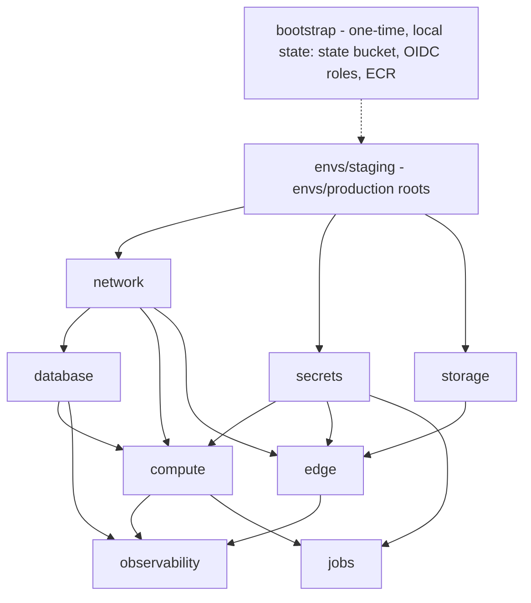

# Phase PI — Infrastructure as code (implementation plan)

> **Adopted Rev 3 (2026-08-02)** by the integration owner after two independent
> Opus plan-review rounds plus a scoped verification pass (workspace record:
> `phase-pi-review-r1.md` and the Rev 2/Rev 3 disposition maps). Traceability
> rows AC-INF-001…008 and AC-OPS-015…019 were ratified into `traceability.md` at
> adoption. **Execution is hard-blocked on the "Escalations pending human owner"
> section below — spend authorization first.**
>
> **Changelog Rev 3:** final-round amendments — custom `orp-auth-api` excluding
> viewer-supplied `X-Origin-Secret`/`X-Real-IP`/`Forwarded` on `/api/v1/*`
> (replaces AllViewerExceptHostHeader; pinned by a `terraform test` assertion);
> Task 14 SSR-path end-to-end check + bridge-gateway address verification at
> caddy start; exit-map row qualified for D24 with master-plan patch Edit 3; D24
> records the design owner's SSR rate-limit keying ruling; AC-INF-002 split
> (staging gate → AC-INF-007, noindex → AC-INF-008, both attributed "PI D25");
> `orp-no-cookie` header-drop inheritance flagged for P5A in the companion
> notes.
>
> **Changelog Rev 2:** addresses all 12 blocking and all 15 non-blocking
> findings of the Opus round-1 plan review (`phase-pi-review-r1.md`):
> fail-closed origin-secret + CIDR contract with new test rows 11–20 (Task 7);
> corrected D6 rationale + alarmed prefix-list drift detector; explicit
> `header_up` XFF suppression; repeated-header rows; **D24 redesigned** (web
> tier leaves the host network namespace — no risk acceptance); CloudFront
> origin-request-policy column + HSTS placement + staging access gate;
> origin-secret via regular sensitive data source; ECR moved to bootstrap;
> pre-migration snapshot + code-back/schema-forward rollback; traceability rows
> ratified via companion patch files (AC-INF-001…006, AC-OPS-015…019);
> caddy.Dockerfile moved into Task 7; escalations split into a dedicated
> human-owner section; shared-file serialization note.
>
> **For agentic workers:** execute with superpowers:subagent-driven-development,
> one task per fresh subagent, Opus 5 review between tasks. Steps are `- [ ]`.
> Every task's tests are written **before** its implementation (TDD): write the
> failing check, run it and see it fail, implement, see it pass, commit.

**Goal:** Terraform modules that apply cleanly to a **staging** environment
mirroring the production topology (VPC, ECS on EC2 Graviton with host networking
for the edge/API tier and fixed ports, RDS Postgres gp3, S3 media, CloudFront +
ACM us-east-1 with the spec §6 behavior matrix, Caddy origin with EIP +
auto-reassociation, origin-secret + prefix-list ingress, SSM secrets with IAM
scoping and rotation, CloudWatch alarms/dashboards/SNS, scheduled retention +
restore-verification jobs, arm64 image build + ECS deploy pipeline with
drain→readiness and the migration advisory-lock sequence), with
`terraform validate`/`plan` wired into CI and staging/production differing
**only by variables**. Plus the **BLOCKING** Phase 0 security-review item: a
production Caddy configuration that derives the viewer address from CloudFront's
validated inbound chain after verifying `X-Origin-Secret`, emits exactly one
canonical client-IP header, **refuses service on empty/unset boundary
configuration**, and is proven by an end-to-end CI test with two viewers through
one simulated edge plus forged and duplicated forwarding headers.

**Base:** `main`, commit `9382c86` (the squashed public initial commit,
2026-08-02), **or the then-current integrated `main` descendant at dispatch
time** — PI depends only on P0, not on P1. PI executes in its **own isolated
worktree** branched from `main`; do not build on the `worktree-phase-1-auth`
branch. Workers must run `git rev-parse HEAD` and
`git merge-base --is-ancestor 9382c86 HEAD` and confirm both before starting
(worktree-isolated agents have checked out stale bases before; this check is
mandatory, not advisory).

**Spec:** `../specs/aboutme-design.md` §2 (system architecture, authoritative
route table, health-endpoint contract), §3 "Schema management" (prod migration
sequence: stop writes → backup + verify → advisory lock → goose up), §6
(client-IP trust boundary, prod topology table, CloudFront behavior matrix,
origin bypass/rotation, RDS, S3/backups, DNS), §9 "Privacy lifecycle &
operations" rows _Secrets_, _Monitoring_, _Retention_, and §0 (versions, CI/CD).
**Master plan:** `implementation-plan.md` — "Phase PI" (mandate + BLOCKING
requirement + exit criteria), "Global constraints", "Agent workflow",
"Integration discipline". **Budgets:** `budgets.md` rows wired into
infrastructure (see the budget-wiring table below). **Traceability:**
AC-INF-001…008 (PI-owned) and AC-OPS-015…019 (P9A-owned) — ratified by the
integration owner at adoption via the companion patch files
`phase-pi-traceability-patch.md` and `phase-pi-masterplan-patch.md` (committed
to `main` before dispatch); this plan references the IDs as ratified.

**Scope boundaries (mandatory):** PI **builds**; P9A **exercises**; P10
**promotes**. This plan provisions staging and produces production-parameterized
modules, but performs **no production apply, no public DNS cutover, no ops
drills** (those are P9A/P10). Deep Vietnam data-residency work and Flutter are
out of scope. **No ALB** (owner decision, spec §10). The rootless-podman dev
stack (`deploy/compose.yml`, dev `CADDY_HTTP_PORT` gotcha) is untouched except
the explicitly flagged shared route-snippet extraction in Task 7 (which uses
env-placeholder defaults so `compose.yml` itself needs no edit). Root
`Makefile`, `.github/workflows/*`, and `.env.example` are integration-owned: PI
workers author exact diffs and hand them to Fable rather than editing (Tasks 7,
8, 12, 13).

**Shared-file serialization (cross-phase):** PI runs in parallel with P1, which
also appends to repo-root `.env.example`, fills rows in
`docs/plans/traceability.md`, and may touch `docs/architecture.md`. These three
files — plus the root `Makefile` and `.github/workflows/*` already listed above
— are **owner-only integration points for this phase**: PI workers never edit
them directly, even in PI's own worktree; they hand the integration owner an
exact diff and the owner serializes application across phases (consistent with
how P1 is already being run).

## Environment facts (verified 2026-08-02 at `9382c86`)

- `deploy/` today: `compose.yml` (three disjoint networks — `db`, `edge`
  10.90.0.0/28, `frontend`; one-shot `migrate` service using the server image
  with a `migrate` entrypoint; `PGPASSWORD` never spliced into `DATABASE_URL`),
  `caddy/Caddyfile` (dev), `server.Dockerfile` (builds `server` + `migrate`
  binaries; Chromium seam reserved for P7A), `web.Dockerfile`. **`deploy/aws/`
  does not exist yet** — spec §6/§7 reserve it for Terraform.
- The dev Caddyfile carries an explicit **"DEV ONLY — do not promote
  unchanged"** marker naming this phase: it sets `X-Real-IP` from the immediate
  peer, which behind CloudFront is the **edge**, recreating the cross-tenant DoS
  the Phase 0 security review flagged. Caddy 2.11.4
  (`docker.io/library/caddy:2.11.4-alpine`) is the pinned dev version.
- A live-Caddy test harness already exists:
  `apps/server/internal/routetable/route_table_test.go` drives the real dev
  Caddyfile through a `caddy` binary (`CADDY_BIN`, `make route-table-test`, CI
  job `route-table` with a pinned caddy) against two stub backends, asserting
  backend fingerprints, **including a listen-port substitution so the test never
  needs a privileged port**. Task 7 extends this pattern (including the port
  substitution); do not invent a second harness.
- Go server config contract (P0, tested): `ENV=prod` **and** `ENV=staging` fail
  closed without `TRUSTED_PROXY_CIDRS` (each CIDR ≤ /8 IPv4, ≤ /48 IPv6, no
  IPv4-mapped prefixes) and require a **loopback** `LISTEN_HOST` (AC-OPS-009,
  AC-OPS-014). The canonical client-IP header is `X-Real-IP`, accepted only from
  trusted-proxy peers (AC-OPS-008). Host networking for Caddy + Go satisfies
  this exactly: Go binds `127.0.0.1:8080`, Caddy proxies via loopback,
  `TRUSTED_PROXY_CIDRS=127.0.0.1/32`. **The web tier does NOT share that
  namespace** — see D24.
- Fixed port contract (P0/spec §6): Caddy `80/443` (prod SG exposes only 443 —
  see decision D14), Go `127.0.0.1:8080`, Nuxt `127.0.0.1:3000` (satisfied in
  prod via the bridge port publication in D24); desired count 1 per service; no
  service discovery.
- CI jobs at base:
  `docs, schema, api, server, web, server-integration, migrations-append-only, semgrep, route-table, data-drift`
  (`.github/workflows/ci.yml`). Makefile targets relevant here: `docs-fmt`,
  `docs-lint`, `route-table-test`, `dev`, `test-db-up/down`,
  `server-migration-test`.
- Two-runner migration safety is already implemented and tested (AC-OPS-001):
  goose Provider with Postgres session advisory lock,
  `apps/server/migrations/harness_test.go::TestHarness_ConcurrentRunners_ExactlyOneApplies`.
  PI reuses it; PI does not re-implement migration locking.
- `.env.example` holds names-only variables; `.env` is git-ignored and never
  committed. The repo is **public**: no secret, account ID, or internal hostname
  may appear in Terraform code, tfvars, workflow logs, or docs.
- The repo `go.work` gotcha applies: run Go commands from inside `apps/server`.
- Budgets that bind infrastructure (from `budgets.md`): whole-server-task memory
  ≤ 512 MiB — a **task-level cgroup** (Go + Chromium together), not a
  container-level limit; pgx pool ≤ 20 < Postgres `max_connections`; SSE ≤ 2000
  conns/task with ≥ 25 % fd headroom; SSE heartbeat 25 s < CloudFront idle
  timeout; API/SSR p95 SLOs measured in P9A on the production instance class.
- GitHub facts (verify at execution): the repo is public, so GitHub-hosted
  **arm64 Linux runners** (`ubuntu-24.04-arm`) are free, and **fork PRs do not
  receive repository secrets** — CI jobs needing AWS credentials must not run on
  the PR gate (decision D17).

## Global constraints (inherited, plus phase-specific)

- **Latest stable at scaffold time, then pinned exactly.** At scaffold the
  implementer resolves and pins: Terraform version (`required_version` exact,
  plus a committed `.terraform-version`), AWS provider (exact version in
  `required_providers` + committed `.terraform.lock.hcl` with
  `terraform providers lock -platform=linux_amd64 -platform=linux_arm64`),
  tflint + its AWS ruleset, xcaddy, `caddy-dns/cloudflare` module version,
  ECS-optimized arm64 AMI (pinned via SSM parameter **resolved and recorded**,
  not floating), and all base image digests. Never hand-write a version guessed
  from memory; resolve it, then commit the resolved pin.
- Feature-availability guardrail: several mechanisms this plan names shipped in
  specific toolchain versions (Terraform native S3 state locking `use_lockfile`;
  `terraform test` mock providers; ephemeral values + write-only arguments such
  as `aws_db_instance.password_wo`; Caddy `trusted_proxies` /
  `client_ip_headers` / `{client_ip}`). The pinned versions resolved at scaffold
  time will satisfy all of them, but the implementer must **verify each against
  the pinned version's documentation before use** and report a mismatch to the
  integration owner instead of substituting a different mechanism silently.
- HCL style: `terraform fmt` mandatory; module inputs/outputs documented with
  `description`; no `provider` blocks inside shared modules (providers are
  passed from the env roots); no `count`/`for_each` churn that would force
  destroy/recreate of stateful resources on a variable flip.
- Shell scripts: `bash`, `set -euo pipefail`, shellcheck-clean.
- **No secrets in repo or state where avoidable:** secret _names_ live in code;
  secret _values_ live in SSM SecureString written by the bootstrap script from
  `.env`/operator input. The single unavoidable exception (CloudFront's
  `X-Origin-Secret` custom origin header value, which AWS stores in the
  distribution config and therefore in Terraform state) is documented and
  mitigated in decision D9.
- Determinism: `terraform test` runs use mock providers (no network, no
  credentials) — and wherever a module's behavior is wired through a **data
  source** (managed prefix list, SSM parameters, AMI lookup), the test must
  supply explicit `override_data`/mock-data values so the assertion checks real
  derived wiring, not provider-generated placeholders. The Caddy boundary test
  injects its secrets, CIDRs, and listen ports via env vars and stub backends
  exactly like the existing route-table test — no real CloudFront, no sleeps, no
  retries.
- Conventional Commits; no AI/agent mentions; `make docs-fmt` before committing
  any touched `.md`.
- Real-AWS work (bootstrap apply, staging apply, ACM issuance, cf DNS) is
  **explicitly labeled** in its task, runs only from an operator/maintainer
  context — never from a fork-PR CI job — and records evidence (redacted command
  output) in the phase ledger under `.superpowers/`.

## Design decisions this plan makes beyond the spec

The spec fixes the topology and security policy but leaves the IaC mechanics
open. Each gap gets an explicit decision here, flagged for Fable to confirm or
overturn in design review — none is a TODO. Items requiring **human-owner**
approval are additionally listed in "Escalations pending human owner" and are
not treated as resolved by this table.

| #   | Gap                                                                    | Decision + rationale                                                                                                                                                                                                                                                                                                                                                                                                                                                                                                                                                                                                                                                                                                                                                                                                                                                                                                                                                                                                                                                                                                                                                                                                                                                                                                                                                                                                                                                                                                                                                                                                                                                                                                                                                                                                                                                                                                                                                                                                                                                                                                                                                                                                                                                                                                                                                                                                                                                                                                                                                                                                                                                                                                                                                                                                                                                                                                                                                                                                                                                                                                                                                                                                                         |
| --- | ---------------------------------------------------------------------- | -------------------------------------------------------------------------------------------------------------------------------------------------------------------------------------------------------------------------------------------------------------------------------------------------------------------------------------------------------------------------------------------------------------------------------------------------------------------------------------------------------------------------------------------------------------------------------------------------------------------------------------------------------------------------------------------------------------------------------------------------------------------------------------------------------------------------------------------------------------------------------------------------------------------------------------------------------------------------------------------------------------------------------------------------------------------------------------------------------------------------------------------------------------------------------------------------------------------------------------------------------------------------------------------------------------------------------------------------------------------------------------------------------------------------------------------------------------------------------------------------------------------------------------------------------------------------------------------------------------------------------------------------------------------------------------------------------------------------------------------------------------------------------------------------------------------------------------------------------------------------------------------------------------------------------------------------------------------------------------------------------------------------------------------------------------------------------------------------------------------------------------------------------------------------------------------------------------------------------------------------------------------------------------------------------------------------------------------------------------------------------------------------------------------------------------------------------------------------------------------------------------------------------------------------------------------------------------------------------------------------------------------------------------------------------------------------------------------------------------------------------------------------------------------------------------------------------------------------------------------------------------------------------------------------------------------------------------------------------------------------------------------------------------------------------------------------------------------------------------------------------------------------------------------------------------------------------------------------------------------- |
| D1  | IaC tool flavor                                                        | **Terraform (HashiCorp), latest stable, pinned exactly** — the master plan names Terraform; BUSL licensing is believed compatible with this use (we are not a competing hosted TF service) but the AGPL-repo posture is an **owner escalation**, not resolved here. Plain HCL keeps the OpenTofu fallback open.                                                                                                                                                                                                                                                                                                                                                                                                                                                                                                                                                                                                                                                                                                                                                                                                                                                                                                                                                                                                                                                                                                                                                                                                                                                                                                                                                                                                                                                                                                                                                                                                                                                                                                                                                                                                                                                                                                                                                                                                                                                                                                                                                                                                                                                                                                                                                                                                                                                                                                                                                                                                                                                                                                                                                                                                                                                                                                                              |
| D2  | State backend + locking                                                | **S3 backend with Terraform-native S3 lockfile locking (`use_lockfile = true`)** — one versioned, SSE-KMS-encrypted, public-access-blocked bucket, key `env/<env>/terraform.tfstate`, **noncurrent-version expiration (90 d)** so rotated-out secrets embedded in old state versions age out (see D9; noted in the rotation runbook). No DynamoDB lock table. Verify `use_lockfile` support in the pinned version per the guardrail above.                                                                                                                                                                                                                                                                                                                                                                                                                                                                                                                                                                                                                                                                                                                                                                                                                                                                                                                                                                                                                                                                                                                                                                                                                                                                                                                                                                                                                                                                                                                                                                                                                                                                                                                                                                                                                                                                                                                                                                                                                                                                                                                                                                                                                                                                                                                                                                                                                                                                                                                                                                                                                                                                                                                                                                                                   |
| D3  | Bootstrap ordering (who creates the state bucket?)                     | A tiny separate root `deploy/aws/bootstrap/` (state bucket + KMS key + GitHub OIDC provider + CI roles + **the shared ECR registry — see D11**) applied **once, manually, with local state**; its local state file is git-ignored, and every resource it creates is import-recoverable (documented in the module README). Everything else uses the S3 backend from birth.                                                                                                                                                                                                                                                                                                                                                                                                                                                                                                                                                                                                                                                                                                                                                                                                                                                                                                                                                                                                                                                                                                                                                                                                                                                                                                                                                                                                                                                                                                                                                                                                                                                                                                                                                                                                                                                                                                                                                                                                                                                                                                                                                                                                                                                                                                                                                                                                                                                                                                                                                                                                                                                                                                                                                                                                                                                                    |
| D4  | Module layout / env parameterization                                   | `deploy/aws/modules/{network,database,storage,secrets,compute,edge,observability,jobs}` + thin env roots `deploy/aws/envs/{staging,production}`. The two roots are **byte-identical except `backend.hcl` and `<env>.auto.tfvars`**; CI enforces parity with a literal `diff` **plus a variable-key-set comparison of the two tfvars files** (a missing/misnamed production variable is a parity failure, not a silent default). This makes the master-plan "differ only by variables" criterion mechanically checkable.                                                                                                                                                                                                                                                                                                                                                                                                                                                                                                                                                                                                                                                                                                                                                                                                                                                                                                                                                                                                                                                                                                                                                                                                                                                                                                                                                                                                                                                                                                                                                                                                                                                                                                                                                                                                                                                                                                                                                                                                                                                                                                                                                                                                                                                                                                                                                                                                                                                                                                                                                                                                                                                                                                                      |
| D5  | Viewer-address derivation mechanism (the BLOCKING item)                | Caddy's built-in validated-chain support: global `servers { trusted_proxies static <CloudFront origin-facing CIDRs> ; client_ip_headers X-Forwarded-For }`, then `header_up X-Real-IP {client_ip}` — Caddy walks `X-Forwarded-For` right-to-left and stops at the first hop not in the trusted ranges, i.e. the address CloudFront itself appended (the real viewer). Preferred over hand-parsing `CloudFront-Viewer-Address` because it is engine-supported, and over rightmost-XFF-by-hand because it is not.                                                                                                                                                                                                                                                                                                                                                                                                                                                                                                                                                                                                                                                                                                                                                                                                                                                                                                                                                                                                                                                                                                                                                                                                                                                                                                                                                                                                                                                                                                                                                                                                                                                                                                                                                                                                                                                                                                                                                                                                                                                                                                                                                                                                                                                                                                                                                                                                                                                                                                                                                                                                                                                                                                                              |
| D6  | Where the CloudFront origin-facing CIDRs come from                     | Terraform data source over the AWS-managed prefix list `com.amazonaws.global.cloudfront.origin-facing` renders the CIDR list into the Caddy task's `CLOUDFRONT_ORIGIN_CIDRS` env var, and writes the same rendered set to a plain SSM String parameter as the drift baseline. **Staleness is NOT fail-closed and is treated as a live risk (corrected Rev 2):** a new, unlisted edge range makes that edge untrusted, so `{client_ip}` degrades to the edge socket address — every viewer behind that edge then shares one rate-limit bucket, which is exactly the cross-tenant DoS the BLOCKING item exists to prevent (it stays spoof-_safe_: an attacker still cannot _choose_ a key — but it is not fail-_closed_). Mitigations: (a) an **empty/unset CIDR set refuses service entirely** (entrypoint guard + config contract, Task 7 row 15); (b) a **scheduled drift detector compares the deployed set against the live managed prefix list and alarms on mismatch** (Task 10 job + Task 9 alarm row) — refresh is a re-apply, prompted by the alarm, not by luck.                                                                                                                                                                                                                                                                                                                                                                                                                                                                                                                                                                                                                                                                                                                                                                                                                                                                                                                                                                                                                                                                                                                                                                                                                                                                                                                                                                                                                                                                                                                                                                                                                                                                                                                                                                                                                                                                                                                                                                                                                                                                                                                                                                    |
| D7  | Prod Caddy config layout vs dev drift                                  | Extract the shared route table into `deploy/caddy/routes.caddy`, imported by **both** the dev `Caddyfile` and the new `Caddyfile.prod`; upstream addresses use env placeholders **with dev defaults** (`{$GO_UPSTREAM:server:8080}`, `{$WEB_UPSTREAM:web:3000}`) so `compose.yml` needs no edit; production sets them (`127.0.0.1:8080` / `127.0.0.1:3000`). The edge-boundary logic lives in `boundary.caddy` imported by `Caddyfile.prod` and by a TLS-free `Caddyfile.boundary-test` wrapper used by the CI e2e test. One source for routes, one source for the boundary — tests pin both. (This touches the dev Caddyfile; the existing route-table test must stay green — Task 7.)                                                                                                                                                                                                                                                                                                                                                                                                                                                                                                                                                                                                                                                                                                                                                                                                                                                                                                                                                                                                                                                                                                                                                                                                                                                                                                                                                                                                                                                                                                                                                                                                                                                                                                                                                                                                                                                                                                                                                                                                                                                                                                                                                                                                                                                                                                                                                                                                                                                                                                                                                      |
| D8  | Origin-secret verification in Caddy                                    | **Fail-closed contract (corrected Rev 2):** a request is authenticated only when the presented `X-Origin-Secret` is a **single-instance, non-empty** value equal to a **non-empty** configured secret (`current` or `next`). An absent/empty header, an empty/unset configured secret, or **multiple header instances** (any order, any mix of right/wrong values) ⇒ `403` before any routing. Caddyfile env placeholders substitute empty strings when unset and an absent header is also empty, so bare equality (`"" == ""`) would authenticate the world in the steady state (next unset) — the CEL expression must require non-emptiness on **both** sides. Defense in depth: the prod image's entrypoint guard (Task 7) refuses to start Caddy at all when `ORIGIN_SECRET_CURRENT` or `CLOUDFRONT_ORIGIN_CIDRS` is unset/empty. The header is stripped before `header_up` so the secret never reaches app logs. **Edge-strip prerequisite (Rev 3):** on the CloudFront path the ORPs (Task 6 `orp-auth-api`/`orp-no-cookie`) never forward viewer-supplied `X-Origin-Secret`/`X-Real-IP`/`Forwarded` to the origin, so a legitimate CloudFront request always presents exactly one `X-Origin-Secret` (CloudFront's own custom origin header) and the multi-instance-403 rule fires only on non-CloudFront paths — where 403 is the correct answer. Comparison is not constant-time — accepted: the secret is high-entropy and the 443 listener is prefix-list-restricted to CloudFront; noted for the P9A adversarial pass.                                                                                                                                                                                                                                                                                                                                                                                                                                                                                                                                                                                                                                                                                                                                                                                                                                                                                                                                                                                                                                                                                                                                                                                                                                                                                                                                                                                                                                                                                                                                                                                                                                                                                                            |
| D9  | Origin-secret storage/rotation                                         | SSM SecureStrings `/aboutme/<env>/edge/origin-secret-current` and `-next`; CloudFront's custom origin header is set from `current` via a **regular `data "aws_ssm_parameter"` marked `sensitive`** (corrected Rev 2: an ephemeral read cannot feed a persistent CloudFront argument — the value unavoidably lands in the distribution config and TF state). Mitigation: SSE-KMS state bucket **with noncurrent-version expiration (D2)**, least-privilege state-read role, value excluded from every output, and a rotation runbook (write new `next` → refresh Caddy → point CloudFront at it → promote). Rotation is drilled in P9A (AC-OPS-016), not PI.                                                                                                                                                                                                                                                                                                                                                                                                                                                                                                                                                                                                                                                                                                                                                                                                                                                                                                                                                                                                                                                                                                                                                                                                                                                                                                                                                                                                                                                                                                                                                                                                                                                                                                                                                                                                                                                                                                                                                                                                                                                                                                                                                                                                                                                                                                                                                                                                                                                                                                                                                                                  |
| D10 | DB credentials                                                         | RDS master password via Terraform **write-only argument** (`password_wo` + its required companion `password_wo_version`, bumped to rotate) fed by an ephemeral SSM read, so it never persists in state; a least-privilege `aboutme_app` role (created by a bootstrap SQL run via the ops task) is what the server uses, injected as `PGPASSWORD` through ECS `secrets`/`valueFrom` — matching the compose convention of never splicing credentials into `DATABASE_URL`.                                                                                                                                                                                                                                                                                                                                                                                                                                                                                                                                                                                                                                                                                                                                                                                                                                                                                                                                                                                                                                                                                                                                                                                                                                                                                                                                                                                                                                                                                                                                                                                                                                                                                                                                                                                                                                                                                                                                                                                                                                                                                                                                                                                                                                                                                                                                                                                                                                                                                                                                                                                                                                                                                                                                                                      |
| D11 | Image registry + identity of the pipeline                              | Private **ECR** repos `aboutme/{server,web,caddy,ops}` live in **`deploy/aws/bootstrap/`** (moved Rev 2) — the registry is account-global shared infrastructure consumed by both envs; placing it in a per-env module would make byte-identical roots collide on apply and would break "promote the same digests" (one registry, one digest namespace). Scan-on-push, tag immutability, lifecycle keep-last-20. Deploys reference **digests, never tags**. GitHub Actions authenticates via **OIDC federation** to per-purpose IAM roles (`ci-plan` read-only, `ci-deploy-staging`) — no long-lived AWS keys anywhere.                                                                                                                                                                                                                                                                                                                                                                                                                                                                                                                                                                                                                                                                                                                                                                                                                                                                                                                                                                                                                                                                                                                                                                                                                                                                                                                                                                                                                                                                                                                                                                                                                                                                                                                                                                                                                                                                                                                                                                                                                                                                                                                                                                                                                                                                                                                                                                                                                                                                                                                                                                                                                       |
| D12 | Build architecture                                                     | **arm64-only production images built natively on `ubuntu-24.04-arm` runners** (free for public repos) — no QEMU cross-build slowness or subtle emulation differences. The master plan's "multi-arch arm64 build" wording is corrected at adoption via `phase-pi-masterplan-patch.md` to "arm64 (Graviton) image build".                                                                                                                                                                                                                                                                                                                                                                                                                                                                                                                                                                                                                                                                                                                                                                                                                                                                                                                                                                                                                                                                                                                                                                                                                                                                                                                                                                                                                                                                                                                                                                                                                                                                                                                                                                                                                                                                                                                                                                                                                                                                                                                                                                                                                                                                                                                                                                                                                                                                                                                                                                                                                                                                                                                                                                                                                                                                                                                      |
| D13 | Prod Caddy image                                                       | Custom image `deploy/caddy.Dockerfile` (**authored in Task 7**, where its config-validation duty lives — moved Rev 2): xcaddy build of the **same Caddy version as dev (2.11.4)** plus `caddy-dns/cloudflare` (pinned) for DNS-01, and an **entrypoint guard** (`caddy-entrypoint.sh`) that refuses to start with unset/empty `ORIGIN_SECRET_CURRENT` or `CLOUDFRONT_ORIGIN_CIDRS` (D8). Cert storage on a host bind mount `/var/lib/caddy` (EBS) — fine for the honest single-node v1, documented in the deploy runbook. The Cloudflare API token reaches Caddy via ECS secrets from SSM, **scoped to Zone:DNS:Edit on the `aboutme.vn` zone only** — no account-wide token.                                                                                                                                                                                                                                                                                                                                                                                                                                                                                                                                                                                                                                                                                                                                                                                                                                                                                                                                                                                                                                                                                                                                                                                                                                                                                                                                                                                                                                                                                                                                                                                                                                                                                                                                                                                                                                                                                                                                                                                                                                                                                                                                                                                                                                                                                                                                                                                                                                                                                                                                                                |
| D14 | Port 80 in production                                                  | The prod security group admits **only 443 from the CloudFront origin-facing prefix list** (+ nothing else inbound; host access is SSM Session Manager, no SSH). Port 80 stays closed: DNS-01 removes the HTTP-ACME need and CloudFront speaks HTTPS-only to the origin. Corroborating constraint (Rev 2): a managed prefix list consumes SG rule quota equal to its MaxEntries — the CloudFront origin-facing list alone approaches the default 60-rules-per-SG limit, so one prefix-list port is also the quota-safe shape (a second port would require a quota increase). Spec §6 "Caddy 80/443" is read as the container's capability, not an ingress requirement — **owner escalation**.                                                                                                                                                                                                                                                                                                                                                                                                                                                                                                                                                                                                                                                                                                                                                                                                                                                                                                                                                                                                                                                                                                                                                                                                                                                                                                                                                                                                                                                                                                                                                                                                                                                                                                                                                                                                                                                                                                                                                                                                                                                                                                                                                                                                                                                                                                                                                                                                                                                                                                                                                 |
| D15 | EIP auto-reassociation                                                 | Single-node ASG (min=max=1) with launch-template user data that associates the tagged EIP at boot (instance role scoped to that allocation ID). Instance replacement therefore self-heals the origin address; failure to associate emits a CloudWatch metric the alarm inventory watches. This is the P9A "EIP recovery" drill's substrate.                                                                                                                                                                                                                                                                                                                                                                                                                                                                                                                                                                                                                                                                                                                                                                                                                                                                                                                                                                                                                                                                                                                                                                                                                                                                                                                                                                                                                                                                                                                                                                                                                                                                                                                                                                                                                                                                                                                                                                                                                                                                                                                                                                                                                                                                                                                                                                                                                                                                                                                                                                                                                                                                                                                                                                                                                                                                                                  |
| D16 | Migration invocation in ECS                                            | Mirror compose exactly: the **server task definition carries a non-essential `migrate` init container** (same image, `migrate` entrypoint) with `dependsOn: [condition: SUCCESS]` on it from the server container. Advisory-lock safety across two concurrent deployments is already proven (AC-OPS-001). Failed migration ⇒ task fails ⇒ ECS deployment circuit breaker rolls back — fail-closed with zero bespoke pipeline orchestration. **Backup + rollback semantics (added Rev 2, spec §3):** the deploy workflow takes and verifies an RDS snapshot **before** `terraform apply` (Task 12) — with single-node min-healthy-0% deploys, the old task is stopped before the new task's migrate runs, so "stop writes → backup → lock → goose up" holds intrinsically; PITR covers the snapshot-to-migration gap. Deploy rollback is **code-back/schema-forward**: re-dispatching an older digest never downgrades schema (released migrations are append-only; a bad migration is repaired by a forward corrective migration, never by re-running an older image's migration state).                                                                                                                                                                                                                                                                                                                                                                                                                                                                                                                                                                                                                                                                                                                                                                                                                                                                                                                                                                                                                                                                                                                                                                                                                                                                                                                                                                                                                                                                                                                                                                                                                                                                                                                                                                                                                                                                                                                                                                                                                                                                                                                                                     |
| D17 | CI credential posture                                                  | PR gate (fork-safe, no credentials): `terraform fmt -check`, per-root `init -backend=false` + `validate`, `terraform test` with **mock providers**, tflint, env-parity diff + tfvars key-set check, Caddy boundary e2e. Credentialed `terraform plan` against the real staging backend runs only on push-to-`main` and manual dispatch under the `ci-plan` OIDC role. `apply` is never automatic: staging deploys are `workflow_dispatch` by a maintainer.                                                                                                                                                                                                                                                                                                                                                                                                                                                                                                                                                                                                                                                                                                                                                                                                                                                                                                                                                                                                                                                                                                                                                                                                                                                                                                                                                                                                                                                                                                                                                                                                                                                                                                                                                                                                                                                                                                                                                                                                                                                                                                                                                                                                                                                                                                                                                                                                                                                                                                                                                                                                                                                                                                                                                                                   |
| D18 | Staging DNS naming                                                     | `staging.aboutme.vn` (CloudFront alias) and `origin-staging.aboutme.vn` (grey-cloud A → staging EIP), both in the existing `aboutme.vn` zone. Production names (`aboutme.vn`, `www`, `origin`) are variables in the same module; no new zone. Staging is **not public** — see D25.                                                                                                                                                                                                                                                                                                                                                                                                                                                                                                                                                                                                                                                                                                                                                                                                                                                                                                                                                                                                                                                                                                                                                                                                                                                                                                                                                                                                                                                                                                                                                                                                                                                                                                                                                                                                                                                                                                                                                                                                                                                                                                                                                                                                                                                                                                                                                                                                                                                                                                                                                                                                                                                                                                                                                                                                                                                                                                                                                           |
| D19 | DNS execution path                                                     | Per CLAUDE.md, Cloudflare records are managed with the **`cf` CLI (v0.5+), not a Terraform provider**. Terraform _outputs_ the required records (origin A, ACM validation CNAMEs, CloudFront alias targets); `deploy/aws/scripts/dns-apply.sh` renders and applies them via `cf`, and `--check` mode diffs live DNS against the outputs. Caddy's transient DNS-01 TXT records via the Cloudflare API are the one exception, mandated by spec §6 itself.                                                                                                                                                                                                                                                                                                                                                                                                                                                                                                                                                                                                                                                                                                                                                                                                                                                                                                                                                                                                                                                                                                                                                                                                                                                                                                                                                                                                                                                                                                                                                                                                                                                                                                                                                                                                                                                                                                                                                                                                                                                                                                                                                                                                                                                                                                                                                                                                                                                                                                                                                                                                                                                                                                                                                                                      |
| D20 | Scheduled jobs engine + overlap locking                                | **EventBridge Scheduler → `ecs:RunTask`** (no Lambda): retention jobs run the _server_ image with a subcommand (interface reserved for P8-priv — see "Interfaces left behind"); the restore-verification drill and the **prefix-list drift check (D6, added Rev 2)** run the _ops_ image scripts. Overlap locks: DB-touching retention jobs take a pg advisory lock (P8-priv's job code); the restore drill's deterministic restore-instance identifier is its natural mutex (script exits nonzero if the previous drill's instance still exists). Failures alarm via an EventBridge ECS task-state rule → SNS.                                                                                                                                                                                                                                                                                                                                                                                                                                                                                                                                                                                                                                                                                                                                                                                                                                                                                                                                                                                                                                                                                                                                                                                                                                                                                                                                                                                                                                                                                                                                                                                                                                                                                                                                                                                                                                                                                                                                                                                                                                                                                                                                                                                                                                                                                                                                                                                                                                                                                                                                                                                                                              |
| D21 | Instance/storage sizing defaults (no budget row exists)                | Staging: `t4g.small` host, `db.t4g.micro`, 20 GiB gp3; production: `t4g.medium` host, `db.t4g.small`, 50 GiB gp3, backup retention 30 d (spec §9). Pure cost/capacity judgment — **owner escalation (recurring spend)**, and P9A's benchmark protocol (production instance class) is the empirical check. Values are tfvars, so overturning costs one variable change.                                                                                                                                                                                                                                                                                                                                                                                                                                                                                                                                                                                                                                                                                                                                                                                                                                                                                                                                                                                                                                                                                                                                                                                                                                                                                                                                                                                                                                                                                                                                                                                                                                                                                                                                                                                                                                                                                                                                                                                                                                                                                                                                                                                                                                                                                                                                                                                                                                                                                                                                                                                                                                                                                                                                                                                                                                                                       |
| D22 | SSE origin timeout mechanics                                           | CloudFront origin **response/idle timeout applies per origin**, not per behavior — so the distribution defines **two origins at the same Caddy address**: default (30 s) and `caddy-sse` (60 s read timeout), with the SSE behaviors (`/api/v1/live/*`, `/api/v1/events`) attached to `caddy-sse`. Satisfies spec §2 "origin-response-timeout raised" with heartbeat 25 s < 30 s < 60 s margins.                                                                                                                                                                                                                                                                                                                                                                                                                                                                                                                                                                                                                                                                                                                                                                                                                                                                                                                                                                                                                                                                                                                                                                                                                                                                                                                                                                                                                                                                                                                                                                                                                                                                                                                                                                                                                                                                                                                                                                                                                                                                                                                                                                                                                                                                                                                                                                                                                                                                                                                                                                                                                                                                                                                                                                                                                                             |
| D23 | Staging lifecycle after PI                                             | Staging is brought up at the end of PI (Task 14) and **may be destroyed and re-created at will**: `apply` from an empty state is the interface P9A consumes, so idempotent bring-up is itself an exit requirement (`terraform destroy` + re-`apply` is the cheapest full-cycle rehearsal and doubles as cost control).                                                                                                                                                                                                                                                                                                                                                                                                                                                                                                                                                                                                                                                                                                                                                                                                                                                                                                                                                                                                                                                                                                                                                                                                                                                                                                                                                                                                                                                                                                                                                                                                                                                                                                                                                                                                                                                                                                                                                                                                                                                                                                                                                                                                                                                                                                                                                                                                                                                                                                                                                                                                                                                                                                                                                                                                                                                                                                                       |
| D24 | **Web-tier isolation (redesigned Rev 2 — no shared loopback with Go)** | **Problem (review blocking 5):** putting Nuxt in the host network namespace with `TRUSTED_PROXY_CIDRS=127.0.0.1/32` lets a compromised SSR task connect to `127.0.0.1:8080` and forge `X-Real-IP` indistinguishably from Caddy — the exact "topology-blind trust" attack `deploy/compose.yml` documents and defeats with three disjoint networks. **Decision: the web task leaves the host namespace.** Caddy + Go (+ the migrate init container) stay host-mode sharing loopback; the **web task runs in bridge network mode** (own namespace), publishing container port 3000 to host port 3000, which Caddy reaches as `127.0.0.1:3000` — the P0 fixed-port contract is preserved unchanged. From a bridge namespace the host's loopback is unreachable, so **web cannot connect to Go at all**, let alone forge the canonical header. Nuxt's internal SSR JSON goes **web → Caddy internal listener → Go**: Caddy binds an internal-only listener on the docker bridge gateway address (`var.bridge_gateway_ip`, default `172.17.0.1`, port 8081) that proxies only `/api/v1/*` to Go, **strips all forwarding headers and sets exactly one `X-Real-IP` to the immediate peer** (correct here — the peer _is_ the client, the web container), with **no origin-secret requirement** (it is unreachable from outside the host; the SG admits only 443). Web env gets `NUXT_INTERNAL_API_BASE=http://172.17.0.1:8081` (consumed by later web phases; PI only fixes the contract). **Compose-parity statement:** prod now matches or exceeds the compose three-network property — RDS SG (5432 from the compute-node SG only) ≙ `db`; host loopback {Caddy, Go, migrate} ≙ `edge`; bridge {web} + Caddy's internal listener ≙ `frontend`; and prod is _stricter_ than dev in one respect: dev web can reach Caddy's full route table, prod web reaches only the API-only internal listener. **Costs:** one extra on-host proxy hop for SSR fetches (sub-ms; identical to the dev topology, where SSR already traverses Caddy); docker-bridge NAT for web traffic; the bridge gateway IP becomes a pinned variable asserted in tests; the bridge host-port publish binds non-loopback interfaces (docker-proxy) — mitigated by the SG (only 443 enters the host). **Rate-limit keying (design-owner ruling, Rev 3):** SSR-originated requests through the internal listener are keyed to the web container's address **deliberately** and are **not** exempt from rate limits (AC-OPS-010/011: eviction-safe keying and composite keys apply to this key like any other); if SSR volume ever approaches the public per-IP budget, that is a capacity signal to size or split, never a reason for an exemption path. **Gateway-address verification (Rev 3):** the `172.17.0.1` default is a real-AWS assumption — the entrypoint guard verifies at caddy start that the configured `INTERNAL_API_LISTEN` address exists on a host interface (and Caddy's bind failure is the second fail-closed layer); Task 14 verifies it live and exercises the SSR path end to end. **Residual, accepted:** AWS-managed host-namespace co-residents (ECS agent, SSM agent) sit inside the loopback trust boundary — they are the platform, not a tenant. |
| D25 | **Staging access control (new Rev 2)**                                 | Staging must not be an open, indexable copy of the product: the edge module gains an env-varying gate — a CloudFront **viewer-request function enforcing HTTP basic auth** when `var.viewer_gate_enabled` (staging `true`, production `false`; same code path, parity preserved) plus a blanket **`X-Robots-Tag: noindex, nofollow`** via the response-headers policy when `var.noindex_all` is set. Gate credentials live in SSM (`/aboutme/<env>/edge/staging-gate-htpasswd`); the function code embeds only the hash. The deploy workflow's synthetic smoke sends the gate credentials in staging. The ACM certificate still lands in CT logs — that residue is an **owner escalation** (trademark item, spec §10).                                                                                                                                                                                                                                                                                                                                                                                                                                                                                                                                                                                                                                                                                                                                                                                                                                                                                                                                                                                                                                                                                                                                                                                                                                                                                                                                                                                                                                                                                                                                                                                                                                                                                                                                                                                                                                                                                                                                                                                                                                                                                                                                                                                                                                                                                                                                                                                                                                                                                                                       |

## Traceability position

Ratified at adoption via the companion patch files (committed to `main` by the
integration owner before dispatch): **AC-INF-001…008** are PI-owned rows;
**AC-OPS-015…019** are the newly minted P9A-owned rows (live CloudFront matrix,
origin-secret rotation drill, live two-runner migration, real restore, alarm
receipt). Exact row text: `phase-pi-traceability-patch.md`. Master-plan
correction (the "are now assigned" paragraph + the "multi-arch arm64" wording):
`phase-pi-masterplan-patch.md`.

| Row                | Owner              | This plan's obligation                                                                                                                              |
| ------------------ | ------------------ | --------------------------------------------------------------------------------------------------------------------------------------------------- |
| AC-INF-001         | PI Task 7          | Fail-closed boundary + validated-chain viewer derivation + single canonical header, proven by the CI e2e matrix (rows 1–20)                         |
| AC-INF-002         | PI Task 6          | Behavior matrix (cache + origin-request policies incl. viewer-header exclusions, SSE origins, HSTS) encoded and asserted by mocked `terraform test` |
| AC-INF-003         | PI Task 1/13       | Env parity: byte-identical roots + tfvars key-set equality, CI-enforced                                                                             |
| AC-INF-007         | PI Task 6 (PI D25) | Staging viewer gate (basic-auth CloudFront Function, env-varying, disabled in production) — PI-originated control, no spec-clause attribution       |
| AC-INF-008         | PI Task 6 (PI D25) | Blanket `X-Robots-Tag: noindex, nofollow` on staging via the response-headers policy — PI-originated control, no spec-clause attribution            |
| AC-INF-004         | PI Task 4          | Secrets absent from repo/state (documented D9 exception); per-service IAM SSM paths disjoint                                                        |
| AC-INF-005         | PI Task 9          | Alarm inventory + dashboards + SNS provisioned, incl. drift + heartbeat alarms                                                                      |
| AC-INF-006         | PI Task 10         | Scheduled restore-verification + retention skeleton, overlap-locked, alarmed                                                                        |
| AC-OPS-001         | P0B (done)         | Reused, not re-implemented (D16); live two-runner staging drill is AC-OPS-017                                                                       |
| AC-OPS-002         | P9A                | PI builds the mechanism (D8/D9, Tasks 6–7) and proves it in CI simulation; live bypass rejection stays P9A                                          |
| AC-OPS-015…019     | P9A                | PI leaves the interfaces (alarm-trigger table, rotation runbook, restore job, deploy workflow); the drills are out of PI scope                      |
| AC-OPS-008/009/014 | P0 (done)          | PI's task env (`TRUSTED_PROXY_CIDRS=127.0.0.1/32`, `LISTEN_HOST=127.0.0.1`, `ENV=staging`/`prod`) is the deployed instantiation                     |

## Budget wiring (numeric budgets → infrastructure parameters)

| Budget (budgets.md)                   | Infrastructure parameter (task)                                                                                                                                                                      |
| ------------------------------------- | ---------------------------------------------------------------------------------------------------------------------------------------------------------------------------------------------------- |
| Server task ≤ 512 MiB (Go + Chromium) | ECS **task-definition-level** `memory = 512` (the task cgroup — budgets.md's whole-task semantics); container-level limits left unset or equal so a container can never out-budget the task (Task 5) |
| pgx pool ≤ 20 < `max_connections`     | RDS parameter group asserts `max_connections` ≥ 100 on the chosen class (Task 3, `terraform test` assertion)                                                                                         |
| SSE ≤ 2000 conns, ≥ 25 % fd headroom  | `ulimits { nofile soft/hard = 65536 }` on caddy + server containers (Task 5)                                                                                                                         |
| SSE heartbeat 25 s < CF idle timeout  | `caddy-sse` origin read timeout 60 s; default origin 30 s (Task 6, D22)                                                                                                                              |
| API/SSR p95 SLOs (P9A-measured)       | Instance classes are tfvars (D21) so P9A benchmark evidence can change them without module edits                                                                                                     |
| Request body ≤ 256 KB                 | App-enforced (P0 middleware); no CloudFront/Caddy override introduced                                                                                                                                |

## Module/file structure produced by this phase

| Path                                                                            | Responsibility                                                                                                                                                                               |
| ------------------------------------------------------------------------------- | -------------------------------------------------------------------------------------------------------------------------------------------------------------------------------------------- |
| `deploy/aws/bootstrap/`                                                         | One-time: state bucket (+ noncurrent-version expiration) + KMS, GitHub OIDC provider, `ci-plan`/`ci-deploy-staging` roles, **shared ECR repos + lifecycle/immutability (D11)** (local state) |
| `deploy/aws/modules/network/`                                                   | VPC, public + **private (DB)** subnets, SG (443 from CloudFront origin-facing prefix list), EIP + ASG(1) auto-reassociation                                                                  |
| `deploy/aws/modules/database/`                                                  | RDS Postgres (gp3, PITR, write-only master password + version), parameter group, **private** subnet group                                                                                    |
| `deploy/aws/modules/storage/`                                                   | S3 media bucket (private, OAC-only policy), lifecycle rules                                                                                                                                  |
| `deploy/aws/modules/secrets/`                                                   | SSM parameter _names_ contract, KMS, per-service IAM task/execution roles with scoped read paths                                                                                             |
| `deploy/aws/modules/compute/`                                                   | ECS cluster, capacity provider (ASG, ECS-optimized arm64 AMI), task definitions (host-mode caddy/server, **bridge-mode web — D24**), log groups                                              |
| `deploy/aws/modules/edge/`                                                      | CloudFront distribution (behavior matrix incl. origin-request + response-headers policies, dual Caddy origins, S3 OAC `/assets`, **staging viewer gate — D25**), ACM us-east-1 cert          |
| `deploy/aws/modules/observability/`                                             | CloudWatch alarms (inventory below, with default thresholds), dashboards, SNS topic + subscription, EventBridge failure rules                                                                |
| `deploy/aws/modules/jobs/`                                                      | EventBridge Scheduler → RunTask wiring for retention (interface), restore-verification, TLS-expiry, **prefix-list drift check (D6)**                                                         |
| `deploy/aws/envs/staging/`, `deploy/aws/envs/production/`                       | Thin, byte-identical roots (D4): `main.tf`, `variables.tf`, `outputs.tf`, `backend.hcl`, `<env>.auto.tfvars`                                                                                 |
| `deploy/aws/scripts/secrets-bootstrap.sh`                                       | Writes SSM SecureStrings from operator input before first apply (D10/D9)                                                                                                                     |
| `deploy/aws/scripts/dns-apply.sh`                                               | Applies/diffs Cloudflare records from Terraform outputs via `cf` CLI (D19)                                                                                                                   |
| `deploy/aws/scripts/restore-verify.sh`                                          | RDS snapshot → isolated instance → verification query → teardown; overlap-guarded (D20)                                                                                                      |
| `deploy/aws/scripts/cidr-drift-check.sh`                                        | Compares deployed CloudFront origin-facing CIDR set vs the live managed prefix list; nonzero exit on drift (D6)                                                                              |
| `deploy/caddy/routes.caddy`                                                     | Shared route table imported by dev + prod Caddyfiles; env-placeholder upstreams with dev defaults (D7)                                                                                       |
| `deploy/caddy/boundary.caddy`                                                   | Edge boundary: fail-closed origin-secret gate, trusted-chain client-IP, header strip/emit (D5/D8)                                                                                            |
| `deploy/caddy/Caddyfile.prod`                                                   | Production Caddyfile: `admin off`, DNS-01 TLS, internal SSR listener (D24), loopback health vhost, imports of the two snippets                                                               |
| `deploy/caddy/Caddyfile.boundary-test`                                          | TLS-free wrapper importing the same snippets, driven by the CI e2e test (env-substituted listen port)                                                                                        |
| `deploy/caddy/Caddyfile` (modify)                                               | Dev file now imports `routes.caddy` (behavior unchanged; existing route-table test must stay green)                                                                                          |
| `deploy/caddy.Dockerfile` + `deploy/caddy/caddy-entrypoint.sh`                  | **Task 7:** xcaddy build (Caddy 2.11.4 + caddy-dns/cloudflare, pinned, arm64) + fail-closed env entrypoint guard                                                                             |
| `deploy/ops.Dockerfile`                                                         | Minimal arm64 image: aws-cli + postgresql-client + the ops scripts                                                                                                                           |
| `apps/server/internal/routetable/prod_boundary_test.go`                         | The BLOCKING e2e test (simulated edge, two viewers, forged + duplicated headers, fail-closed rows)                                                                                           |
| `.github/workflows/{iac.yml,images.yml,deploy-staging.yml}`                     | Authored by Tasks 8/12/13 as exact diffs, **applied by the integration owner**                                                                                                               |
| Root `Makefile` (diff for owner)                                                | `iac-fmt`, `iac-validate`, `iac-test`, `route-table-test-prod`, `staging-plan` targets                                                                                                       |
| `.env.example` (diff for owner — owner-serialized)                              | `CLOUDFLARE_API_TOKEN=` (Zone:DNS:Edit, `aboutme.vn` only), `AWS_PROFILE=` names-only additions                                                                                              |
| `docs/runbooks/{deploy-rollback,eip-recovery,secret-rotation,restore-drill}.md` | Seeded runbooks (drilled in P9A)                                                                                                                                                             |
| `docs/architecture.md` (update — **owner-serialized diff**)                     | Gains the deployed-staging current-state section (Task 14, diff handed to owner)                                                                                                             |

Module dependency graph:



## Master-plan exit bullet → task map

| Master-plan PI exit bullet                                                                                              | Task(s)  |
| ----------------------------------------------------------------------------------------------------------------------- | -------- |
| VPC                                                                                                                     | 2        |
| ECS on EC2 Graviton — host networking for the edge/API tier (web tier bridge-mode per D24), fixed ports per P0 contract | 5 (D24)  |
| RDS Postgres (gp3)                                                                                                      | 3        |
| S3 (media)                                                                                                              | 3        |
| CloudFront + ACM (us-east-1) with the §6 behavior matrix                                                                | 6, 11    |
| Caddy origin `origin.aboutme.vn` (DNS-01 via Cloudflare)                                                                | 7, 11    |
| EIP + auto-reassociation                                                                                                | 2        |
| Origin-secret + prefix-list ingress                                                                                     | 2, 6, 7  |
| SSM secrets (IAM scoping + rotation)                                                                                    | 4        |
| CloudWatch alarms + dashboards + SNS/on-call                                                                            | 9        |
| Scheduled retention + RDS restore-verification (overlap, alarmed)                                                       | 10       |
| arm64 (Graviton) image build + ECS deploy pipeline drain→readiness                                                      | 7, 8, 12 |
| Migration advisory-lock sequence (+ pre-migration backup, §3)                                                           | 5, 12    |
| `terraform validate`/`plan` in CI                                                                                       | 13       |
| Env-parameterized modules (staging/prod differ only by variables)                                                       | 1, 13    |
| **BLOCKING**: production Caddy client-IP boundary + e2e test                                                            | 7        |
| Modules apply cleanly to a staging environment                                                                          | 14       |

---

### Task 1: Terraform skeleton, exact pinning, bootstrap stack (incl. shared ECR)

AC-INF-003 (parity substrate). Produces the layout every later task fills in.

**Files:** `deploy/aws/{versions.tf conventions,.terraform-version,README.md}`,
`deploy/aws/bootstrap/**` (incl. ECR — D11),
`deploy/aws/envs/{staging,production}/**` (empty roots that only pin
providers/backends at this point), `.gitignore` additions for `.terraform/`,
`*.tfstate*`, `crash.log` (report the `.gitignore` diff to the integration owner
— additive only, never touching the global excludes).

**Steps:**

- [ ] Resolve and pin latest stable Terraform + AWS provider (record the exact
      versions and the resolution date in `deploy/aws/README.md`); commit
      `.terraform.lock.hcl` with linux_amd64 + linux_arm64 hashes. Verify D2's
      `use_lockfile` and the ephemeral/write-only mechanisms against the pinned
      versions' docs (guardrail above); report mismatches, do not improvise.
- [ ] Failing check first: add `deploy/aws/scripts/parity-check.sh`
      (shellcheck-clean) that (a) diffs `envs/staging` vs `envs/production`
      excluding `backend.hcl` + `*.auto.tfvars` and fails on any difference,
      **and (b) extracts the sorted top-level variable key set from each root's
      `*.auto.tfvars` and fails on any asymmetric key** (a production root
      silently omitting a variable staging sets is a parity failure, not a
      silent default). Run it against intentionally divergent stub roots and
      against stub tfvars with a missing key → observe both FAIL modes, then fix
      → PASS.
- [ ] Write `bootstrap/`: state bucket (versioned, SSE-KMS,
      public-access-blocked, `use_lockfile`-ready, **lifecycle rule expiring
      noncurrent versions after 90 d** — old state versions can embed
      rotated-out secret values, D2/D9); GitHub OIDC provider; `ci-plan`
      read-only role; `ci-deploy-staging` role trust-scoped to this repo +
      environment; **the four ECR repos `aboutme/{server,web,caddy,ops}`** with
      scan-on-push, tag immutability, lifecycle keep-last-20 (D11).
      Failing-first `terraform test` (mock provider) asserts the ECR properties
      and the bucket lifecycle rule; then `terraform fmt -check`,
      `terraform init -backend=false`, `terraform validate` all green.
- [ ] **Real AWS (explicit, operator-run):** apply `bootstrap/` once with local
      state; record redacted outputs (bucket name, role ARNs, repo URIs) in the
      phase ledger, and the import-recovery commands in the module README. No CI
      job ever applies bootstrap.
- [ ] Env roots: identical `main.tf` (module calls arrive in later tasks),
      `variables.tf`, `backend.hcl` per env, `staging.auto.tfvars` /
      `production.auto.tfvars` skeletons with identical key sets.
      `terraform init -backend=false && terraform validate` green in both;
      parity check green.

**Verification:** `terraform fmt -check -recursive deploy/aws`; per-root
`init -backend=false` + `validate`; `terraform test` in `bootstrap/`;
`bash deploy/aws/scripts/parity-check.sh`. Real-AWS portion: bootstrap apply
evidence in the ledger (unavoidable — this is the only path to a remote state
backend; the cheapest safe check is that `terraform plan` on a second run
reports zero changes).

### Task 2: Network module — VPC, prefix-list ingress, private DB subnets, EIP auto-reassociation

**Files:** `deploy/aws/modules/network/**` (+ `tests/*.tftest.hcl`), env-root
wiring, `docs/runbooks/eip-recovery.md` seed.

**Steps:**

- [ ] Failing tests first (`terraform test` with `mock_provider "aws"` and
      **explicit `override_data` values** for the prefix-list and AMI data
      sources, so wiring assertions check real derived values, not
      mock-generated placeholders): assert (a) the SG has **exactly one**
      inbound rule — TCP 443 whose source is the managed prefix list
      `com.amazonaws.global.cloudfront.origin-facing` (via
      `aws_ec2_managed_prefix_list` data source); (b) no rule admits port 80 or
      22 (also the SG-quota-safe shape — D14); (c) the EIP is tagged for the
      user-data association script; (d) the ASG has min=max=desired=1 and the
      launch template sets `instance_type = var.instance_type`; (e) **private
      subnets exist (2 AZs) with no route to an IGW and no NAT** — they exist
      solely for the DB subnet group (Task 3).
- [ ] Implement: VPC (public subnets across 2 AZs — the single node lives in
      one; **plus 2 private subnets for RDS**), IGW, SG per the tests, EIP,
      ASG(1) + launch template (arm64 ECS-optimized AMI pinned per the
      guardrail; user data associates the EIP by allocation ID and emits a
      CloudWatch metric on failure; SSM Session Manager access via instance role
      — no SSH key pairs).
- [ ] Seed `docs/runbooks/eip-recovery.md`: what auto-reassociation does, manual
      recovery commands, and the P9A drill hook ("terminate the instance; verify
      the replacement re-associates within N minutes").
      `make docs-fmt && make docs-lint`.

**Verification:** `terraform test` (mocked, in CI — no credentials); `validate`;
parity check still green. Real-AWS behavior (does the user-data script actually
associate?) is **deliberately deferred to Task 14's staging bring-up** — the
cheapest safe check before that is a shellcheck + `bash -n` pass on the rendered
user-data script plus the mocked assertions.

### Task 3: Database + storage modules — RDS gp3 (private subnets), S3 media

**Files:** `deploy/aws/modules/database/**`, `deploy/aws/modules/storage/**` (+
tests), env-root wiring.

**Steps:**

- [ ] Failing `terraform test` (mocked) first: RDS engine `postgres`, engine
      version = pinned latest stable major (resolve at scaffold; record),
      `storage_type = "gp3"`, `instance_class = var.db_instance_class`,
      `backup_retention_period = var.db_backup_retention_days` (staging 7,
      production 30 per spec §9), PITR on, storage encrypted,
      `publicly_accessible = false`, deletion protection on in production vars,
      **subnet group composed of the network module's private subnets only**,
      `password_wo` present **with its required companion
      `password_wo_version = var.db_master_password_version`** and **no**
      `password` attribute; parameter group keeps `max_connections` ≥ 100
      (budget wiring). S3: bucket private, all public access blocked, policy
      grants read to the CloudFront OAC principal only, SSE enabled, versioning
      on.
- [ ] Implement both modules; DB security group admits 5432 **only from the
      compute node SG** (module input), nothing else.
- [ ] Output the pieces `DATABASE_URL` assembly needs (host, port, dbname) —
      never a URL containing credentials (compose convention).

**Verification:** `terraform test`, `validate`, parity. RDS actually accepting
connections is Task 14 + P9A territory (real AWS, stated).

### Task 4: Secrets & IAM module — SSM contract, scoped roles, bootstrap script

AC-INF-004.

**Files:** `deploy/aws/modules/secrets/**` (+ tests),
`deploy/aws/scripts/secrets-bootstrap.sh`, `docs/runbooks/secret-rotation.md`
seed, `.env.example` diff (names only) for the integration owner
(owner-serialized — see "Shared-file serialization").

**SSM name contract (module-exported as outputs, single source):**

```text
/aboutme/<env>/db/master-password         (bootstrap-written; ephemeral TF read feeds password_wo only)
/aboutme/<env>/db/app-password            (bootstrap-written; server task secret)
/aboutme/<env>/edge/origin-secret-current
/aboutme/<env>/edge/origin-secret-next
/aboutme/<env>/edge/cloudflare-api-token  (caddy task secret, DNS-01 — Zone:DNS:Edit on aboutme.vn ONLY, D13)
/aboutme/<env>/edge/staging-gate-htpasswd (viewer-gate credential hash, D25; unused when the gate is disabled)
/aboutme/<env>/edge/cloudfront-origin-cidrs (PLAIN String, Terraform-written — drift baseline, D6; not a secret)
```

**Steps:**

- [ ] Failing `terraform test` (mocked) first: the server task role's SSM policy
      resource list is exactly `/aboutme/<env>/db/app-password`; the caddy task
      role's is exactly the two origin-secret params + the cloudflare token;
      **neither role can read the other's path**; the ops task role reads only
      the drift baseline + what the restore drill needs; the execution roles
      hold ECR pull + CloudWatch Logs + their own `secrets` only; nothing grants
      `ssm:GetParametersByPath` on `/aboutme` root.
- [ ] Implement roles + KMS key. Secret-valued parameters are **not** Terraform
      resources and are **not** data-sourced at plan time for mere existence (a
      plan-time read would pull values into state — the contradiction the
      round-1 review flagged): existence is verified exclusively by
      `secrets-bootstrap.sh --check`, and a value is read by Terraform only
      where it is actually consumed — ephemerally for `password_wo` (D10), and
      as a regular `sensitive` data source solely for the CloudFront custom
      header (D9's documented exception). The drift-baseline parameter is
      non-secret and IS a Terraform resource.
- [ ] `secrets-bootstrap.sh`: prompts/reads values (never echoes), writes
      SecureStrings idempotently (`--overwrite` only with an explicit flag),
      generates high-entropy origin secrets (`openssl rand -base64 32`).
      Shellcheck-clean; a `--check` mode verifies all names exist without
      printing values. Failing-first: run `--check` against a fake env name →
      nonzero exit.
- [ ] Seed `docs/runbooks/secret-rotation.md` with the D9 rotation sequence
      (origin secret current/next promotion; DB master rotation =
      bootstrap-write + bump `db_master_password_version`; app-password
      rotation; **note that the state bucket's noncurrent-version expiration
      (D2) is what ages rotated values out of old state versions**; the P9A
      drill hook — AC-OPS-016). Docs gates green.

**Verification:** `terraform test`, `validate`, shellcheck, parity, docs gates.
Real-AWS bootstrap-write happens in Task 14's staging bring-up.

### Task 5: Compute module — ECS cluster, arm64 capacity, task definitions (D24 topology)

**Files:** `deploy/aws/modules/compute/**` (+ tests), env-root wiring.

**Steps:**

- [ ] Failing `terraform test` (mocked, with `override_data` for AMI/SSM
      lookups) first, pinning the P0 contract into the task definitions: **caddy
      and server tasks use `network_mode = "host"`; the web task uses
      `network_mode = "bridge"` with a port mapping container 3000 → host 3000
      (D24)**; desired count 1 each; server container env has `PORT=8080`,
      `LISTEN_HOST=127.0.0.1`, `TRUSTED_PROXY_CIDRS=127.0.0.1/32`,
      `ENV=var.environment` (`staging`/`prod` — the values AC-OPS-009/014 fail
      closed on), `PGPASSWORD` arrives via `secrets`/`valueFrom` (never
      `environment`), and `DATABASE_URL` contains **no** credential; server
      task-definition **task-level** `memory = 512` (the task cgroup per
      budgets.md's whole-task semantics; container-level limits unset or equal —
      never a looser task bound); caddy + server containers set
      `ulimits nofile 65536/65536`; web container env has `HOST=0.0.0.0`
      (bridge-internal), `PORT=3000`, `NUXT_PUBLIC_API_BASE=/api/v1`,
      `NUXT_INTERNAL_API_BASE=http://${var.bridge_gateway_ip}:8081` (D24); caddy
      task env includes `GO_UPSTREAM=127.0.0.1:8080`,
      `WEB_UPSTREAM=127.0.0.1:3000`, `INTERNAL_API_LISTEN` derived from
      `var.bridge_gateway_ip` (D7/D24); the server task definition contains the
      non-essential `migrate` container with `dependsOn SUCCESS` from the server
      container (D16); every container's image input is a **digest** reference
      (`@sha256:`) — the test rejects a tag.
- [ ] Implement: cluster, capacity provider on Task 2's ASG, three services
      (caddy, server, web) with deployment `minimum_healthy_percent = 0`,
      `maximum_percent = 100` (fixed host ports forbid overlap — this _is_ the
      documented maintenance window), **deployment circuit breaker with rollback
      enabled**, container health checks mapped to `/healthz` (liveness —
      readiness must not restart-loop on DB outage, spec §6's liveness/readiness
      split); **the caddy container's health check targets Caddy's loopback
      health vhost `http://127.0.0.1:2020/caddy-health` (Task 7) — a plain
      `wget` against the named production site block would 404 on Host mismatch,
      so the dedicated vhost is the named mechanism**; log groups per service
      with `var.log_retention_days`.
- [ ] Caddy task env additionally includes `CLOUDFRONT_ORIGIN_CIDRS` rendered
      from the D6 prefix-list data source, plus the ECS secrets for origin
      secrets and the Cloudflare token; bind mount `/var/lib/caddy` host volume
      (D13).

**Verification:** `terraform test`, `validate`, parity. Live scheduling
correctness is Task 14 (real AWS, stated).

### Task 6: Edge module — CloudFront behavior matrix, ORPs, HSTS, staging gate, ACM

AC-INF-002; AC-INF-007/008 (the D25 gate + noindex, PI-attributed rows).

**Files:** `deploy/aws/modules/edge/**` (incl. the viewer-gate CloudFront
Function code, D25) (+ tests), env-root wiring (aliased `us-east-1` provider
passed from the roots).

The behavior matrix, transcribed from spec §6 — now with the
**origin-request-policy (ORP) column**, because cookie/header/query forwarding
is governed by the ORP, not the cache policy (with CachingDisabled and no ORP,
`/api/v1/*` would forward **no** cookies and authenticated traffic would break —
review blocking 7). Two custom ORPs are defined in this module. `orp-no-cookie`:
all query strings, zero cookies, header allowlist including `Accept`,
`Content-Type`, and `Last-Event-ID` (SSE resume). `orp-auth-api` (Rev 3,
replaces managed AllViewerExceptHostHeader): all cookies, all query strings, and
viewer headers forwarded **except `X-Origin-Secret`, `X-Real-IP`, and
`Forwarded`** — a viewer-sent `X-Origin-Secret` reaching the origin alongside
CloudFront's custom origin header would arrive as a second instance and trip the
D8 multi-instance-403 rule on the authenticated API path (the D25 viewer-request
function cannot do this stripping: it is disabled in production). Both ORPs'
exclusion of those three headers is pinned by a `terraform test` assertion. This
table is the review artifact — any deviation is a spec question, not an
implementation choice:

| Precedence | Path pattern                 | Origin    | Cache policy                                                         | Origin request policy    | Cookies to origin | Notes                                                                                                    |
| ---------- | ---------------------------- | --------- | -------------------------------------------------------------------- | ------------------------ | ----------------- | -------------------------------------------------------------------------------------------------------- |
| 1          | `/api/v1/live/*`             | caddy-sse | CachingDisabled                                                      | `orp-no-cookie` (custom) | none              | SSE; 60 s origin read timeout (D22)                                                                      |
| 2          | `/api/v1/events`             | caddy-sse | CachingDisabled                                                      | `orp-no-cookie` (custom) | none              | SSE                                                                                                      |
| 3          | `/api/v1/public/*`           | caddy     | CachingDisabled                                                      | `orp-no-cookie` (custom) | **none**          | public JSON; ETag/no-cache from app                                                                      |
| 4          | `/api/v1/*`                  | caddy     | CachingDisabled                                                      | `orp-auth-api` (custom)  | all               | authenticated API; `no-store` from app; viewer `X-Origin-Secret`/`X-Real-IP`/`Forwarded` never forwarded |
| 5          | `/assets/*`                  | S3 (OAC)  | CachingOptimized                                                     | none (OAC/S3 default)    | none              | media/avatars                                                                                            |
| default    | `*` (HTML/md/og/PDF/sitemap) | caddy     | TTL min 0 / default 0 / **max 60 s**, respect origin `Cache-Control` | `orp-no-cookie` (custom) | none              | never cache `Set-Cookie`; minimal key                                                                    |

**HSTS placement (spec §6 requires HSTS):** a CloudFront **response-headers
policy** attached to every behavior sets
`Strict-Transport-Security: max-age=31536000; includeSubDomains` — edge-owned so
it also covers edge-cached objects; app/route-level security headers (CSP etc.)
remain P8-sec's scope and are not duplicated here. The same policy carries the
blanket `X-Robots-Tag: noindex, nofollow` **when `var.noindex_all` is true**
(staging; D25).

**Steps:**

- [ ] Failing `terraform test` (mocked, `override_data` for the SSM
      origin-secret read) first: behaviors exist in exactly this precedence
      order; **each behavior's `origin_request_policy_id` matches the ORP
      column** (`orp-no-cookie` forwards zero cookies, all query strings, and
      includes `Last-Event-ID` in its header allowlist; `orp-auth-api` forwards
      all cookies and all query strings); **a dedicated assertion pins that
      neither custom ORP's header configuration can forward viewer-supplied
      `X-Origin-Secret`, `X-Real-IP`, or `Forwarded` to the origin** (Rev 3 —
      protects the D8 multi-instance-403 rule on the authenticated path); the
      two SSE behaviors point at the `caddy-sse` origin whose
      `origin_read_timeout = 60`; default origin timeout 30; no behavior other
      than `/api/v1/*` forwards cookies; every origin request to Caddy carries
      the `X-Origin-Secret` custom header; viewer protocol policy
      `redirect-to-https`; `minimum_protocol_version` ≥ TLSv1.2_2021; the
      response-headers policy with HSTS is attached to **every** behavior, and
      adds `X-Robots-Tag: noindex, nofollow` iff `var.noindex_all`; **the
      viewer-request function association exists on every behavior iff
      `var.viewer_gate_enabled`** (true in `staging.auto.tfvars`, false in
      `production.auto.tfvars` — env-varying variable, same code path, parity
      preserved — D25); S3 origin uses OAC and the default/S3 behaviors forward
      no cookies; aliases + ACM certificate ARN come from variables; the origin
      domain is `var.origin_fqdn` (`origin-staging.aboutme.vn` /
      `origin.aboutme.vn`).
- [ ] Implement distribution + custom ORP + response-headers policy + the
      basic-auth viewer-request CloudFront Function (credential hash injected
      from SSM at apply; function code contains the hash, never the plaintext) +
      `aws_acm_certificate` (us-east-1 provider alias) with DNS validation
      records **exported as outputs** for the D19 `cf` script — no Cloudflare
      provider.
- [ ] Origin-secret value: **regular `data "aws_ssm_parameter"` marked
      `sensitive`** feeding the custom origin header (an ephemeral value cannot
      populate a persistent CloudFront argument — this is D9's documented,
      mitigated exception; keep it out of _outputs_ and mark related variables
      `sensitive`).

**Verification:** `terraform test`, `validate`, parity. Real CloudFront behavior
(matrix observed through a live edge) is **P9A's row AC-OPS-015** (plus
AC-OPS-002 live bypass rejection); PI's cheapest safe check is the mocked
assertion set above, which pins the configuration content.

### Task 7: **BLOCKING** — production Caddy client-IP boundary, fail-closed config, prod image, simulated-edge e2e test

AC-INF-001; mechanism half of AC-OPS-002. This task is the reason PI cannot
slip: promoting the dev Caddyfile unchanged recreates a cross-tenant DoS (master
plan, Phase 0 security review). The prod Caddy image (`deploy/caddy.Dockerfile`)
is authored **here**, not in Task 8, because `Caddyfile.prod` can only be
validated inside it (review blocking 11).

**Files:**
`deploy/caddy/{routes.caddy,boundary.caddy,Caddyfile.prod,Caddyfile.boundary-test,caddy-entrypoint.sh}`,
`deploy/caddy.Dockerfile`, `deploy/caddy/Caddyfile` (modify: import
`routes.caddy`), `apps/server/internal/routetable/prod_boundary_test.go`,
Makefile diff (`route-table-test-prod`) for the integration owner.

**Boundary contract (what `boundary.caddy` + global options + the entrypoint
guard must implement):**

1. **Fail-closed origin-secret gate (D8):** authenticate only when the presented
   `X-Origin-Secret` is a single header instance whose non-empty value equals a
   **non-empty** configured secret (`{$ORIGIN_SECRET_CURRENT}` or
   `{$ORIGIN_SECRET_NEXT}`, sourced from SSM via ECS secrets). The CEL
   expression must require non-emptiness on both sides — env placeholders
   substitute to `""` when unset and an absent header is also `""`, so bare
   equality would authenticate the world in the steady state (next unset).
   Multiple `X-Origin-Secret` instances never authenticate, regardless of order
   or whether one value is correct. Everything else ⇒ `403` before any routing.
2. Derive the viewer address via Caddy's trusted-proxy chain walk:
   `trusted_proxies static {$CLOUDFRONT_ORIGIN_CIDRS}` +
   `client_ip_headers X-Forwarded-For`; `{client_ip}` is then the first address
   (right-to-left) **outside** the trusted ranges — the entry CloudFront itself
   appended, i.e. the real viewer (D5/D6). An **empty/unset CIDR set must refuse
   service**: the entrypoint guard (`caddy-entrypoint.sh`) exits nonzero before
   starting Caddy when `ORIGIN_SECRET_CURRENT` or `CLOUDFRONT_ORIGIN_CIDRS` is
   unset/empty, and the boundary test pins the config layer's behavior with an
   empty set (row 15) so the deployed system is fail-closed at **both** layers.
3. Strip every inbound forwarding header (`X-Forwarded-For`, `X-Real-IP`,
   `Forwarded`, `X-Forwarded-Host`, `X-Forwarded-Proto`) and the
   `X-Origin-Secret` itself from what goes upstream, **and suppress
   `reverse_proxy`'s default re-addition of forwarding headers explicitly inside
   every `reverse_proxy` block**: `header_up -X-Forwarded-For`,
   `header_up -X-Forwarded-Proto`, `header_up -X-Forwarded-Host` (Caddy re-adds
   these upstream by default — inbound `request_header` stripping alone is
   insufficient and the strict count assertions would fail without the explicit
   `header_up` deletions). Emit **exactly one** `X-Real-IP: {client_ip}` via
   `header_up`.
4. Route per `routes.caddy` (identical table to dev, incl. `/print/*` denial);
   upstreams via `{$GO_UPSTREAM:server:8080}` / `{$WEB_UPSTREAM:web:3000}` env
   placeholders with dev defaults (D7).
5. **Internal SSR listener (D24):** a separate site block on
   `{$INTERNAL_API_LISTEN}` (prod: the bridge gateway address, port 8081)
   proxying only `/api/v1/*` to `{$GO_UPSTREAM}`, with **no origin-secret
   requirement**, stripping all inbound forwarding headers (with the same
   explicit `header_up` deletions) and emitting exactly one `X-Real-IP` set to
   the immediate peer (`{remote_host}`) — correct on this listener because the
   peer _is_ the client (the web container).
6. `Caddyfile.prod` sets **`admin off`** globally (under host networking the
   admin API would expose the adapted config — secrets included — to any
   host-namespace process), and defines a loopback-only health vhost
   `http://127.0.0.1:2020` answering `200` at `/caddy-health` (the ECS container
   health check target, Task 5).
7. `deploy/caddy.Dockerfile` (D13): pinned xcaddy builds Caddy **2.11.4**
   `--with github.com/caddy-dns/cloudflare@<pinned>`; runtime from the pinned
   alpine digest; non-root; entrypoint `caddy-entrypoint.sh` (the fail-closed
   env guard, itself unit-tested). The guard additionally verifies (Rev 3) that
   the address in `INTERNAL_API_LISTEN` exists on a host interface before
   starting Caddy — the bridge-gateway default (`172.17.0.1`, D24) is the plan's
   riskiest real-AWS assumption, and a missing address must refuse start rather
   than silently bind-fail into a restart loop (Caddy's own bind error is the
   second layer; Task 14 verifies the address live).

**Steps:**

- [ ] **Write the failing e2e test first** — same harness pattern as
      `route_table_test.go` (real `caddy` binary via `CADDY_BIN`, stub Go
      backends, `Caddyfile.boundary-test` importing the same snippets on a
      **test-chosen unprivileged listen port injected via env**, reusing the
      existing listen-port substitution pattern — never `:80` in CI). The stub
      backend records, per request, every
      `X-Real-IP`/`X-Forwarded-*`/`Forwarded`/`X-Origin-Secret` value received
      (multi-value aware — it must count header occurrences, not just read the
      first). Test matrix (table-driven; default env for the run:
      `CLOUDFRONT_ORIGIN_CIDRS=127.0.0.0/8`, `ORIGIN_SECRET_CURRENT=itest-cur`,
      `ORIGIN_SECRET_NEXT=itest-next` — loopback plays CloudFront; rows 11–15
      restart caddy with the stated env deltas):

| #   | Simulated request (edge = loopback client)                                                                                             | Expected at origin/backend                                                                                                                                                                                                                                                                                            |
| --- | -------------------------------------------------------------------------------------------------------------------------------------- | --------------------------------------------------------------------------------------------------------------------------------------------------------------------------------------------------------------------------------------------------------------------------------------------------------------------- |
| 1   | Secret=cur; edge-appended `X-Forwarded-For: 203.0.113.10` (viewer A)                                                                   | 200; backend sees exactly one `X-Real-IP: 203.0.113.10`; no XFF/Forwarded/secret leak                                                                                                                                                                                                                                 |
| 2   | Secret=cur; `X-Forwarded-For: 198.51.100.7` (viewer B, same edge socket)                                                               | 200; exactly one `X-Real-IP: 198.51.100.7` — two viewers through one edge keyed apart                                                                                                                                                                                                                                 |
| 3   | Secret=cur; viewer-forged prefix: `X-Forwarded-For: 10.0.0.1, 172.16.0.1, 203.0.113.10` (edge appended last)                           | `X-Real-IP: 203.0.113.10` — forged left-hand entries ignored by the chain walk                                                                                                                                                                                                                                        |
| 4   | Secret=cur; viewer-forged `X-Real-IP: 6.6.6.6` **and** `Forwarded: for=6.6.6.6` plus edge XFF `203.0.113.10`                           | Exactly one `X-Real-IP: 203.0.113.10`; forged headers stripped, count == 1                                                                                                                                                                                                                                            |
| 5   | No `X-Origin-Secret`; well-formed XFF                                                                                                  | `403`; backend never receives the request                                                                                                                                                                                                                                                                             |
| 6   | Wrong secret                                                                                                                           | `403`; backend never receives the request                                                                                                                                                                                                                                                                             |
| 7   | Secret=**next**                                                                                                                        | 200 (rotation window: current+next both accepted)                                                                                                                                                                                                                                                                     |
| 8   | Re-run subtests 1/3 with `CLOUDFRONT_ORIGIN_CIDRS=192.0.2.0/24` (loopback now untrusted)                                               | `X-Real-IP` = the socket peer (127.0.0.1), **never** an XFF-supplied value                                                                                                                                                                                                                                            |
| 9   | Secret=cur; malformed XFF (`X-Forwarded-For: not-an-ip`)                                                                               | Upstream `X-Real-IP` is a valid IP (peer fallback) or the request is rejected — never garbage forwarded (Go rejects malformed values regardless, AC-OPS-008; assert the boundary doesn't rely on that)                                                                                                                |
| 10  | Secret=cur; route checks through the boundary: `/api/v1/x` → go-backend, `/` → web-backend, `/print/x` → 404                           | Route table identical to dev (shared `routes.caddy` proven in the prod wrapper too)                                                                                                                                                                                                                                   |
| 11  | **NEXT unset** (env absent); secret=cur                                                                                                | 200 — steady state (no rotation in progress) still authenticates the real secret                                                                                                                                                                                                                                      |
| 12  | **NEXT unset**; no `X-Origin-Secret` header                                                                                            | `403` — absent header must not match the empty NEXT placeholder (the `"" == ""` fail-open, review blocking 1)                                                                                                                                                                                                         |
| 13  | **NEXT unset**; header present with empty value (`X-Origin-Secret:`)                                                                   | `403` — an empty presented value never authenticates                                                                                                                                                                                                                                                                  |
| 14  | **CURRENT and NEXT both unset**; any request, correct-looking or not                                                                   | Every request `403` at the config layer; **separately**, `caddy-entrypoint.sh` with the same env exits nonzero before starting Caddy (bash unit test in this task)                                                                                                                                                    |
| 15  | **`CLOUDFRONT_ORIGIN_CIDRS` unset/empty**; secret correct; forged XFF                                                                  | Caddy refuses to load the config **or** every derived `X-Real-IP` equals the socket peer and never an XFF value — the test pins whichever the pinned Caddy version does with an explicit assertion; **and** the entrypoint guard exits nonzero on this env, so the deployed image can never reach the ambiguous state |
| 16  | Secret=cur; **duplicated `X-Forwarded-For` header instances** (line 1: `10.0.0.1`; line 2: `203.0.113.10` edge-appended)               | Exactly one `X-Real-IP: 203.0.113.10` — instance duplication is equivalent to the comma form; the forged first instance is ignored                                                                                                                                                                                    |
| 17  | **Duplicated `X-Origin-Secret` instances**: (a) wrong then right; (b) right then wrong                                                 | `403` in both orders — multiple credential instances never authenticate (D8)                                                                                                                                                                                                                                          |
| 18  | **Internal listener (D24):** request to `{$INTERNAL_API_LISTEN}` `/api/v1/x` with forged `X-Real-IP`/XFF/`Forwarded`, no origin secret | 200; upstream sees exactly one `X-Real-IP` == the socket peer address; all forged headers absent                                                                                                                                                                                                                      |
| 19  | Connection attempt to the admin API port                                                                                               | Refused — `admin off` is in effect (config asserted AND connection probed)                                                                                                                                                                                                                                            |
| 20  | `GET http://127.0.0.1:2020/caddy-health`                                                                                               | `200` — the loopback health vhost the ECS health check targets (Task 5)                                                                                                                                                                                                                                               |

Run:
`cd apps/server && CADDY_BIN=caddy go test ./internal/routetable/   -run ProdBoundary -count=1`
→ **FAIL** (config files don't exist yet).

- [ ] Implement `routes.caddy` (extracted verbatim from the dev Caddyfile,
      upstreams parameterized with dev defaults — D7), `boundary.caddy`,
      `Caddyfile.prod` (`admin off`; site block for `{$ORIGIN_FQDN}`:
      `tls { dns cloudflare {$CLOUDFLARE_API_TOKEN} }`; internal listener;
      health vhost; imports boundary + routes), `Caddyfile.boundary-test`
      (HTTP-only, env-substituted port, same imports), `caddy-entrypoint.sh` + a
      small bash unit test for its refusal cases, `deploy/caddy.Dockerfile`, and
      the dev `Caddyfile` import swap.
- [ ] Existing dev route-table test **must stay green unmodified**
      (`make route-table-test`) — it is the regression gate for the D7
      extraction. If it needs editing, stop and report; do not adapt the test to
      the refactor.
- [ ] Build the prod image locally with podman (amd64 locally is fine; CI builds
      arm64 natively) and run the config-validity check inside it:
      `podman run --rm -v "$PWD/deploy/caddy:/cfg:ro,Z" <image> caddy     validate --config /cfg/Caddyfile.prod`
      with dummy env — the vanilla caddy binary cannot validate `Caddyfile.prod`
      (unknown `dns.providers.cloudflare` module), which is why the image lives
      in this task (review blocking 11).
- [ ] Author the Makefile diff (`route-table-test-prod` mirroring
      `route-table-test` with `-run ProdBoundary`) and hand it to the
      integration owner. Task 13 wires the CI job.

**Verification:** both Caddy test suites green with a pinned caddy 2.11.4
binary; the entrypoint-guard bash unit test green; the in-image `caddy validate`
command recorded as the config-validity check. Entirely CI-runnable; no AWS.

### Task 8: Ops image + arm64 build workflow (registry consumed from bootstrap)

**Files:** `deploy/ops.Dockerfile`, `.github/workflows/images.yml` authored as a
diff for the integration owner. (ECR repositories live in
`deploy/aws/bootstrap/` — Task 1/D11; this task only consumes them. No
"implementer's choice" remains — review blocking 8.)

**Steps:**

- [ ] `deploy/ops.Dockerfile`: pinned alpine + `aws-cli`, `postgresql-client`,
      `bash`, and the ops scripts (`restore-verify.sh`, `cidr-drift-check.sh`)
      baked in; non-root. Failing-first: a trivial structure check (scripts
      present + executable + shellcheck run during build) that fails before the
      Dockerfile exists.
- [ ] Author `images.yml`: on tag/dispatch, `runs-on: ubuntu-24.04-arm`, builds
      all four images (server, web, caddy — Task 7's Dockerfile — and ops)
      natively for arm64, pushes to the bootstrap-owned ECR **by digest** via
      the `ci-deploy-staging` OIDC role, emits a digest manifest artifact (JSON:
      image → digest) consumed by Task 12's deploy workflow and, later, by P10's
      promotion (same digests, per the master plan). No QEMU/buildx multi-arch
      matrix (D12). Hand the workflow diff to the integration owner; run
      `actionlint` on it before handoff.

**Verification:** podman builds succeed locally; `actionlint` clean. The actual
ECR push is exercised on first staging deploy (Task 14) — real AWS, stated.

### Task 9: Observability module — alarms (with default thresholds), dashboards, SNS

AC-INF-005.

**Alarm inventory** (from spec §9 _Monitoring_ + P0 review additions; this list
is the review artifact). Thresholds are concrete staging defaults — each is a
variable; rows marked _(owner-set)_ have no defensible default and must be set
by the owner before production use:

| Alarm                                            | Source metric                                                         | Default threshold (staging)             |
| ------------------------------------------------ | --------------------------------------------------------------------- | --------------------------------------- |
| RDS free storage low                             | `RDS/FreeStorageSpace`                                                | < 20 % of allocated, 2 × 5 min          |
| RDS CPU high                                     | `RDS/CPUUtilization`                                                  | > 80 %, 3 × 5 min                       |
| RDS connections near `max_connections`           | `RDS/DatabaseConnections`                                             | > 80 (of ≥ 100), 2 × 5 min              |
| RDS snapshot/backup failure                      | RDS events → EventBridge rule                                         | any event                               |
| Restore-drill failure or **absence** (heartbeat) | Custom metric from Task 10's job (missing-data ⇒ ALARM — fail closed) | no heartbeat in 26 h                    |
| Retention-job failure                            | EventBridge ECS task-state rule (nonzero exit)                        | any nonzero exit                        |
| **Prefix-list drift (D6)**                       | Custom metric from Task 10's drift job (missing-data ⇒ ALARM)         | any drift, or no heartbeat in 13 h      |
| Server task readiness flapping / restart loop    | ECS service `RunningTaskCount` + deployment events                    | < 1 for 5 min, or > 3 restarts / 30 min |
| Render queue depth / OOM kills                   | Custom app metric (interface reserved — emitted from P7A)             | _(owner-set with P7A baselining)_       |
| EIP association failure                          | Custom metric from Task 2's user-data script                          | any failure event                       |
| TLS certificate expiry (origin cert)             | Custom metric from a scheduled ops check (Task 10)                    | < 21 days remaining                     |
| CloudFront 5xx rate                              | `CloudFront/5xxErrorRate` (us-east-1 metrics)                         | > 1 %, 2 × 5 min                        |
| ECS deployment circuit-breaker rollback          | ECS deployment state EventBridge rule                                 | any rollback                            |

**Steps:**

- [ ] Failing `terraform test` (mocked) first: every row above materializes as
      an `aws_cloudwatch_metric_alarm` (or EventBridge rule → SNS) wired to the
      single SNS topic; heartbeat-style alarms treat missing data as
      `breaching`; the SNS topic has exactly the `var.oncall_email`
      subscription; dashboard resources exist for API/ECS/RDS/CloudFront;
      threshold inputs default to the table values.
- [ ] Implement; thresholds are variables (staging defaults deliberately tight —
      staging is the rehearsal instrument P9A uses for AC-OPS-019, "alarm fires
      and is received").
- [ ] Document each alarm's **deliberate trigger method** in a table inside the
      module README — this is the interface P9A's AC-OPS-019 drill consumes.

**Verification:** `terraform test`, `validate`, parity. Live
alarm-fires-and-received proof is **P9A's AC-OPS-019**, not PI's.

### Task 10: Jobs module — retention interface, restore-verification, drift check

AC-INF-006; drift-detector half of D6.

**Files:** `deploy/aws/modules/jobs/**` (+ tests),
`deploy/aws/scripts/restore-verify.sh`,
`deploy/aws/scripts/cidr-drift-check.sh`, `docs/runbooks/restore-drill.md` seed.

**Steps:**

- [ ] Failing `terraform test` (mocked) first: an EventBridge Scheduler schedule
      per job (`retention` — disabled-by-default until P8-priv ships the
      subcommand; `restore-verify` — nightly; `tls-expiry-check` — daily;
      **`cidr-drift-check` — every 6 h**), each targeting `ecs:RunTask` on the
      right task definition with a flexible-window **off** (deterministic
      start), scheduler role scoped to exactly those task definitions, and
      `retry_policy` attempts = 0 (a failed drill must alarm, not silently
      retry).
- [ ] `restore-verify.sh` (ops image): restore latest automated snapshot to
      instance id `aboutme-<env>-restore-verify` (the deterministic id is the
      overlap mutex — the script **fails fast** if the instance already exists,
      and that failure alarms via the task-state rule, D20); wait; run a
      verification query (`SELECT count(*) FROM goose_db_version` + newest
      migration timestamp sanity); emit the heartbeat metric; tear down the
      instance **in a trap so teardown also runs on failure**; never print
      credentials. Shellcheck + `bash -n` + a dry-run mode (`--plan`) that
      prints intended AWS calls without executing — the dry-run is the
      CI-runnable failing-first check.
- [ ] `cidr-drift-check.sh` (ops image): fetch the live
      `com.amazonaws.global.cloudfront.origin-facing` prefix-list entries,
      compare (set equality) against the Terraform-written baseline parameter
      `/aboutme/<env>/edge/cloudfront-origin-cidrs` (Task 4); equal → emit
      heartbeat metric; different → emit drift metric + exit nonzero (→
      task-state alarm). This is the **real, alarmed control** behind D6 — a
      stale trusted-CIDR set degrades every viewer behind a new edge into one
      shared bucket, so drift must page, not wait for a runbook reader. Same
      `--plan` dry-run pattern for CI.
- [ ] Retention interface (for P8-priv, stated here so PI leaves a contract, not
      a drill): the schedule invokes the **server image** with command
      `["retention-sweep"]`; P8-priv implements that subcommand with its pg
      advisory lock. PI ships the schedule disabled + the task definition
      wiring; enabling it is a P8-priv one-variable change.
- [ ] Seed `docs/runbooks/restore-drill.md` (what the job does, how P9A runs the
      **real** timed restore drill manually — AC-OPS-018, evidence
      expectations).

**Verification:** `terraform test`, shellcheck, both scripts' `--plan` dry-run
output asserted by a grep-based script test, docs gates. A real snapshot restore
is **explicitly real-AWS and belongs to P9A (AC-OPS-018)**; PI's staging
bring-up (Task 14) only verifies the schedules exist and the task definitions
resolve.

### Task 11: DNS + certificate glue — `cf` apply script from Terraform outputs

**Files:** `deploy/aws/scripts/dns-apply.sh`, `.env.example` diff
(`CLOUDFLARE_API_TOKEN=` name-only; token scope Zone:DNS:Edit on `aboutme.vn`
only — D13) for the integration owner (owner-serialized).

**Steps:**

- [ ] Failing-first: script test harness (pure-bash, no network) feeding a
      fixture `terraform output -json` document and asserting the rendered `cf`
      commands for: `origin-staging` A → EIP (grey-cloud/DNS-only), ACM
      validation CNAMEs, `staging` CNAME/alias → CloudFront domain. Production
      names render from the same code path with production outputs (parity).
- [ ] Implement with `--check` (diff live DNS vs outputs, exit nonzero on drift
      — this becomes a P9A/P10 pre-flight) and `--apply` modes; `cf` CLI v0.5+
      per CLAUDE.md; never a Cloudflare Terraform provider (D19). Grey-cloud
      enforced on every record the script manages.
- [ ] Document ordering in the script header: secrets-bootstrap → terraform
      apply (cert pending validation) → `dns-apply.sh --apply` (validation
      records) → ACM issues → CloudFront deploys. This ordering note **is** the
      executable answer to the cert-vs-DNS chicken-and-egg.

**Verification:** script harness green in CI (no network); shellcheck.
Real-AWS/Cloudflare execution happens in Task 14 (stated).

### Task 12: Deploy pipeline — pre-migration snapshot, drain→readiness, rollback

**Files:** `.github/workflows/deploy-staging.yml` authored as a diff for the
integration owner; `docs/runbooks/deploy-rollback.md` seed.

**Steps:**

- [ ] Author the workflow (manual `workflow_dispatch` with an input naming the
      image-digest manifest from Task 8's build): OIDC → `ci-deploy-staging`;
      **pre-migration backup per spec §3: create an RDS snapshot
      (`aws rds create-db-snapshot`), wait for `available`, and verify its
      status/size before any apply — the workflow hard-fails without a verified
      snapshot (review blocking 9)**; `terraform plan` with the digest vars and
      **post the plan as the run summary**; a required manual environment
      approval gate; `terraform apply` (updates task definitions + services —
      the D16 init container makes migration-before-server intrinsic, the
      min-healthy-0 % single-node deploy stops the old task first so "stop
      writes → backup → lock → goose up" holds, and the advisory lock makes a
      concurrent second deploy safe, AC-OPS-001);
      `aws ecs wait services-stable`; then a synthetic smoke: `GET /healthz` +
      `/readyz` **through the staging CloudFront URL** (the
      CloudFront→Caddy→app→DB chain), **sending the D25 staging-gate
      credentials**, failing the run on non-200. Drain semantics: ECS SIGTERM →
      the P0 server's graceful shutdown; `stopTimeout` set ≥ the SSE heartbeat
      interval.
- [ ] Rollback semantics — **code-back / schema-forward (D16, spec §3)**:
      re-dispatch with the previous digest manifest (digests are immutable)
      rolls back **code only**; the schema is never downgraded — released
      migrations are append-only and an older image's migrate container finds
      nothing new to apply against a forward schema; a _bad migration_ is
      repaired by a **forward corrective migration**, and the pre-deploy
      snapshot + PITR are the data-recovery path of last resort. Document
      exactly this in `docs/runbooks/deploy-rollback.md`, plus the automatic
      circuit-breaker rollback from D16 and the **documented maintenance
      window** language from spec §6 (single node, min-healthy 0 %).
- [ ] `actionlint` the workflow; hand the diff to the integration owner. Note in
      the workflow header: **P10 promotes by running the same workflow shape
      against `envs/production` with the staging-proven digest manifest** — the
      interface P10 consumes; PI does not create a production workflow run.

**Verification:** `actionlint`; the workflow's first real execution is Task 14's
staging bring-up (real AWS, stated). Docs gates on the runbook.

### Task 13: CI integration — `terraform validate`/`plan`/test, parity, boundary job

AC-INF-003 closure. **Split per review non-blocking 12:** the worker authors and
locally verifies; the integration owner applies and observes — the worker cannot
execute the applied-workflow steps and must not claim them.

**Files:** `.github/workflows/iac.yml` + additions to `ci.yml` authored as diffs
for the integration owner; Makefile diff (`iac-fmt`, `iac-validate`, `iac-test`,
`staging-plan`).

**Worker steps:**

- [ ] Author the PR-gate job set (fork-safe, zero credentials — D17):
      `terraform fmt -check -recursive`; per-root `init -backend=false` +
      `validate`; `terraform test` across bootstrap + all modules (mock
      providers); `tflint` with the pinned AWS ruleset; `parity-check.sh`
      (diff + tfvars key-set); shellcheck on `deploy/aws/scripts`;
      `route-table-test-prod` (Task 7's e2e job with the pinned caddy binary,
      alongside the existing `route-table` job).
- [ ] Author the credentialed `staging-plan` job: push-to-`main` +
      `workflow_dispatch` only, OIDC → `ci-plan` (read-only),
      `terraform     plan -lock=false` against the staging backend, plan summary
      posted; **never** on `pull_request` (public repo, fork secrets).
- [ ] Locally verify everything the worker _can_ verify: `actionlint` on both
      workflow files; run each PR-gate command directly in the worktree and
      record green output; deliberately mis-format one `.tf` file, run
      `terraform fmt -check`, observe red, revert — the failing-first
      observation at command level.
- [ ] Hand all diffs to the integration owner with the exact expected job-name
      list and trigger table.

**Integration-owner steps (not the worker's):** apply the diffs; observe the PR
gate green on a no-op PR and red on a seeded violation; confirm no AWS
credentials are reachable from any `pull_request` trigger by reading the applied
workflow triggers.

**Verification:** worker: local command runs + `actionlint` output recorded.
Owner: the applied workflows' red-then-green observation.

### Task 14: Staging bring-up (real AWS), runbooks complete, evidence

Closes "modules apply cleanly to a staging environment". **This task is
explicitly real-AWS**, operator-run, with spend visibility (D21 sizing).

**Preconditions (hard gate — do not start without all three):**

- [ ] **Recorded human-owner spend authorization** for staging-scale AWS spend
      (see "Escalations pending human owner" #2 — the master plan's only spend
      gate sits after P9A, so Task 14 must not create recurring spend on the
      integration owner's authority alone). **No apply without the authorization
      recorded in the phase ledger.**
- [ ] Owner-provided inputs in hand: AWS account/role access, Cloudflare API
      token (Zone:DNS:Edit, `aboutme.vn` only), `var.oncall_email` value.
- [ ] Base commit + image digests from Task 8's first build recorded;
      `secrets-bootstrap.sh --check` green after bootstrap-write.

**Steps:**

- [ ] Sequence per Task 11's ordering: `terraform apply` in `envs/staging` →
      `dns-apply.sh --apply` → ACM issued → CloudFront deployed →
      `deploy-staging.yml` dispatch → services stable → synthetic smoke green
      (CloudFront→Caddy→app→DB via `/readyz`, with staging-gate credentials —
      D25).
- [ ] **Bridge-gateway + SSR path end-to-end (Rev 3, D24):** before/at caddy
      start, verify the bridge gateway address live — record
      `ip addr show docker0` (or the ECS AMI's equivalent bridge) on the
      instance proving `var.bridge_gateway_ip` exists, and confirm the caddy
      task started (its entrypoint guard verifies the `INTERNAL_API_LISTEN`
      address and refuses otherwise). Then fetch a Nuxt-SSR-rendered page
      through the staging CloudFront URL (gate credentials) and confirm the full
      chain **web → internal listener (bridge gateway :8081) → Go**: the caddy
      internal-listener access log shows the SSR fetch from the web container's
      bridge address, and the Go server log shows the same request with
      canonical `X-Real-IP` = that bridge address (the D24 keying ruling
      observed live). Record both log excerpts in the ledger.
- [ ] Fail-closed spot-checks (cheap, staging-only, recorded in the ledger):
      direct-to-EIP request **without** the origin secret → connection refused
      or 403 (prefix-list + secret, AC-OPS-002 mechanism); `curl` with a forged
      `X-Forwarded-For` through CloudFront → application rate-limit keying
      unaffected (observed via server logs' canonical IP); a viewer-sent
      `X-Origin-Secret` through CloudFront → not forwarded by the ORP, request
      served normally with exactly one origin-side secret instance (Task 6 Rev 3
      assertion observed live); unauthenticated request to `staging.aboutme.vn`
      → gate challenge, not product content (D25); response headers carry HSTS +
      `X-Robots-Tag: noindex` (Task 6); `terraform plan` immediately after apply
      → **zero changes** (the cheapest idempotency proof); `terraform destroy` +
      re-`apply` once → clean both ways (D23), then leave staging **up or down
      per the integration owner's cost call**, recorded.
- [ ] Author the `docs/architecture.md` current-state update (staging exists,
      module map, one Mermaid diagram — the spec's intended-design diagram is
      not duplicated) **as a diff handed to the integration owner**
      (owner-serialized file); complete all four runbook seeds;
      `make docs-fmt && make docs-lint` on files PI owns.
- [ ] Hand the integration owner: evidence ledger path, filled test references
      for AC-INF-001…008 in `traceability.md` (as a diff — owner-serialized),
      and the master-plan Phase-status row update text ("PI: staging applied at
      `<commit>`").

**Verification:** the recorded command outputs above; every prior task's CI
checks green at the final commit. What PI does **not** claim: ops drills,
CloudFront matrix live probing (AC-OPS-015), rotation drill (AC-OPS-016), live
two-runner migration (AC-OPS-017), real restore timing (AC-OPS-018), alarm
receipt (AC-OPS-019), SSE soak — all P9A, against this staging environment.

---

## Escalations pending human owner

These are **not** resolved by the design-decisions table; each lists the default
this plan assumes if approved. The integration owner routes them; the human
owner decides.

| #   | Escalation                                                                                                         | Default assumed if approved                                                                                                                         |
| --- | ------------------------------------------------------------------------------------------------------------------ | --------------------------------------------------------------------------------------------------------------------------------------------------- |
| 1   | D21 sizing — recurring real-money commitment with no budget row                                                    | Staging `t4g.small`/`db.t4g.micro`; production `t4g.medium`/`db.t4g.small`; tfvars-only change if overturned                                        |
| 2   | Task 14 creates ongoing AWS spend **before** the master plan's only spend gate (human launch checkpoint, post-P9A) | Owner records a staging-scale spend authorization at Task 14 dispatch — **an explicit Task 14 precondition; no apply without it**                   |
| 3   | AWS account, Cloudflare API token, `var.oncall_email` — human-provided inputs with no acquisition path in-plan     | Owner supplies via `.env`/`secrets-bootstrap.sh` before Task 1's real-AWS step (account) and Task 14 (token, email)                                 |
| 4   | D1 — Terraform (BUSL) tooling in an AGPL-3.0 public repo                                                           | Terraform retained: repo ships only HCL (no BUSL binaries); OpenTofu fallback preserved by plain-HCL constraint                                     |
| 5   | D14 — closing port 80 deviates from spec §6's literal "Caddy 80/443"                                               | 443-only ingress from the CloudFront prefix list; port 80 closed                                                                                    |
| 6   | Web-tier trust posture (review blocking 5)                                                                         | The D24 redesign (web outside the host namespace; no risk acceptance) — approving D24 closes this                                                   |
| 7   | D9 — origin secret unavoidably in CloudFront distribution config + TF state                                        | Accepted with mitigations: SSE-KMS state + noncurrent expiration, scoped state-read role, rotation runbook                                          |
| 8   | Public `staging.aboutme.vn` + ACM cert in CT logs while the spec §10 trademark item is open                        | Staging gated (D25: basic auth + blanket noindex); CT-log residue accepted — owner may instead direct a neutral staging domain (tfvars-only change) |

## Interfaces PI leaves behind (consumed by later phases)

| Consumer | Interface                                                                                                                                                                                                                                                                                                                                                                                                                                                                                                        |
| -------- | ---------------------------------------------------------------------------------------------------------------------------------------------------------------------------------------------------------------------------------------------------------------------------------------------------------------------------------------------------------------------------------------------------------------------------------------------------------------------------------------------------------------- |
| P9A      | `envs/staging` applies from empty state (D23); alarm-trigger method table (Task 9 README) for AC-OPS-019; restore-drill runbook + manually invocable job for AC-OPS-018; secret-rotation runbook (D9) for AC-OPS-016; deploy/rollback workflow + runbook for AC-OPS-017 (two concurrent dispatches); direct-EIP bypass check procedure (AC-OPS-002); live behavior-matrix probe surface (AC-OPS-015); synthetic CloudFront→Caddy→app→DB smoke in the deploy workflow; staging-gate credentials for drill tooling |
| P10      | `envs/production` root (byte-identical to staging, D4) + `production.auto.tfvars` (gate disabled, noindex off); the deploy workflow shape re-pointed at production with the **staging-proven digest manifest**; `dns-apply.sh --check/--apply` for cutover records; P10 authors **no new Terraform** (master plan)                                                                                                                                                                                               |
| P7A      | Chromium seam in `server.Dockerfile` (untouched); 512 MiB task-level memory + render-queue custom-metric alarm slot (Task 9)                                                                                                                                                                                                                                                                                                                                                                                     |
| P8-priv  | `retention-sweep` server subcommand contract + disabled schedule (Task 10, D20)                                                                                                                                                                                                                                                                                                                                                                                                                                  |
| P6A      | ulimit/fd headroom in task definitions; SSE origin timeout margins (D22)                                                                                                                                                                                                                                                                                                                                                                                                                                         |
| P2B+/web | `NUXT_INTERNAL_API_BASE` (Caddy internal listener, D24) as the SSR-internal API base contract                                                                                                                                                                                                                                                                                                                                                                                                                    |

## Phase exit criteria

- [ ] Every module (incl. bootstrap) and both env roots: `terraform fmt -check`,
      `validate`, `terraform test` (mock providers with explicit `override_data`
      where data sources feed wiring), tflint — green in CI on the PR gate with
      **zero AWS credentials**; parity check (byte diff + tfvars key-set) proves
      staging/production differ only by `backend.hcl` + variable values.
- [ ] The **BLOCKING** boundary test (`prod_boundary_test.go`, all 20 rows — two
      viewers through one simulated edge; forged AND duplicated
      `X-Forwarded-For`/`X-Real-IP`/`Forwarded`/`X-Origin-Secret`; fail-closed
      rows 11–15 for empty/unset secrets and CIDRs; internal listener;
      `admin off`; health vhost) passes in CI against the pinned caddy binary;
      the entrypoint-guard unit test passes; the dev route-table test is green
      **unmodified**; `Caddyfile.prod` validates inside the Task 7 custom Caddy
      image.
- [ ] `envs/staging` applied cleanly to real AWS **after recorded owner spend
      authorization**: services stable, synthetic CloudFront→Caddy→app→DB smoke
      green (through the D25 gate), post-apply `plan` shows zero changes,
      destroy/re-apply cycle proven once, direct-to-origin no-secret request
      rejected, gate challenge + noindex headers observed, bridge gateway
      address verified live, and the SSR chain (web → internal listener → Go)
      exercised end to end with log evidence — all in the phase ledger.
- [ ] Secrets: `secrets-bootstrap.sh --check` green; no secret value in repo,
      tfvars, outputs, or workflow logs; no plan-time reads of secret values
      except the two consuming sites (D10 ephemeral, D9 sensitive data source);
      IAM scoping tests prove per-service SSM path isolation; the CloudFront
      header exception is documented with mitigation (D9, incl. state-version
      expiration).
- [ ] Alarm inventory (incl. prefix-list drift + heartbeat alarms) +
      dashboards + SNS subscription provisioned with the stated default
      thresholds; each alarm's deliberate-trigger method documented for P9A's
      AC-OPS-019.
- [ ] Scheduled jobs provisioned: restore-verify (nightly, overlap-guarded,
      heartbeat-alarmed incl. missing-data), cidr-drift-check (6-hourly,
      alarmed), TLS-expiry check, retention schedule wired but disabled pending
      P8-priv.
- [ ] Image pipeline: four arm64 images built natively and pushed to the
      bootstrap-owned ECR by digest via OIDC (no static keys); deploy workflow
      with **verified pre-migration RDS snapshot**, plan-approval gate,
      drain→readiness, circuit-breaker rollback, the migration-init-container
      sequence riding AC-OPS-001's advisory lock, and code-back/schema-forward
      rollback documented in the runbook.
- [ ] All four runbooks seeded and docs gates green; `docs/architecture.md`
      update handed to the integration owner as a diff (owner-serialized).
- [ ] Traceability: the adoption-time patches (AC-INF-001…008, AC-OPS-015…019,
      master-plan corrections incl. Edit 3) are committed to `main` by the
      integration owner; PI's rows carry filled test references handed as a diff
      at Task 14.
- [ ] Opus 5 has reviewed every task diff; blocking findings resolved. Task 7
      (client-IP boundary) additionally gets independent adversarial tests
      derived from the spec **before** the reviewer reads the implementation
      diff (security-sensitive per the master-plan workflow table), and
      `make semgrep` runs clean on the touched configuration.
