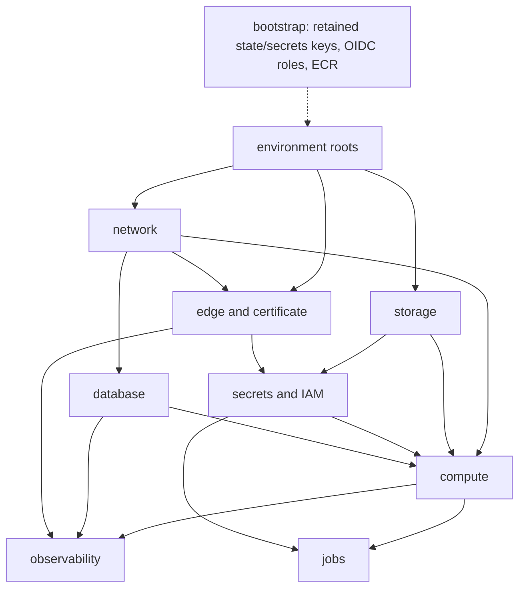

# Contracts, budgets, and structure

## Traceability position

The committed authority is direct: **AC-INF-001…008** are PI-owned rows in
[`traceability/`](../traceability/), and **AC-OPS-015…019** are the P9A-owned
rows for the live CloudFront matrix, origin-secret rotation drill, live
two-runner migration, real restore, and alarm receipt. The current sequencing
and arm64 build wording live in
[`implementation-plan.md`](../implementation-plan.md); no companion patch file
is required or present.

| Row                | Owner              | This plan's obligation                                                                                                                     |
| ------------------ | ------------------ | ------------------------------------------------------------------------------------------------------------------------------------------ |
| AC-INF-001         | PI Task 7          | Fail-closed boundary + validated-chain viewer derivation + single canonical header and secret-free access logs, proven by CI e2e rows 1–22 |
| AC-INF-002         | PI Task 6          | Caddy-only behavior matrix, with no S3 origin or `/assets` behavior, encoded and asserted by mocked `terraform test`                       |
| AC-INF-003         | PI Task 1/13       | Env parity: byte-identical roots + tfvars key-set equality, CI-enforced                                                                    |
| AC-INF-007         | PI Task 6 (PI D25) | Staging viewer gate (basic-auth CloudFront Function, env-varying, disabled in production) — PI-local control, no design-clause attribution |
| AC-INF-008         | PI Task 6 (PI D25) | Blanket `X-Robots-Tag: noindex, nofollow` on staging via the response-headers policy — PI-local control, no design-clause attribution      |
| AC-INF-004         | PI Task 4          | Secrets absent from repo/state; SSM paths disjoint; only the server role gets prefix-scoped media operations                               |
| AC-INF-005         | PI Task 9          | Alarm inventory + dashboards + SNS provisioned, incl. drift + heartbeat alarms                                                             |
| AC-INF-006         | PI Task 10         | Enabled privacy, media, restore, TLS, and drift schedules with exact roles, overlap locks, heartbeats, and failure alarms                  |
| AC-OPS-001         | P0B (done)         | Reused, not re-implemented (D16); live two-runner staging drill is AC-OPS-017                                                              |
| AC-OPS-002         | P9A                | PI builds the mechanism (D8/D9, Tasks 6–7) and proves it in CI simulation; live bypass rejection stays P9A                                 |
| AC-OPS-015…019     | P9A                | PI leaves the interfaces (alarm-trigger table, rotation runbook, restore job, deploy workflow); the drills are out of PI scope             |
| AC-OPS-008/009/014 | P0 (done)          | PI's task env (`TRUSTED_PROXY_CIDRS=127.0.0.1/32`, `LISTEN_HOST=127.0.0.1`, `ENV=staging`/`prod`) is the deployed instantiation            |

## Budget wiring (numeric budgets → infrastructure parameters)

| Budget (budgets.md)                   | Infrastructure parameter (task)                                                                                                                                                                      |
| ------------------------------------- | ---------------------------------------------------------------------------------------------------------------------------------------------------------------------------------------------------- |
| Server task ≤ 512 MiB (Go + Chromium) | ECS **task-definition-level** `memory = 512` (the task cgroup — budgets.md's whole-task semantics); container-level limits left unset or equal so a container can never out-budget the task (Task 5) |
| pgx pool ≤ 20 < `max_connections`     | RDS parameter group asserts `max_connections` ≥ 100 on the chosen class (Task 3, `terraform test` assertion)                                                                                         |
| SSE ≤ 2000 conns, ≥ 25 % fd headroom  | `ulimits { nofile soft/hard = 65536 }` on caddy + server containers (Task 5)                                                                                                                         |
| SSE heartbeat 25 s < CF idle timeout  | `caddy-sse` origin read timeout 60 s; default origin 30 s (Task 6, D22)                                                                                                                              |
| API/SSR p95 SLOs (P9A-measured)       | Instance classes are tfvars (D21) so P9A benchmark evidence can change them without module edits                                                                                                     |
| Request body ≤ 256 KB                 | App-enforced (P0 middleware); no CloudFront/Caddy override introduced                                                                                                                                |

## Module/file structure produced by this phase

| Path                                                                            | Responsibility                                                                                                                                              |
| ------------------------------------------------------------------------------- | ----------------------------------------------------------------------------------------------------------------------------------------------------------- |
| `deploy/aws/bootstrap/`                                                         | One-time retained state/secrets KMS roots, state bucket, exact GitHub OIDC build/plan/deploy roles + boundary, and shared ECR repos (local state)           |
| `deploy/aws/modules/network/`                                                   | VPC, public + **private (DB)** subnets, SG (443 from CloudFront origin-facing prefix list), EIP + ASG(1) auto-reassociation                                 |
| `deploy/aws/modules/database/`                                                  | RDS Postgres (gp3, PITR, write-only master password + version), parameter group, **private** subnet group                                                   |
| `deploy/aws/modules/storage/`                                                   | Private unversioned S3 media bucket, public-access block, encryption, bucket and prefix outputs                                                             |
| `deploy/aws/modules/secrets/`                                                   | SSM name contract, retained-key input, scoped task/execution roles, server-only media and one-distribution invalidation permissions                         |
| `deploy/aws/modules/compute/`                                                   | ECS cluster, capacity provider (ASG, ECS-optimized arm64 AMI), task definitions (host-mode caddy/server, **bridge-mode web — D24**), log groups             |
| `deploy/aws/modules/edge/`                                                      | CloudFront distribution with dual Caddy origins only, origin-request and response-header policies, **staging viewer gate — D25**, ACM us-east-1 certificate |
| `deploy/aws/modules/observability/`                                             | CloudWatch alarms (inventory below, with default thresholds), dashboards, SNS topic + subscription, EventBridge failure rules                               |
| `deploy/aws/modules/jobs/`                                                      | Enabled bounded privacy/media jobs plus restore, TLS-expiry, and prefix-list drift; exact RunTask/PassRole/task-role boundaries                             |
| `deploy/aws/envs/staging/`, `deploy/aws/envs/production/`                       | Thin, byte-identical roots (D4): `main.tf`, `variables.tf`, `outputs.tf`, `backend.hcl`, `<env>.auto.tfvars`                                                |
| `deploy/aws/scripts/secrets-bootstrap.sh`                                       | After bootstrap, writes and decrypt-checks SSM SecureStrings under the retained environment key before the environment foundation apply                     |
| `deploy/aws/scripts/dns-apply.sh`                                               | Applies/diffs Cloudflare records from Terraform outputs via `cf` CLI (D19)                                                                                  |
| `deploy/aws/scripts/restore-verify.sh`                                          | RDS snapshot → isolated instance → verification query → teardown; overlap-guarded (D20)                                                                     |
| `deploy/aws/scripts/cidr-drift-check.sh`                                        | Compares deployed CloudFront origin-facing CIDR set vs the live managed prefix list; nonzero exit on drift (D6)                                             |
| `deploy/aws/scripts/db-bootstrap.sh`                                            | Creates the database and exact migrator/app/restore roles and grants; idempotent and app-DDL-negative tested                                                |
| `deploy/aws/scripts/tls-expiry-check.sh`                                        | Checks the local Caddy listener with origin SNI/hostname and emits bounded expiry/failure metrics                                                           |
| `deploy/caddy/routes.caddy`                                                     | Shared route table imported by dev + prod Caddyfiles; env-placeholder upstreams with dev defaults (D7)                                                      |
| `deploy/caddy/boundary.caddy`                                                   | Edge boundary: fail-closed origin-secret gate, trusted-chain client-IP, header strip/emit (D5/D8)                                                           |
| `deploy/caddy/Caddyfile.prod`                                                   | Production Caddyfile: `admin off`, DNS-01 TLS, internal SSR listener (D24), loopback health vhost, imports of the two snippets                              |
| `deploy/caddy/Caddyfile.boundary-test`                                          | TLS-free wrapper importing the same snippets, driven by the CI e2e test (env-substituted listen port)                                                       |
| `deploy/caddy/Caddyfile` (modify)                                               | Dev file now imports `routes.caddy` (behavior unchanged; existing route-table test must stay green)                                                         |
| `deploy/caddy.Dockerfile` + `deploy/caddy/caddy-entrypoint.sh`                  | **Task 7:** xcaddy build (Caddy 2.11.4 + caddy-dns/cloudflare, pinned, arm64) + fail-closed env entrypoint guard                                            |
| `deploy/ops.Dockerfile`                                                         | Minimal arm64 image: aws-cli + postgresql-client + the ops scripts                                                                                          |
| `apps/server/internal/routetable/prod_boundary_test.go`                         | The BLOCKING e2e test (simulated edge, two viewers, forged + duplicated headers, fail-closed rows)                                                          |
| `.github/workflows/{iac.yml,images.yml,deploy-staging.yml}`                     | Authored by Tasks 8/12/13 as exact diffs, **applied by the integration owner**                                                                              |
| Root `Makefile` (diff for owner)                                                | `iac-fmt`, `iac-validate`, `iac-test`, `route-table-test-prod`, `staging-plan` targets                                                                      |
| `.env.example` (diff for owner — owner-serialized)                              | `CLOUDFLARE_API_TOKEN=` (Zone:DNS:Edit, `aboutme.vn` only), `AWS_PROFILE=` names-only additions                                                             |
| `docs/runbooks/{deploy-rollback,eip-recovery,secret-rotation,restore-drill}.md` | Seeded runbooks (drilled in P9A)                                                                                                                            |
| `docs/architecture.md` (update — **owner-serialized diff**)                     | Gains the deployed-staging current-state section (Task 14, diff handed to owner)                                                                            |

Module dependency graph:

## Master-plan exit bullet → task map

| Master-plan PI exit bullet                                                                                              | Task(s)  |
| ----------------------------------------------------------------------------------------------------------------------- | -------- |
| VPC                                                                                                                     | 2        |
| ECS on EC2 Graviton — host networking for the edge/API tier (web tier bridge-mode per D24), fixed ports per P0 contract | 5 (D24)  |
| RDS Postgres (gp3)                                                                                                      | 3        |
| Private S3 media, with access limited to the Go server role                                                             | 3, 4     |
| CloudFront + ACM (us-east-1) with the [CloudFront behavior contract](../../design/deployment.md#cloudfront-behavior)    | 6, 11    |
| Caddy origin `origin.aboutme.vn` (DNS-01 via Cloudflare)                                                                | 7, 11    |
| EIP + auto-reassociation                                                                                                | 2        |
| Origin-secret + prefix-list ingress                                                                                     | 2, 6, 7  |
| SSM secrets (IAM scoping + rotation)                                                                                    | 4        |
| CloudWatch alarms + dashboards + SNS/on-call                                                                            | 9        |
| Scheduled retention + RDS restore-verification (overlap, alarmed)                                                       | 10       |
| arm64 (Graviton) image build + ECS deploy pipeline drain→readiness                                                      | 7, 8, 12 |
| [Database release sequence](../../design/deployment.md#database-and-releases), including backup and migration lock      | 5, 12    |
| `terraform validate`/`plan` in CI                                                                                       | 13       |
| Env-parameterized modules (staging/prod differ only by variables)                                                       | 1, 13    |
| **BLOCKING**: production Caddy client-IP boundary + e2e test                                                            | 7        |
| Modules apply cleanly to a staging environment                                                                          | 14       |

---
