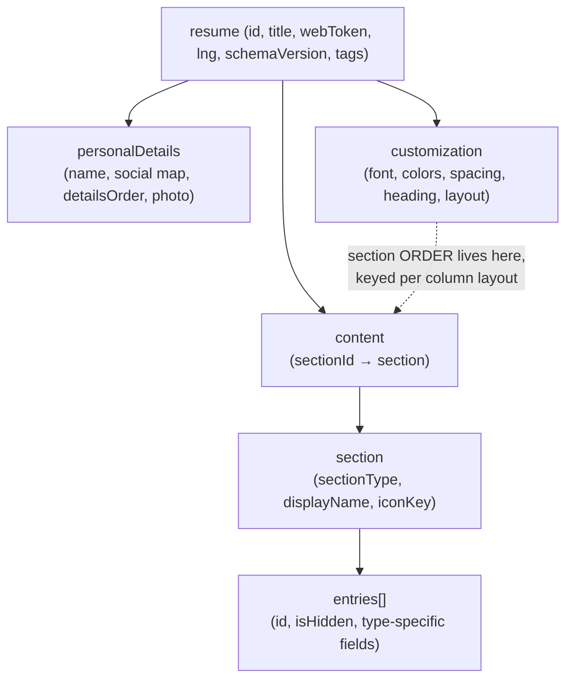

# FlowCV CV-surface feature inventory

What FlowCV's resume product does, read out of the local reference notes.
Research evidence only — not project authority (`AGENTS.md`, "External
references are evidence, not project authority").

Compiled 2026-08-11. Scope: the CV document surface only (document model,
sections, entries, rich text, layout, templates, typography, colour, photo,
pagination, print, sharing, export). Nothing here was verified against the live
API; live probing is a separate worker's job.

## Sources and evidence rules

| File                             | sha256 (first 12) | Cited as      |
| -------------------------------- | ----------------- | ------------- |
| `~/src/flowcv/docs/API.md`       | `87321e2926a2`    | `API.md Lnn`  |
| `~/src/flowcv/docs/RENDERING.md` | `98f5c12381f8`    | `REND.md Lnn` |
| `~/src/flowcv/docs/PULLPUSH.md`  | `2926659019cf`    | `PULL.md Lnn` |

Line numbers refer to those exact file versions. Every row is marked:

- **OBSERVED** — stated in the notes. The note itself may be a reverse
  engineering claim; OBSERVED means "the note says so", not "verified true".
- **INFERRED** — my reading between the lines. Never treat these as fact.

Rows mixing both say which half is which.

Excluded, out of scope (named once, not analysed): Cover Letters, Job Tracker,
Email Signatures, Personal Websites, AI Tools (Translate resume, Check spelling
& grammar), business/team templates (`businessDetails`,
`usingBusinessTemplateId`), download counters (`downloads`), subscription and
billing endpoints.

## Document model

| ID  | Capability                                                                                | Evidence             | Status                                    |
| --- | ----------------------------------------------------------------------------------------- | -------------------- | ----------------------------------------- |
| F01 | Multi-resume library (`GET /resumes/all` → id, title, webToken, webResumeLive, order)     | API.md L38           | OBSERVED                                  |
| F02 | One document = `personalDetails` + `content` + `customization` plus resume-level metadata | API.md L20, L52-57   | OBSERVED                                  |
| F03 | Rename a resume                                                                           | API.md L42           | OBSERVED                                  |
| F04 | Manual ordering of the resume library (`order` field)                                     | API.md L38           | OBSERVED field / purpose INFERRED         |
| F05 | Duplicate a resume (native `duplicate`, or clone via `create` keeping `content`)          | API.md L40-41        | OBSERVED                                  |
| F06 | Delete a resume, irreversibly                                                             | API.md L43           | OBSERVED                                  |
| F07 | Doc-shape version field `schemaVersion` on every resume                                   | API.md L56           | OBSERVED field / versioning role INFERRED |
| F08 | Per-resume language field `lng`                                                           | API.md L57           | OBSERVED field / purpose INFERRED         |
| F09 | Per-resume `tags`                                                                         | API.md L57           | OBSERVED field / purpose INFERRED         |
| F10 | Free tier = one resume; further resumes need Pro (cap not enforced on `create`)           | API.md L40, L207-208 | OBSERVED                                  |

## Sections and entries

| ID  | Capability                                                                                                                                                            | Evidence           | Status                                      |
| --- | --------------------------------------------------------------------------------------------------------------------------------------------------------------------- | ------------------ | ------------------------------------------- |
| F11 | `content` is a map `sectionId → {entries[], iconKey, displayName, sectionType}`                                                                                       | API.md L63-64      | OBSERVED                                    |
| F12 | 15 section types: profile, work, education, skill, publication, organisation, custom, language, certificate, interest, project, course, award, reference, declaration | API.md L64-66      | OBSERVED                                    |
| F13 | A section is created implicitly by saving its first entry with section metadata                                                                                       | API.md L70         | OBSERVED                                    |
| F14 | Rename a section heading (`save_section_name`)                                                                                                                        | API.md L73         | OBSERVED                                    |
| F15 | Per-section icon key with a default per type (address-card, briefcase, graduation-cap, head-side-brain, …)                                                            | API.md L74, L86-91 | OBSERVED / Font Awesome naming INFERRED     |
| F16 | Delete a whole section and its entries                                                                                                                                | API.md L75         | OBSERVED                                    |
| F17 | Section order lives in `customization.sectionOrder.<layout>.sectionsSorted`, keyed per column layout (one/two/mix)                                                    | API.md L78-81      | OBSERVED paths / per-layout memory INFERRED |
| F18 | Manual entry reorder within a section (`save_entries_order` + `disableAutoSort`)                                                                                      | API.md L72         | OBSERVED                                    |
| F19 | Automatic date sort of entries unless `disableAutoSort` is set                                                                                                        | API.md L72         | OBSERVED                                    |
| F20 | Per-entry hide: `isHidden` keeps the entry in the document but drops it from output                                                                                   | API.md L77         | OBSERVED                                    |
| F21 | Delete a single entry                                                                                                                                                 | API.md L71         | OBSERVED                                    |
| F22 | New entries append to the bottom of the section                                                                                                                       | API.md L70         | OBSERVED                                    |
| F23 | Dates are display strings (`startDateNew: 01/2022`, `endDateNew: Present`) beside a structured `date: {"year": …}`                                                    | PULL.md L38-41     | OBSERVED values / per-type split INFERRED   |
| F24 | Rich-text field name varies by type: profile → `text`, skill → `skill` + `infoHtml`, others → `description`                                                           | API.md L95-96      | OBSERVED                                    |

## Rich text

| ID  | Capability                                                                                  | Evidence                      | Status   |
| --- | ------------------------------------------------------------------------------------------- | ----------------------------- | -------- |
| F25 | ProseMirror editing for the summary and every entry description                             | REND.md L78-80                | OBSERVED |
| F26 | Stored as HTML: paragraphs, `<strong>`, `<ul><li>
` bullet lists                          | API.md L93-95, REND.md L79-81 | OBSERVED |
| F27 | Per-paragraph text alignment carried as an inline style (`
`) | API.md L93, REND.md L79-80    | OBSERVED |
| F28 | Bold-only paragraph used as an in-entry sub-heading (no heading tags in the subset)         | API.md L94                    | OBSERVED |

## Layout and templates

| ID  | Capability                                                                                             | Evidence          | Status                                                           |
| --- | ------------------------------------------------------------------------------------------------------ | ----------------- | ---------------------------------------------------------------- |
| F29 | Column layout one / two / mix via `layout.colsFromDetails.top\|left\|right`                            | API.md L133, L146 | OBSERVED paths / three regions (top band + two columns) INFERRED |
| F30 | Per-section placement into those regions from the Layout panel                                         | API.md L146       | OBSERVED                                                         |
| F31 | Template catalogue with id, title, full customization and `isPremium`                                  | API.md L160-166   | OBSERVED                                                         |
| F32 | Apply a template = `templateId` + the template's full customization + current personalDetails          | API.md L44, L167  | OBSERVED / content left untouched INFERRED                       |
| F33 | Premium templates gated behind a subscription                                                          | API.md L165, L207 | OBSERVED                                                         |
| F34 | "Create template" publishes the current design as a shareable template; `get_shared_template` reads it | API.md L153, L162 | OBSERVED                                                         |
| F35 | "Entry Layout" customize group                                                                         | API.md L147       | OBSERVED name / arranges fields within an entry INFERRED         |
| F36 | Footer toggles: page numbers, email, name                                                              | API.md L152       | OBSERVED                                                         |
| F37 | Undo / redo inside the customize panel                                                                 | API.md L154       | OBSERVED                                                         |
| F38 | Document group: page format A4 / Letter, plus a document-level date format                             | API.md L138, L146 | OBSERVED                                                         |

## Typography, colour and headings

| ID  | Capability                                                                                       | Evidence              | Status                                                  |
| --- | ------------------------------------------------------------------------------------------------ | --------------------- | ------------------------------------------------------- |
| F39 | Body font family plus a serif/sans switch (`font.fontFamily`, `font.selected`)                   | API.md L134           | OBSERVED                                                |
| F40 | Separate body font and name font                                                                 | API.md L148-149       | OBSERVED                                                |
| F41 | Web fonts loaded on demand (DM Sans, Roboto, Alegreya, Inter)                                    | REND.md L62-64        | OBSERVED / third-party font host INFERRED               |
| F42 | Font size as its own customize group (`spacing.fontSize`)                                        | API.md L136, L147     | OBSERVED                                                |
| F43 | Spacing controls including line height and `spacing.marginHorizontal`                            | API.md L136           | OBSERVED / marginHorizontal = page side margin INFERRED |
| F44 | Colours: `colors.mode` basic/advanced, a single base colour, an accent                           | API.md L135, L150     | OBSERVED                                                |
| F45 | "Color Area" selector — full / page / header / border — choosing which region the colour fills   | API.md L150-151       | OBSERVED names / region semantics INFERRED              |
| F46 | Section heading style `line` / `box`, with capitalization and heading icons as separate controls | API.md L137, L147-148 | OBSERVED                                                |
| F47 | Link styling customize group                                                                     | API.md L152           | OBSERVED name only                                      |
| F48 | Per-section customizations                                                                       | API.md L153           | OBSERVED name / per-section design overrides INFERRED   |
| F49 | Every design change is a `{path, value}` delta against `customization`                           | API.md L129-131       | OBSERVED                                                |

## Header, contact details and photo

| ID  | Capability                                                                                                                                             | Evidence                      | Status                                 |
| --- | ------------------------------------------------------------------------------------------------------------------------------------------------------ | ----------------------------- | -------------------------------------- |
| F50 | `personalDetails` is saved as a whole object; a partial body replaces it                                                                               | API.md L105-109, REND.md L124 | OBSERVED                               |
| F51 | Header links as an open map `social: {platform: {display, link}}` — arbitrary platforms incl. `orcid`, `googlescholar`, each with its own display text | API.md L108-111               | OBSERVED                               |
| F52 | Contact chip order via `personalDetails.detailsOrder`                                                                                                  | API.md L109-111               | OBSERVED                               |
| F53 | Legacy single website field (`website` + `websiteLink`)                                                                                                | API.md L112                   | OBSERVED                               |
| F54 | Header customize group: text alignment, details arrangement, icon style                                                                                | API.md L151                   | OBSERVED names / semantics INFERRED    |
| F55 | Photo upload (multipart) returning an `imageId` under `avatar/`                                                                                        | API.md L118                   | OBSERVED                               |
| F56 | Photo placement object: `shape: "round"`, a percentage crop rectangle, and the original pixel dimensions                                               | API.md L120-122               | OBSERVED / other shapes exist INFERRED |
| F57 | Photo show/hide as a customization delta `header.photo.show`, separate from the photo data                                                             | API.md L123                   | OBSERVED                               |

## Pagination, preview and print

| ID  | Capability                                                                                                  | Evidence               | Status                                                    |
| --- | ----------------------------------------------------------------------------------------------------------- | ---------------------- | --------------------------------------------------------- |
| F58 | Preview is a fixed-width HTML page element (~794 px ≈ A4 at 96 dpi) scaled to the viewport by CSS transform | REND.md L59-61         | OBSERVED                                                  |
| F59 | Multi-page A4/Letter flow, columns, colours, spacing and headings are pure CSS from `customization`         | REND.md L64-65         | OBSERVED                                                  |
| F60 | Preview is real React DOM (no canvas, iframe or embed), so the rendered text is in the a11y tree            | REND.md L10-12, L66-68 | OBSERVED                                                  |
| F61 | Keystroke → store → both editor and preview re-render instantly, with zero network                          | REND.md L13-14, L70-76 | OBSERVED                                                  |
| F62 | Saves debounced ~1 s / on blur / on navigate, coalesced into ONE PATCH of the whole changed object          | REND.md L15-18, L83-96 | OBSERVED                                                  |
| F63 | The PDF is a second, server-side render of the same JSON — two renderers sharing one `customization`        | REND.md L98-109        | OBSERVED / drift between them is a standing risk INFERRED |
| F64 | Download passes a client-measured `previewPageCount`, which does not truncate the output                    | API.md L46             | OBSERVED                                                  |

## Export and sharing

| ID  | Capability                                                                                                                             | Evidence               | Status                                                                            |
| --- | -------------------------------------------------------------------------------------------------------------------------------------- | ---------------------- | --------------------------------------------------------------------------------- |
| F65 | Download your own resume as a PDF                                                                                                      | API.md L46, L176       | OBSERVED                                                                          |
| F66 | Download via email (PDF mailed to the account)                                                                                         | API.md L177            | OBSERVED                                                                          |
| F67 | Public web resume toggle → `flowcv.com/resume/{webToken}`; the URL is a server-minted opaque token                                     | API.md L45, L50, L178  | OBSERVED                                                                          |
| F68 | Public PDF of a shared resume without auth, gated by the "Display download button" flag                                                | API.md L47, L53, L178  | OBSERVED                                                                          |
| F69 | Search-index flag on the web resume (`webResumeSearchIndex`)                                                                           | API.md L53             | OBSERVED field / indexing opt-in INFERRED                                         |
| F70 | Public-page cache flag (`webResumeCached`)                                                                                             | API.md L53             | OBSERVED field / purpose INFERRED                                                 |
| F71 | Feedback sharing (`feedbackToken`, `feedbackEnabled`, `feedback`)                                                                      | API.md L50, L53-54     | OBSERVED fields / share-for-comments INFERRED                                     |
| F72 | No HTML-snapshot endpoint: rendered HTML exists only inside the React app; the PDF is the only programmatic visual output              | REND.md L119-122       | OBSERVED                                                                          |
| F73 | Resume-as-code: `pull` materialises the document into a git-diffable Markdown tree, `push` diffs one snapshot and applies only changes | PULL.md L1-8, L55-70   | OBSERVED — capability of the local CLI over the API, not a FlowCV product feature |
| F74 | Round-trip stability: rich text diffed in markdown space; last-writer-wins with no conflict detection                                  | PULL.md L46-50, L72-87 | OBSERVED — local CLI, as above                                                    |

74 capabilities inventoried. The gap analysis against the aboutme design spec is
in [`gap-analysis.md`](gap-analysis.md).
