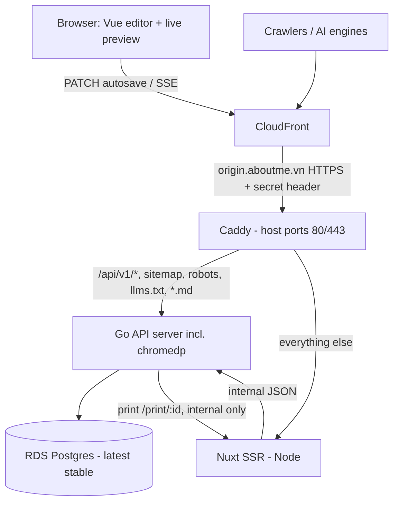
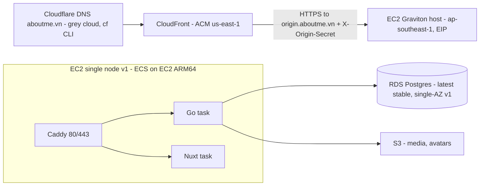

# aboutme — design

Open-source resume builder + hosted display service (a full-featured resume
editor, about.me-class URLs). Domain: **aboutme.vn**. License: **AGPL-3.0**.
Repo: `github.com/dannyota/aboutme` (public, open-source AGPL-3.0).

Status: DRAFT v3 — two independent review rounds applied (2026-07-31 arch,
2026-08-01 data model + full round-2). Owner decisions: **ap-southeast-1
Singapore + RDS on Graviton** (privacy/residency phase deferred; Hanoi LZ =
future option), resume-slug-only URLs (users invisible), 3 publish toggles, slug
≥ 4 chars, ≤ 3 resumes/user, Google style guides + quality gates,
latest-stable-then-pinned versions.

## 0. Engineering standards

| Concern       | Decision                                                                                                                                                                                                                                                                                      |
| ------------- | --------------------------------------------------------------------------------------------------------------------------------------------------------------------------------------------------------------------------------------------------------------------------------------------- |
| Versions      | **Latest stable** at scaffold time, then **pinned exactly** (toolchain versions + image digests) for reproducible builds; Renovate proposes reviewed upgrades — majors (Postgres/Nuxt/Go/Flutter) require explicit compatibility work                                                         |
| Code style    | **Google style guides**: Go (google.github.io/styleguide/go), TS/JS (Google TS style via ESLint config); gofmt/goimports mandatory                                                                                                                                                            |
| Go quality    | `golangci-lint` (curated linter set) + `govulncheck`                                                                                                                                                                                                                                          |
| Web quality   | ESLint + `vue-tsc --noEmit` typecheck + dependency-vuln scanning (Semgrep Supply Chain, see Security)                                                                                                                                                                                         |
| Docs quality  | **markdownlint-cli2** (`.markdownlint.jsonc`) + **Prettier** (`proseWrap: always`, 80 cols) — `make docs-lint` / `docs-fmt`, enforced in CI; conventions in `docs/README.md`                                                                                                                  |
| Security      | **Semgrep** — connected `semgrep ci` in CI (Code/SAST with Pro rules + Supply Chain/SCA for Go+npm + Secrets, free for public repos), offline registry packs (`make semgrep`) locally; plus `govulncheck` (official Go vuln DB). Secure defaults: CSP, sanitized rich text, CSRF, rate limits |
| CI/CD         | **GitHub Actions**: PR gate = lint + typecheck + test + govulncheck + Semgrep (SAST+SCA+secrets) + schema/data-drift + route-table; build images + ECS deploy jobs added at deploy phase                                                                                                      |
| Local tooling | npm (fnm) / pip (pyenv), no sudo                                                                                                                                                                                                                                                              |

## 1. Product scope (v1)

| Area                                                        | v1                                                                                                                                                                                                                                                                                                                                                                                  |
| ----------------------------------------------------------- | ----------------------------------------------------------------------------------------------------------------------------------------------------------------------------------------------------------------------------------------------------------------------------------------------------------------------------------------------------------------------------------- |
| Editor                                                      | Multi-resume (**max 3 per user**); typed sections (profile, work, education, skill, language, certificate, project, custom…); ProseMirror rich text (sanitized HTML); customization (fonts, colors, 1–2 column layout, spacing, headings); templates                                                                                                                                |
| Publishing                                                  | **Resume-only URLs, users invisible**: `aboutme.vn/{slug}` is ONE resume (no usernames, no profile pages). Slug: globally unique, 4–30 chars, `^[a-z0-9]+(-[a-z0-9]+)*$` (no leading/trailing/double hyphens), reserved root segments (incl. `u`, `people` for a future hub), claimed at publish; claims rate-limited per account+IP. Toggle effects: see publish-state matrix (§4) |
| Publish toggles (per resume, user-chosen in publish dialog) | 1. **Public resume** (live) · 2. **PDF download** · 3. **SEO + GEO publishing** (search engines + AI engines). Defaults: download ON, SEO/GEO OFF (explicit opt-in)                                                                                                                                                                                                                 |
| SEO/GEO (when opted in)                                     | SSR HTML, OG/Twitter meta, generated og-image, JSON-LD (`ProfilePage`+`Person`), sitemap.xml, canonical URLs, markdown variant (`/danny.md`), llms.txt                                                                                                                                                                                                                              |
| Realtime                                                    | Instant client-side preview (zero network); debounced granular autosave; SSE refresh for open public/preview tabs                                                                                                                                                                                                                                                                   |
| Auth                                                        | **Google + GitHub + LinkedIn** OAuth (no passwords); web = httpOnly session cookie + CSRF token; mobile (later) = OAuth code + PKCE deep link → bearer access/refresh tokens (contract reserved now, built later)                                                                                                                                                                   |
| PDF                                                         | Server-side print of the same web renderer (headless Chromium)                                                                                                                                                                                                                                                                                                                      |
| Mobile                                                      | **Deferred until after v1 deployment** (owner decision 2026-08-01); API versioned `/api/v1` and the document schema kept language-neutral from day 1 so Dart types generate later                                                                                                                                                                                                   |

Out of v1: cover letters, job tracker, AI tools, custom domains, teams,
analytics, multi-language UI, collaborative editing.

## 2. System architecture



- **Renderer written once** as Vue components; used by (1) editor preview
  client-side, (2) public pages SSR, (3) PDF/og-image via Chromium print. Editor
  pagination is **approximate**; the PDF (CSS `@page`) is **authoritative** — JS
  measurement and print engine are different algorithms by design.
- Chromium runs inside the Go server task (chromedp) — **round-2 honest
  bounds**: the 512 MB budget is the _whole-task_ cgroup (Go + Chromium), not
  per render; therefore **1 render at a time** initially, 20 s timeout with
  process-group kill, bounded queue, per-user/IP render rate limits, and
  readiness reports unhealthy when saturated. Moving renders to a separate ECS
  task is the scale-up path.
- **Authoritative route table (Caddy):**

| Path                                                     | Backend | Notes                                                                                                                                                                                                                                                                                                                                                                                                                                                                                                                                                                                                                                                                                                                                                                                                                                                                                                                                                   |
| -------------------------------------------------------- | ------- | ------------------------------------------------------------------------------------------------------------------------------------------------------------------------------------------------------------------------------------------------------------------------------------------------------------------------------------------------------------------------------------------------------------------------------------------------------------------------------------------------------------------------------------------------------------------------------------------------------------------------------------------------------------------------------------------------------------------------------------------------------------------------------------------------------------------------------------------------------------------------------------------------------------------------------------------------------- |
| `/api/v1/*`                                              | Go      | CachingDisabled at CloudFront; all methods; cookies/query forwarded                                                                                                                                                                                                                                                                                                                                                                                                                                                                                                                                                                                                                                                                                                                                                                                                                                                                                     |
| `/api/v1/events`, `/api/v1/live/*`                       | Go      | SSE: heartbeat every 25 s; CloudFront origin-response-timeout raised                                                                                                                                                                                                                                                                                                                                                                                                                                                                                                                                                                                                                                                                                                                                                                                                                                                                                    |
| `/sitemap.xml`, `/robots.txt`, `/llms.txt`, `/{slug}.md` | Go      | generated from publish state; `.md` requires `seo_geo_enabled` (§4 matrix)                                                                                                                                                                                                                                                                                                                                                                                                                                                                                                                                                                                                                                                                                                                                                                                                                                                                              |
| `/healthz`, `/readyz`                                    | Go      | **unversioned by design** — health is infrastructure, not product API, so an `/api/v2` must never break orchestrator or synthetic checks. `/healthz` = liveness, never touches the DB; `/readyz` = readiness (DB check, 503 + error envelope when down). Container/ECS checks hit the task directly; the CloudFront→Caddy→app synthetic check (§9) uses these paths through the edge **Both accept GET and HEAD** (RFC 9110: HEAD is GET without a body, and container/monitoring probes such as `wget --spider` use it); the router's method matcher must therefore treat HEAD as satisfying a GET route Responses are **JSON in the standard envelope** (`{"data":{"status":"ok"}}` / `{"error":{...}}`), not plain text — the envelope is the API-wide contract and machine-parseable probes are worth more than human-readable ones. A contract test must assert the OpenAPI document and the Go handler agree on status, media type and body shape |
| `/api/v1/public/resumes/{slug}/pdf`                      | Go      | public PDF, gated by `download_enabled` (§4 matrix)                                                                                                                                                                                                                                                                                                                                                                                                                                                                                                                                                                                                                                                                                                                                                                                                                                                                                                     |
| `/print/*`                                               | Nuxt    | **internal-only**: Caddy denies external requests; Go calls it directly with short-lived single-audience token; no-cache                                                                                                                                                                                                                                                                                                                                                                                                                                                                                                                                                                                                                                                                                                                                                                                                                                |
| everything else                                          | Nuxt    | SSR public pages + editor SPA                                                                                                                                                                                                                                                                                                                                                                                                                                                                                                                                                                                                                                                                                                                                                                                                                                                                                                                           |

## 3. Data model (RDS Postgres, jsonb doc)

**Users are invisible on the platform — only resumes are published.** No
username column; the public namespace is resume slugs.

| Table           | Columns (key)                                                                                                                                                                                                                                                                                                                         |
| --------------- | ------------------------------------------------------------------------------------------------------------------------------------------------------------------------------------------------------------------------------------------------------------------------------------------------------------------------------------- |
| users           | id **uuidv7**, email citext UNIQUE, name, avatar_key (account-only; resume photos live per-doc), timestamps                                                                                                                                                                                                                           |
| identities      | user_id, provider (google/github/linkedin), provider_user_id — UNIQUE(provider, provider_user_id). **No automatic email merge** (account-takeover vector): second provider with a matching email gets an explicit link flow requiring auth via the existing provider                                                                  |
| sessions        | id, user_id, **token_hash** (sha256; raw token only in cookie), csrf_secret, created_at, **last_seen_at**, **absolute_expires_at**, **revoked_at**, ua, ip, **rotation_grace_until** (successor minted; predecessor accepted until this instant — orthogonal to `revoked_at`), **reauthenticated_at** (drives the recent-reauth gate) |
| resumes         | id uuidv7, user_id, title, **slug** (text, **globally UNIQUE**, NULL until published), live, download_enabled, seo_geo_enabled, **schema_version**, **revision** (bigint, for If-Match), lng, personal_details jsonb, content jsonb, customization jsonb, timestamps                                                                  |
| slug_tombstones | slug UNIQUE, released_by_user_id, released_at — released slugs unclaimable by others for **180 days**                                                                                                                                                                                                                                 |

Relational constraints & store-layer invariants (DB-enforced where marked ⛁;
everything else enforced in the single validated store layer all writes pass
through):

- ⛁ `UNIQUE (slug)`; ⛁
  `CHECK (slug IS NULL OR (char_length(slug) BETWEEN 4 AND 30 AND slug ~ '^[a-z0-9]+(-[a-z0-9]+)*$'))`;
  ⛁ `CHECK (NOT live OR slug IS NOT NULL)`; ⛁
  `CHECK (NOT seo_geo_enabled OR live)`; reserved-slug list = reserved **root
  segments**
  (`api, app, u, people, print, login, logout, auth, assets, sitemap.xml, robots.txt, llms.txt, admin, static, _nuxt, og, …`).
- **Slug lifecycle**: unpublish sets `live=false` and **keeps the slug**
  (links/SERPs can't be hijacked). Release happens only on explicit
  rename/delete → 180-day tombstone; reclaim under per-slug advisory lock. ⛁
  `slug_tombstones.released_by_user_id` is nullable `ON DELETE SET NULL`
  (account deletion must NOT free tombstoned slugs early). Squatting handled by
  rate limits + report/admin process, not an exhaustive blocklist.
- **Max 3 resumes/user**: ⛁ DB trigger on insert + create tx takes
  `SELECT … FOR UPDATE` on the user row (belt and suspenders — no race, no
  bypassing caller).
- `content` = ordered map
  `sectionKey → {entries[], displayName, iconKey, sectionType}`; entry ids are
  client-generated uuids, **unique across the whole resume** (store layer); date
  ranges `{start:{y,m?}, end:{y,m?}|null, present:bool}` with `start ≤ end`,
  `present ⇒ end=null`, `¬present ⇒ end≠null`; rich text sanitized HTML subset
  (§5 sanitizer contract).
- **Size bounds** (DoS/abuse guard, store layer + request middleware): request
  body ≤ 256 KB; total doc ≤ 512 KB; ≤ 24 sections; ≤ 64 entries/section; ≤ 16
  KB rich text per entry; customization delta paths from a fixed allowlist.

### Entry fields per `sectionType` (the document contract)

| sectionType     | Fields (beyond the shared ones)                                                               |
| --------------- | --------------------------------------------------------------------------------------------- |
| `profile`       | `text` (rich HTML)                                                                            |
| `work`          | `jobTitle`, `employer`, `employerLink`, `city`, `country`, `dates`, `description` (rich HTML) |
| `education`     | `degree`, `school`, `schoolLink`, `city`, `country`, `dates`, `description` (rich HTML)       |
| `skill`         | `name`, `level` (0–5, **optional**), `infoHtml`                                               |
| `language`      | `name`, `level`                                                                               |
| `certificate`   | `title`, `titleLink`, `issuer`, `date`, `description` (rich HTML)                             |
| `project`       | `title`, `link`, `dates`, `description` (rich HTML)                                           |
| `custom`        | `title`, `titleLink`, `subtitle`, `city`, `dates`, `description` (rich HTML)                  |
| _(every entry)_ | `id` (client-generated uuid), `isHidden`                                                      |

`dates` is the range object `{start:{y,m?}, end:{y,m?}|null, present:bool}`;
`date` (certificate) is a single `{y,m?}`.

**Optionality: draft-permissive, publish-strict** (revised 2026-08-01 after
adversarial review — the earlier "everything required with empty-string
sentinels" rule was wrong for an autosaving editor). Two validation levels:

| Level              | Applies to                                    | Rule                                                                                                                                                                                                                                                                                          |
| ------------------ | --------------------------------------------- | --------------------------------------------------------------------------------------------------------------------------------------------------------------------------------------------------------------------------------------------------------------------------------------------- |
| **Stored (draft)** | every save/autosave                           | Only `id` and the section's `sectionType` discriminator are required. All domain fields are optional; a half-typed entry must persist and reload exactly as typed                                                                                                                             |
| **Publish**        | `POST /resumes/{id}/publish` with `live=true` | Enforced by a **separate versioned publish policy** (`publish-policy.v<N>.json` in `packages/schema`, generated into Go and TS like the storage schema — never a hand-written validator, which would drift). Failures return `422` listing offending entries so the editor can highlight them |

Absence is meaningful and preserved: a missing key means "never entered", `""`
means "explicitly cleared". Never fabricate a sentinel year, date, or level to
satisfy the schema.

**Draft permissiveness covers the WHOLE document, not just entries.**
`personalDetails` (including `fullName`), `details`, and section metadata
(`displayName`, `iconKey`) are optional and may be empty while editing —
clearing a field to retype it must never block autosave. Fixtures must cover a
cleared name, cleared contact values, and a freshly created empty section.

**The publish policy is exhaustive, not exemplary.** It declares, per
`sectionType`, which fields must be non-blank; how hidden entries count; and an
**aggregate minimum**: a publishable resume needs a non-blank `fullName` and at
least one visible entry across all sections. Without that aggregate rule a
validator iterating entries finds nothing wrong with `content: {}` and would
publish a blank, indexable page. Positive and negative fixtures are shared by
the Go and TypeScript validators and must span every discriminator. New fields
are always introduced optional, so adding one never becomes an all-document
migration.

- **Aggregate invariant** (adversarial review): the three jsonb columns are ONE
  aggregate, not three independent documents. Every `content` section key must
  appear **exactly once** across the `customization.layout.sections` arrays;
  those arrays are bounded, deduplicated, and may not reference a missing key.
  **Structural mutations** (create/delete/move/reorder a section) therefore go
  through one transactional endpoint `PATCH /resumes/{id}/structure` that writes
  `content` and `customization` together — never two requests that can
  half-succeed. Field-level edits stay granular. The fully assembled aggregate
  is validated on **every** write; partial-failure cases are covered by tests.
- **Doc-shape migrations** (`schema_version`): migrate-on-read is
  **projection-only** (never writes during GET — avoids revision bumps racing
  autosave); persisted only when a user write occurs (transactional), plus
  background backfill using compare-and-swap
  `WHERE id=$1 AND schema_version=$old AND revision=$observed`.
- DB reachable **only from Go** (security group); pgx pool capped (≈ 20, below
  Postgres max_connections); statement timeout + per-route deadlines; rate
  limiting at Caddy + Go middleware.

### Schema management (declarative-schema pattern)

| Piece                        | Role                                                                                                                                                                                                                                                                                                                                                                                                                                                                                                                                                                                                                                                                                 |
| ---------------------------- | ------------------------------------------------------------------------------------------------------------------------------------------------------------------------------------------------------------------------------------------------------------------------------------------------------------------------------------------------------------------------------------------------------------------------------------------------------------------------------------------------------------------------------------------------------------------------------------------------------------------------------------------------------------------------------------ |
| Codegen fidelity             | The generator must **derive every discriminator and entry definition from the schema at generation time** — never a hardcoded list. A byte-compare drift test alone certifies determinism, not faithfulness: a hardcoded omission reproduces identically. A **conformance test** enumerates every `sectionType` in the schema and asserts AJV, the generated TS union, and the Go dispatch each accept a sample and reject cross-type entries — so adding a section fails loudly in all three languages instead of silently in one                                                                                                                                                   |
| `sql/schema.sql`             | **Declarative single source of truth** for both sqlc and migrations                                                                                                                                                                                                                                                                                                                                                                                                                                                                                                                                                                                                                  |
| `sql/queries.sql` + **sqlc** | Type-safe Go data layer (`pgx/v5`, jsonb → `json.RawMessage`); `make generate`                                                                                                                                                                                                                                                                                                                                                                                                                                                                                                                                                                                                       |
| `make migrate-gen`           | `atlas migrate diff` vs throwaway dev DB → **goose**-format SQL. **Simplified**: ONE migration dir, no multi-schema post-processing, no rehash logic. Atlas CLI needed only by schema-changing contributors (scripted/containerized); never for builds or self-host upgrades                                                                                                                                                                                                                                                                                                                                                                                                         |
| `cmd/migrate`                | Applies embedded (`go:embed`) migrations in order — **goose-only at runtime**. Goose tracks versions, not content checksums → migration immutability enforced in **CI** (append-only check on `migrations/`)                                                                                                                                                                                                                                                                                                                                                                                                                                                                         |
| Prod migration sequence      | stop app writes → local backup + verify → migration **advisory lock** → goose up exactly once → start new tasks → readiness → reopen traffic. Rollback = forward corrective migration, not down-migration                                                                                                                                                                                                                                                                                                                                                                                                                                                                            |
| Wire-version compatibility   | **Stored canonical model and external wire contract are separate.** Every released `schema_version` keeps an **immutable** schema file + generated types (`resume.v<N>.schema.json`); the server declares which versions it **accepts** and **emits**; adjacent-version converters (`vN-1 ⇄ vN`) are explicit and tested. Policy applies from v1: P2A builds and tests both converter directions plus synthetic old-client projection/emission before a second version exists; P2B binds that machinery to the real HTTP path and proves an old-client write is projected, target-validated, persisted as the complete current document, and emitted in a declared supported version |
| Lifecycle                    | Pre-release: schema editable + dev-DB reset. Post-first-release: migrations append-only                                                                                                                                                                                                                                                                                                                                                                                                                                                                                                                                                                                              |

Conventions inherited: single-column surrogate PKs (natural keys = composite
UNIQUE), JSONB for non-queryable data, named constraints ≤ 63 bytes.

### OAuth (RFC 9700 / OAuth 2.1-aligned; round-2 hardened)

| Provider | Protocol                              | Identity & email rule                                                                                                                                                                                                          |
| -------- | ------------------------------------- | ------------------------------------------------------------------------------------------------------------------------------------------------------------------------------------------------------------------------------ |
| Google   | OIDC (discovery)                      | `sub` claim; require `email_verified == true`                                                                                                                                                                                  |
| LinkedIn | OIDC (`openid profile email`)         | `sub` claim; **`email`/`email_verified` are optional in LinkedIn's OIDC** — registration without a verified email is rejected (linking to an existing account still allowed); absent `email_verified` is never treated as true |
| GitHub   | Plain OAuth2 (no OIDC for user login) | numeric user id; email from `/user/emails` — **verified primary only**                                                                                                                                                         |

Flow: authorization-code + **PKCE S256 even as confidential client** (RFC 9700).
Each OAuth transaction is stored **server-side**: provider, purpose
(`login`/`link`), state hash, PKCE verifier, exact redirect URI, expiry, and —
**OIDC only** — nonce. The browser holds a 256-bit opaque `__Host-oauth-tx`
handle (`Secure; HttpOnly; SameSite=Lax; Path=/; Max-Age=600`), consumed
atomically once. Google/LinkedIn id_tokens pass signature/JWKS, exact issuer,
audience, expiry, and nonce checks. **GitHub gets no OIDC checks** — its defense
is the distinct `/auth/github/callback`, transaction-bound endpoints, state, and
PKCE (mix-up protection per RFC 9700 for multi-AS clients). Code exchange
server-side only; provider tokens discarded after profile fetch; auth endpoints
rate-limited. `identities` keyed by provider `sub`/id — never email.
Cross-provider linking is explicit (§3) and requires **recent
reauthentication**.

**Email-collision contract.** When a callback presents a verified email that
already belongs to an account reached via a different provider, the server
writes **no rows** and redirects with a generic
`?error=email_already_registered`. The response **must not name the existing
provider** — naming it hands an attacker a targeted-phishing hint. Linking
happens only from an authenticated session, never from the callback.

Libraries (trust-ranked, minimal supply-chain surface):

- **`golang.org/x/oauth2`** (official) + **`coreos/go-oidc/v3`** (de-facto
  standard OIDC client on top of it, 1.3 k+ importers) — chosen: 3 providers
  hand-wired is ~200 auditable lines matching Google-style explicitness.
- Rejected: `goth` (per-provider quality varies, larger dep surface),
  `zitadel/oidc` (certified, good — but heavier than needed for RP-only), Ory
  Kratos / Zitadel / Keycloak servers (whole IdP service for 3 social logins +
  no passwords contradicts single-node ops).

### Sessions (OWASP-aligned)

| Concern                  | Decision                                                                                                                                                                                                                                                                                                                                                                                                                                            |
| ------------------------ | --------------------------------------------------------------------------------------------------------------------------------------------------------------------------------------------------------------------------------------------------------------------------------------------------------------------------------------------------------------------------------------------------------------------------------------------------- |
| Model                    | **Server-side opaque sessions in Postgres** (revocable); no JWTs for web                                                                                                                                                                                                                                                                                                                                                                            |
| Token                    | 256-bit CSPRNG, base64url; cookie holds raw token; DB stores **SHA-256 hash**; constant-time compare                                                                                                                                                                                                                                                                                                                                                |
| Cookie                   | **`__Host-session`**: `Secure; HttpOnly; SameSite=Lax; Path=/` (no Domain) — Lax because visitors arrive via external links                                                                                                                                                                                                                                                                                                                         |
| Timeouts                 | **Documented risk acceptance** (consumer product; far above OWASP's illustrative ranges): idle 30 d (sliding `last_seen_at`, throttled to ≤1 write/h), absolute 90 d. Compensating control: **sensitive operations require recent OAuth reauth** — provider link/unlink, account deletion, email change, slug release, log-out-everywhere                                                                                                           |
| Rotation                 | New session at login (fixation defense); token rotated when > 24 h old — **atomically one successor**, old token accepted for a short grace interval so concurrent requests can't mint competing successors or clobber the newest cookie                                                                                                                                                                                                            |
| CSRF                     | SameSite=Lax **+** synchronizer token **+** Origin, fail-closed: `GET /me` returns the token in its JSON **body** (never cookie/URL/log); mutating cookie-authed requests need `Content-Type: application/json`, constant-time token match, and exact `Origin: https://aboutme.vn` (exact Referer fallback; reject if neither usable). Web v1 has **no cross-origin credentialed CORS**. OAuth callbacks rely on their one-time transaction instead |
| OAuth flow               | `state` + **PKCE** + nonce; code exchange server-side only; provider tokens used once for profile fetch then **discarded** (we store no provider refresh tokens)                                                                                                                                                                                                                                                                                    |
| Logout                   | Delete session row + expire cookie + `Clear-Site-Data` header. "Log out everywhere" = delete all user's rows                                                                                                                                                                                                                                                                                                                                        |
| Device visibility        | Sessions list (created, last seen, ua, ip) + per-session revoke in account settings (cheap with DB-backed rows)                                                                                                                                                                                                                                                                                                                                     |
| Hygiene                  | `Cache-Control: no-store` on all `/api` responses; auth endpoints rate-limited; session lifecycle audit-logged; ip/ua logged for anomaly review, **not** hard-bound (mobile roaming)                                                                                                                                                                                                                                                                |
| Recent-reauth window     | **15 minutes** since `reauthenticated_at` (documented risk acceptance, same pattern as the 30 d/90 d timeouts). Gates provider link/unlink, account deletion, slug release, and log-out-everywhere                                                                                                                                                                                                                                                  |
| Primary keys             | **Postgres-native `uuidv7()` as column DEFAULT** for every server-owned row (`users`, `identities`, `sessions`, `resumes`, `slug_tombstones`). Client-generated uuids appear only _inside_ documents (entry ids), never as table PKs — binding on all later phases so they cannot diverge                                                                                                                                                           |
| OAuth transaction handle | The `__Host-oauth-tx` value is **hashed at rest** (sha256) exactly like the session token; the raw handle exists only in the cookie                                                                                                                                                                                                                                                                                                                 |

## 4. API (`/api/v1`, REST, granular autosave)

| Endpoint                                                                                      | Purpose                                                                                                                                                                                                                                                                                                        |
| --------------------------------------------------------------------------------------------- | -------------------------------------------------------------------------------------------------------------------------------------------------------------------------------------------------------------------------------------------------------------------------------------------------------------- |
| `GET /auth/{provider}/start`, `GET /auth/{provider}/callback`, `POST /auth/logout`, `GET /me` | OAuth + session (web cookie + CSRF)                                                                                                                                                                                                                                                                            |
| `GET /sessions`, `DELETE /sessions/{id}`, `DELETE /sessions`                                  | Device list, per-session revoke, log-out-everywhere (latter two require recent reauth); `DELETE /sessions` also emits `Clear-Site-Data`                                                                                                                                                                        |
| `GET/POST /resumes`, `GET/PATCH/DELETE /resumes/{id}`                                         | CRUD; create enforces 3-resume cap                                                                                                                                                                                                                                                                             |
| `PATCH /resumes/{id}/entries/{sectionKey}`                                                    | upsert ONE entry — identity = `entry.id` in body (client-generated UUID)                                                                                                                                                                                                                                       |
| `DELETE /resumes/{id}/entries/{sectionKey}/{entryId}`                                         | delete entry                                                                                                                                                                                                                                                                                                   |
| `PATCH /resumes/{id}/sections/{sectionKey}`                                                   | name / icon / entry order (content only; never changes section placement)                                                                                                                                                                                                                                      |
| `PATCH /resumes/{id}/structure`                                                               | **The only way to create, delete, move or reorder a section.** Writes `content` and `customization.layout` in ONE transaction so the exactly-once placement invariant is never observably broken. Takes `If-Match` and an idempotency key like every other write; the whole command applies or none of it does |
| `PATCH /resumes/{id}/personal-details`                                                        | whole object                                                                                                                                                                                                                                                                                                   |
| `PATCH /resumes/{id}/customization`                                                           | list of `{path, value}` deltas                                                                                                                                                                                                                                                                                 |
| `POST /resumes/{id}/publish`                                                                  | `{live, slug, downloadEnabled, seoGeoEnabled}` — slug claim is atomic (global namespace)                                                                                                                                                                                                                       |
| `GET /resumes/{id}/pdf`                                                                       | server-rendered PDF                                                                                                                                                                                                                                                                                            |
| `GET /events` (auth), `GET /live/{slug}` (public)                                             | SSE (event ids, Last-Event-ID reconnect → client refetches doc)                                                                                                                                                                                                                                                |
| `GET /public/resumes/{slug}`                                                                  | doc+meta for Nuxt SSR (never CloudFront-cached)                                                                                                                                                                                                                                                                |

**Write-safety (round-2 corrected):** every write carries `If-Match: "r<rev>"`
(ETag form); a failed precondition returns **`412 Precondition Failed`** + the
current revision/doc (RFC 9110 — `409` is reserved for domain conflicts, e.g.
slug already taken). `revision` is a bigint **serialized as a string** in
JSON/OpenAPI (TS/Dart precision). Idempotency: records persisted transactionally
keyed by user + route + mutation UUID with a request-body hash, stored response,
and TTL; replay returns the stored response; reuse with a different body is
rejected.

**Publish-state matrix (round-2 — what each toggle actually gates):**

| State                      | Public behavior                                                                                             |
| -------------------------- | ----------------------------------------------------------------------------------------------------------- |
| `live=false`               | Every public representation 404/410; public SSE closes                                                      |
| `live=true, seo_geo=false` | HTML shareable but `X-Robots-Tag: noindex, noarchive`; excluded from sitemap/llms.txt; `/{slug}.md` → 404   |
| `seo_geo=true`             | HTML + `/{slug}.md` + JSON-LD in sitemap/llms.txt discovery surfaces                                        |
| `download_enabled=true`    | Enables `GET /api/v1/public/resumes/{slug}/pdf` (else 404); owner-only `/resumes/{id}/pdf` always available |

Envelope: `{data}` / `{error:{code,message}}`. OpenAPI spec maintained in
`docs/api/openapi.yaml`; Dart/TS clients generated from it.

## 5. Web app (Nuxt 4 / Vue 3)

- `components/resume/` is a **pure renderer**: props in → HTML out; no store, no
  API, no editor imports. Golden-snapshot tests pin
  `(doc, customization) → HTML`.
- Pages: `/` landing · `/app/**` editor (client-only) · `/[slug]` SSR public
  resume · `/print/[id]` (internal-only, see route table).
- Autosave: keystroke → Pinia store → both panels re-render → debounce ~1 s →
  one coalesced PATCH (validated autosave model).

### Renderer detail (part-3 review, 2026-08-01)

- Contract: `(personalDetails, content, customization) → deterministic HTML`; no
  store/API/editor imports, no `Date.now()`/locale calls; all styling via CSS
  custom properties computed by `useResumeStyles(customization)`.
- Tree: `ResumeDocument` → `ResumeHeader` (contacts per `detailsOrder`, CSS
  photo crop) → `LayoutColumns` (placement from `customization.layout.sections`)
  → `SectionRenderer` (dispatch by `sectionType`) → `sections/*` +
  `primitives/*` (`EntryHeader`, `DateRange`, `RichText` w/ DOMPurify
  re-sanitize, `SectionHeading`, `Icon`).
- One-column placement (design decision, 2026-08-01): `columns: 1` with a
  populated `sidebar` array is **valid by design**. The renderer emits `main`
  followed by `sidebar` sections in order, so the exactly-once placement
  invariant keeps meaning "nothing is silently unrendered" in both column modes,
  and a 1 ↔ 2 column toggle preserves sidebar placement instead of destructively
  rewriting it.
- Pagination: editor preview = JS measure-and-break at entry boundaries (fixed
  794 px page, transform-scaled); public page = **continuous flow, no
  pagination** (SEO/mobile); PDF = CSS `@page` + `break-inside: avoid` —
  Chromium breaks pages natively.
- Templates: **customization presets as JSON in repo**
  (`packages/schema/templates/*.json`), no DB table v1; apply = full
  customization replace, content untouched; thumbnails generated at build time
  through the print pipeline with a sample doc.
- Fonts: self-hosted subset webfonts with **full Vietnamese diacritics** (Be
  Vietnam Pro, Inter, Source Sans 3, Alegreya, Roboto Serif). No external font
  CDN **for privacy** (third-party CDNs see every visitor's IP — same motivation
  as VN data residency; not a performance concern, Google Fonts is fast in VN).
  Also keeps print rendering fully offline-deterministic. `/print` awaits
  `document.fonts.ready` before chromedp prints. Icons: tree-shaken inline SVG
  (lucide) via `iconKey`.
- **Sanitizer contract (round-2)**: ONE versioned allowlist (tags, attributes,
  URL schemes) defined in `packages/schema`; bluemonday (write) and DOMPurify
  (render) are both generated/conformance-tested against it with a shared
  hostile corpus. Forbidden outright: inline event handlers, SVG, iframes,
  external images, non-https(+mailto/tel) schemes. External links get
  `rel="noopener noreferrer"`. Backstop: strict CSP; the print browser has no
  general outbound network access.
- Guards: golden HTML snapshots (fixtures × templates) in CI; Playwright
  screenshot diff of `/print` per template; renderer handles current
  `schema_version` only (server projects first); lint rule enforcing
  editor→renderer one-way imports.
- Public page freshness (round-2): pages cached at CloudFront ~60 s for normal
  edits. Unpublish / delete / slug rename trigger CloudFront invalidation of
  **all** affected surfaces — old+new HTML URL, `/{slug}.md`, og-image, public
  PDF, `sitemap.xml`, `llms.txt` — noting invalidation completes
  **asynchronously** (never described as "immediate"). SSE refresh refetches the
  uncached `/public/resumes/{slug}` JSON and re-renders client-side.

## 6. Deployment

### Client-IP trust boundary (security-critical)

Established after a security review found the naive approach creates a
**cross-tenant denial of service**: CloudFront appends the viewer address and a
proxy may append the edge address, so taking the rightmost `X-Forwarded-For`
value keys the limiter by **CloudFront edge** — one attacker then exhausts a
bucket shared by every viewer behind that edge.

**There is exactly ONE canonical boundary, and it is Caddy.** Caddy verifies
`X-Origin-Secret`, accepts forwarded headers only from CloudFront origin-facing
ranges, **strips all viewer-supplied forwarding headers**, derives the validated
viewer address, and passes it to Go in a single canonical header. Go trusts that
header **only** from its configured trusted-proxy CIDRs and never parses
`X-Forwarded-For` itself.

| Requirement       | Rule                                                                                                                                                                                                                                      |
| ----------------- | ----------------------------------------------------------------------------------------------------------------------------------------------------------------------------------------------------------------------------------------- |
| Go listen address | Binds `127.0.0.1:8080` in production so port 8080 cannot be reached around Caddy's origin-secret boundary. Compose supplies its container-network CIDR instead — configured trust must match the deployed topology, never assume loopback |
| Trusted proxies   | Explicit, validated, environment-specific CIDRs. **Fail closed in production** when absent                                                                                                                                                |
| IP handling       | Parse with `netip.ParseAddr`, normalize via `Unmap().String()`, reject malformed values. Never retain a substring of the raw header — Go slicing retains the whole backing allocation                                                     |
| Limiter eviction  | Evict only **expired** entries. When full of active entries use a global overflow limiter or refuse admission — evicting an arbitrary active entry hands an attacker a fresh bucket via key churn                                         |
| Limiter keys      | Support IP, account, and **composite account+IP** keys (§3 requires per-account+IP limits on slug claims); a per-IP-only limiter cannot express that policy                                                                               |
| Cache policy      | Authenticated `/api` responses `no-store`; public JSON `no-cache, must-revalidate` + `ETag`. Applied per route group, never indiscriminately                                                                                              |

### Dev (podman)

- `deploy/compose.yml` via **podman compose**: postgres + server + web + caddy.
  One origin (`localhost`), same-site cookies, mirrors prod routing.
- Self-hosters use the same compose file.

### Prod (AWS ap-southeast-1 Singapore — ARM64/Graviton + RDS; residency work deferred)

**Owner decision (2026-08-01): deploy v1 to ap-southeast-1 (Singapore).** Deep
data-privacy/residency engineering is **deferred to a later phase** — Singapore
unlocks ARM64/Graviton, managed RDS, standard AZs, and plain S3, removing the
entire Local-Zone constraint set (no-RDS, in-zone snapshots, zone-outage backup
questions).

**Kept from the privacy work** (cheap, product-level): publish-dialog disclosure
wording (public = global CDN delivery; SEO/GEO = crawler disclosure) and the
privacy lifecycle (§9: delete/export/retention).

**Future option — VN residency (Hanoi Local Zone):** revisit when the
data-privacy phase runs a qualified-counsel review of **PDPL 91/2025/QH15** +
**Decree 356/2025/NĐ-CP** (eff. 2026-01-01) and **Cybersecurity Law
116/2025/QH15** (eff. 2026-07-01). The earlier Hanoi-LZ design (Postgres on
EC2+EBS, in-zone snapshots, no-Fargate) is preserved in git history if needed.



| Concern                        | Decision (post-review)                                                                                                                                                                                                                                                                                                                                                                                                                                                                                                                                                                                                                                          |
| ------------------------------ | --------------------------------------------------------------------------------------------------------------------------------------------------------------------------------------------------------------------------------------------------------------------------------------------------------------------------------------------------------------------------------------------------------------------------------------------------------------------------------------------------------------------------------------------------------------------------------------------------------------------------------------------------------------- |
| Topology                       | **Honest single-node v1**: one EC2 **Graviton (ARM64)** host runs ECS tasks (Caddy, Go, Nuxt) — all images built multi-arch/arm64. Deploys = brief drain + restart window; blue-green second host later (Fargate ARM64 is the no-host alternative if wanted)                                                                                                                                                                                                                                                                                                                                                                                                    |
| No ALB (v1 executable model)   | Owner choice (cost). **Host networking, fixed ports**: Caddy `80/443`, Go `127.0.0.1:8080`, Nuxt `127.0.0.1:3000`; desired count 1 each; **no service discovery or horizontal scaling in v1**. Liveness (ECS container checks) is separate from **readiness** (verifies init + downstream deps — a DB outage must not restart-loop the API). Deploy = drain SSE/renders → stop old → start new → await readiness → resume; CloudFront may serve 502/503 in this **documented maintenance window**. Scaling beyond 1 task per service requires ALB / Cloud Map + dynamic Caddy upstreams — explicit later decision. EIP on the EC2 host, reassociation automated |
| Origin DNS/TLS                 | `origin.aboutme.vn` (grey-cloud A record → EIP via `cf`). Caddy cert via **DNS-01 through Cloudflare** — no HTTP ACME path, so no unauthenticated bypass exception. CloudFront→origin HTTPS-only; viewer HTTPS redirect; min TLS 1.2; HSTS                                                                                                                                                                                                                                                                                                                                                                                                                      |
| Origin bypass                  | Restrict 443 ingress to CloudFront's **origin-facing managed prefix list** (standard in ap-southeast-1). Rotating `X-Origin-Secret` verified by Caddy, **current+next accepted during rotation**; client-IP headers trusted only from the CloudFront path                                                                                                                                                                                                                                                                                                                                                                                                       |
| Database                       | **RDS Postgres** (latest stable engine, `db.t4g`/Graviton, gp3, single-AZ v1 → Multi-AZ later). Managed automated backups + **PITR** (7–30 d retention); nightly restore-verification drill still required (restores are only real if rehearsed)                                                                                                                                                                                                                                                                                                                                                                                                                |
| Storage & backups              | Media/avatars: **S3 (ap-southeast-1)** behind CloudFront `/assets`. DB durability = RDS automated backups + periodic manual snapshots; no WAL-G/MinIO needed. Zone-outage question moot in a standard multi-AZ region                                                                                                                                                                                                                                                                                                                                                                                                                                           |
| CloudFront behaviors (round-2) | Authenticated `/api/v1/*`: CachingDisabled, cookies forwarded, `no-store`. **`/api/v1/public/*` + `/live/*`: separate behavior, NO cookies forwarded**, CachingDisabled; public JSON gets `no-cache, must-revalidate` + `ETag` (so the polling fallback works). Public HTML/md/og/PDF: never forward cookies, never cache `Set-Cookie`, minimal cache key. Crawler/no-JS loads are SSR-generated but **may be served from edge cache up to 60 s**                                                                                                                                                                                                               |
| DNS                            | Cloudflare grey-cloud (DNS-only) via `cf` CLI: apex + `www` → CloudFront; `origin` → EIP                                                                                                                                                                                                                                                                                                                                                                                                                                                                                                                                                                        |

Infra-as-code in `deploy/aws/` (Terraform) when we reach the deploy phase.

## 7. Folder structure (monorepo)

```text
aboutme/
├── apps/
│   ├── server/                 # Go API — module github.com/dannyota/aboutme/apps/server
│   │   ├── cmd/server/         # main.go (wiring only)
│   │   ├── cmd/migrate/        # goose apply (embedded SQL; immutability checked in CI)
│   │   ├── internal/
│   │   │   ├── api/            # router, middleware (auth, CSRF, rate-limit), envelope
│   │   │   ├── auth/           # Google/GitHub/LinkedIn OAuth, sessions
│   │   │   ├── user/           # accounts (invisible publicly)
│   │   │   ├── resume/         # doc model, granular saves, revision/If-Match; migrate/ (doc-shape)
│   │   │   ├── publish/        # slug claim + reserved list, toggles, sitemap, robots, md, llms.txt, CF invalidation
│   │   │   ├── realtime/       # SSE hub over Postgres LISTEN/NOTIFY
│   │   │   ├── render/         # chromedp: PDF + og-image (bounded worker pool)
│   │   │   ├── media/          # avatar upload → S3
│   │   │   ├── store/          # sqlc-generated data layer + pgx pool
│   │   │   └── config/
│   │   ├── sql/                # schema.sql + queries.sql (sqlc + Atlas source of truth)
│   │   ├── migrations/         # generated goose SQL (embedded; CI append-only check)
│   │   ├── sqlc.yaml
│   │   └── go.mod
│   ├── web/                    # Nuxt 4 (structure as §5; renderer isolated in components/resume/)
│   └── mobile/                 # Flutter placeholder (README only in v1)
├── packages/
│   └── schema/                 # resume.schema.json + gen/{go,ts,dart} (committed; CI drift check)
├── deploy/
│   ├── compose.yml             # podman compose dev/self-host
│   ├── server.Dockerfile       # multi-stage; chromium included, resource-bounded
│   ├── web.Dockerfile
│   ├── caddy/Caddyfile         # authoritative route table lives here
│   └── aws/                    # Terraform (deploy phase)
├── docs/                       # map in docs/README.md; linted (markdownlint-cli2 + Prettier)
│   ├── README.md               # docs index + conventions
│   ├── architecture.md         # living current-state overview (added at scaffold)
│   ├── api/openapi.yaml        # API contract; TS/Dart clients generated
│   ├── adr/                    # NNNN-<slug>.md — 0001-agpl, 0002-nuxt-ssr, 0003-sse-over-ws…
│   ├── runbooks/               # deploy/rollback, restore drill, EIP recovery, secret rotation
│   └── specs/                  # frozen design specs (this doc)
├── .github/workflows/ci.yml
├── .env.example
├── Makefile
├── LICENSE                     # AGPL-3.0
└── README.md
```

## 8. Realtime — transport decisions (researched 2026-08-01)

**Writes (autosave): HTTP PATCH only — no WebSocket, no dual path.**

| Reason             | Detail                                                                                                                                                       |
| ------------------ | ------------------------------------------------------------------------------------------------------------------------------------------------------------ |
| Rate               | Debounced saves ≤ ~1/s; WS per-message overhead advantage is irrelevant; HTTP/2 keep-alive amortizes connections                                             |
| Semantics for free | Status codes, `If-Match`/412, idempotency keys, per-route rate limits, request logs, fetch retries — over WS we'd rebuild ack/ordering/error framing by hand |
| One write path     | WS-first + PATCH-fallback = every write rule (revision, sanitize, quota) implemented & tested twice; divergence bugs                                         |
| When WS would win  | True collaborative editing (CRDT/OT, presence) — out of v1; if added later it's a dedicated channel, orthogonal to autosave                                  |

**Reads (auto-reload): SSE primary → conditional-polling fallback → full reload
as terminal guard.**

| Rung | Mechanism                                                                                                                                                                                              | Trigger                                                              |
| ---- | ------------------------------------------------------------------------------------------------------------------------------------------------------------------------------------------------------ | -------------------------------------------------------------------- |
| 1    | **SSE** (`EventSource`): native auto-reconnect + `Last-Event-ID`; events are invalidation signals, not data — client refetches `/public/resumes/{slug}` and re-renders in place (no scroll/state loss) | default                                                              |
| 2    | Conditional polling: `If-None-Match` on the public JSON every 30–60 s                                                                                                                                  | SSE stream fails repeatedly (buffering proxy)                        |
| 3    | Full page reload                                                                                                                                                                                       | client code older than doc `schema_version` (can't re-render safely) |

Why SSE over WebSocket for the notify channel: one-way is SSE's exact case;
plain HTTP traverses CloudFront/Caddy (heartbeat every 25 s < origin idle
timeout); no upgrade handling; universal browser support; WS buys nothing
one-way and loses built-in reconnect. (ADR to record this.)

- Fan-out: events published via Postgres `NOTIFY resume_events` → each Go task's
  hub notifies its local SSE subscribers (fan-out scales to N tasks; request
  _routing_ beyond 1 task still needs the §6 discovery decision).
- **Durability honesty (round-2)**: `NOTIFY` is not durable — `Last-Event-ID`
  cannot replay missed events after restart. Every SSE (re)connect therefore
  performs an **unconditional refetch**; event ids serve dedup/observability
  only. Per-IP/user connection caps, slow-client eviction, fd budget; public
  streams close immediately on unpublish.
- No-JS/crawler case needs no realtime fallback: loads are SSR-generated (served
  from edge cache for up to ~60 s).

## 9. Error handling & testing

| Layer                 | Approach                                                                                                                             |
| --------------------- | ------------------------------------------------------------------------------------------------------------------------------------ |
| API errors            | `{error:{code,message}}`; 4xx user, 5xx logged with request id                                                                       |
| Autosave              | Optimistic UI; retry queue + idempotency keys; 412 → rebase/prompt; "unsaved" indicator                                              |
| Go                    | Table-driven unit tests; `httptest` integration vs test Postgres                                                                     |
| Web                   | Vitest components; golden snapshots for renderer                                                                                     |
| E2E                   | Playwright: editor → publish → public page → unpublish (cache behavior asserted)                                                     |
| Schema/API            | CI: codegen drift check; OpenAPI contract tests                                                                                      |
| Ops (pre-launch gate) | timed restore drill, EIP-recovery drill, deploy+rollback rehearsal, SSE soak, synthetic health check hitting CloudFront→Caddy→app→DB |

### Privacy lifecycle & operations (round-2)

| Concern          | Decision                                                                                                                                                                                                                            |
| ---------------- | ----------------------------------------------------------------------------------------------------------------------------------------------------------------------------------------------------------------------------------- |
| Account deletion | `DELETE /me` (recent reauth required): revoke all sessions, delete identities/resumes/media, create slug tombstones, invalidate all public variants; **backup copies expire on backup-retention schedule** (documented to users)    |
| Export           | `GET /me/export` → JSON bundle of all docs (data portability; cheap since docs are JSON)                                                                                                                                            |
| Retention        | Session ip/ua: 90 d then redacted; audit log 180 d; orphan media swept weekly; backup retention 30 d                                                                                                                                |
| Secrets          | SSM Parameter Store (SecureString) in the parent region for bootstrap secrets — **listed in the residency data-flow inventory** (secrets ≠ user data); app-level secrets never in Terraform state where avoidable; rotation runbook |
| Monitoring       | Alerts: RDS storage/CPU/connections, snapshot & restore-drill failures, render queue depth/OOM kills, task readiness, TLS expiry, CloudFront 5xx rate. CloudWatch (ap-southeast-1)                                                  |

## 10. Resolved / open

| Item                                             | Status                                                                                                                                    |
| ------------------------------------------------ | ----------------------------------------------------------------------------------------------------------------------------------------- |
| Region & DB                                      | **ap-southeast-1 Singapore + RDS Postgres on Graviton** (owner, 2026-08-01); deep privacy/residency work deferred to a later phase        |
| Residency                                        | deferred; publish-dialog disclosures + privacy lifecycle kept (§6, §9)                                                                    |
| SEO default                                      | Superseded: publish dialog has 3 explicit toggles; SEO/GEO defaults OFF                                                                   |
| ALB                                              | **owner keeps no-ALB** for cost — single-node story documented (Caddy + EIP origin)                                                       |
| Usernames                                        | **Dropped** (owner): users invisible; slugs belong to resumes, global namespace                                                           |
| Slug / quota                                     | ≥ 4 chars; ≤ **3** resumes/user (DB-enforced)                                                                                             |
| Schema mgmt                                      | simplified declarative-schema pattern: sqlc + Atlas diff (authoring only) → goose embedded runtime; immutability via CI append-only check |
| LinkedIn email                                   | optional in LinkedIn OIDC → no-email registrations rejected; linking allowed                                                              |
| Sessions 30 d/90 d                               | accepted as documented consumer risk; sensitive ops gated on recent reauth                                                                |
| VN law instruments (for the later privacy phase) | PDPL 91/2025/QH15 + Decree 356/2025/NĐ-CP + Cybersecurity Law 116/2025/QH15 (verified in force against official Vietnamese legal sources) |
| Naming vs about.me trademark                     | open — revisit before public launch                                                                                                       |
| VN residency migration (Hanoi LZ)                | future option — only if the deferred privacy phase (counsel review) requires it                                                           |
