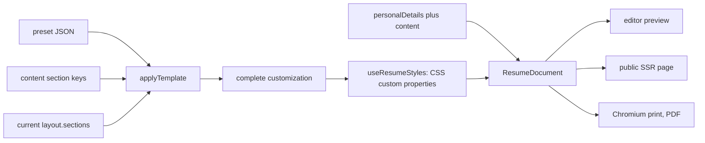

# Template contract

DRAFT v1 (2026-08-11) — not approved.

What a template is, what it may decide, and exactly how it renders the frozen
document contract of `docs/specs/aboutme-design.md` §3.

## 1. A template is data, not code

A template is a **customization preset**: a JSON file in
`packages/schema/templates/*.json` which, applied to a document, yields a
complete `customization` object. Design spec §5 fixes this — "customization
presets as JSON in repo … no DB table v1" — and three consequences follow that
every concrete template design must be written against.

1. **There is one renderer.** `components/resume/` is a single pure component
   tree (`ResumeDocument` → `ResumeHeader` → `LayoutColumns` → `SectionRenderer`
   → `sections/*` + `primitives/*`). No template ships its own components, its
   own CSS file, or its own section markup.
2. **The document stores no template identity.** `resume.schema.json`'s
   `customization` object is `additionalProperties: false` with eight required
   keys, none of which names a template; the `resumes` table has no template
   column. After apply, the preset that produced the values is unrecoverable.
3. Therefore **a template is a point in token space.** Every visual difference
   between two templates must be expressible as a difference in `customization`
   values, because at render time nothing else distinguishes them. A template
   cannot introduce a token the schema lacks. See §9, Contract pressure.

## 2. The decision boundary

Three domains, disjoint by construction.

| Domain            | Holds                                                                                                                                                                                | Written by                                        | Template apply       |
| ----------------- | ------------------------------------------------------------------------------------------------------------------------------------------------------------------------------------ | ------------------------------------------------- | -------------------- |
| **Document**      | `personalDetails`, `content` (entries, `displayName`, `iconKey`, `sectionType`)                                                                                                      | the user, through entry/section/details endpoints | never touched        |
| **Customization** | the 24 leaf values under `customization` (§2 of `tokens.md`; 7 optional — added 2026-08-11: `spacing.pageMargin`, `colors.surface`, `layout.surfaceTarget`, and the `header` object) | the user, and a preset on apply                   | replaced wholesale   |
| **Renderer**      | everything else: type scale ratios, weights, rule geometry, margins, column ratio, photo shape                                                                                       | the codebase                                      | identical everywhere |

The boundary in one line each:

- The **document** owns what the resume says. No template or token may add,
  remove, reorder, or reword content.
- The **user** owns every value in `customization` and may change any of them
  individually at any time.
- A **preset** owns the same values collectively: it is a saved point in that
  same space, not a separate layer above it.
- The **renderer** owns everything not in `customization`, and owns it for all
  templates at once.
- `layout.sections` is jointly derived, not directly owned: `applyTemplate`
  computes it (ADR 0008) and `PATCH /resumes/{id}/structure` is the only
  endpoint that may rewrite it (ADR 0009).

Because the user's customization _is_ the template, applying a template replaces
it. That is not data loss through carelessness; it is the definition. What
survives an apply is the document itself and the placement of its sections (§3).
The editor is responsible for making the replacement visible and undoable; the
renderer and the preset schema are not.

## 3. Apply semantics — ADR 0008 is binding

ADR 0008 imposes:

> A preset does not carry section keys. It carries a **placement rule**, and
> `applyTemplate` computes `layout.sections` as a total function of the
> document's actual content keys.

and

> Everything else in §5's sentence stands: applying a template replaces the rest
> of `customization` wholesale, and `content` is untouched.

Consequences a template design must respect:

- A preset declares `layout.placement` as either `"keep"` (preserve the
  document's current `main`/`sidebar` arrays) or `"byType"` with an ordered
  `sidebarSectionTypes` list. One-column presets use `"keep"`.
- Under `"byType"`, every content key whose section's `sectionType` appears in
  the list goes to `sidebar` in list order; every other key goes to `main`
  preserving its current relative order. Each key lands in exactly one array, so
  §3's exactly-once aggregate invariant holds by construction, not by
  validation.
- A preset must therefore be renderable against a document it has never seen,
  including one whose only sections are custom sections with UUID keys.
- The preset shape is **not** the document's `customization` shape: it adds
  `layout.placement`/`sidebarSectionTypes` and omits `layout.sections`.
  `applyTemplate(preset, contentKeys, currentSections)` is a pure function
  returning a complete, schema-valid `customization`.
- A preset must supply every one of the eight required `customization` keys,
  including `pageFormat` and `dateFormat`, because the replace is wholesale.
  Applying a template therefore resets page size and date format. See §9.2.
- The one-column ↔ two-column toggle in the customize panel is a **different
  operation** with its own preserve-and-move semantics. It is not an apply and
  must not route through `applyTemplate`.

## 4. Section order — ADR 0009 is binding

ADR 0009 imposes:

> **`customization.layout.sections` is the sole authority for section order and
> placement. `content` is an unordered map keyed by section key.**

The renderer iterates `layout.sections.main`, then `layout.sections.sidebar`,
looking each key up in `content`. It never iterates `content` to emit sections;
that is the defect the ADR names in advance. Entry order within a section is the
`entries` array order, which is preserved everywhere and is unaffected by this
rule.

A key present in `layout.sections` but absent from `content` renders nothing —
the store rejects that state on write, and the renderer must not crash on it.

## 5. Rendering the document contract

### 5.1 Header

`ResumeHeader` renders, in this order: photo (if present), `fullName`,
`headline`, then `personalDetails.details`. Detail order is the **array order**
of `details`; the schema carries no separate order field, which supersedes §5's
reference to a `detailsOrder`. A detail with `isHidden: true` is omitted
entirely. `isHidden` is required on a detail and optional on an entry; an entry
without the key is visible.

Details of type `website`, `linkedin`, `github`, `twitter` render as an anchor
with `rel="noopener noreferrer"`; `email` and `phone` may render as `mailto:` /
`tel:`; `location` and `custom` render as text. `label`, when present and
non-empty, replaces the type's default label.

### 5.2 Entry anatomy

Every entry renders into at most four slots. A template varies their type,
color, and spacing; it never varies which field feeds which slot.

| Slot       | Content                                             |
| ---------- | --------------------------------------------------- |
| `title`    | the entry's primary line, bold                      |
| `subtitle` | the organization or issuer                          |
| `meta`     | dates, place, level indicator                       |
| `body`     | sanitized rich text, or the level widget for skills |

Mapping — restates §3's entry-field table, adds nothing to it:

| sectionType   | title      | subtitle   | meta                       | body          | notes                                       |
| ------------- | ---------- | ---------- | -------------------------- | ------------- | ------------------------------------------- |
| `profile`     | —          | —          | —                          | `text`        | no per-entry heading; body blocks only      |
| `work`        | `jobTitle` | `employer` | `dates`, `city`, `country` | `description` | `employerLink` wraps `subtitle`             |
| `education`   | `degree`   | `school`   | `dates`, `city`, `country` | `description` | `schoolLink` wraps `subtitle`               |
| `skill`       | `name`     | —          | `level` widget             | `infoHtml`    | widget style from `sectionDisplay.skill`    |
| `language`    | `name`     | —          | `level` widget             | —             | no rich-text field exists                   |
| `certificate` | `title`    | `issuer`   | `date` (single `{y,m?}`)   | `description` | `titleLink` wraps `title`                   |
| `project`     | `title`    | —          | `dates`                    | `description` | `link` wraps `title`; no place fields       |
| `custom`      | `title`    | `subtitle` | `dates`, `city`            | `description` | `titleLink` wraps `title`; **no `country`** |

Asymmetries a designer will otherwise assume away: `custom` has `city` but no
`country`; `project` has neither; `certificate` carries a single `{y,m?}` and
never a range; `language` has no body.

### 5.3 Section heading

The heading text is `displayName`. `iconKey` renders as an inline lucide SVG
before it. `heading.style` maps to `text-transform: uppercase` / title case /
none, and `heading.showRule` toggles the divider (`tokens.md` §4).

A section whose `displayName` is absent or `""` renders **no heading text** and
no substitute: not the `sectionType`, not "Untitled". The icon and rule still
render if the section itself renders.

### 5.4 Dates

`dateFormat` selects `MM/YYYY`, `Mon YYYY`, or `YYYY`. Rules:

- A range renders `start – end`. `present: true` renders `start – Present`. The
  word is a label derived from the boolean, not a sentinel.
- A `{y}` without `m` renders as the year alone regardless of `dateFormat`;
  never invent a month.
- An absent `dates`/`date` object renders no date line and no separator.
- `Mon` is a fixed English three-letter table in the renderer, not
  `Intl.DateTimeFormat` — §5 forbids locale calls in the renderer, and the print
  container's locale must not be able to change the output.

### 5.5 Rich text

`description` / `text` / `infoHtml` are the sanitized HTML subset. The renderer
re-sanitizes with DOMPurify against the same versioned allowlist and styles only
the permitted tags. It never rewrites, truncates, or reflows the markup. Anchors
inside rich text get `rel="noopener noreferrer"`.

### 5.6 Level widgets

`skill.level` and `language.level` are optional integers 0–5.
`sectionDisplay.<type>.style` selects `text` / `tag` / `bar` / `dots`.

- Level **absent** → render the name only, in every style. No zero bar, no empty
  dots row, no "N/A".
- Level **`0`** → an explicit value; render zero of five filled. `0` and absent
  are different and must render differently.
- `text` style renders no widget at all; the level is not spelled out, because
  the schema defines no label vocabulary for 0–5.

## 6. Absence, clearing, hiding, emptiness

Design spec §3: "a missing key means 'never entered', `""` means 'explicitly
cleared'. Never fabricate a sentinel year, date, or level to satisfy the
schema."

| Input state                               | Rendered output                                                    |
| ----------------------------------------- | ------------------------------------------------------------------ |
| optional field absent                     | slot omitted, with its separators and punctuation                  |
| optional field `""`                       | identical to absent                                                |
| `isHidden: true` entry or detail          | omitted from the DOM entirely                                      |
| section with no entries                   | section omitted entirely, including heading, rule, and section gap |
| section whose every entry is hidden       | same as no entries                                                 |
| section key in `content`, not in `layout` | nothing; the store forbids this state                              |

Rules the above encodes:

- **Absent and `""` render identically.** There is no glyph for "explicitly
  cleared". The distinction is meaningful in storage and in the editor; it is
  not observable in output, and the renderer must never normalize one to the
  other in the document, because the renderer never writes.
- **Hidden means absent from the HTML, not `display: none`.** A hidden entry
  under `display: none` still reaches the accessibility tree of some tools, the
  copy buffer, crawlers, and the `/{slug}.md` variant. `fixtures/full.json`
  contains a hidden work entry precisely so a snapshot catches this.
- **No placeholder text, ever.** No "Company Name", no em dash standing in for a
  missing employer, no "—" for an absent date.
- **Separators are emitted between two present values, never beside one.**
  `city` present with `country` absent renders `Hanoi`, not `Hanoi` followed by
  a trailing comma and space. This is where the sentinel bug reappears as a
  punctuation bug.
- Colors and levels have no cleared form: `hexColor` cannot be `""` and `level`
  cannot be `""`. For those, absence is the only unset state, and
  `colors.accent` is the only optional color (§`tokens.md`).
- Entry `id` is never rendered and never emitted as an HTML attribute.

## 7. Columns

`layout.columns` is `1` or `2`; `layout.sections` names what goes where.

- **`columns: 2`** renders `main` and `sidebar` as two independent flows side by
  side, at the renderer-fixed width ratio. Both flows start at the top of the
  body; the sidebar continues in place across page breaks (`print.md` §5).
- **`columns: 1` with a populated `sidebar` is valid by design** (§5, decision
  of 2026-08-01). The renderer emits `main` sections in order, then `sidebar`
  sections in order, all at full width. Nothing is silently unrendered in either
  mode, and toggling 1 ↔ 2 preserves placement rather than destroying it.
- **Nothing moves between columns during a template apply** unless the preset's
  placement rule is `"byType"`, in which case the movement is the total function
  of ADR 0008 and is fully determined by section types.
- Section type does not imply a column. `skill` in `main` and `work` in
  `sidebar` are both legal documents and must render acceptably. A template
  design may not assume the sidebar holds only short entries.
- In one-column mode any sidebar-specific treatment (tint, narrower measure)
  degrades to the main treatment. There is no second visual language for
  sections that happen to be in the `sidebar` array.

## 8. Conformance — what a preset must ship

| Artifact                              | Requirement                                                                               |
| ------------------------------------- | ----------------------------------------------------------------------------------------- |
| `packages/schema/templates/<id>.json` | validates against the preset schema; all eight customization keys plus `layout.placement` |
| golden HTML snapshots                 | every fixture × this preset, per §5's guard list                                          |
| print screenshot diff                 | `/print` per preset, per §5                                                               |
| one- and two-column fixtures          | ADR 0008 requires both, so an empty-sidebar regression shows in a diff                    |
| contrast check                        | the preset's own colors satisfy `tokens.md` §5 before clamping                            |

A preset that needs a renderer change is not a preset. Raise it as a contract
change, not as a template.

## 9. Contract pressure

Open questions for the design owner. None is worked around in this spec, and
none requires a change to the §3 entry-field contract.

1. **No template identity in the document.** `customization` is
   `additionalProperties: false` and stores no `templateId`, so two templates
   can differ only by their values for the 24 leaf tokens. The 2026-08-11
   additions (`colors.surface` + `layout.surfaceTarget`, the `header` object)
   made the most-demanded structural moves expressible — a tinted header band or
   sidebar and a distinct header treatment. Deeper structural variety — a
   timeline rail, per-template markup — remains unreachable. ADR 0008 fixed
   placement expressiveness; the residue of its concern ("templates would differ
   only by fonts and spacing") survives in much weaker form. _Cost of leaving it
   out:_ the v1 template set is capped at roughly four to six recognizably
   different presets, and any later addition of a structural template becomes a
   schema version bump rather than a new JSON file.
2. **Template apply resets `pageFormat` and `dateFormat`.** Both are regional
   preferences, not visual design, but ADR 0008's wholesale replace covers them.
   _Cost of leaving it out:_ a user on A4 who tries a Letter preset ships a
   Letter PDF without noticing. The cheap alternative is to extend `"keep"` to
   these two fields; the alternative that needs no contract change is an editor
   warning.
3. **No photo visibility control.** A photo lives in `personalDetails.photo`;
   nothing in `customization` can suppress it, and §3 has no `showPhoto` flag.
   An ATS-oriented or photo-free template must therefore still render a photo
   that is present — dropping it would silently unrender document content. _Cost
   of leaving it out:_ users hide a photo by deleting it, losing the crop.
4. **No section-level hidden flag.** Only entries have `isHidden`, so hiding a
   whole section means hiding every entry or deleting the section. _Cost:_ an
   editor bulk action masks it, at N writes and a lossy delete/undo path.
5. **`iconKey` has no global on/off.** An icon-free template would drop the
   user's chosen icon with no explanation, so in v1 every template renders
   icons. _Cost:_ no template can be icon-free.
6. **No sidebar width token.** The sidebar ratio is renderer-fixed (`tokens.md`
   §6). The page-margin half of this item was resolved 2026-08-11:
   `spacing.pageMargin` (0–40 mm per axis, default 15 mm) is now a token, so a
   user needing one more line can widen margins before touching `baseSizePx`.
   _Cost of the remainder:_ acceptable for v1.
7. **`baseSizePx` may be set to 10 (7.5 pt).** The schema's floor permits a
   document too small to read in print, and no publish-policy rule rejects it.
   The template cannot override it without breaking the user-owns-base-size
   boundary. _Cost of leaving it out:_ a user can publish an unreadable resume;
   the containment is an editor-side warning, not a contract change.
8. **Links are distinguishable only by color, and no preset can fix it.** The
   renderer owns `text-decoration`, so an inline link is separable from body
   text solely by `--color-link`. Two independent preset designs proved the
   consequences: on a monochrome print a link is indistinguishable from body
   ink, and a preset targeting WCAG AAA text contrast cannot simultaneously
   satisfy G183's 3:1 link-versus-body distinction — the two constraints are
   arithmetically incompatible on a white page. _Open question for the design
   owner:_ adopt a renderer-wide link underline (the standard resolution, and
   what G183 exists to avoid needing), accepting that it changes every
   template's look; until decided, presets should not claim AAA-plus-G183.
